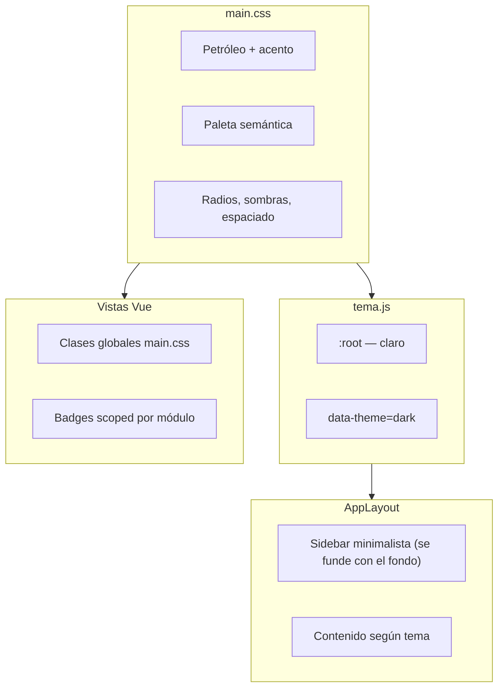

# Guía UX/UI — Materen · Sistema TI

> Documentación visual del panel **Materen — Sistema TI**. Los tokens canónicos
> viven en [`main.css`](../frontend/src/styles/main.css) (`--mat-*` y alias
> `--color-*`); este archivo describe cómo usarlos en las vistas.

**Vigencia**: actualizado 2026-07-09 — componentes compartidos (`PageHeader`,
`BadgeEstado`, `EmptyState`, `TextoVacio`) y `.text-muted` en terciario para
celdas vacías.

Documentación del sistema visual del panel: colores, tipografías, layout y
convenciones de componentes. Útil para mantener coherencia al añadir pantallas.

## Componentes compartidos (`frontend/src/components/shared/`)

Vistas de listado usan estos wrappers en lugar de copiar el markup del header
o del estado vacío:

| Componente | Uso |
|------------|-----|
| `PageHeader` | Título + icono Tabler + conteo opcional; slots `#acciones`, `#izquierda` (detalle con volver) y `#extra` (p. ej. tabs de Configuración) |
| `EmptyState` | Tabla sin filas: icono, título, mensaje y slot para CTA secundario (`.btn`, no primario) |
| `BadgeEstado` | Badge semántico vía `core/badges.js` (`tipo`: `empleado`, `ticket`, `prioridad`, `situacion`, `tipo_cuenta`) |
| `TextoVacio` | Celda vacía con placeholder `—` y clase `.text-muted` automática |
| `Pagination` | Paginación client/server (ya documentada abajo) |
| `PublicBrand` | Cabecera de páginas públicas (empleados sin sesión) |

Los mapas de color por dominio siguen en `core/dominio-*.js`; `core/badges.js`
solo despacha hacia ellos.

## Arquitectura general

El frontend **no usa Tailwind ni librería de componentes**. Todo el diseño vive en:

| Archivo | Rol |
|---------|-----|
| [`frontend/src/styles/main.css`](../frontend/src/styles/main.css) | Design system completo: tokens, layout, botones, tablas, modales, badges, timeline, capacity, confirm-dialog, etc. |
| [`frontend/src/core/tema.js`](../frontend/src/core/tema.js) | Alternancia claro/oscuro (`data-theme` en `<html>`) |
| [`frontend/src/components/shared/AppLayout.vue`](../frontend/src/components/shared/AppLayout.vue) | Shell: sidebar minimalista + área principal |
| [`frontend/index.html`](../frontend/index.html) | Inter + Sora (Google Fonts) + Tabler Icons |

**Patrón de uso:** las vistas Vue aplican clases globales (`.card`, `.btn-primary`, `.filters`…) directamente en el template. Solo hay **un componente compartido** (`AppLayout`); el resto son vistas por módulo con `<style scoped>` para badges/chips de dominio.



---

## Identidad de marca

> **Principio (jul 2026, decisión del JEFE): la marca no es la paleta del
> sistema.** El logo (verde pino + menta) es identidad; las superficies, bordes
> y texto de la UI son **grises neutros** en ambos temas. La marca se conecta a
> la interfaz únicamente a través del **acento** (botón primario, nav activo,
> focus ring) y del propio logo. Antes de esta corrección el ink petróleo teñía
> títulos/stats/toast y el tema oscuro entero era lienzo petróleo.

| Token | Hex | Rol en Sistema TI |
|-------|-----|-------------------|
| `--mat-color-brand` | `#072E2A` | Reservado a piezas de marca (logo); **no es color de sistema** |
| `--mat-color-accent` | `#157955` | Botón primario, links, foco (teal-deep, AA) — único punto de marca en la UI |
| `--mat-color-accent-alt` | `#34D399` | Gradiente de marca — no texto sobre blanco |
| `--mat-color-bg` | `#F6F7F8` | Fondo de página (gris neutro) |

El icono de marca usa **gradiente teal-deep → verde acento**:

```css
background: linear-gradient(135deg, var(--mat-color-accent) 0%, var(--mat-color-accent-alt) 100%);
```

**Estilo shadcn (sin la librería):** un acento por vista, botones outline/solid,
inputs `h-36px` con focus ring, contenedores separados por **borde** (sin
`box-shadow` decorativo).

---

## Paleta de colores (tokens CSS)

Los valores canónicos viven en `--mat-color-*`; la tabla usa los alias `--color-*`
que apuntan a ellos.

### Fondos y texto — tema claro (`:root`)

Grises neutros (jul 2026 — reemplazan los neutros cálidos/crema de v0.3; ni el
petróleo ni la calidez del logo son colores de cuerpo):

| Token | Valor | Uso |
|-------|-------|-----|
| `--mat-color-bg` | `#F6F7F8` | Fondo de página |
| `--mat-color-bg-elevated` | `#FFFFFF` | Tarjetas, header |
| `--mat-color-bg-subtle` | `#F0F2F4` | Filtros, cabeceras de tabla |
| `--mat-color-bg-hover` | `#EAEDF0` | Hover en filas/elementos |
| `--mat-color-text-primary` | `#23282D` | Texto de cuerpo |
| `--mat-color-text-secondary` | `#6B7280` | Subtítulos, labels |
| `--mat-color-text-tertiary` | `#9CA3AF` | Placeholders |
| `--mat-color-border` | `#E4E7EB` | Bordes estándar |

En oscuro el lienzo también es gris neutro (`#0F1113` página, `#16181B`
tarjetas, bordes `#282D33`) — ya no petróleo. El acento sube a `#34D399`.

### Acento / identidad

| Token | Claro | Oscuro |
|-------|-------|--------|
| `--mat-color-accent` | `#157955` | `#34D399` |
| `--mat-color-accent-alt` | `#34D399` | `#34D399` |
| `--mat-color-accent-hover` | `#126B48` | `#2DD4A0` |
| `--mat-color-accent-subtle` | `#E6F7F1` | `rgba(52,211,153,0.14)` |
| `--mat-color-accent-text` | `#157955` | `#6EE7B7` |

Títulos (toolbar, modal) y valores de stats usan `--color-text-primary`, igual
que el cuerpo — la jerarquía se logra con tamaño/peso, no con el ink de marca.
`--mat-color-brand` quedó reservado al área del logo (`.brand-text h1` vía
`--color-brand-ink`).

### Colores semánticos (convención de dominio)

Cada familia comparte **una sola fórmula** de saturación/luminosidad; solo
cambia el hue (H). Esto garantiza que las 8 familias se lean como *un mismo
sistema* y no como paletas sueltas:

- **Claro**: `bg` → H, S 35-55%, L 90-93% · `text` → H, S 45-60%, L 28-35% · `border` → H, S 30-45%, L 75-80%
- **Oscuro**: `bg` → H, S 25-30%, L 20-22% · `text` → H, S 45-60%, L 75-80% · `border` → H, S 25-30%, L 35-38%

Todas las variantes `-bg`/`-text` (16 pares, 8 familias × 2 temas) están
verificadas ≥5.3:1 de contraste (WCAG AA es 4.5:1; la mayoría cae en rango
AAA). Ver [`scripts/contraste.mjs`](../scripts/contraste.mjs) — correr
`node scripts/contraste.mjs` tras tocar estos tokens.

| Familia | Hue | Significado en el panel |
|---------|-----|--------------------------|
| **danger** (rojo) | 9° | Errores, crítico, equipos perdidos/robados |
| **success** (verde) | 100° | OK, disponible, activo |
| **warning** (ámbar) | 36° | Rotar contraseña, por vencer, suspendido, en reparación |
| **info** (azul) | 205° | Asignado, entregas |
| **purple** (morado) | 265° | Ubicaciones |
| **sky** (celeste) | 190° | Tipos de cuenta |
| **teal** | 170° | Correos, garantías |
| **neutral** (gris) | 100° (S baja) | Baja, inactivo genérico |

Cada familia expone `-bg`, `-text`, `-border`; `warning` y `teal` además
tienen variantes de énfasis (`-text-strong`, `-bg-strong`, `-bg-subtle`)
para casos donde el par base no da suficiente jerarquía visual — estas
variantes también están verificadas en el script.

`--color-danger` y `--color-success` (sin sufijo) son versiones **vivas**
de alta saturación para iconos/botones sólidos — no se usan para texto
sobre su propio `-bg` (para eso están `-text`).

> Corrección de accesibilidad (jul 2026): `--color-neutral-text` pasó de
> `#68716b` (4.2:1 sobre `--color-neutral-bg`, fallaba AA) a `#474d40`
> (~7.2:1, AAA).

### Sidebar (minimalista, sigue el tema)

Definido en `AppLayout.vue`. Regla de diseño (decisión del JEFE):
**el sidebar no debe sentirse como un bloque aparte** —

- Fondo: `var(--color-bg)` — el mismo de la página (gris claro / gris-noche
  oscuro). **Sin borde derecho, sin sombra, sin líneas divisorias** internas
  (logo y footer sin `border-bottom/top`).
- Hover de ítems: fondo muy tenue `var(--color-bg-hover)`, **nunca bordes**.
- Ítem activo: tinte suave `var(--color-accent-subtle)` + texto
  `var(--color-accent-text)`, **sin border-left ni indicadores**.
- Búsqueda: input sin borde visible (fondo tenue); al enfocar sube a
  `--color-bg-elevated` con borde suave.
- **Nav agrupada (jul 2026)** por frecuencia de uso, en este orden: día a día
  sin label (Dashboard, Tickets) → "Gestión" (Empleados, Correos, Licencias,
  Equipos) → "Administración" (Actividad solo JEFE, Configuración). Labels de
  sección en uppercase 10.5px `--color-text-secondary`; la separación entre
  grupos es solo espaciado (`gap`), **nunca líneas divisorias**. Colapsado:
  los labels se ocultan y queda el espaciado.
- Ancho: `240px` expandido, `64px` colapsado (rail de solo iconos). En móvil
  (off-canvas) sí lleva sombra al abrirse.
- **Colapso (jul 2026)**: toggle en la fila del logo
  (`ti-layout-sidebar-left-collapse/expand`); preferencia persistida en
  `localStorage` clave `sistema-ti-sidebar` (mismo patrón que el tema).
  Colapsado: labels ocultos con `title` como tooltip, búsqueda reducida a un
  botón que expande y enfoca el input, footer apilado con solo avatar +
  iconos. Solo aplica en desktop (>768px); el drawer móvil siempre va
  completo y oculta el toggle.

### Sombras y radios

```
--radius-sm: 6px      --shadow-sm: sutil
--radius-md: 10px     --shadow-md: tarjetas hover
--radius-lg: 14px     --shadow-lg: modales
--radius-xl: 20px
--radius-pill: 999px  (badges, capacity-bar, timeline-dot)
```

Escala en `main.css` (`--radius-*`).

### Escala de z-index

Especificación en `main.css` (`--z-*`).

```
--z-header: 50           site-header sticky de cada vista
--z-header-mobile: 60    topbar-mobile (encima del header normal)
--z-nav: 100             sidebar en modo drawer (≤768px) + su overlay (z-nav - 1)
--z-popover: 300         .sb-resultados (búsqueda global)
--z-modal: 400           .modal-bg
--z-modal-stacked: 410   reservado para un modal sobre otro (sin uso aún)
--z-popover-modal: 420   .combo-lista (BuscadorCombo) — popover teleportado
                         a <body> que nace dentro de un modal y debe superarlo
--z-toast: 500           .toast — siempre visible, incluso sobre un modal
```

Antes de este ajuste, `.modal-bg` estaba en `z-index: 100` y el drawer móvil
en `200` — un modal podía quedar **debajo** del sidebar en móvil. Corregido
al fijar la escala completa en `main.css`.

Un popover que se teletransporta a `<body>` deja de competir dentro del
stacking context de su modal y pasa a competir contra toda la escala: por eso
`.combo-lista` necesita un nivel propio por encima de `--z-modal`. Un popover
que sigue dentro del árbol del modal (posicionado con `absolute`) no participa
de la escala y le basta un `z-index` local.

### Excepciones hardcodeadas

- Botón WhatsApp: `#25d366`
- Overlay de modal: `rgba(15,23,42,0.45)` + `backdrop-filter: blur(4px)`
- Focus ring en inputs: `box-shadow: 0 0 0 3px rgba(13,148,136,0.18)`

---

## Tipografía — Inter + Sora (DS v0.3)

| Rol | Fuente | Pesos |
|-----|--------|-------|
| Cuerpo / UI | **Inter** | 400–600 |
| Encabezados | **Sora** (temporal; Axiforma pendiente) | 500–700 |
| Mono | SO nativo | — |
| Iconos | **Tabler Icons** | CDN |

Variables canónicas: `--mat-fs-*` (alias legacy `--fs-*`). El `body` usa
`--mat-fs-md` (14px). Títulos de marca/toolbar/modal usan `--font-display`.

### Escala tipográfica (tokenizada)

Tokens en `main.css` — **usar en pantallas nuevas** en lugar de px sueltos:

| Token | Valor | Uso típico |
|-------|-------|------------|
| `--mat-fs-xs` | 11px | Badges, headers de tabla (uppercase) |
| `--mat-fs-sm` | 12px | Labels secundarios, metadatos |
| `--mat-fs-base` | 13px | Botones, inputs, celdas de tabla, nav |
| `--mat-fs-md` | 14px | `body` base |
| `--mat-fs-lg` | 15px | Títulos de toolbar/sección |
| `--mat-fs-xl` | 17px | Títulos de modal |
| `--mat-fs-2xl` | 20px | Títulos de página/login |
| `--mat-fs-stat` | 26px | Valores en stat cards |

Pesos: **600** botones/nav/labels/badges, **700** solo stats y
marca. Uppercase con letter-spacing `0.04–0.06em`.

---

## Tema claro / oscuro

[`frontend/src/core/tema.js`](../frontend/src/core/tema.js):

1. `initTema()` se llama **antes** de montar Vue (evita flash)
2. Preferencia guardada en `localStorage` → clave `sistema-ti-tema`
3. Sin preferencia: respeta `prefers-color-scheme` del sistema
4. Oscuro: atributo `data-theme="dark"` en `<html>`

El sidebar usa los tokens del tema, así que **cambia junto con el área
principal** (gris claro / gris-noche oscuro).

---

## Layout y estructura de página

### Grilla de 12 columnas

Las vistas componen sobre `.grid-12` (12 columnas, gap 16px) con clases de
span `.col-2 / .col-3 / .col-4 / .col-6 / .col-8 / .col-12` definidas en
`main.css`. Colapso responsive automático: ≤1200px los spans se ensanchan
(2→4, 3→6, 4→6, 8→12); ≤700px todo apila (col-2 queda en media fila).

Uso en el Dashboard: 6 stat-cards `col-2` (fila completa), pendientes
`col-4` (3 por fila), recientes `col-3` (4 por fila). **Preferir esta grilla
sobre grids ad-hoc por vista.**

### Shell autenticado (unificado jul 2026)

```
┌────────────┬──────────────────────────────┐
│  Sidebar   │  layout-main (scroll)        │
│  240px/64  │  ├ site-header sticky ≥64px  │
│  (tema)    │  └ main.page (full-bleed)    │
└────────────┴──────────────────────────────┘
```

**Todas las vistas de módulo comparten la misma estructura** — la raíz lleva
`.vista-modulo` (llena el alto del `layout-main`), el header muestra el
**título del módulo** (no la marca, que ya vive en el sidebar), y `main.page`
es **full-bleed** (sin padding; decisión del JEFE jul 2026 — el módulo ocupa
todo el ancho y alto). Solo icono + título, **sin descripción** (decisión del
JEFE jul 2026):

```html
<div class="mimodulo-page vista-modulo">
  <header class="site-header">
    <div class="header-inner">
      <div class="header-title">
        <h1>
          <i class="ti ti-users" aria-hidden="true"></i> Empleados
          <span class="badge-count">{{ listaFiltrada.length }}</span>
        </h1>
      </div>
      <div class="header-btns">…acciones (único .btn-primary de la vista)…</div>
    </div>
  </header>
  <main class="page">…</main>
</div>
```

`.brand` (icono + "Sistema TI") quedó **reservado a rutas públicas** (login,
entrega, tickets públicos), donde no hay sidebar que muestre la marca.

### Página tipo listado (empleados, equipos, etc.)

1. Shell de arriba, con las acciones del módulo en `.header-btns` y el
   **contador (`.badge-count`) dentro del `h1`** — la fila `.card-toolbar`
   con título+contador se eliminó de los módulos (jul 2026): era
   redundante con el header. Los paneles de Configuración SÍ conservan su
   `.card-toolbar` porque no tienen header propio (ahí viven su título,
   contador y botón de crear).
2. `main.page` → `.card.card--fill` — el card se estira a todo el
   ancho/alto disponible, **sin borde ni radio** (full-bleed)
3. `.filters` (búsqueda + selects)
4. `.table-wrap` > `table` o `.empty`

### Página multi-card (dashboard, detalle de empleado/ticket)

El contenido no es un solo card: el `main` lleva `page--padded`
(padding `1.5rem`, `1rem` en ≤600px) y adentro van stats/grids/cards con
borde y radio normales. Las vistas de detalle mantienen su header
contextual (botón volver + entidad) sobre la misma base `site-header` +
`header-inner`.

### Rutas públicas (login, entrega)

Sin sidebar: card centrada a pantalla completa, reutilizando `.card`, `.brand`, `.form-group`, `.btn-primary`.

### Breakpoints responsive

**Escala única (jul 2026): 1200 / 900 / 768.** Todo corte "móvil" nuevo debe
usar **768px** — es donde el shell cambia a drawer + topbar, y el contenido
debe cambiar con él (antes convivían cortes en 560/600/700 y quedaba una
franja 601-768px con drawer móvil pero contenido de escritorio).

| Ancho | Comportamiento |
|-------|----------------|
| ≤1200px | Grid-12: spans se ensanchan |
| ≤900px | Stats grid a 2 columnas; Equipos oculta `.badge-fisico` |
| ≤768px | Sidebar off-canvas + topbar móvil 48px; grid-12 apila; formularios 1 columna; padding reducido; header compacto; filtros apilados (buscador a fila completa); toast a lo ancho; tablas de módulos operativos → tarjetas |

Constantes: `--header-h: 64px` (ahora `min-height` — el header crece si lleva
tabs, como en Configuración). `--max-w` se eliminó (estaba definido pero
ningún selector lo usaba; el contenido es de ancho completo). `.page` ya no
tiene padding — el respiro en vistas multi-card lo da `.page--padded`.

**Utilidades de visibilidad:** `.solo-escritorio` (se oculta en ≤768px) y
`.solo-movil` (solo visible en ≤768px; variante `.solo-movil--flex` cuando el
elemento necesita `display:flex`). Son la base del dual render de tablas.

**Targets táctiles:** `@media (pointer: coarse)` sube el padding de
`.icon-btn` a 10px (~40px de target) sin afectar la densidad en escritorio.

### Patrón tabla → tarjetas (módulos operativos en móvil)

En ≤768px las tablas de **Tickets, Empleados y Equipos** se reemplazan por
tarjetas apiladas (dual render: el `<table>` lleva `.solo-escritorio` y a su
lado vive una `<ul class="lista-tarjetas solo-movil">` sobre la **misma
lista paginada**; `<Pagination>` queda fuera de ambos para no ocultarse).
El resto de vistas de lista (Correos, Licencias, Actividad, Accesos
sensibles, Configuración) conserva la tabla con scroll horizontal — el
`.table-wrap` global ya pinta sombras de scroll en los bordes como
indicador (sin JS, `background-attachment: local`).

Anatomía de `.tarjeta-fila` (todas las zonas son opcionales):

```html
<li class="tarjeta-fila tarjeta-fila--clic">      <!-- --clic si navega -->
  <div class="tarjeta-fila__cab">…</div>          <!-- código mono + fecha -->
  <div class="tarjeta-fila__principal">…</div>    <!-- dato principal -->
  <div class="tarjeta-fila__sec">…</div>          <!-- secundarios con "·" -->
  <div class="tarjeta-fila__pie">                 <!-- badges + menú ⋮ -->
    <div class="tarjeta-fila__badges">…</div>
    <MenuAcciones :acciones="accionesDe(fila)" />
  </div>
</li>
```

### MenuAcciones.vue (menú contextual ⋮)

`src/components/shared/MenuAcciones.vue`. Condensa acciones por fila en las
tarjetas móviles (≥3 acciones) o botones de toolbar que no caben en móvil
(ej. el "Más" del header de Tickets). API: prop
`acciones: [{ icono, label, danger?, disabled?, visible?, separador?, onClick }]`;
prop `texto` para trigger tipo `.btn` (toolbar) — sin texto usa `.icon-btn`.
Accesible: `role="menu"`, `aria-haspopup`/`aria-expanded`, flechas ↑↓,
Escape devuelve el foco al trigger; cierra con clic fuera, scroll y resize.
Panel con `Teleport` a body + `--z-popover` (`.card` tiene `overflow:hidden`
y recortaría un popover absoluto). En Equipos la fuente única de las 11
acciones condicionales es `accionesDe(eq)` (EquiposView.vue) — la consumen
los icon-btn de escritorio y el menú móvil; no dupliques condiciones.

### BuscadorCombo.vue (campo de búsqueda con lista de resultados)

`src/components/shared/BuscadorCombo.vue`. Reemplaza al antiguo
`BuscadorEmpleado.vue` y a las variantes ad hoc de combo que había en
Cuentas, Licencias, Equipos y Tickets. API: `v-model` (id seleccionado),
`v-model:busqueda` (texto), `items`, `camposBusqueda`, `etiqueta(item)`,
`limite` (filas visibles, 8 por defecto), `forzarCerrado`. Slots:
`#resultado` (contenido de cada fila), `#icono`, `#vacio`, `#extra` (acciones
al pie, ej. "Registrar como correo nuevo" en LicenciaForm).

**La lista va teleportada a `<body>` con `position: fixed`, no `absolute`.**
Es el punto no obvio del componente: `.modal-body` tiene `overflow-y: auto` y
el modal se ajusta a su contenido, así que una lista `absolute` quedaba
recortada a la altura visible del body — en un modal chico se veían una o dos
filas y había que scrollear el modal a mano para leer los resultados. Las dos
alternativas se descartaron: dejar solo el scroll interno no arregla nada
porque el hueco visible sigue siendo de dos filas, y hacer crecer el modal
según la cantidad de resultados provoca un salto de tamaño en cada tecleo.
Teleportada, la lista se mide contra el viewport y el modal nunca cambia de
tamaño.

Detalles de comportamiento, todos en el componente:

- Se abre hacia abajo y **solo se voltea hacia arriba** si el contenido real
  (`scrollHeight`) no cabe abajo y arriba hay más aire. Se ancla por `top` al
  abrir hacia abajo y por `bottom` al abrir hacia arriba, así el borde pegado
  al campo no se mueve mientras se filtra.
- `max-height` se calcula contra el espacio disponible (techo de 320px, ~8
  filas) — no es un valor fijo. El espacio se mide contra el **visual
  viewport**, no `window.innerHeight`: en móvil el teclado virtual no siempre
  reduce `innerHeight`, y la lista terminaría extendiéndose por debajo del
  teclado — el mismo síntoma de dos filas visibles que el componente evita.
- Reposiciona en `scroll` (en captura, para oír el scroll del modal), `resize`
  y los eventos de `visualViewport`, con throttle por `requestAnimationFrame`;
  los listeners solo existen mientras la lista está abierta. Si el campo sale
  del área visible de su contenedor con scroll, la lista se cierra en vez de
  quedar flotando apuntando a nada.
- Escape se intercepta en `window` en fase de **captura**, no desde el input:
  `Modal.vue` escucha en `document` en captura y detiene ahí la propagación,
  así que un handler en el campo nunca vería el evento y Escape cerraría el
  modal entero en vez de solo la lista. La captura en `window` corre antes que
  la de `document`. Solo intercepta con la lista visible.
- Teclado: ↑↓ recorren (con wrap), Enter elige el ítem marcado — sin ítem
  marcado Enter sigue enviando el formulario —, Escape cierra solo la lista
  sin cerrar el modal, Tab cierra. El mouse y el teclado comparten
  `indiceActivo`, así nunca hay dos filas resaltadas.
- Cuando `limite` recorta resultados, un pie fijo declara cuántos quedaron
  fuera ("N coincidencias más — precise la búsqueda"). Sin eso, 40
  coincidencias se ven igual que 8 y el usuario cree que ya no hay nada por
  afinar.
- Las filas de los slots `#vacio`/`#extra` se compilan con el scope del padre:
  las reglas de fila usan `.combo-lista :deep(...)` para que todas compartan
  el layout. Bajo `.combo-lista` cada regla de fila especial gana por
  especificidad a la regla base, sin `!important`.

---

## Componentes UI reutilizables (clases CSS)

Todo en `main.css` — no hay átomos Vue separados:

**Botones:** `.btn`, `.btn-primary`, `.btn-whatsapp`, `.btn-danger` (+ `.toolbar-actions` para agrupar varios en un toolbar)

**Contenedores:** `.card`, `.card-toolbar`, `.stat-card`, `.password-cell`/`.password-text` (credenciales en `CuentasPanel.vue`)

**Formularios:** `.form-grid`, `.form-group`, `.section-label`. Accesorios de equipo: lista editable (código / descripción / cantidad) en `EquipoForm.vue` (`.acc-lista`, `.acc-fila`); ya no se usan chips.

**Datos:** `.table-wrap`, `table/th/td`, `.user-name`, `.avatar`, `.lista-tarjetas`/`.tarjeta-fila` (render móvil de tablas, ver patrón arriba)

**Estado:** `.status`, `.badge`/`.badge--*` (ver sistema unificado abajo), `.badge-count`

**Interacción:** `.icon-btn`, `.actions`, `.filters`, `.search-wrap`, `MenuAcciones.vue` (menú ⋮, ver arriba)

**Overlays:** `.modal-bg`, `.modal`, `.modal-lg`, `.modal-actions`

**Feedback:** `.empty`, `.no-results`, `.toast` (vía `core/toast.js`)

**Detalle:** `.detalle-grid`, `.datos-card`, `.datos-lista`, `.dato` (`EmpleadoDetalleView.vue`)

> `.cred-card`, `.tool-tag`/`.tool-input`, `.user-cell`, `.modal-detail`,
> `.detail-header`/`.detail-grid`/`.detail-item` siguen definidas en
> `main.css` pero **ningún template las usa ya** — mismo caso que las
> clases antiguas de badges, quedaron como restos sin limpiar. No usarlas
> en código nuevo; se pueden borrar de `main.css` en una limpieza futura.

### Badges — sistema unificado

**Antes**: 5 convenciones distintas para el mismo patrón visual
(`.status`+`.s-*`, `.sit-*`, `.badge-rotar`, `.pill`, `.badge-count`), cada
una con su propio padding/radio/font-size ligeramente distinto. **Ahora**:
una sola base + modificador, definida una vez en `main.css`:

```html
<span class="badge badge--success">Activo</span>
<span class="status badge--warning">Suspendido</span>  <!-- +indicador de punto -->
```

| Modificador | Familia | Uso típico |
|-------------|---------|------------|
| `.badge--success` | verde | Activo, disponible, reutilizable libre |
| `.badge--warning` | ámbar | Suspendido, rotar contraseña, en reparación, entrega abierta |
| `.badge--danger` | rojo | Perdido/robado, sin devolver, acceso denegado (auditoría) |
| `.badge--info` | azul | Asignado, "vio contraseña" |
| `.badge--purple` | morado | Ubicaciones, rol JEFE |
| `.badge--sky` | celeste | Tipo de cuenta (compartida/reutilizable en la ficha) |
| `.badge--teal` | teal | (disponible, sin uso activo aún) |
| `.badge--neutral` | gris | Inactivo, de baja |
| `.badge--accent` | identidad | Contadores (`badge-count`), "copió contraseña" |

`.status` es `.badge` + un indicador de punto (`::before`) para estados
"vivos" de una entidad (Activo/Inactivo/Suspendido); se combina con el
modificador de color: `class="status badge--success"`.

**Clases antiguas**: `.s-activo`, `.s-inactivo`, `.s-suspendido`,
`.sit-disponible`, `.sit-asignado`, `.sit-ubicacion`, `.sit-reparacion`,
`.sit-baja`, `.sit-perdido`, `.badge-rotar`, `.pill` siguen definidas en
`main.css` como **alias** (agrupadas en el mismo selector que su
modificador) — si algo externo las referencia, no se rompe. Ningún
template activo las usa ya.

**Ajustes locales permitidos**: cuando un badge necesita un detalle que no
es color/estructura (ej. `margin-left` para separarlo de texto vecino,
`text-transform: uppercase` para el chip de rol), se agrega como clase
adicional con solo esa propiedad — nunca redeclarando display/padding/
radius/font-size. Ejemplos: `.badge-inline` (cuentas), `.badge-rol`
(staff, solo `text-transform`+`letter-spacing`), `.badge-sin-devolver`
(equipos, solo `margin-left`+`font-weight`).

> Nota de diseño: al consolidar se **quitaron los `border: 1px solid`**
> que tenían `.badge-rotar` y `.badge-sin-devolver` — coherente con el
> principio minimalista (sidebar) de no usar bordes para estados, solo
> fondos tenues.

---

## Componentes de dominio (jul 2026)

Cuatro patrones que no existían como componente reutilizable — vivían como
tabla genérica o texto suelto — ahora están en `main.css`:

### Timeline (historial de asignaciones)

El README llama al historial de asignaciones "el corazón del sistema"; ahora
tiene su propia UI. Reemplaza `.table-wrap` para ese bloque específico:

```html
<div class="timeline">
  <div class="timeline-item">
    <span class="timeline-dot timeline-dot--active"></span>  <!-- fecha_fin NULL -->
    <div class="timeline-content">
      <div class="timeline-title">Juan Pérez <span class="badge badge--success badge-inline">Activa</span></div>
      <div class="timeline-meta">Desde 02/07/2026</div>
    </div>
  </div>
</div>
```

En uso: modal "Historial" de una cuenta (`CuentasPanel.vue`), reemplazando
la antigua `.historial-table`. `timeline-dot--closed` cuando hay `fecha_fin`.

### Barra de capacidad (asientos de licencia)

Reemplaza el texto suelto "2/3": comunica cercanía al tope **antes** de que
el trigger `check_tope_licencia` bloquee la asignación.

```html
<div class="capacity">
  <div class="capacity-bar"><div class="capacity-fill capacity-fill--warning" style="width: 80%"></div></div>
  <span class="capacity-label">4/5 asientos</span>
</div>
```

Umbrales: `--ok` <70% ocupado, `--warning` 70-99%, `--full` =100%. En uso en
`LicenciasView.vue` (tabla y modal "Asignar asiento").

### Badge doble (`.badge-group`)

> Patrón visto solo en Equipos — no generalizar hasta que un segundo módulo lo necesite.

Para entidades con **dos estados simultáneos e independientes** — un equipo
tiene estado físico (operativo/en_reparación/de_baja/perdido) y situación
derivada (Disponible/Asignado/En ubicación) a la vez:

```html
<span class="badge-group" title="Operativo · Asignado">
  <span class="badge badge--success badge-fisico">Operativo</span>
  <span class="badge badge--info">Asignado</span>
</span>
```

Solo se duplican los badges cuando ambos datos aportan información (equipo
operativo + en uso/ubicado); si no está operativo, el estado físico solo ya
lo dice todo. Columna `.th-situacion` con `min-width: 168px`; en pantallas
≤900px el badge físico (`.badge-fisico`) se oculta y queda accesible en el
`title` del grupo — se prioriza el estado derivado.

### Confirmación destructiva

```html
<div class="modal-bg confirm-dialog--destructive">
  <div class="modal">
    <div class="modal-title">
      <span style="display:flex;align-items:center;gap:10px">
        <span class="modal-icon"><i class="ti ti-user-off"></i></span>
        Dar de baja a Juan Pérez
      </span>
    </div>
    ...
  </div>
</div>
```

Borde superior rojo (`border-top: 3px solid`) + ícono circular de alerta.
**Decisión de producto (jul 2026)**: sin paso extra de fricción — no se pide
escribir el nombre ni marcar un checkbox; el detalle de "qué va a pasar"
vive en el cuerpo del modal (ver `BajaEmpleadoModal.vue`, que ya lo hace
mostrando el resumen de accesos antes de confirmar). No aplica a "revelar
contraseña" (es de lectura, ya auditada en Actividad) ni se implementó aún
para "cerrar asignación reutilizable" (usa `confirm()` nativo del navegador,
que no admite estilos — requeriría un modal propio; pendiente).

### Paginación (`Pagination.vue`)

Todas las tablas cargan la lista completa del store y la filtran en el
cliente (no hay paginación en el backend/InsForge); a partir de jul 2026
esa lista filtrada también se corta en páginas de 20 filas para no
renderizar cientos de `<tr>` de una vez. Componente compartido en
`frontend/src/components/shared/Pagination.vue`:

```html
<script setup>
const TAM_PAGINA = 20;
const paginaActual = ref(1);
watch(listaFiltrada, () => { paginaActual.value = 1; }); // reset al filtrar/buscar
const listaPaginada = computed(() => {
  const inicio = (paginaActual.value - 1) * TAM_PAGINA;
  return listaFiltrada.value.slice(inicio, inicio + TAM_PAGINA);
});
</script>

<tbody>
  <tr v-for="item in listaPaginada" :key="item.id">...</tr>
</tbody>
<!-- fuera de <table>, dentro de .table-wrap -->
<Pagination v-model="paginaActual" :total-items="listaFiltrada.length" :page-size="TAM_PAGINA" />
```

El componente muestra "Mostrando X–Y de Z" y controles anterior/siguiente
(usa `.icon-btn`, ya con estado `:disabled`); no renderiza nada si
`totalItems` es 0, y se auto-ajusta si la página actual queda fuera de
rango al reducirse la lista filtrada. El conteo del badge del toolbar y el
estado vacío siguen usando la lista filtrada completa, nunca la página.

En uso en las 10 vistas con tabla (Tickets, Empleados, Equipos, Licencias,
Plataformas, Empresas, Correos, Actividad, Staff, y los paneles de
Ubicaciones/Tipos de equipo en Configuración). Se descartó a propósito en
`CuentasPanel.vue`: es una lista de cuentas de un solo empleado (unas
pocas filas, sin buscador), no un listado global.

### Reglas de tabla (jul 2026, tras auditoría de accesibilidad)

- **Semántica**: todo `<th>` lleva `scope="col"`; toda `<table>` lleva
  `aria-label` descriptivo; la columna de acciones usa
  `<th scope="col"><span class="sr-only">Acciones</span></th>` — nunca un
  `<th>` vacío.
- **Botones de icono**: siempre `title` **y** `aria-label` con el mismo
  texto (o `:aria-label` con la misma expresión si el title es dinámico).
  Aplica también a links solo-icono (URL externa, foto).
- **Filas clicables**: el click en la fila es un atajo de mouse; siempre
  debe existir un elemento enfocable dentro de la fila que haga lo mismo
  (botón "Ver ficha" en Empleados; el código como `RouterLink` en Tickets).
- **Thead sticky**: dentro de `.card--fill` la tabla scrollea internamente
  (`.table-wrap` con `overflow-y: auto`) y el `thead` queda fijo
  (`position: sticky; top: 0`). Por eso `table` usa
  `border-collapse: separate` — con `collapse`, los bordes del header se
  quedan atrás al scrollear. Resultado: header de módulo, toolbar y
  filtros siempre visibles; solo las filas se desplazan.
- **Valores vacíos** ("—", "Sin usuarios"): preferir `<TextoVacio :valor="campo" />`
  o `.text-muted` (color `--color-text-tertiary`). Si la celda a veces tiene
  valor, condicional: `:class="{ 'text-muted': !campo }"`.
- **Números**: `table` define `font-variant-numeric: tabular-nums` — DNI,
  fechas y conteos alinean dígito a dígito sin nada extra por vista.
- **Tipografía uniforme (decisión JEFE jul 2026)**: ningún dato de tabla
  va en negrita; todas las celdas comparten peso (400), tamaño (13px) y
  color (`--color-text-primary`). `.user-name` es peso 400. Lo único que
  puede variar es la **familia** (mono para identificadores: códigos,
  series, correos). La jerarquía la dan los badges y el layout, no la
  tipografía. Excepciones: badges/chips (son estado, no dato) y los
  vacíos "—" en `.text-muted`.

### Errores de formulario/acción (`.form-error`)

Antes duplicado idéntico en 10 módulos; ahora global. Distinto del toast:
**persiste** hasta que el usuario actúa, para mensajes que hay que leer
completos — típicamente rechazos de trigger de BD (tope de asientos, doble
titular activo, equipo no operativo). En uso en los modales "Asignar" de
Licencias y Equipos, además de los formularios de creación/edición.

```html
<p v-if="error" class="form-error" role="alert">{{ error }}</p>
```

`.form-grid .form-error` obtiene automáticamente `grid-column: 1 / -1`.

## Animaciones y micro-interacciones

- Transiciones hover: **0.12–0.2s** en botones, tarjetas, bordes
- Stat cards: `translateY(-1px)` + sombra al hover
- Modales: `fadeIn` 0.2s + `slideUp` 0.25s
- Sidebar móvil: slide con `transform` 0.25s

---

## Cómo modificar la identidad visual

1. **Cambiar marca:** editar `--mat-color-accent*` en `:root` y `[data-theme="dark"]` en [`main.css`](../frontend/src/styles/main.css)
2. **Cambiar tipografía:** actualizar `--mat-font-*` y el `<link>` en [`index.html`](../frontend/index.html)
3. **Nuevo componente visual:** preferir añadir clase global en `main.css` antes que estilos inline o duplicados por vista
4. **Nuevo estado/badge de dominio:** clase scoped en la vista usando `var(--color-*-bg)` y `var(--color-*-text)` existentes

---

## Resumen

Panel con **CSS custom estilo shadcn** (sin Tailwind ni librería), tokens
**neutros grises + acento de marca** (`#157955`/`#34D399`), **Inter + Sora**, iconos **Tabler**,
separación por **bordes** (sin sombras en contenedores), y clases globales en
`main.css`.

### Principios de diseño (definidos por el JEFE)

- **Minimalista**: no sobresaturar la vista ni agobiar con información.
- Estados hover/activo **sin bordes** — solo fondos muy tenues.
- Preferir fusión de superficies sobre paneles/bloques delimitados.
- **Sin bordes de acento en los costados de un componente**: para marcar
  severidad/estado en una fila o tarjeta, usar **color de ícono + badge**,
  nunca un borde lateral (izquierdo/derecho) de color. Es el mismo principio
  que ya rige hover/activo ("sin bordes, solo fondos tenues") aplicado
  también a indicadores de severidad — ningún otro componente del sistema
  usa un borde de costado, así que introducir uno rompe la consistencia
  aunque el color sea correcto. Ver `.feed-item` (Dashboard): la severidad
  se lee por el color del ícono y el texto del badge, sin borde. Los bordes
  que sí existen (contenedores `.card`/`.stat-card`, `1px solid
  --color-border`) delimitan la superficie completa, no un costado; no
  confundir ese patrón con un acento de estado.
- **Un solo acento visible por vista** — el botón `.btn-primary`
  del header/toolbar de cada módulo (ej. "Nueva licencia") es el acento fijo
  de esa vista. **Corrección (jul 2026)**: en 7 vistas (Empleados, Correos,
  Empresas, Plataformas, Licencias, Equipos, Cuentas) el estado vacío
  mostraba un **segundo** `.btn-primary` idéntico ("Agregar X") al mismo
  tiempo que el del header — dos acentos simultáneos para la misma acción.
  Se demotó el CTA del estado vacío a `.btn` (secundario); el header sigue
  siendo el único lugar con el acento primario para "crear".
  **Excepción declarada**: el botón "Guardar"/"Confirmar" dentro de un
  modal SÍ puede ser `.btn-primary` aunque el header de la página detrás
  también lo sea — el modal es la superficie de foco activa, el fondo queda
  inerte tras el backdrop. No se considera doble acento.
