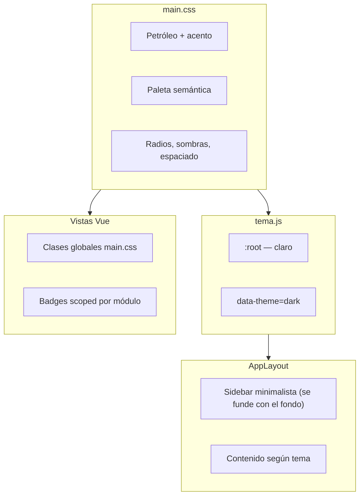

# Guía UX/UI — Materen · Sistema TI

> Documentación visual del panel **Materen — Sistema TI**. Los tokens canónicos
> viven en [`main.css`](../frontend/src/styles/main.css) (`--mat-*` y alias
> `--color-*`); este archivo describe cómo usarlos en las vistas.

**Vigencia**: actualizado 2026-08-13 — sexta pasada, primer porteo real de
`design.pen` a producción (Fases A-E, commits separados): tokens aditivos
en `main.css` (`--mat-space-1..12`, `--mat-color-danger-hover`/`-solid`,
`--mat-color-whatsapp-text`) sin renombrar `--mat-color-*`/`--color-*` a la
notación de puntos de la propuesta de paleta (sigue sin aprobar); 5
variantes de `.btn` con estados completos y foco unificado en anillo
externo (`box-shadow`, color por variante) — de paso resuelve DS-01 y
unifica `:disabled` a `opacity:.5` (DS-02 parcial: solo botones, no
`input`/`select`); 4 variantes semánticas de `.toast`; hover de fondo en
`ThOrdenable`; símbolo de marca actualizado a 4 pétalos + diamante. DS-03,
DS-04 y DS-05 siguen abiertos a propósito (ver `docs/HISTORIAL-AUDITORIAS.md`
Ciclo 3) — la propuesta de paleta de puntos tampoco se portó. Ver changelog
completo más abajo.
La quinta pasada (2026-08-12), cierre de la migración
planificada en la cuarta: adopción real de `space-1..12` (83 propiedades en
los 46 componentes + 2 pantallas), sidebar real reagrupado en 3 subgrupos
(antes solo mockup comparativo), `$social.whatsapp`/`$social.whatsapp.hover`
tokenizados, `Primitivas/Botón icono` a 49×49px con spec de `aria-label` por
instancia, y foco visible extendido a `Ítem de navegación`/`Paginación`/
`Ítem de menú` (`Ítem de combo` documentado como no-focusable — usa
`aria-activedescendant`, no DOM focus). Ver changelog completo más abajo. La
cuarta pasada del día había sido la migración planificada de `design.pen`
hacia producción en 4 fases (auditoría de divergencias → fixes de bajo
riesgo → fichas para desarrollo → fundación de escalamiento) — los 5
hallazgos de esa pasada (DS-01 a DS-05) en `docs/HISTORIAL-AUDITORIAS.md`
**siguen abiertos**, ninguno se tocó en esta quinta pasada (son cambios de
`main.css`/`.vue`, fuera de alcance de trabajo solo-diseño). La tercera pasada había
sido la propuesta de rediseño de paleta de color (notación de puntos,
`brand.400`/`text.primary`/`success.bg`...) — **sigue sin portar a
`main.css`**, igual que todo lo de esta cuarta pasada: los únicos cambios
de código de hoy son de documentación (`docs/HISTORIAL-AUDITORIAS.md`,
`docs/CHANGELOG.md`), no de `main.css`/`.vue`. La segunda pasada había sido
la auditoría y estandarización de la librería; la primera había agregado
`design.pen`; antes, 2026-08-11, se agregó `NotificacionesCampana` a los
componentes compartidos (migración 045). **Deuda de accesibilidad
conocida**: `.text-muted` en terciario (`--mat-color-text-tertiary`, tema
claro) sigue por debajo de 4.5:1 (WCAG AA) sobre
`--mat-color-bg`/`--mat-color-bg-elevated` (2.37:1 / 2.54:1, medido en esta
auditoría). **Ampliación 2026-08-12**: en tema oscuro tampoco alcanza AA
para texto normal — 3.68:1–3.91:1, solo cumple el umbral AA de texto grande
(3:1). Es una deuda de código, no un desacuerdo de convención — hasta que
se corrija el token, seguir usando `.text-muted` según lo documentado abajo
(es consistente con el resto del sistema), pero no asumir que pasa el
verificador de contraste: `scripts/contraste.mjs` hoy solo cubre badges, no
este par texto/superficie. Detalle y seguimiento en
`docs/HISTORIAL-AUDITORIAS.md` (hallazgo U-01). **Hallazgo nuevo de esta
auditoría (sin registrar aún en HISTORIAL-AUDITORIAS.md)**:
`.btn-danger:hover` en `main.css` fija `color: #fff` sin condicionar por
tema; en oscuro `--color-danger` es `#E88870` (salmón claro), dando texto
blanco a 2.57:1 — falla AA. Es un bug del código fuente (no de la
migración a Figma); reproducido tal cual en `design.pen` →
`Primitivas/Botón` → fila "⚠ Hallazgo de accesibilidad" para que sea
visible, sin corregirlo ahí (corregir el color de texto de esa regla queda
pendiente en `main.css`).

Documentación del sistema visual del panel: colores, tipografías, layout y
convenciones de componentes. Útil para mantener coherencia al añadir pantallas.

## Componentes compartidos (`frontend/src/components/shared/`)

Vistas de listado usan estos wrappers en lugar de copiar el markup del header
o del estado vacío:

| Componente | Uso |
|------------|-----|
| `PageHeader` | Título + icono Tabler + conteo opcional; slots `#acciones`, `#izquierda` (detalle con volver) y `#extra` (p. ej. tabs de Configuración) |
| `EmptyState` | Tabla sin filas: icono, título, mensaje y slot para CTA secundario (`.btn`, no primario) |
| `BadgeEstado` | Badge semántico vía `core/badges.js` (`tipo`: `empleado`, `ticket`, `prioridad`, `situacion`, `tipo_cuenta`) |
| `TextoVacio` | Celda vacía con placeholder `—` y clase `.text-muted` automática |
| `Pagination` | Paginación client/server (ya documentada abajo) |
| `PublicBrand` | Cabecera de páginas públicas (empleados sin sesión) |
| `NotificacionesCampana` | Campana de notificaciones (migración 045) en el footer del sidebar/topbar móvil; lista los 4 eventos con estado leído/no-leído, marca lectura por usuario vía `stores/notificaciones.js` |

Los mapas de color por dominio siguen en `core/dominio-*.js`; `core/badges.js`
solo despacha hacia ellos.

### Librería visual (`design.pen`)

`design.pen` (raíz del repo, se abre con Pencil) contiene el espejo visual de
este documento: los tokens `--mat-*` como variables con tema claro/oscuro, y
cada componente compartido y primitiva de `main.css` como componente
reutilizable e instanciable (46 componentes). Incluye tres tableros de nivel
raíz:

| Tablero | Contenido |
|---------|-----------|
| `Librería de componentes` | Fichas agrupadas: Tokens, Primitivas, Formularios, Datos y tablas, Contenedores, Superposiciones, Navegación y marca |
| `Empleados — listado` | Pantalla armada con los componentes (sidebar + `PageHeader` + filtros + tabla + paginación) |
| `Empleados — listado (tema oscuro)` | La misma pantalla con `theme: {mode: dark}` para revisar el tema oscuro |

El logotipo se reconstruyó desde `frontend/public/logo_materen_sisti.svg` (mismo
trazado; "sistema ti" en Poppins) y se invierte a blanco en tema oscuro, igual
que el `filter: brightness(0) invert(1)` del CSS. Si cambia un token o un
componente compartido, actualizar también el tablero correspondiente.

**Nomenclatura**: cada uno de los 46 componentes usa el prefijo
`Familia/Componente` (p. ej. `Primitivas/Botón`, `Formularios/Campo de
texto`, `Navegación y marca/Barra lateral`), con las mismas 7 familias que
agrupan las fichas del tablero (`Tokens`, `Primitivas`, `Formularios`,
`Datos y tablas`, `Contenedores`, `Superposiciones`, `Navegación y marca`).
`Ítem de combo`/`Lista de combo` viven en `Superposiciones` (no en
`Formularios`) porque su lista se teletransporta al body igual que un menú o
un modal, no porque el campo de búsqueda que los dispara no sea un
formulario.

#### Changelog — auditoría y estandarización (2026-08-12)

- **Bug de renderizado (sesión anterior)**: se auditaron los 46 componentes
  y los 3 tableros nodo por nodo (bounds + captura). No se encontraron
  nodos fantasma persistentes — el problema de la sesión anterior era caché
  de render del cliente en nodos creados con `Insert` dentro de la misma
  sesión en vivo (no repintaban hasta recargar), no corrupción de datos.
  **El mismo bug reapareció dos veces durante esta auditoría** al insertar
  el componente `Logotipo compacto` desde cero: los nodos quedaban con
  datos correctos (confirmado con `bounds`) pero invisibles hasta recargar.
  Patrón de corrección usado: `Copy` de un nodo recién insertado fuerza el
  repintado inmediato, mientras que el `Insert` original se queda en blanco
  en la misma sesión — por eso el componente final se promovió desde una
  copia verificada en vez de dejar el `Insert` original.
- **Nomenclatura**: se renombraron los 46 componentes raíz con el prefijo
  de familia (ver arriba) y se corrigieron 7 capas internas con nombres
  genéricos ambiguos (`Texto` usado a la vez para un texto suelto y para un
  frame contenedor en `Modal`, `Tarjeta`, `Diálogo de confirmación`,
  `Cabecera de módulo` e `Ítem de notificación`; ahora `Título`/`Textos`
  según corresponda). El texto "sistema ti" del logotipo pasó de estar
  nombrado por su contenido a `Texto de marca`.
- **Tokens**: se compararon los 71 `--mat-*` declarados en `main.css`
  contra las variables de `design.pen`. Se agregaron 13 tokens reales que
  faltaban y estaban en uso activo en el código: `font-mono`, `ring`
  (`--mat-ring`, el anillo de foco), `accent-2`, `success` (color base,
  distinto de `success-text` en oscuro), `warning-text-strong`,
  `warning-bg-strong`, `teal-bg-subtle`, `brand-elevated`, `brand-ink`,
  `purple-border`, `sky-border`, `teal-border`, `scroll-shadow`. Se
  corrigió un bug de fidelidad ya presente en la primera versión: el
  overlay de `Modal` tenía un valor de tema oscuro inventado (`main.css` no
  define uno — el `.modal-bg` no tiene override por tema) y `Barra de
  capacidad` usaba `$success-text` en vez de `$success` (diverge en oscuro:
  `#6EE7B7` vs `#34D399`), igual que `.capacity-fill--ok` en `main.css`.
  `brand-elevated`, `brand-ink`, `purple-border`, `sky-border`,
  `teal-border` y `radius-xl` están declarados en `main.css` pero **ninguna
  regla los consume actualmente** — deuda del código fuente, migrados de
  todos modos para paridad 1:1, y señalados como no usados. `scroll-shadow`
  tampoco es replicable 1:1: `main.css` lo usa dentro de 4 gradientes en
  capas con `background-position`, que el modelo de `Fill` de Pencil no
  soporta — se migró el color plano, no el efecto compuesto.
  `accent-alt`/`accent-subtle-bg`/`accent-subtle-text` no generaron tokens
  nuevos a propósito: son duplicados exactos (mismo valor, mismos temas) de
  `accent-2`/`accent-subtle`/`accent-text` ya existentes en el propio
  `main.css`, y crear una segunda variable idéntica habría violado la regla
  de "sin duplicados". `shadow-sm/md/lg` valen `none` en las tres — no son
  representables como variable de color/número; se honran por ausencia de
  efecto de sombra en todos los componentes (ningún componente de la
  librería usa `effect: shadow`), consistente con la decisión de producto
  "sin sombras en contenedores" (DS v0.3 §3.4).
- **Estados y variantes**: se agregaron filas "Estados" con casos reales
  del código (no inventados) a `Primitivas/Botón` (hover, focus con anillo
  visible, cargando con `spinner-icon` — patrón usado en 35+ archivos —, y
  un "deshabilitado" anotado como inferido porque `.btn` no define
  `:disabled` en `main.css`), `Formularios/Campo de texto` (focus con
  `$ring`, "con error" mostrando el patrón real: sin borde rojo, solo
  `.form-error` + `aria-invalid` para lectores de pantalla, y
  "deshabilitado" con la misma salvedad que `.btn`) y
  `Navegación y marca/Ítem de navegación` (hover; sin `:focus-visible`
  propio, anotado). `Badge estado` se dejó explícitamente sin estados de
  interacción con una nota: no es interactivo en el código (`<span>` de
  solo lectura). Se agregó una variante "alerta" a `Tarjeta de métrica`
  usando `warning-bg-strong`/`warning-text`, el único uso real de esos
  tokens (`.stat-icon--alerta` en `DashboardView.vue`).
- **Logo (posicionamiento absoluto)**: se evaluó convertir el logotipo a
  auto layout escalable. **Confirmado empíricamente que no es posible con
  las primitivas actuales de Pencil**: sobreescribir `width`/`height` en
  una instancia no reescala sus hijos con `layout: "none"` (quedan con las
  coordenadas absolutas originales y se desbordan o se ven diminutos según
  el caso) — verificado con `bounds` reales, no con capturas (una captura
  de un nodo aislado no sirve para juzgar escala real: la herramienta
  ajusta la imagen a un tamaño de miniatura consistente sin importar el
  tamaño real del nodo, lo que produjo un falso positivo inicial). Por eso
  el logotipo se mantiene como dos componentes independientes con
  geometría propia (`Logotipo Materen — Sistema TI` 394×100 y
  `Logotipo compacto` 110×28), no como variantes de tamaño de un mismo
  componente. Es la única forma de que ambos tamaños rendericen fielmente
  hoy; queda anotado en el tablero (ficha `Marca`) para que no se intente
  "simplificar" de nuevo sin volver a probar. `Símbolo Sistema TI` (28×28,
  icono solo) se mantiene aparte porque corresponde a un archivo fuente
  distinto (`icon_sisti.svg`), no es una variante de tamaño del lockup.
- **Accesibilidad (WCAG AA)**: se midió contraste real (fórmula de
  luminancia relativa, no aproximado) de los 9 pares badge fondo/texto en
  ambos temas — todos pasan AA (mínimo 4.86:1 en claro, 5.84:1 en oscuro
  compuesto sobre `bg-elevated`), botón primario en ambos temas (5.39:1 /
  9.84:1) y los 13 tokens nuevos. Dos hallazgos reales, ambos del código
  fuente (no de la migración): la deuda ya conocida de `text-muted`
  terciario, ampliada con la medición en oscuro (ver arriba), y un bug
  nuevo no registrado antes en `.btn-danger:hover` (ver arriba). Ninguno
  se "corrigió" en Figma — se documentan y, en el caso del botón de
  peligro, se reproducen visiblemente en el propio tablero para que no
  pasen desapercibidos.

**Pendiente / requiere decisión de diseño** (no resuelto en esta pasada):

- El patrón "aviso de advertencia" (`warning-bg` + `warning-text-strong`,
  fondo suave con texto reforzado) se usa en 3 vistas
  (`BajaEmpleadoModal.vue`, `EntregaView.vue` ×2) pero no tiene componente
  propio en la librería — no se agregó por estar fuera del alcance de "los
  46 componentes existentes"; queda como candidato a incorporar.
  `--mat-color-brand-elevated`/`brand-ink`/`purple-border`/`sky-border`/
  `teal-border`/`radius-xl` migrados pero sin ningún consumidor en el
  código actual — decidir si se eliminan de `main.css` o se usan.
- El bug de `.btn-danger:hover` en oscuro y la extensión de la deuda U-01
  a tema oscuro no están todavía en `docs/HISTORIAL-AUDITORIAS.md` — se
  señalan aquí porque surgieron de esta auditoría de `design.pen`, no se
  registró un hallazgo formal nuevo ahí para no invadir ese documento sin
  pedido explícito.

#### Changelog — propuesta de rediseño de paleta (2026-08-12, tercera pasada)

Reemplazo completo de los tokens de color de `design.pen` (no de
`main.css`) por una propuesta nueva, anclada en los dos colores del logo
(`#34D399`/`#072E2A`, sin modificar) y en notación de puntos
(`brand.400`, `text.primary`, `success.bg`...) en vez del `kebab-case`
anterior. Iniciativa del usuario con cálculos de contraste propios; yo
verifiqué cada valor, encontré y resolví un problema real antes de aplicar
nada, derivé los tokens que faltaban con la misma metodología, y reescribí
las 383 referencias de color de los 46 componentes (290 propiedades
directas + 93 overrides de instancia).

- **Bug encontrado en el brief antes de implementarlo**: `brand.600`
  (candidato obvio para "acento sólido", ya que su valor en oscuro
  coincidía con el patrón del `accent-hover` anterior) fallaba contraste
  con texto blanco en **ambos** temas — 3.77:1 en claro, **1.92:1 en
  oscuro** (porque `brand.600` oscuro = `brand.400` = el verde crudo del
  logo). Es el mismo número exacto que el bug de `accent-soft` que esta
  paleta buscaba eliminar (punto 3 del brief), reaparecido un paso más
  arriba en la escala. Consultado con el usuario; resuelto usando
  `brand.700` como acento (5.48:1 claro) y tematizando `text.on-brand`
  (blanco en claro, `#072E2A` en oscuro, 8.91:1) en vez de dejarlo fijo en
  blanco como pedía el brief original — necesario porque ningún verde de
  la mitad superior de la escala en modo oscuro despeja 4.5:1 con blanco.
- **Segundo hallazgo, encontrado ya en producción de las muestras**: el
  brief no incluye un hue "teal/cian" (evita a propósito la zona
  verde-teal para no competir con la marca), pero el sistema anterior
  usaba teal para la prioridad "Media" de tickets. Mi primer intento
  reasignó esa prioridad a `categoric.blue` — que resultó ser el mismo hex
  exacto que `info.solid` (#2563EB), recreando la colisión semántica que
  el punto 2 del brief buscaba eliminar (esta vez entre "Abierto" y
  "Media"). Corregido reasignando a `categoric.indigo`, con su propio par
  bg/text/border derivado y verificado.
- **Tokens sin equivalente en el brief, derivados con la misma
  metodología** (tinte ~90% hacia blanco/superficie para `.bg`,
  oscurecido/aclarado por tema para `.text`, verificados ≥4.5:1; bordes
  decorativos verificados ≥3:1 donde fue posible):
  `border.subtle`, `ring` (basado en `brand.700` al 28% alfa, mismo patrón
  que el sistema anterior), `success/warning/danger/info.border`,
  `warning.text-strong`/`warning.bg-strong` (mismos roles que ya existían:
  avisos reforzados y `.stat-icon--alerta`), `neutral.bg/text/border`
  (sobre `categoric.slate`, reemplaza al `neutral` que el brief no
  contemplaba pero que sigue en uso real para Inactivo/Cerrado/De baja) y
  `categoric.*.bg/.text/.border` para los 8 hues (el brief solo daba
  sólidos). Todos marcados como "derivado" en el tablero (sección
  `Tokens`), no como parte del brief original.
- **50 tokens del sistema anterior eliminados** de `design.pen` tras
  confirmar cero referencias rotas (`bg-elevated`, `accent*`,
  `success/warning/danger-bg/text/border`, `info-*`, `neutral-*`,
  `purple/sky/teal-*`, `logo-acento`/`logo-tinta` — consolidados en
  `brand.400`/`brand.900` porque son el mismo valor —, `brand`,
  `brand-elevated`, `brand-ink`). `ring`, `overlay`, `font-mono` y la
  escala de radios/tipografía no cambiaron (fuera del alcance de esta
  paleta).
- **No se tocó**: `main.css`, ningún archivo `.vue`, ni
  `core/dominio-*.js` (que sigue mapeando a las clases `.badge--*`
  antiguas). Portar esta paleta a producción es un trabajo aparte, no
  incluido en esta pasada.

**Pendiente de esta pasada:**

- Decidir si `categoric.blue` (idéntico a `info.solid`, sin uso hoy) se
  conserva para uso futuro o se retira del brief por ser redundante.
- Portar la paleta a `main.css`/Vue queda pendiente de aprobación
  explícita — no se tocó ningún archivo de producción en esta pasada.
- Los derivados (`border.subtle`, `ring`, bordes semánticos, pares
  categóricos completos) están verificados por mí pero no vienen
  aprobados por el autor del brief — revisar antes de dar por definitiva
  la paleta.

#### Changelog — plan de migración a producción en 4 fases (2026-08-12, cuarta pasada)

`design.pen` lleva tres pasadas de trabajo puramente de diseño. Esta cuarta
pasada arma el **plan para llevarlo a producción sin romperla**: audita qué
tan alejado está el archivo del código real, aplica lo de bajo riesgo,
redacta specs para lo que sí requiere tocar `main.css`/`.vue`, y construye
la base para que Correos, Licencias, Equipos, Base de Conocimiento,
Problemas y Encuestas (ya tienen ruta y vista en el código, no tienen
tablero propio en `design.pen`) hereden un sistema consistente en vez de
reinventar cada uno el suyo.

**Fase 0 — Auditoría de estado real.** Releída completa de `main.css`
(1461 líneas, ya con los fixes de U-02/U-03/U-04/S-04/A-02/A-06 aplicados
desde la última vez que este documento se actualizó) y de
`components/shared/*.vue`. Confirmadas las 3 divergencias conocidas
(`:disabled`, borde de error, uso real de `$ring`) y encontradas 3 más,
todas nuevas — ver DS-01 a DS-05 en `docs/HISTORIAL-AUDITORIAS.md` para el
detalle y las fichas de desarrollo. Resumen de riesgo: DS-01 (a), DS-02
(b), DS-03 (b), DS-04 (b), DS-05 (c) — DS-05 es el único que toca 10
archivos de markup a la vez, el resto es CSS aislado.

**Fase 1 — Fixes de bajo riesgo, aplicados en `design.pen`:**
- `text.tertiary` (claro): mismo nombre de token, valor corregido de
  `#7D8590` (3,51:1) a `#6B737E` (4,51:1 contra `bg`, 4,80:1 contra
  `bg.elevated`) — **solo valor de token**, cero cambio de código si se
  porta a `main.css` (ver propuesta de valor para el token real,
  `#697281`/`#747C8B`, en el hallazgo U-01 ampliado).
- `danger.hover` (nuevo token, invariante `#DC2626`, 4,83:1 con blanco en
  ambos temas): reemplaza el hex hardcodeado `#E88870` del hallazgo de
  accesibilidad de la auditoría anterior. **Requiere código** — no es solo
  valor, hay que introducir la variable nueva y cambiar el selector
  `.btn-danger:hover` (ficha DS-01). El tablero (`Primitivas/Botón` → fila
  "⚠ Hallazgo de accesibilidad") ahora muestra el antes (bug reproducido
  tal cual) y el después (con `$danger.hover`) lado a lado.
- Labels de los selects de filtro: reactivados en
  `Contenedores/Barra de filtros` (estaban con `enabled:false` a propósito,
  reproduciendo el bug real). **Requiere código** — no había nada que
  reactivar en el markup real (no existe un label oculto, nunca hubo
  ninguno); es agregar `<label>` nuevo en 10 vistas (ficha DS-05).

**Fase 2 — Fichas para desarrollo.** DS-02 (`:disabled` unificado), DS-03
(estado de error visual) y DS-04 (cobertura de `:focus-visible`/`$ring` en
`.sb-nav-item`, `ThOrdenable`, `BuscadorCombo` y `AppSearch` — ninguno de
los 4 tiene hoy tratamiento de foco propio) quedaron documentados como
fichas completas (qué cambia / selector / cómo verificar en QA) en
`docs/HISTORIAL-AUDITORIAS.md`, no en este archivo, siguiendo la regla de
`AGENTS.md` de que los hallazgos de auditoría viven ahí. Ninguno de los 3
se implementó en `design.pen` más allá de lo que ya existía (los variant
sets de Fase 3 ya modelan visualmente DS-02/DS-03).

**Fase 3 — Fundación de escalamiento**, nueva sección en el tablero
(`Librería de componentes` → "Fundación de escalamiento"):
- Escala `space-1` a `space-12` (2, 4, 6, 8, 10, 12, 16, 20, 24, 32, 40,
  48px) — cubre el 90%+ de los valores crudos ya en uso en `main.css`
  (medido por frecuencia: 2/3/4/5/6/8/10/12/16px y sus equivalentes en
  `rem`). Migración progresiva, no total: los componentes nuevos
  (Correos, Licencias, etc.) la usan desde ya; los 1461 líneas de
  `main.css` existentes se migran en su próximo ciclo de cambio cada uno,
  no de una vez — no se tocó ningún `padding`/`gap` crudo de `main.css` en
  esta pasada.
- Variant sets completos (variante × estado) de `Primitivas/Botón` (4
  variantes × 5 estados = 20 combinaciones), `Formularios/Campo de texto`
  y `Formularios/Campo select` (4 estados cada uno, con nota de qué es real
  del código y qué es inferido). Reemplazan las filas de "Estados"
  sueltas de la auditoría anterior como referencia canónica para módulos
  nuevos — esas filas sueltas se dejaron intactas (documentan detalle de
  foco con más precisión que la celda compacta de la matriz), la matriz
  es la vista de conjunto.
- Propuesta de reagrupación del sidebar: los mismos 8 ítems planos de hoy
  bajo "GESTIÓN" reorganizados en 3 subgrupos semánticos (Personas;
  Activos y credenciales; Conocimiento y mejora) — **mismos `path` e
  íconos, verificados contra `router/routes/*.js`**, solo cambia el
  encabezado de grupo en `AppNav.vue` (`navGrupos`). No se aplicó en esta
  pasada: era un cambio de arquitectura de información que requería
  validación de producto antes de tocar código, no solo de diseño —
  **validado y portado a producción el 2026-08-13**, ver sección "Sidebar
  (minimalista, sigue el tema)" y el changelog al final de este documento.

**Qué requiere coordinación con desarrollo antes de aplicarse**: DS-01,
DS-02, DS-03, DS-04 (las 4 fichas de `docs/HISTORIAL-AUDITORIAS.md`) y
DS-05 (la de mayor alcance, 10 archivos). Ninguna se tocó en el código en
esta pasada.

**Qué se puede aplicar de inmediato sin dependencias**: el valor de
`text.tertiary`/`--mat-color-text-tertiary` (fix (a) puro, un solo número
en `:root` y otro en `[data-theme="dark"]`, cero riesgo de romper nada);
todo lo de Fase 3 en `design.pen` ya está aplicado y no depende de nada
del código.

#### Changelog — cierre de la migración, ronda 2 (2026-08-12, quinta pasada)

Los 5 puntos que quedaban abiertos de la Fase 3 anterior, resueltos en
`design.pen` (ninguno toca `main.css`/`.vue` — son cambios de diseño puro):

1. **Adopción real de `space-1..12`**: se auditaron los valores crudos de
   `gap`/`padding` de los 46 componentes + las 2 pantallas de ejemplo (el
   tablero de documentación, `Librería de componentes`, se excluyó a
   propósito del barrido — sus filas "Fila" y paddings de ficha son
   maquetación de la documentación, no parte del sistema que se envía a
   producción; los valores 22/32/36/48 que parecían "sin mapear" solo
   existían ahí). De 17 valores crudos reales: 9 coincidían exacto con un
   token (2/4/6/8/10/12/16/20/24), 7 quedaron a mitad de camino entre dos
   tokens (3, 5, 9, 11, 13, 14, 18) y se resolvieron con una regla
   consistente — empate exacto → redondear hacia el token mayor — excepto
   dos excepciones documentadas que se dejaron en valor crudo: `Eje` en
   `Ítem de timeline` (`padding-top: 3px`, alinea ópticamente el punto con
   la primera línea de texto) y `Estado vacío` (`padding: 56px` vertical,
   aire intencional alrededor del ilustrativo, por encima del tope de la
   escala). Resultado: **83 propiedades migradas, 0 valores crudos
   mapeables restantes, 2 excepciones documentadas**.
2. **Sidebar real reagrupado**: `Navegación y marca/Barra lateral` ya no
   tiene el grupo plano "GESTIÓN" — sus 8 ítems se movieron (no se
   recrearon, mismas instancias) a 3 subgrupos nuevos (PERSONAS; ACTIVOS Y
   CREDENCIALES; CONOCIMIENTO Y MEJORA). "Empleados" conserva su estado
   activo (`fill: $brand.50`, texto `$brand.700`, `fontWeight: 600`) sin
   cambios — se movió el nodo, no se recreó. Ambas pantallas de ejemplo
   (`Empleados — listado`, claro y oscuro) lo heredan automáticamente por
   ser instancias de `Barra lateral`, no copias independientes.
3. **`$social.whatsapp`/`$social.whatsapp.hover`** (`#25D366`/`#1EBE57`,
   mismo valor en ambos temas — coincide con `--mat-color-whatsapp(-hover)`
   real, que tampoco varía por tema): reemplazan el hex hardcodeado en las
   5 celdas de la variante WhatsApp del variant set de Botón, más la
   muestra suelta de `Primitivas/Botón`.
4. **`Primitivas/Botón icono`**: padding subido de `$space-3`(6) a
   `$space-7`(16) — área táctil 49×49px (antes ~29×29), sin tocar el
   ícono (sigue en 17×17). Se agregó `context` en el componente base
   documentando la obligación de `aria-label` por instancia, más una capa
   de texto oculta (`enabled:false`) como refuerzo visual en el árbol de
   capas, y se anotó el `context` de las 10 instancias reales
   (Anterior/Siguiente de Paginación, Menú de Fila de tarjeta y de Fila de
   tabla, Editar de Fila de tabla, Cerrar de Modal, Descartar de Aviso
   emergente, Colapsar/Tema/Salir del sidebar) con el texto exacto — 4 ya
   confirmados contra el código real (`Pagination.vue`, `Modal.vue`,
   `AppNotifications.vue`), 6 propuestos y marcados como pendientes de
   confirmar con desarrollo. Extendido también a `Campana de
   notificaciones` (32×30→44×44): no es una instancia de `Botón icono`
   pero en el código real comparte la clase `.icon-btn` — mismo problema,
   mismo fix; queda anotado como candidato a refactor (componer sobre
   `Botón icono` en vez de duplicar su estructura).
5. **Foco visible extendido**: `Ítem de navegación` (nueva fila "Focus",
   con nota actualizada — ya no dice solo "no tiene foco", ahora aclara que
   esa fila es la propuesta del hallazgo DS-04), `Paginación` (fila
   "Estados — foco en controles" sobre el botón "Anterior") e `Ítem de
   menú` (fila "Estados" aislada, Default vs. Hover=Focus — se muestran
   **idénticos a propósito**: `.menu-acciones__item:hover` y
   `:focus-visible` comparten literalmente la misma regla en `main.css`,
   no es una omisión). `Ítem de combo` se dejó **sin** anillo de foco, con
   nota explícita: usa el patrón `aria-activedescendant` (el `<input>`
   conserva el foco de DOM, `@mousedown.prevent` evita que el `<li>` se
   enfoque) — agregar un `:focus-visible` ahí sería modelar una interacción
   que el componente no tiene.

**Bug de renderizado, tercera aparición**: volvió a pasar exactamente lo
mismo que en la auditoría original — un frame nuevo creado con `Insert`
("Anillo de foco" de `Ítem de navegación`) quedó con datos correctos
(confirmado con `bounds`) pero invisible hasta que se promovió vía `Copy`.
Mismo patrón, misma corrección; se sigue sin poder prevenir, solo detectar
y corregir con el mismo truco.

**(a) Qué cambió**: los 5 puntos, todos en `design.pen`. **(b) Riesgo**:
ninguno toca `main.css`/`.vue` — son cambios de diseño puro, sin
coordinación de desarrollo necesaria para *este* archivo (el sidebar real y
`aria-label` sí la necesitan para pasar a producción, pero eso ya estaba
señalado y sigue igual). **(c) Pendiente**: los 6 `aria-label` propuestos
(no confirmados contra código) para `Botón icono`; decidir si `Campana de
notificaciones` se refactoriza para componer `Botón icono`; los 5
hallazgos DS-01 a DS-05 de la pasada anterior siguen abiertos, no se
tocaron acá.

#### Changelog — primer porteo a producción, Fases A-E (2026-08-13, sexta pasada)

Primera vez que algo de `design.pen` sale del propio archivo y toca
`main.css`/`.vue` en producción. Cinco commits separados:

- **Fase A (tokens)**: `--mat-space-1..12` (base 4px), `--mat-color-whatsapp-text`,
  y los invariantes `--mat-color-danger-hover`/`-solid` (#DC2626 en ambos
  temas). **Deliberadamente aditivo**: no se tocó ningún nombre `--mat-color-*`
  ni `--color-*` existente — la propuesta de paleta en notación de puntos
  (tercera pasada) sigue sin aprobación explícita para portarse.
- **Fase B (botón)**: `.btn-danger-solid` nuevo (confirmaciones destructivas
  irreversibles, sólido desde el default — distinto de `.btn-danger`, que es
  el tratamiento "soft" existente). Foco de las 5 variantes migrado de
  `outline` a anillo externo (`box-shadow`), color de anillo propio por
  variante (verde de marca / rojo / verde WhatsApp). Efecto colateral:
  **DS-01 resuelto** (`.btn-danger:hover` ya no hereda el salmón de
  `--color-danger` en oscuro). Decisión de producto confirmada con el
  usuario: `:disabled` unificado a `opacity:.5` en las 5 variantes +
  `.icon-btn` (antes `.4`, único con regla propia) — **DS-02 solo
  parcialmente resuelto**, `input`/`select` de formulario siguen sin regla
  propia (fuera de alcance, no se preguntó por eso).
- **Fase C (toast)**: 4 variantes semánticas (`.toast-success/-error/-warning/-info`)
  con fondo de color real (antes: fondo neutro con solo el ícono verde,
  sin distinguir tipo). `toast.js` gana un mapa de íconos por tipo
  (warning/info sin uso real todavía, listos para cuando se necesiten).
- **Fase D (hover)**: de los 5 componentes pedidos, 4 ya tenían hover propio
  (combo, menú de acciones, ítem de sidebar, ítem de notificación) — solo
  `ThOrdenable` lo tenía a medias (cambiaba color, no fondo). Único cambio
  real de esta fase.
- **Fase E (logo)**: ya estaba resuelta al empezar esta pasada (trabajo de
  una sesión anterior, sin commitear) — se verificó contra el nodo
  `Símbolo Sistema TI` de `design.pen` y se commiteó tal cual.

**Qué sigue sin portar, a propósito**: DS-03 (borde de error de formulario)
y DS-04 (cobertura de `:focus-visible` en navegación/`ThOrdenable`/buscadores)
— ambos requieren la misma decisión de producto que `:disabled`, no se
tocaron. DS-05 (labels de filtro) tampoco. La propuesta de paleta de puntos
sigue solo en `design.pen`.

#### Changelog — sidebar reagrupado a producción (2026-08-13, séptima pasada)

Se portó a `AppNav.vue` la propuesta de reagrupación semántica del sidebar
que hasta ahora solo vivía en `design.pen` (ver "Propuesta de reagrupación
del sidebar" más arriba, en el changelog de la quinta pasada). Validado con
el usuario antes de tocar código (mismo grupo elegido que ya estaba diseñado,
más el título "Día a día" agregado al bloque superior por consistencia
visual con el resto de los grupos).

- El grupo plano "Gestión" (8 ítems sin subdivisión) se dividió en 3
  subgrupos: **Personas** (Empleados, Pre-registro de personal solo JEFE),
  **Activos y credenciales** (Correos, Licencias, Equipos), **Conocimiento y
  mejora** (Base de Conocimiento, Problemas, Encuestas). Mismos `path` e
  íconos que antes — solo cambió el array `navGrupos` en `AppNav.vue`, cero
  CSS nuevo.
- El bloque superior (Dashboard, Tickets), antes sin título de grupo, ahora
  lleva el título "Día a día" — mismo tratamiento visual que los demás
  grupos (uppercase 10.5px, oculto en modo colapsado).
- "Administración" no cambió.

**(a) Qué cambió**: `frontend/src/components/shared/AppNav.vue` (`navGrupos`
y su comentario) + esta guía (sección "Sidebar" y la nota de la propuesta
original). **(b) Riesgo**: ninguno — mismas rutas, mismos íconos, sin tocar
`main.css`. **(c) Pendiente**: nada abierto por este cambio puntual; sigue
sin decidir todo lo de DS-03/DS-04/DS-05 y la paleta de puntos, sin relación
con el sidebar.

#### Changelog — acordeón por grupo en el sidebar (2026-08-13, octava pasada)

Pedido explícito del usuario, distinto del colapso general del sidebar (rail
de 64px): cada grupo de `navGrupos` ahora se pliega/despliega individualmente
al hacer click en su título.

- Cada grupo ganó un `id` fijo (`dia-a-dia`, `personas`,
  `activos-credenciales`, `conocimiento-mejora`, `administracion`),
  desacoplado del `label` visible, usado como clave de persistencia.
- `.sb-nav-titulo` pasó de `<div>` a `<button>` con chevron
  (`ti-chevron-right`/`ti-chevron-down`, cambio de ícono — mismo criterio que
  `CategoriasTicketPanel.vue`, sin `transform: rotate` porque no existe esa
  clase en `main.css`) y `aria-expanded`/`aria-controls`.
- Persistencia en `localStorage`, clave nueva `sistema-ti-sidebar-grupos`
  (ids separados por coma, string plano — separada de `sistema-ti-sidebar`,
  que sigue siendo el colapso general/rail).
- Tres reglas de interacción (detalladas en la sección "Sidebar" arriba):
  el modo rail ignora el colapso por grupo; la ruta activa revela su grupo
  sin persistir ese cambio; el badge de "Tickets sin asignar" se reubica en
  el título de "Día a día" mientras ese grupo está colapsado.

**(a) Qué cambió**: solo `frontend/src/components/shared/AppNav.vue` (estado,
`toggleGrupo`, `grupoVisible`, `badgeDeGrupo`, template, estilos nuevos) +
esta guía. **(b) Riesgo**: bajo — cambio autocontenido, no tocó
`AppLayout.vue` ni ninguna ruta; el `<button>` nuevo suma un
`:focus-visible` que antes no existía (mejora, no regresión) sobre un
elemento que antes ni siquiera era interactivo. **(c) Pendiente**: nada
abierto por este cambio; DS-03/DS-04/DS-05 y la paleta de puntos siguen
igual de pendientes que antes, sin relación con esto.

#### Changelog — footer de usuario condensado (2026-08-13, novena pasada)

Hallazgo del usuario: a 240px de ancho, avatar + nombre + 3 botones de ícono
(campana, tema, logout) en una sola fila dejaban al nombre solo ~66px antes
de truncarse (verificado con captura real: "a.gueva…").

- "Cambiar tema" y "Cerrar sesión" se movieron a un menú `⋮` en
  `AppLayout.vue`, reusando `MenuAcciones.vue` (mismo componente ya usado en
  menús de fila de tabla en `EmpleadosView.vue`/`CorreosView.vue`/etc.) —
  cero componente nuevo. Array `accionesUsuario` (computed) con las dos
  acciones + un separador.
- La campana de notificaciones (`NotificacionesCampana`) queda fuera del
  menú, visible directo — es información urgente/frecuente, no una acción
  de cuenta.
- Se eliminó `.sb-logout--salir` (clase que solo usaba el botón de logout
  quitado); `.sb-logout` se mantiene porque el toggle de colapso del
  sidebar (`.sb-collapse`) sigue usándola.

**(a) Qué cambió**: `frontend/src/components/shared/AppLayout.vue` (script:
`accionesUsuario` + import de `MenuAcciones`; template: footer; estilos:
comentario actualizado, clase muerta eliminada) + esta guía. **(b) Riesgo**:
bajo — tema y logout pasan de 1 click a 2 (abrir menú → elegir), aceptado
como costo del arreglo; verificado con capturas reales en modo expandido,
menú abierto, y rail. **(c) Pendiente**: nada abierto por este cambio.

#### Changelog — cierre de DS-04/DS-05, cumplimiento contra `design.pen` (2026-08-13, décima pasada)

Pedido explícito del usuario: que todo el sistema quede bajo las reglas del
design system y `design.pen`, corrigiendo cualquier inconveniente. Se
reauditaron directamente los nodos de `design.pen` vía Pencil MCP (no solo
`docs/HISTORIAL-AUDITORIAS.md`, que tenía algunas fichas desactualizadas)
antes de tocar código.

- **DS-04 (foco visible) resuelto**: `.sb-nav-item` (`AppNav.vue`) y
  `.th-ordenable-btn` (`ThOrdenable.vue`) ganaron `outline: 2px solid
  var(--color-accent); outline-offset: -2px` — mismo criterio ya usado en
  `.sb-nav-titulo`, para que el anillo no se recorte contra el `gap` de 2px
  entre ítems. `.sb-busqueda input` (`AppSearch.vue`) ganó
  `box-shadow: 0 0 0 3px var(--mat-ring)`. `.combo-wrap input`
  (`BuscadorCombo.vue`) **ya estaba resuelto de hecho**: siempre vive dentro
  de `.form-group`, que ya trae anillo — la ficha original no lo había
  reverificado.
- **Dos gaps reales adicionales, no listados en DS-04, encontrados al
  comparar contra `design.pen` nodo por nodo**: `MenuAcciones.vue`
  (`.menu-acciones__item:focus-visible`) y `BuscadorCombo.vue`
  (`.combo-lista li.is-activo`) solo cambiaban el fondo en su estado de
  foco/activo; `design.pen` (`rowY1dDW`/`rowlEgjG`) modela además un anillo
  `$brand.700`. Ambos ganaron `box-shadow: 0 0 0 3px var(--mat-ring)`,
  separado del `:hover` puro (que sigue sin anillo, solo fondo).
- **DS-05 (nombre accesible en selects de filtro) resuelto**: cada
  `<select>` de filtro se envolvió en `.filter-field` (clase nueva en
  `main.css`, reemplaza el `flex`/`min-width` que tenía `.filters select`
  directamente) con un `<label>` visible arriba. Corrección al conteo de la
  ficha original: son **7 archivos con 11 selects**, no 10 archivos —
  `ActividadView`, `CorreosView`, `EmpleadosView`, `EquiposView` (×2),
  `KbView` (×2), `ProblemasView` (×2), `TicketsView` (×2);
  `LicenciasView.vue` no tiene ningún select de filtro, la ficha original
  la listó por error.
- La página `/design-system` se actualizó en el mismo cambio para reflejar
  los fixes (ver `docs/HISTORIAL-AUDITORIAS.md`, Ciclo 3): las notas
  "pendiente" de sidebar/menú/combo/ordenable pasaron a notas "resuelto", y
  sus demos ahora muestran el anillo real en vez de simularlo igual que
  `Hover`.
- El reporte suelto `AUDITORIA-DESIGN-SYSTEM-PAGINA.md` (auditoría de la
  propia página `/design-system`, sin código) tenía varios hallazgos ya
  desactualizados contra el código real (el punto de "no leída" y el
  `.ds-toc` sticky que reportaba como faltantes ya estaban en el código) —
  se descartó en vez de aplicarlo a ciegas; lo verificable se reconcilió acá
  y en `docs/HISTORIAL-AUDITORIAS.md`.

**(a) Qué cambió**: `AppNav.vue`, `ThOrdenable.vue`, `AppSearch.vue`,
`MenuAcciones.vue`, `BuscadorCombo.vue`, `main.css` (`.filter-field`), 7
vistas con filtros, `DesignSystemView.vue` + esta guía +
`docs/HISTORIAL-AUDITORIAS.md`. **(b) Riesgo**: bajo — solo CSS de foco
(nuevo, no reemplaza nada visible en reposo) y markup de label/wrapper sin
tocar lógica; verificado con `npm run build`. **(c) Pendiente**: DS-02
(`input`/`select` sin regla de `:disabled` propia) y DS-03 (borde de error)
siguen abiertos — pendientes de decisión de producto, sin relación con este
cambio.

#### Changelog — 6 bugs del Ciclo 4 corregidos (2026-08-13, undécima pasada)

Auditoría de superficie UI/UX completa (skill `ui-ux-pro-max`, 65 archivos,
ver `docs/HISTORIAL-AUDITORIAS.md` Ciclo 4). De ~50 hallazgos, se corrigieron
en el momento los 6 de impacto real (bug funcional o violación directa de
una regla de producto ya fijada); el resto queda documentado como deuda
abierta (UX4-07 a UX4-53) para priorizar después.

- **Historial de ticket sin color**: `main.css` gana 5 reglas
  `.timeline-dot--info/warning/success/neutral/danger` (mismos tokens que
  usan los badges de estado) — antes no existían y el punto quedaba sin
  `background`.
- **Buscador global inoperable por teclado**: `AppSearch.vue` — los 5
  botones de resultado ganan `@click` (el `@mousedown.prevent` se deja vacío,
  solo para no perder el foco del input); `cerrarBusqueda()` ya no cierra la
  lista si el foco quedó dentro de ella (Tab desde el input hacia un
  resultado).
- **Regresión de contraste en WhatsApp**: `CuentasPanel.vue` tenía un
  `<style scoped>` que reintroducía `color:#fff` sobre `#25d366` (~2:1) —
  el mismo bug que `.btn-whatsapp` global ya evita a propósito. Se quitó el
  override, solo queda el ajuste de tamaño del botón.
- **Avatar de usuario**: `.sb-user-avatar` (`AppLayout.vue`) fijaba
  `color:#fff` sobre un gradiente que en tema oscuro es monocromo
  `--color-accent-2` (#34D399, ~1.9:1) — pasa a `var(--color-text-inverse)`,
  mismo token que ya usa `.btn-primary` para este caso exacto.
- **Borde de severidad a 3px**: `.accion-item--vencida`
  (`ProblemaDetalleView.vue`) bajó a 2px — ninguna otra excepción a la regla
  de "sin bordes &gt;2px" se agregó en esta pasada.
- **2 modales sin Escape/scroll-lock**: `TiposEquipoPanel.vue` y
  `CategoriasTicketPanel.vue` usaban un modal hand-rolled con
  `useFocoAtrapado` (solo atrapa Tab, no maneja Escape ni bloquea el scroll
  del body) en vez del `<Modal>` compartido que ya usan sus 2 pares
  equivalentes (`AreasObrasPanel.vue`/`UbicacionesPanel.vue`). Migrados al
  mismo patrón — mismo markup de formulario, sin cambios de comportamiento
  de guardado.

**(a) Qué cambió**: `main.css`, `AppSearch.vue`, `CuentasPanel.vue`,
`AppLayout.vue`, `ProblemaDetalleView.vue`, `TiposEquipoPanel.vue`,
`CategoriasTicketPanel.vue` + esta guía + `docs/HISTORIAL-AUDITORIAS.md`.
**(b) Riesgo**: bajo — todos son fixes puntuales verificados contra el
código real (`npm run build`, `npm test`, `node scripts/contraste.mjs`, los
tres en verde); ninguno cambia markup de formularios salvo la migración a
`<Modal>`, que reutiliza el mismo patrón ya probado en 2 paneles hermanos.
**(c) Pendiente**: los ~47 hallazgos restantes del Ciclo 4 (patrones
sistémicos como tarjetas móviles faltantes en 7 vistas, botones de
contraseña sin `aria-label`, objetivos táctiles bajo 44px, y hallazgos
puntuales por archivo) quedan abiertos en `docs/HISTORIAL-AUDITORIAS.md`
para una pasada futura.

#### Changelog — alineación de la barra de filtros (2026-08-13, duodécima pasada)

Pedido explícito del usuario ("arreglar y alinear los filtros en cada
módulo"). `.filters` (`main.css`) no fijaba `align-items`, así que heredaba
`stretch`: `.search-wrap` (sin label, 36px) quedaba top-aligned dentro de una
fila estirada a la altura de `.filter-field` (label + select, ~54px),
mientras el `<select>` se dibuja al fondo de su propia columna — resultado:
el buscador flotaba visiblemente ~18px más arriba que los selects en las 6
vistas que combinan ambos (Tickets, Problemas, KB, Equipos, Empleados,
Correos).

- **Fix de un solo token**: `.filters { align-items: flex-end; }` — todos
  los hijos directos (`.search-wrap`, `.filter-field`, `.chips-filtro` en
  Tickets, el `.btn` de "Solo pendientes" en Pre-registros) miden 36px de
  alto en su fila de control real, así que alinear por el borde inferior los
  deja en la misma línea de base sin tocar ningún archivo `.vue`.
  `LicenciasView`/`EmpresasView`/`PlataformasView` (solo buscador, sin
  selects) no cambian visualmente — ya estaban alineados al no tener un
  segundo elemento con el que desalinearse.
- **Verificado con captura real** (no solo lectura de CSS): página estática
  de prueba servida por el dev server de Vite, cargando el `main.css` real
  del proyecto, capturada con Playwright en desktop (960px, filas de
  Tickets/Equipos) y en móvil (375px, filtros apilados) — confirmado el
  borde inferior común en ambos casos antes de aplicar el fix a producción.
  El archivo de prueba se borró al terminar, no quedó en el repo.

**(a) Qué cambió**: `main.css` (`.filters`) + esta guía +
`docs/HISTORIAL-AUDITORIAS.md` (UX4-54). **(b) Riesgo**: bajo — un solo
token de layout, sin cambios de markup; verificado con `npm run build`,
`npm test` y captura visual real antes y después. **(c) Pendiente**: nada
abierto por este cambio puntual; los ~47 hallazgos restantes del Ciclo 4
siguen igual de pendientes, sin relación con esto.

#### Changelog — rediseño de sidebar y dropdowns (2026-08-13, décimotercera pasada)

Pedido explícito del usuario: sidebar "profesional y usable, que no
confunda", Configuración movida al menú donde están tema/salir, y rediseño
de "todos los dropdowns del sistema". Dirección del sidebar confirmada con
el usuario antes de tocar código (retirar el acordeón, no solo pulirlo).

- **Acordeón por grupo retirado**: con ~12 ítems en 5 grupos, plegar/
  desplegar cada sección agregaba más reglas de comportamiento (rail que lo
  ignora, ruta activa que revela sin persistir, badge que se reubicaba en
  el título de "Día a día" al colapsar) que valor real — patrón más cercano
  a un sidebar de 40+ ítems que a este. `AppNav.vue` pierde `toggleGrupo`,
  `grupoVisible`, `grupoContieneRutaActiva`, `badgeDeGrupo` y la clave de
  `localStorage` `sistema-ti-sidebar-grupos`; `.sb-nav-titulo` pasa de
  `<button>` con chevron a un `<div>` estático, siempre expandido. El
  colapso general del sidebar a rail (64px, `sistema-ti-sidebar`) no
  cambia — sigue siendo el único eje de colapso.
- **Grupos vacíos no se renderizan**: al sacar Configuración de
  "Administración", ese grupo queda sin ítems para ASISTENTE (Actividad/
  Accesos sensibles son solo JEFE) — `navGrupos` filtra grupos con
  `items.length === 0` antes de pintarlos, para no mostrar un encabezado
  "Administración" sin filas debajo.
- **Configuración se mueve al menú `⋮`** (`AppLayout.vue`,
  `accionesUsuario`): primer ítem, antes de tema/logout — no es una
  sección de uso diario. El `label` accesible del trigger pasa de "Más
  acciones de la cuenta" a "Configuración y cuenta".
- **Jerarquía visual pulida**: `gap` entre grupos de 14px a 18px (más aire
  entre secciones sin agregar líneas divisorias, regla ya fijada del
  proyecto); `.sb-nav-titulo` de 10.5px a 11px con algo más de padding
  vertical, ahora que es una etiqueta y no un control que necesitaba caber
  en una fila angosta; `.sb-nav-item` de `9px 12px` a `10px 12px` de
  padding (objetivo de toque un poco más generoso).
- **Rediseño de dropdowns nativos, base global**: el primer intento estiló
  solo `.filters select`/`.form-group select` — pero varios `<select>` viven
  sueltos, sin ninguno de los dos wrappers (`StaffView.vue` `.rol-select`,
  `CategoriasTicketPanel.vue` dentro de `.cat-sub-nueva`, `ProblemaDetalleView.vue`
  en `.accion-item`/`.accion-form-nueva`, `ReporteTicketsModal.vue` el
  selector de mes/año), y esos se quedaban con el look nativo del
  navegador — justo "fuera del sistema" (hallazgo del usuario tras ver el
  primer intento). Corregido moviendo la base completa (altura, padding,
  borde, radio, fondo, chevron, foco) a un selector `select` global, sin
  atarla a ningún contenedor; `.filters select` y `.form-group select`
  quedan solo con sus ajustes de contexto (ancho 100%, padding-right del
  formulario). El chevron pierde la flecha nativa del navegador
  (`appearance: none`) por una de línea propia (mismo trazo que Tabler) en
  `--color-text-tertiary`, con su valor por tema (`#9CA3AF` claro / `#6B7280`
  oscuro, mismos hex que ya usa ese token). Los popovers custom
  (`MenuAcciones.vue`, `BuscadorCombo.vue`, `NotificacionesCampana.vue`) ya
  compartían borde/radio/sombra (`--color-border-strong`, `--radius-md`,
  `--shadow-lg`) — no necesitaron cambios, son el sistema al que los
  `<select>` nativos se suman ahora, envueltos o no.
- **Verificado con captura real**: reconstrucción estática del sidebar
  completo (mismo CSS de `AppNav.vue`/`AppLayout.vue` pegado literal, sin
  el hash de scope de Vue) servida por el dev server y capturada con
  Playwright — confirmado visualmente el estado activo, hover, el menú `⋮`
  con Configuración arriba de tema/logout, y el chevron de los `<select>`
  en ambos temas (`<html data-theme="dark">`, no un `<div>` anidado — los
  tokens de tema cuelgan de `:root`). Repetido después del fix a base
  global: 4 `<select>` lado a lado (envuelto en `.form-group`, suelto tipo
  `.rol-select`, suelto dentro de un toolbar mixto con input+botón, y
  `disabled`) — los 4 con el mismo borde/radio/chevron. Los archivos de
  prueba se borraron
  al terminar, no quedaron en el repo.

**(a) Qué cambió**: `AppNav.vue`, `AppLayout.vue`, `main.css` (`.filters
select`, `.form-group select`) + esta guía. **(b) Riesgo**: medio — a
diferencia de los cambios anteriores de este documento, este sí quita una
función que el propio usuario había pedido antes (el acordeón); confirmado
explícitamente con él antes de implementar. Verificado con `npm run build`,
`npm test` y captura visual real en ambos temas. **(c) Pendiente**: nada
abierto por este cambio; los ~47 hallazgos del Ciclo 4 y la propuesta de
paleta de puntos siguen sin relación con esto.

#### Changelog — atajo de teclado para el buscador global (2026-08-13, décimocuarta pasada)

Parte del roadmap de mejoras para el público de TI (junto con
observabilidad y rendimiento del dashboard, ver `docs/CHANGELOG.md` y
`docs/HISTORIAL-AUDITORIAS.md`). El buscador global (`AppSearch.vue`) ya
existe y ya tiene navegación por teclado dentro de sus resultados (pasada
anterior), pero solo se abría con clic/tap — Ctrl/Cmd+K (mismo atajo que
Linear/Notion/Vercel/GitHub) ahorra el viaje del mouse en el flujo más
repetido del día: buscar un ticket/empleado/cuenta.

- **`AppSearch.vue`** expone el método que ya usaba el botón de lupa del
  sidebar colapsado (`expandirYBuscar`) vía
  `defineExpose({ enfocar: expandirYBuscar })` — mismo patrón que
  `Modal.vue` (`defineExpose({ cerrar })`).
- **`AppLayout.vue`** agrega `ref="appSearchRef"` al `<AppSearch>` ya
  montado y un listener `keydown` en el mismo ciclo `onMounted`/
  `onUnmounted` que ya usa para el socket realtime. Guard: si el foco está
  dentro de un `[role="dialog"]` (`Modal.vue`/`ConfirmDialog.vue`), el
  atajo no hace nada — saltar al buscador del sidebar detrás de un overlay
  con foco atrapado sería confuso.
- **Verificado con la app real, no una reconstrucción**: a diferencia de
  las capturas estáticas de pasadas anteriores (que no pueden probar
  interacción JS), se montó `AppSearch.vue` de verdad en un componente
  `.vue` de prueba servido por Vite, y se usó Playwright para presionar
  Ctrl+K y confirmar por código (`document.activeElement`) que el foco
  cae en el input — y que con un `role="dialog"` enfocado, Ctrl+K no lo
  mueve. El primer intento de esta verificación usó un `h()` manual sin
  compilador de templates y el `ref` nunca se resolvía (warning de Vue
  "Missing ref owner context") — no era un bug del código real, era el
  arnés de prueba; se corrigió escribiéndolo como un `.vue` de verdad. Los
  4 archivos de prueba (`.vue`, `.js`, `.html`, script de Playwright) se
  borraron al terminar, no quedaron en el repo ni en `package.json`
  (Playwright se instaló solo temporalmente con `--no-save` para poder
  ejecutar el script, y se dejó fuera del lockfile).

**(a) Qué cambió**: `AppSearch.vue`, `AppLayout.vue` + esta guía. **(b)
Riesgo**: bajo — no reemplaza ninguna interacción existente, solo agrega
una nueva vía de entrada al mismo buscador ya probado. Verificado con
`npm run build`, `npm test` y la app real montada con Playwright. **(c)
Pendiente**: nada abierto por este cambio; sin hint visual del atajo (ej.
"⌘K" en el placeholder) — no estaba en el plan aprobado, se puede agregar
si se pide.

#### Changelog — cierre del backlog Ciclo 4, 47 hallazgos (2026-08-13, décimoquinta pasada)

Pedido explícito del usuario: seguir con el backlog de UX/UI ya documentado
(UX4-07 a UX4-53, `docs/HISTORIAL-AUDITORIAS.md`) en vez de seguir
agregando mejoras nuevas. 6 agentes en paralelo, cada uno sobre un conjunto
de archivos sin superposición entre sí (sin riesgo de choque de ediciones
concurrentes) — detalle completo hallazgo por hallazgo en
`docs/HISTORIAL-AUDITORIAS.md`, acá solo el resumen de patrones que tocan
el sistema de diseño:

- **Patrón `.lista-tarjetas` extendido a 7 vistas más** (`LicenciasView`,
  `AccesosSensiblesView`, `PersonalRegistrosView`, `StaffView`, `KbView`,
  `EncuestasView`, `EncuestaDetalleView`), replicado desde
  `ProblemasView.vue`/`EquiposView.vue` — mismas clases ya existentes en
  `main.css`, sin tokens nuevos.
- **`ConfirmDialog` reemplaza 2 patrones fuera del sistema**: `confirm()`
  nativo del navegador en `StaffView.vue` (desactivar staff) y un clic
  directo sin confirmación en `EncuestaDetalleView.vue` (cerrar ronda) —
  ambos ahora usan el componente compartido, mismo patrón que
  `TiposEquipoPanel.vue`/`AreasObrasPanel.vue`.
- **Un widget interactivo mal anidado, corregido**: `CategoriasTicketPanel.vue`
  tenía botones reales (editar/eliminar) dentro de un `role="button"` — se
  separó en un `<button>` real para expandir/colapsar (`.cat-fila-toggle`)
  y `.actions` como hermano, no hijo.
- **Foco visible añadido** a radios ocultos (`CorreoForm.vue`/`LicenciaForm.vue`)
  y a chips/botones que caían al outline nativo (`TicketsView.vue`,
  `ResponderEncuestaView.vue`) — mismo criterio de anillo ya establecido.
- **Campo "Notas" reactivado** en `EmpleadoForm.vue` (se mostraba en la
  ficha sin forma de editarlo) — se verificó que su remoción del
  formulario, años atrás, no tenía ninguna decisión de producto documentada
  en contra antes de reactivarlo.

**(a) Qué cambió**: 43 archivos (ver `docs/HISTORIAL-AUDITORIAS.md` para el
detalle completo por ítem) + esta guía + `docs/CHANGELOG.md`. **(b)
Riesgo**: bajo-medio — la mayoría son adiciones de accesibilidad/CSS
aisladas; los 2 cambios de mayor superficie (`StaffView.vue`,
`CategoriasTicketPanel.vue`) se revisaron manualmente además de la
verificación automática. `npm run build` + `npm test` (96/97) en verde
tras consolidar los 6 lotes. **(c) Pendiente**: el tuteo de UX4-52 se
repite en otros 9 `ConfirmDialog` fuera de este alcance (ver
`docs/HISTORIAL-AUDITORIAS.md`); nada más queda abierto del Ciclo 4.

## Arquitectura general

El frontend **no usa Tailwind ni librería de componentes**. Todo el diseño vive en:

| Archivo | Rol |
|---------|-----|
| [`frontend/src/styles/main.css`](../frontend/src/styles/main.css) | Design system completo: tokens, layout, botones, tablas, modales, badges, timeline, capacity, confirm-dialog, etc. |
| [`frontend/src/core/tema.js`](../frontend/src/core/tema.js) | Alternancia claro/oscuro (`data-theme` en `<html>`) |
| [`frontend/src/components/shared/AppLayout.vue`](../frontend/src/components/shared/AppLayout.vue) | Shell raíz: drawer/colapso, socket realtime, tema, logout. Compone `AppSearch.vue` (buscador), `AppNav.vue` (navegación) y `AppNotifications.vue` (toasts) — divididos del propio `AppLayout` en 2026-08-12 (era un god-component de 1161 líneas, A-06) |
| [`frontend/index.html`](../frontend/index.html) | Inter + Sora (Google Fonts) + Tabler Icons |

**Patrón de uso:** las vistas Vue aplican clases globales (`.card`, `.btn-primary`, `.filters`…) directamente en el template; usan `<style scoped>` solo para badges/chips de dominio. El shell (`AppLayout` + `AppSearch`/`AppNav`/`AppNotifications`) es la excepción con layout propio. Nota de implementación: `.sidebar--colapsado` vive en `AppLayout` pero varias reglas de `AppSearch`/`AppNav` dependen de esa clase ancestro — `:global()` dentro de `<style scoped>` pierde el selector descendiente al compilar en este proyecto (verificado), así que esas reglas van en un segundo `<style>` sin scope en cada componente hijo.



---

## Identidad de marca

> **Principio (jul 2026, decisión del JEFE): la marca no es la paleta del
> sistema.** El logo (verde pino + menta) es identidad; las superficies, bordes
> y texto de la UI son **grises neutros** en ambos temas. La marca se conecta a
> la interfaz únicamente a través del **acento** (botón primario, nav activo,
> focus ring) y del propio logo. Antes de esta corrección el ink petróleo teñía
> títulos/stats/toast y el tema oscuro entero era lienzo petróleo.

| Token | Hex | Rol en Sistema TI |
|-------|-----|-------------------|
| `--mat-color-brand` | `#072E2A` | Reservado a piezas de marca (logo); **no es color de sistema** |
| `--mat-color-accent` | `#157955` | Botón primario, links, foco (teal-deep, AA) — único punto de marca en la UI |
| `--mat-color-accent-alt` | `#34D399` | Gradiente de marca — no texto sobre blanco |
| `--mat-color-bg` | `#F6F7F8` | Fondo de página (gris neutro) |

El icono de marca usa **gradiente teal-deep → verde acento**:

```css
background: linear-gradient(135deg, var(--mat-color-accent) 0%, var(--mat-color-accent-alt) 100%);
```

**Estilo shadcn (sin la librería):** un acento por vista, botones outline/solid,
inputs `h-36px` con focus ring, contenedores separados por **borde** (sin
`box-shadow` decorativo).

---

## Paleta de colores (tokens CSS)

Los valores canónicos viven en `--mat-color-*`; la tabla usa los alias `--color-*`
que apuntan a ellos.

### Fondos y texto — tema claro (`:root`)

Grises neutros (jul 2026 — reemplazan los neutros cálidos/crema de v0.3; ni el
petróleo ni la calidez del logo son colores de cuerpo):

| Token | Valor | Uso |
|-------|-------|-----|
| `--mat-color-bg` | `#F6F7F8` | Fondo de página |
| `--mat-color-bg-elevated` | `#FFFFFF` | Tarjetas, header |
| `--mat-color-bg-subtle` | `#F0F2F4` | Filtros, cabeceras de tabla |
| `--mat-color-bg-hover` | `#EAEDF0` | Hover en filas/elementos |
| `--mat-color-text-primary` | `#23282D` | Texto de cuerpo |
| `--mat-color-text-secondary` | `#6B7280` | Subtítulos, labels |
| `--mat-color-text-tertiary` | `#9CA3AF` | Placeholders |
| `--mat-color-border` | `#E4E7EB` | Bordes estándar |

En oscuro el lienzo también es gris neutro (`#0F1113` página, `#16181B`
tarjetas, bordes `#282D33`) — ya no petróleo. El acento sube a `#34D399`.

### Acento / identidad

| Token | Claro | Oscuro |
|-------|-------|--------|
| `--mat-color-accent` | `#157955` | `#34D399` |
| `--mat-color-accent-alt` | `#34D399` | `#34D399` |
| `--mat-color-accent-hover` | `#126B48` | `#2DD4A0` |
| `--mat-color-accent-subtle` | `#E6F7F1` | `rgba(52,211,153,0.14)` |
| `--mat-color-accent-text` | `#157955` | `#6EE7B7` |

Títulos (toolbar, modal) y valores de stats usan `--color-text-primary`, igual
que el cuerpo — la jerarquía se logra con tamaño/peso, no con el ink de marca.
`--mat-color-brand` quedó reservado al área del logo (`.brand-text h1` vía
`--color-brand-ink`).

### Colores semánticos (convención de dominio)

Cada familia comparte **una sola fórmula** de saturación/luminosidad; solo
cambia el hue (H). Esto garantiza que las 8 familias se lean como *un mismo
sistema* y no como paletas sueltas:

- **Claro**: `bg` → H, S 35-55%, L 90-93% · `text` → H, S 45-60%, L 28-35% · `border` → H, S 30-45%, L 75-80%
- **Oscuro**: `bg` → H, S 25-30%, L 20-22% · `text` → H, S 45-60%, L 75-80% · `border` → H, S 25-30%, L 35-38%

Todas las variantes `-bg`/`-text` (16 pares, 8 familias × 2 temas) están
verificadas ≥5.3:1 de contraste (WCAG AA es 4.5:1; la mayoría cae en rango
AAA). Ver [`scripts/contraste.mjs`](../scripts/contraste.mjs) — correr
`node scripts/contraste.mjs` tras tocar estos tokens.

| Familia | Hue | Significado en el panel |
|---------|-----|--------------------------|
| **danger** (rojo) | 9° | Errores, crítico, equipos perdidos/robados |
| **success** (verde) | 100° | OK, disponible, activo |
| **warning** (ámbar) | 36° | Rotar contraseña, por vencer, suspendido, en reparación |
| **info** (azul) | 205° | Asignado, entregas |
| **purple** (morado) | 265° | Ubicaciones |
| **sky** (celeste) | 190° | Tipos de cuenta |
| **teal** | 170° | Correos, garantías |
| **neutral** (gris) | 100° (S baja) | Baja, inactivo genérico |

Cada familia expone `-bg`, `-text`, `-border`; `warning` y `teal` además
tienen variantes de énfasis (`-text-strong`, `-bg-strong`, `-bg-subtle`)
para casos donde el par base no da suficiente jerarquía visual — estas
variantes también están verificadas en el script.

`--color-danger` y `--color-success` (sin sufijo) son versiones **vivas**
de alta saturación para iconos/botones sólidos — no se usan para texto
sobre su propio `-bg` (para eso están `-text`).

> Corrección de accesibilidad (jul 2026): `--color-neutral-text` pasó de
> `#68716b` (4.2:1 sobre `--color-neutral-bg`, fallaba AA) a `#474d40`
> (~7.2:1, AAA).

### Sidebar (minimalista, sigue el tema)

Definido en `AppLayout.vue`. Regla de diseño (decisión del JEFE):
**el sidebar no debe sentirse como un bloque aparte** —

- Fondo: `var(--color-bg)` — el mismo de la página (gris claro / gris-noche
  oscuro). **Sin borde derecho, sin sombra, sin líneas divisorias** internas
  (logo y footer sin `border-bottom/top`).
- Hover de ítems: fondo muy tenue `var(--color-bg-hover)`, **nunca bordes**.
- Ítem activo: tinte suave `var(--color-accent-subtle)` + texto
  `var(--color-accent-text)`, **sin border-left ni indicadores**.
- Foco de ítems (`:focus-visible`, DS-04 resuelto ago 2026): `outline: 2px
  solid var(--color-accent); outline-offset: -2px` — `outline`, no el anillo
  `box-shadow` que usan botones/inputs, porque el `gap` de 2px entre ítems
  recortaría el `box-shadow`. Mismo criterio en `.th-ordenable-btn`
  (encabezado ordenable de tablas). `.sb-nav-titulo` (título de grupo) ya no
  es focoable desde el rediseño de sidebar (ago 2026, ver más abajo): es un
  `<div>` estático, no un control.
- Búsqueda: input sin borde visible (fondo tenue); al enfocar sube a
  `--color-bg-elevated` con borde suave.
- **Nav agrupada semánticamente**, definida en `AppNav.vue` (`navGrupos`), en
  este orden: "Día a día" (Dashboard, Tickets) → "Personas" (Empleados,
  Pre-registro de personal solo JEFE) → "Activos y credenciales" (Correos,
  Licencias, Equipos) → "Conocimiento y mejora" (Base de Conocimiento,
  Problemas, Encuestas) → "Administración" (Actividad y Accesos sensibles,
  ambos solo JEFE — **Configuración ya no vive acá**, ver "Rediseño de
  sidebar" más abajo). Un grupo sin ítems visibles para el rol actual (ej.
  "Administración" completo para ASISTENTE, una vez retirada Configuración)
  no se renderiza — un encabezado sin filas debajo se leería como una
  sección rota. Labels de sección en uppercase 11px `--color-text-secondary`;
  la separación entre grupos es solo espaciado (`gap`), **nunca líneas
  divisorias**. Colapsado (rail): los labels se ocultan y queda el
  espaciado.
- **Sin acordeón por grupo** (retirado en el rediseño de sidebar, ago 2026):
  los títulos de grupo son ahora `<div>` estáticos, siempre expandidos —
  ver "Rediseño de sidebar" más abajo para el porqué y el detalle.
- Ancho: `240px` expandido, `64px` colapsado (rail de solo iconos). En móvil
  (off-canvas) sí lleva sombra al abrirse.
- **Colapso (jul 2026)**: toggle en la fila del logo
  (`ti-layout-sidebar-left-collapse/expand`); preferencia persistida en
  `localStorage` clave `sistema-ti-sidebar` (mismo patrón que el tema).
  Colapsado: labels ocultos con `title` como tooltip, búsqueda reducida a un
  botón que expande y enfoca el input, footer apilado con solo avatar +
  iconos. Solo aplica en desktop (>768px); el drawer móvil siempre va
  completo y oculta el toggle.
- **Footer de usuario condensado (ago 2026)**: a 240px de ancho, avatar +
  nombre + 3 botones de ícono (campana, tema, logout) dejaban al nombre
  ~66px de ancho antes de truncarse (ej. "a.gueva…"). Tema y "Cerrar
  sesión" se movieron a un menú `⋮` (reusa `MenuAcciones.vue`, el mismo
  componente de los menús de fila de tabla — sin componente nuevo); la
  campana de notificaciones queda visible fuera del menú por ser
  información urgente/frecuente, no una acción de cuenta. Resultado: el
  nombre gana ~40px (ej. "a.guevaramart…"). **Configuración se suma a ese
  mismo menú (ago 2026, rediseño de sidebar)** como primer ítem, antes de
  tema/logout — no es una sección de uso diario, así que sale de la nav
  principal. `label` del trigger pasa de "Más acciones de la cuenta" a
  "Configuración y cuenta" para reflejarlo.

### Sombras y radios

```
--radius-sm: 6px      --shadow-sm: sutil
--radius-md: 10px     --shadow-md: tarjetas hover
--radius-lg: 14px     --shadow-lg: modales
--radius-xl: 20px
--radius-pill: 999px  (badges, capacity-bar, timeline-dot)
```

Escala en `main.css` (`--radius-*`).

### Escala de z-index

Especificación en `main.css` (`--z-*`).

```
--z-header: 50           site-header sticky de cada vista
--z-header-mobile: 60    topbar-mobile (encima del header normal)
--z-nav: 100             sidebar en modo drawer (≤768px) + su overlay (z-nav - 1)
--z-popover: 300         .sb-resultados (búsqueda global)
--z-modal: 400           .modal-bg
--z-modal-stacked: 410   reservado para un modal sobre otro (sin uso aún)
--z-popover-modal: 420   .combo-lista (BuscadorCombo) — popover teleportado
                         a <body> que nace dentro de un modal y debe superarlo
--z-toast: 500           .toast — siempre visible, incluso sobre un modal
```

Antes de este ajuste, `.modal-bg` estaba en `z-index: 100` y el drawer móvil
en `200` — un modal podía quedar **debajo** del sidebar en móvil. Corregido
al fijar la escala completa en `main.css`.

Un popover que se teletransporta a `<body>` deja de competir dentro del
stacking context de su modal y pasa a competir contra toda la escala: por eso
`.combo-lista` necesita un nivel propio por encima de `--z-modal`. Un popover
que sigue dentro del árbol del modal (posicionado con `absolute`) no participa
de la escala y le basta un `z-index` local.

### Excepciones hardcodeadas

- Botón WhatsApp: `#25d366`
- Overlay de modal: `rgba(15,23,42,0.45)` + `backdrop-filter: blur(4px)`
- Focus ring en inputs: `box-shadow: 0 0 0 3px rgba(13,148,136,0.18)`

---

## Tipografía — Inter + Sora (DS v0.3)

| Rol | Fuente | Pesos |
|-----|--------|-------|
| Cuerpo / UI | **Inter** | 400–600 |
| Encabezados | **Sora** (temporal; Axiforma pendiente) | 500–700 |
| Mono | SO nativo | — |
| Iconos | **Tabler Icons** | CDN |

Variables canónicas: `--mat-fs-*` (alias legacy `--fs-*`). El `body` usa
`--mat-fs-md` (14px). Títulos de marca/toolbar/modal usan `--font-display`.

### Escala tipográfica (tokenizada)

Tokens en `main.css` — **usar en pantallas nuevas** en lugar de px sueltos:

| Token | Valor | Uso típico |
|-------|-------|------------|
| `--mat-fs-xs` | 11px | Badges, headers de tabla (uppercase) |
| `--mat-fs-sm` | 12px | Labels secundarios, metadatos |
| `--mat-fs-base` | 13px | Botones, inputs, celdas de tabla, nav |
| `--mat-fs-md` | 14px | `body` base |
| `--mat-fs-lg` | 15px | Títulos de toolbar/sección |
| `--mat-fs-xl` | 17px | Títulos de modal |
| `--mat-fs-2xl` | 20px | Títulos de página/login |
| `--mat-fs-stat` | 26px | Valores en stat cards |

Pesos: **600** botones/nav/labels/badges, **700** solo stats y
marca. Uppercase con letter-spacing `0.04–0.06em`.

---

## Tema claro / oscuro

[`frontend/src/core/tema.js`](../frontend/src/core/tema.js):

1. `initTema()` se llama **antes** de montar Vue (evita flash)
2. Preferencia guardada en `localStorage` → clave `sistema-ti-tema`
3. Sin preferencia: respeta `prefers-color-scheme` del sistema
4. Oscuro: atributo `data-theme="dark"` en `<html>`

El sidebar usa los tokens del tema, así que **cambia junto con el área
principal** (gris claro / gris-noche oscuro).

---

## Layout y estructura de página

### Grilla de 12 columnas

Las vistas componen sobre `.grid-12` (12 columnas, gap 16px) con clases de
span `.col-2 / .col-3 / .col-4 / .col-6 / .col-8 / .col-12` definidas en
`main.css`. Colapso responsive automático: ≤1200px los spans se ensanchan
(2→4, 3→6, 4→6, 8→12); ≤700px todo apila (col-2 queda en media fila).

Uso en el Dashboard: 6 stat-cards `col-2` (fila completa), pendientes
`col-4` (3 por fila), recientes `col-3` (4 por fila). **Preferir esta grilla
sobre grids ad-hoc por vista.**

### Shell autenticado (unificado jul 2026)

```
┌────────────┬──────────────────────────────┐
│  Sidebar   │  layout-main (scroll)        │
│  240px/64  │  ├ site-header sticky ≥64px  │
│  (tema)    │  └ main.page (full-bleed)    │
└────────────┴──────────────────────────────┘
```

**Todas las vistas de módulo comparten la misma estructura** — la raíz lleva
`.vista-modulo` (llena el alto del `layout-main`), el header muestra el
**título del módulo** (no la marca, que ya vive en el sidebar), y `main.page`
es **full-bleed** (sin padding; decisión del JEFE jul 2026 — el módulo ocupa
todo el ancho y alto). Solo icono + título, **sin descripción** (decisión del
JEFE jul 2026):

```html
<div class="mimodulo-page vista-modulo">
  <header class="site-header">
    <div class="header-inner">
      <div class="header-title">
        <h1>
          <i class="ti ti-users" aria-hidden="true"></i> Empleados
          <span class="badge-count">{{ listaFiltrada.length }}</span>
        </h1>
      </div>
      <div class="header-btns">…acciones (único .btn-primary de la vista)…</div>
    </div>
  </header>
  <main class="page">…</main>
</div>
```

`.brand` (icono + "Sistema TI") quedó **reservado a rutas públicas** (login,
entrega, tickets públicos), donde no hay sidebar que muestre la marca.

### Página tipo listado (empleados, equipos, etc.)

1. Shell de arriba, con las acciones del módulo en `.header-btns` y el
   **contador (`.badge-count`) dentro del `h1`** — la fila `.card-toolbar`
   con título+contador se eliminó de los módulos (jul 2026): era
   redundante con el header. Los paneles de Configuración SÍ conservan su
   `.card-toolbar` porque no tienen header propio (ahí viven su título,
   contador y botón de crear).
2. `main.page` → `.card.card--fill` — el card se estira a todo el
   ancho/alto disponible, **sin borde ni radio** (full-bleed)
3. `.filters` (búsqueda + selects)
4. `.table-wrap` > `table` o `.empty`

### Página multi-card (dashboard, detalle de empleado/ticket)

El contenido no es un solo card: el `main` lleva `page--padded`
(padding `1.5rem`, `1rem` en ≤600px) y adentro van stats/grids/cards con
borde y radio normales. Las vistas de detalle mantienen su header
contextual (botón volver + entidad) sobre la misma base `site-header` +
`header-inner`.

### Rutas públicas (login, entrega)

Sin sidebar: card centrada a pantalla completa, reutilizando `.card`, `.brand`, `.form-group`, `.btn-primary`.

### Breakpoints responsive

**Escala única (jul 2026): 1200 / 900 / 768.** Todo corte "móvil" nuevo debe
usar **768px** — es donde el shell cambia a drawer + topbar, y el contenido
debe cambiar con él (antes convivían cortes en 560/600/700 y quedaba una
franja 601-768px con drawer móvil pero contenido de escritorio).

| Ancho | Comportamiento |
|-------|----------------|
| ≤1200px | Grid-12: spans se ensanchan |
| ≤900px | Stats grid a 2 columnas; Equipos oculta `.badge-fisico` |
| ≤768px | Sidebar off-canvas + topbar móvil 48px; grid-12 apila; formularios 1 columna; padding reducido; header compacto; filtros apilados (buscador a fila completa); toast a lo ancho; tablas de módulos operativos → tarjetas |

Constantes: `--header-h: 64px` (ahora `min-height` — el header crece si lleva
tabs, como en Configuración). `--max-w` se eliminó (estaba definido pero
ningún selector lo usaba; el contenido es de ancho completo). `.page` ya no
tiene padding — el respiro en vistas multi-card lo da `.page--padded`.

**Utilidades de visibilidad:** `.solo-escritorio` (se oculta en ≤768px) y
`.solo-movil` (solo visible en ≤768px; variante `.solo-movil--flex` cuando el
elemento necesita `display:flex`). Son la base del dual render de tablas.

**Targets táctiles:** `@media (pointer: coarse)` sube el padding de
`.icon-btn` a 10px (~40px de target) sin afectar la densidad en escritorio.

### Patrón tabla → tarjetas (módulos operativos en móvil)

En ≤768px las tablas de **Tickets, Empleados y Equipos** se reemplazan por
tarjetas apiladas (dual render: el `<table>` lleva `.solo-escritorio` y a su
lado vive una `<ul class="lista-tarjetas solo-movil">` sobre la **misma
lista paginada**; `<Pagination>` queda fuera de ambos para no ocultarse).
El resto de vistas de lista (Correos, Licencias, Actividad, Accesos
sensibles, Configuración) conserva la tabla con scroll horizontal — el
`.table-wrap` global ya pinta sombras de scroll en los bordes como
indicador (sin JS, `background-attachment: local`).

Anatomía de `.tarjeta-fila` (todas las zonas son opcionales):

```html
<li class="tarjeta-fila tarjeta-fila--clic">      <!-- --clic si navega -->
  <div class="tarjeta-fila__cab">…</div>          <!-- código mono + fecha -->
  <div class="tarjeta-fila__principal">…</div>    <!-- dato principal -->
  <div class="tarjeta-fila__sec">…</div>          <!-- secundarios con "·" -->
  <div class="tarjeta-fila__pie">                 <!-- badges + menú ⋮ -->
    <div class="tarjeta-fila__badges">…</div>
    <MenuAcciones :acciones="accionesDe(fila)" />
  </div>
</li>
```

### MenuAcciones.vue (menú contextual ⋮)

`src/components/shared/MenuAcciones.vue`. Condensa acciones por fila en las
tarjetas móviles (≥3 acciones) o botones de toolbar que no caben en móvil
(ej. el "Más" del header de Tickets). API: prop
`acciones: [{ icono, label, danger?, disabled?, visible?, separador?, onClick }]`;
prop `texto` para trigger tipo `.btn` (toolbar) — sin texto usa `.icon-btn`.
Accesible: `role="menu"`, `aria-haspopup`/`aria-expanded`, flechas ↑↓,
Escape devuelve el foco al trigger; cierra con clic fuera, scroll y resize.
Panel con `Teleport` a body + `--z-popover` (`.card` tiene `overflow:hidden`
y recortaría un popover absoluto). En Equipos la fuente única de las 11
acciones condicionales es `accionesDe(eq)` (EquiposView.vue) — la consumen
los icon-btn de escritorio y el menú móvil; no dupliques condiciones.

### BuscadorCombo.vue (campo de búsqueda con lista de resultados)

`src/components/shared/BuscadorCombo.vue`. Reemplaza al antiguo
`BuscadorEmpleado.vue` y a las variantes ad hoc de combo que había en
Cuentas, Licencias, Equipos y Tickets. API: `v-model` (id seleccionado),
`v-model:busqueda` (texto), `items`, `camposBusqueda`, `etiqueta(item)`,
`limite` (filas visibles, 8 por defecto), `forzarCerrado`. Slots:
`#resultado` (contenido de cada fila), `#icono`, `#vacio`, `#extra` (acciones
al pie, ej. "Registrar como correo nuevo" en LicenciaForm).

**La lista va teleportada a `<body>` con `position: fixed`, no `absolute`.**
Es el punto no obvio del componente: `.modal-body` tiene `overflow-y: auto` y
el modal se ajusta a su contenido, así que una lista `absolute` quedaba
recortada a la altura visible del body — en un modal chico se veían una o dos
filas y había que scrollear el modal a mano para leer los resultados. Las dos
alternativas se descartaron: dejar solo el scroll interno no arregla nada
porque el hueco visible sigue siendo de dos filas, y hacer crecer el modal
según la cantidad de resultados provoca un salto de tamaño en cada tecleo.
Teleportada, la lista se mide contra el viewport y el modal nunca cambia de
tamaño.

Detalles de comportamiento, todos en el componente:

- Se abre hacia abajo y **solo se voltea hacia arriba** si el contenido real
  (`scrollHeight`) no cabe abajo y arriba hay más aire. Se ancla por `top` al
  abrir hacia abajo y por `bottom` al abrir hacia arriba, así el borde pegado
  al campo no se mueve mientras se filtra.
- `max-height` se calcula contra el espacio disponible (techo de 320px, ~8
  filas) — no es un valor fijo. El espacio se mide contra el **visual
  viewport**, no `window.innerHeight`: en móvil el teclado virtual no siempre
  reduce `innerHeight`, y la lista terminaría extendiéndose por debajo del
  teclado — el mismo síntoma de dos filas visibles que el componente evita.
- Reposiciona en `scroll` (en captura, para oír el scroll del modal), `resize`
  y los eventos de `visualViewport`, con throttle por `requestAnimationFrame`;
  los listeners solo existen mientras la lista está abierta. Si el campo sale
  del área visible de su contenedor con scroll, la lista se cierra en vez de
  quedar flotando apuntando a nada.
- Escape se intercepta en `window` en fase de **captura**, no desde el input:
  `Modal.vue` escucha en `document` en captura y detiene ahí la propagación,
  así que un handler en el campo nunca vería el evento y Escape cerraría el
  modal entero en vez de solo la lista. La captura en `window` corre antes que
  la de `document`. Solo intercepta con la lista visible.
- Teclado: ↑↓ recorren (con wrap), Enter elige el ítem marcado — sin ítem
  marcado Enter sigue enviando el formulario —, Escape cierra solo la lista
  sin cerrar el modal, Tab cierra. El mouse y el teclado comparten
  `indiceActivo`, así nunca hay dos filas resaltadas.
- Cuando `limite` recorta resultados, un pie fijo declara cuántos quedaron
  fuera ("N coincidencias más — precise la búsqueda"). Sin eso, 40
  coincidencias se ven igual que 8 y el usuario cree que ya no hay nada por
  afinar.
- Las filas de los slots `#vacio`/`#extra` se compilan con el scope del padre:
  las reglas de fila usan `.combo-lista :deep(...)` para que todas compartan
  el layout. Bajo `.combo-lista` cada regla de fila especial gana por
  especificidad a la regla base, sin `!important`.

---

## Componentes UI reutilizables (clases CSS)

Todo en `main.css` — no hay átomos Vue separados:

**Botones:** `.btn`, `.btn-primary`, `.btn-whatsapp`, `.btn-danger` (+ `.toolbar-actions` para agrupar varios en un toolbar)

**Contenedores:** `.card`, `.card-toolbar`, `.stat-card`, `.password-cell`/`.password-text` (credenciales en `CuentasPanel.vue`)

**Formularios:** `.form-grid`, `.form-group`, `.section-label`. Accesorios de equipo: lista editable (código / descripción / cantidad) en `EquipoForm.vue` (`.acc-lista`, `.acc-fila`); ya no se usan chips.

**Datos:** `.table-wrap`, `table/th/td`, `.user-name`, `.avatar`, `.lista-tarjetas`/`.tarjeta-fila` (render móvil de tablas, ver patrón arriba)

**Estado:** `.status`, `.badge`/`.badge--*` (ver sistema unificado abajo), `.badge-count`

**Interacción:** `.icon-btn`, `.actions`, `.filters`, `.search-wrap`, `MenuAcciones.vue` (menú ⋮, ver arriba)

**Overlays:** `.modal-bg`, `.modal`, `.modal-lg`, `.modal-actions`

**Feedback:** `.empty`, `.no-results`, `.toast` (vía `core/toast.js`)

**Detalle:** `.detalle-grid`, `.datos-card`, `.datos-lista`, `.dato` (`EmpleadoDetalleView.vue`)

> `.cred-card`, `.tool-tag`/`.tool-input`, `.user-cell`,
> `.detail-header`/`.detail-grid`/`.detail-item` **ya se eliminaron de
> `main.css`** (limpieza del 2026-08-11, ~267 líneas de reglas sin uso) —
> no es que sigan como residuo, ya no existen. `.modal-detail` **sí sigue
> en uso** (`CuentasPanel.vue`, `EquiposView.vue`) y no forma parte de esa
> limpieza.

### Badges — sistema unificado

**Antes**: 5 convenciones distintas para el mismo patrón visual
(`.status`+`.s-*`, `.sit-*`, `.badge-rotar`, `.pill`, `.badge-count`), cada
una con su propio padding/radio/font-size ligeramente distinto. **Ahora**:
una sola base + modificador, definida una vez en `main.css`:

```html
<span class="badge badge--success">Activo</span>
<span class="status badge--warning">Suspendido</span>  <!-- +indicador de punto -->
```

| Modificador | Familia | Uso típico |
|-------------|---------|------------|
| `.badge--success` | verde | Activo, disponible, reutilizable libre |
| `.badge--warning` | ámbar | Suspendido, rotar contraseña, en reparación, entrega abierta |
| `.badge--danger` | rojo | Perdido/robado, sin devolver, acceso denegado (auditoría) |
| `.badge--info` | azul | Asignado, "vio contraseña" |
| `.badge--purple` | morado | Ubicaciones, rol JEFE |
| `.badge--sky` | celeste | Tipo de cuenta (compartida/reutilizable en la ficha) |
| `.badge--teal` | teal | (disponible, sin uso activo aún) |
| `.badge--neutral` | gris | Inactivo, de baja |
| `.badge--accent` | identidad | Contadores (`badge-count`), "copió contraseña" |

`.status` es `.badge` + un indicador de punto (`::before`) para estados
"vivos" de una entidad (Activo/Inactivo/Suspendido); se combina con el
modificador de color: `class="status badge--success"`.

**Clases antiguas**: `.s-activo`, `.s-inactivo`, `.s-suspendido`,
`.sit-disponible`, `.sit-asignado`, `.sit-ubicacion`, `.sit-reparacion`,
`.sit-baja`, `.sit-perdido`, `.badge-rotar`, `.pill` **ya se eliminaron de
`main.css`** (limpieza del 2026-08-11) — dejaron de existir como alias, no
solo de usarse. Si algo externo todavía las referencia (no debería quedar
nada en este repo), hay que migrarlo a la clase base + modificador antes de
actualizar.

**Ajustes locales permitidos**: cuando un badge necesita un detalle que no
es color/estructura (ej. `margin-left` para separarlo de texto vecino,
`text-transform: uppercase` para el chip de rol), se agrega como clase
adicional con solo esa propiedad — nunca redeclarando display/padding/
radius/font-size. Ejemplos: `.badge-inline` (cuentas), `.badge-rol`
(staff, solo `text-transform`+`letter-spacing`), `.badge-sin-devolver`
(equipos, solo `margin-left`+`font-weight`).

> Nota de diseño: al consolidar se **quitaron los `border: 1px solid`**
> que tenían `.badge-rotar` y `.badge-sin-devolver` — coherente con el
> principio minimalista (sidebar) de no usar bordes para estados, solo
> fondos tenues.

---

## Componentes de dominio (jul 2026)

Cuatro patrones que no existían como componente reutilizable — vivían como
tabla genérica o texto suelto — ahora están en `main.css`:

### Timeline (historial de asignaciones)

El README llama al historial de asignaciones "el corazón del sistema"; ahora
tiene su propia UI. Reemplaza `.table-wrap` para ese bloque específico:

```html
<div class="timeline">
  <div class="timeline-item">
    <span class="timeline-dot timeline-dot--active"></span>  <!-- fecha_fin NULL -->
    <div class="timeline-content">
      <div class="timeline-title">Juan Pérez <span class="badge badge--success badge-inline">Activa</span></div>
      <div class="timeline-meta">Desde 02/07/2026</div>
    </div>
  </div>
</div>
```

En uso: modal "Historial" de una cuenta (`CuentasPanel.vue`), reemplazando
la antigua `.historial-table`. `timeline-dot--closed` cuando hay `fecha_fin`.

### Barra de capacidad (asientos de licencia)

Reemplaza el texto suelto "2/3": comunica cercanía al tope **antes** de que
el trigger `check_tope_licencia` bloquee la asignación.

```html
<div class="capacity">
  <div class="capacity-bar"><div class="capacity-fill capacity-fill--warning" style="width: 80%"></div></div>
  <span class="capacity-label">4/5 asientos</span>
</div>
```

Umbrales: `--ok` <70% ocupado, `--warning` 70-99%, `--full` =100%. En uso en
`LicenciasView.vue` (tabla y modal "Asignar asiento").

### Badge doble (`.badge-group`)

> Patrón visto solo en Equipos — no generalizar hasta que un segundo módulo lo necesite.

Para entidades con **dos estados simultáneos e independientes** — un equipo
tiene estado físico (operativo/en_reparación/de_baja/perdido) y situación
derivada (Disponible/Asignado/En ubicación) a la vez:

```html
<span class="badge-group" title="Operativo · Asignado">
  <span class="badge badge--success badge-fisico">Operativo</span>
  <span class="badge badge--info">Asignado</span>
</span>
```

Solo se duplican los badges cuando ambos datos aportan información (equipo
operativo + en uso/ubicado); si no está operativo, el estado físico solo ya
lo dice todo. Columna `.th-situacion` con `min-width: 168px`; en pantallas
≤900px el badge físico (`.badge-fisico`) se oculta y queda accesible en el
`title` del grupo — se prioriza el estado derivado.

### Confirmación destructiva

```html
<div class="modal-bg confirm-dialog--destructive">
  <div class="modal">
    <div class="modal-title">
      <span style="display:flex;align-items:center;gap:10px">
        <span class="modal-icon"><i class="ti ti-user-off"></i></span>
        Dar de baja a Juan Pérez
      </span>
    </div>
    ...
  </div>
</div>
```

Borde superior rojo (`border-top: 3px solid`) + ícono circular de alerta.
**Decisión de producto (jul 2026)**: sin paso extra de fricción — no se pide
escribir el nombre ni marcar un checkbox; el detalle de "qué va a pasar"
vive en el cuerpo del modal (ver `BajaEmpleadoModal.vue`, que ya lo hace
mostrando el resumen de accesos antes de confirmar). No aplica a "revelar
contraseña" (es de lectura, ya auditada en Actividad) ni se implementó aún
para "cerrar asignación reutilizable" (usa `confirm()` nativo del navegador,
que no admite estilos — requeriría un modal propio; pendiente).

### Paginación (`Pagination.vue`)

Todas las tablas cargan la lista completa del store y la filtran en el
cliente (no hay paginación en el backend/InsForge); a partir de jul 2026
esa lista filtrada también se corta en páginas de 20 filas para no
renderizar cientos de `<tr>` de una vez. Componente compartido en
`frontend/src/components/shared/Pagination.vue`:

```html
<script setup>
const TAM_PAGINA = 20;
const paginaActual = ref(1);
watch(listaFiltrada, () => { paginaActual.value = 1; }); // reset al filtrar/buscar
const listaPaginada = computed(() => {
  const inicio = (paginaActual.value - 1) * TAM_PAGINA;
  return listaFiltrada.value.slice(inicio, inicio + TAM_PAGINA);
});
</script>

<tbody>
  <tr v-for="item in listaPaginada" :key="item.id">...</tr>
</tbody>
<!-- fuera de <table>, dentro de .table-wrap -->
<Pagination v-model="paginaActual" :total-items="listaFiltrada.length" :page-size="TAM_PAGINA" />
```

El componente muestra "Mostrando X–Y de Z" y controles anterior/siguiente
(usa `.icon-btn`, ya con estado `:disabled`); no renderiza nada si
`totalItems` es 0, y se auto-ajusta si la página actual queda fuera de
rango al reducirse la lista filtrada. El conteo del badge del toolbar y el
estado vacío siguen usando la lista filtrada completa, nunca la página.

En uso en las 10 vistas con tabla (Tickets, Empleados, Equipos, Licencias,
Plataformas, Empresas, Correos, Actividad, Staff, y los paneles de
Ubicaciones/Tipos de equipo en Configuración). Se descartó a propósito en
`CuentasPanel.vue`: es una lista de cuentas de un solo empleado (unas
pocas filas, sin buscador), no un listado global.

### Reglas de tabla (jul 2026, tras auditoría de accesibilidad)

- **Semántica**: todo `<th>` lleva `scope="col"`; toda `<table>` lleva
  `aria-label` descriptivo; la columna de acciones usa
  `<th scope="col"><span class="sr-only">Acciones</span></th>` — nunca un
  `<th>` vacío.
- **Botones de icono**: siempre `title` **y** `aria-label` con el mismo
  texto (o `:aria-label` con la misma expresión si el title es dinámico).
  Aplica también a links solo-icono (URL externa, foto).
- **Filas clicables**: el click en la fila es un atajo de mouse; siempre
  debe existir un elemento enfocable dentro de la fila que haga lo mismo
  (botón "Ver ficha" en Empleados; el código como `RouterLink` en Tickets).
- **Thead sticky**: dentro de `.card--fill` la tabla scrollea internamente
  (`.table-wrap` con `overflow-y: auto`) y el `thead` queda fijo
  (`position: sticky; top: 0`). Por eso `table` usa
  `border-collapse: separate` — con `collapse`, los bordes del header se
  quedan atrás al scrollear. Resultado: header de módulo, toolbar y
  filtros siempre visibles; solo las filas se desplazan.
- **Valores vacíos** ("—", "Sin usuarios"): preferir `<TextoVacio :valor="campo" />`
  o `.text-muted` (color `--color-text-tertiary`). Si la celda a veces tiene
  valor, condicional: `:class="{ 'text-muted': !campo }"`.
- **Números**: `table` define `font-variant-numeric: tabular-nums` — DNI,
  fechas y conteos alinean dígito a dígito sin nada extra por vista.
- **Tipografía uniforme (decisión JEFE jul 2026)**: ningún dato de tabla
  va en negrita; todas las celdas comparten peso (400), tamaño (13px) y
  color (`--color-text-primary`). `.user-name` es peso 400. Lo único que
  puede variar es la **familia** (mono para identificadores: códigos,
  series, correos). La jerarquía la dan los badges y el layout, no la
  tipografía. Excepciones: badges/chips (son estado, no dato) y los
  vacíos "—" en `.text-muted`.

### Errores de formulario/acción (`.form-error`)

Antes duplicado idéntico en 10 módulos; ahora global. Distinto del toast:
**persiste** hasta que el usuario actúa, para mensajes que hay que leer
completos — típicamente rechazos de trigger de BD (tope de asientos, doble
titular activo, equipo no operativo). En uso en los modales "Asignar" de
Licencias y Equipos, además de los formularios de creación/edición.

```html
<p v-if="error" class="form-error" role="alert">{{ error }}</p>
```

`.form-grid .form-error` obtiene automáticamente `grid-column: 1 / -1`.

## Animaciones y micro-interacciones

- Transiciones hover: **0.12–0.2s** en botones, tarjetas, bordes
- Stat cards: `translateY(-1px)` + sombra al hover
- Modales: `fadeIn` 0.2s + `slideUp` 0.25s
- Sidebar móvil: slide con `transform` 0.25s

---

## Cómo modificar la identidad visual

1. **Cambiar marca:** editar `--mat-color-accent*` en `:root` y `[data-theme="dark"]` en [`main.css`](../frontend/src/styles/main.css)
2. **Cambiar tipografía:** actualizar `--mat-font-*` y el `<link>` en [`index.html`](../frontend/index.html)
3. **Nuevo componente visual:** preferir añadir clase global en `main.css` antes que estilos inline o duplicados por vista
4. **Nuevo estado/badge de dominio:** clase scoped en la vista usando `var(--color-*-bg)` y `var(--color-*-text)` existentes

---

## Resumen

Panel con **CSS custom estilo shadcn** (sin Tailwind ni librería), tokens
**neutros grises + acento de marca** (`#157955`/`#34D399`), **Inter + Sora**, iconos **Tabler**,
separación por **bordes** (sin sombras en contenedores), y clases globales en
`main.css`.

### Principios de diseño (definidos por el JEFE)

- **Minimalista**: no sobresaturar la vista ni agobiar con información.
- Estados hover/activo **sin bordes** — solo fondos muy tenues.
- Preferir fusión de superficies sobre paneles/bloques delimitados.
- **Sin bordes de acento en los costados de un componente**: para marcar
  severidad/estado en una fila o tarjeta, usar **color de ícono + badge**,
  nunca un borde lateral (izquierdo/derecho) de color. Es el mismo principio
  que ya rige hover/activo ("sin bordes, solo fondos tenues") aplicado
  también a indicadores de severidad — ningún otro componente del sistema
  usa un borde de costado, así que introducir uno rompe la consistencia
  aunque el color sea correcto. Ver `.feed-item` (Dashboard): la severidad
  se lee por el color del ícono y el texto del badge, sin borde. Los bordes
  que sí existen (contenedores `.card`/`.stat-card`, `1px solid
  --color-border`) delimitan la superficie completa, no un costado; no
  confundir ese patrón con un acento de estado.
- **Un solo acento visible por vista** — el botón `.btn-primary`
  del header/toolbar de cada módulo (ej. "Nueva licencia") es el acento fijo
  de esa vista. **Corrección (jul 2026)**: en 7 vistas (Empleados, Correos,
  Empresas, Plataformas, Licencias, Equipos, Cuentas) el estado vacío
  mostraba un **segundo** `.btn-primary` idéntico ("Agregar X") al mismo
  tiempo que el del header — dos acentos simultáneos para la misma acción.
  Se demotó el CTA del estado vacío a `.btn` (secundario); el header sigue
  siendo el único lugar con el acento primario para "crear".
  **Excepción declarada**: el botón "Guardar"/"Confirmar" dentro de un
  modal SÍ puede ser `.btn-primary` aunque el header de la página detrás
  también lo sea — el modal es la superficie de foco activa, el fondo queda
  inerte tras el backdrop. No se considera doble acento.
