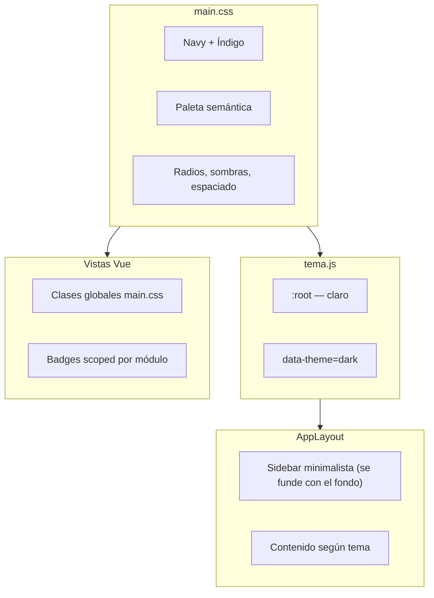

# Guía UX/UI del Sistema TI

> Este documento implementa, para Sistema TI, la fórmula y los patrones
> definidos en [`MATEREN-CORE.md`](MATEREN-CORE.md) (compartido entre todos
> los productos Materen). Lo de acá abajo son los **valores concretos**
> (hex, componentes ya cableados); la fundación conceptual vive allá.

**Vigencia**: actualizado 2026-07-06 — migración a Materen Core (Navy/Índigo,
tokens `--mat-*`, alias `--color-*`, Inter + Poppins). Si el código de
`main.css` contradice algo de aquí, gana el código
([Gobernanza de documentación](MATEREN-CORE.md#gobernanza)).

Documentación del sistema visual del panel: colores, tipografías, layout y
convenciones de componentes. Útil para mantener coherencia al añadir pantallas
o ajustar la identidad de marca.

### Sincronización con Materen Core

Para no mantener dos especificaciones que divergen con el tiempo, lo canónico
vive en [`MATEREN-CORE.md`](MATEREN-CORE.md); acá solo la implementación de
Sistema TI. Patrones ya **promovidos** al documento madre:

| Tema en esta guía | Especificación canónica | Qué queda acá |
|---|---|---|
| Escala z-index | [Fundaciones → Interacción](MATEREN-CORE.md#fundaciones) | Valores `--z-*` en `main.css` |
| Radios (`--radius-pill`, etc.) | [Fundaciones → Radios](MATEREN-CORE.md#fundaciones) | Tokens en `main.css` |
| Un acento por vista (+ excepción modal) | [Fundaciones → Interacción](MATEREN-CORE.md#fundaciones) | Corrección jul 2026 en 7 vistas |
| Badge base + modificadores, ajustes locales | [Patrones → Badge](MATEREN-CORE.md#patrones-de-componente) | Modificadores de dominio (`--purple`, `--sky`, etc.) |
| Capacity, timeline, confirmación, `.form-error` | [Patrones de componente](MATEREN-CORE.md#patrones-de-componente) | Markup de referencia de este repo |
| `.badge-group` | [Patrón candidato](MATEREN-CORE.md#patrones-de-componente) — **no generalizado** | Solo Equipos; no copiar hasta segunda ocurrencia |

## Arquitectura general

El frontend **no usa Tailwind ni librería de componentes**. Todo el diseño vive en:

| Archivo | Rol |
|---------|-----|
| [`frontend/src/styles/main.css`](../frontend/src/styles/main.css) | Design system completo: tokens, layout, botones, tablas, modales, badges, timeline, capacity, confirm-dialog, etc. |
| [`frontend/src/core/tema.js`](../frontend/src/core/tema.js) | Alternancia claro/oscuro (`data-theme` en `<html>`) |
| [`frontend/src/components/shared/AppLayout.vue`](../frontend/src/components/shared/AppLayout.vue) | Shell: sidebar minimalista + área principal |
| [`frontend/index.html`](../frontend/index.html) | Iconos (Tabler CDN). Sin webfonts de texto — tipografía del sistema operativo (ver §Tipografía) |

**Patrón de uso:** las vistas Vue aplican clases globales (`.card`, `.btn-primary`, `.filters`…) directamente en el template. Solo hay **un componente compartido** (`AppLayout`); el resto son vistas por módulo con `<style scoped>` para badges/chips de dominio.



---

## Identidad de marca

Implementación de [Identidad de marca](MATEREN-CORE.md#identidad-de-marca)
en `main.css` (tokens canónicos `--mat-*`; alias legacy `--color-*`):

| Token | Hex | Rol en Sistema TI |
|-------|-----|-------------------|
| `--mat-color-brand` | `#11133C` (Navy) | Identidad de marca |
| `--mat-color-accent` | `#4F46E5` (Índigo) | Botones primarios, foco, ítem activo |
| `--mat-color-accent-alt` | `#51EDC8` (Turquesa) | Extremo del gradiente del icono de marca |
| `--mat-color-brand-elevated` | `#1C2050` | Superficies secundarias sobre Navy (oscuro) |

El icono de marca usa **gradiente Índigo → Turquesa**:

```css
/* frontend/src/styles/main.css — .brand-icon */
background: linear-gradient(135deg, var(--mat-color-accent) 0%, var(--mat-color-accent-alt) 100%);
box-shadow: 0 4px 12px rgba(79, 70, 229, 0.35);
```

> **Código nuevo:** preferir `--mat-*`. Los `--color-*` existen solo como alias
> de compatibilidad hacia las vistas que aún no migraron.

---

## Paleta de colores (tokens CSS)

Los valores canónicos viven en `--mat-color-*`; la tabla usa los alias `--color-*`
que apuntan a ellos.

### Fondos y texto — tema claro (`:root`)

Neutros con tinte Navy (H~237°, saturación baja), según
[Fórmula de color → Neutros](MATEREN-CORE.md#formula-de-color):

| Token | Valor | Uso |
|-------|-------|-----|
| `--mat-color-bg` | `#eceef4` | Fondo de página |
| `--mat-color-bg-elevated` | `#fafafc` | Tarjetas, header |
| `--mat-color-bg-subtle` | `#f4f5f9` | Filtros, cabeceras de tabla |
| `--mat-color-bg-hover` | `#e2e4ec` | Hover en filas/elementos |
| `--mat-color-text-primary` | `#1a1d2e` | Texto principal |
| `--mat-color-text-secondary` | `#5a5f78` | Subtítulos, labels |
| `--mat-color-text-tertiary` | `#8b8fa3` | Placeholders, iconos muted |
| `--mat-color-border` | `#d4d7e3` | Bordes estándar |

### Acento / identidad

| Token | Claro | Oscuro |
|-------|-------|--------|
| `--mat-color-accent` | `#4F46E5` (índigo) | `#818CF8` |
| `--mat-color-accent-2` | `#51EDC8` (turquesa) | `#51EDC8` |
| `--mat-color-accent-soft` | `#6366F1` | `#A5B4FC` |
| `--mat-color-accent-hover` | `#4338CA` | `#6366F1` |
| `--mat-color-accent-subtle` | `#ededfc` | `rgba(129,140,248,0.14)` |
| `--mat-color-accent-text` | `#3730A3` | `#C7D2FE` |

En oscuro el índigo sube de luminosidad para mantener contraste sobre fondos Navy.

### Colores semánticos (convención de dominio)

Cada familia comparte **una sola fórmula** de saturación/luminosidad; solo
cambia el hue (H). Esto garantiza que las 8 familias se lean como *un mismo
sistema* y no como paletas sueltas:

- **Claro**: `bg` → H, S 35-55%, L 90-93% · `text` → H, S 45-60%, L 28-35% · `border` → H, S 30-45%, L 75-80%
- **Oscuro**: `bg` → H, S 25-30%, L 20-22% · `text` → H, S 45-60%, L 75-80% · `border` → H, S 25-30%, L 35-38%

Todas las variantes `-bg`/`-text` (16 pares, 8 familias × 2 temas) están
verificadas ≥5.3:1 de contraste (WCAG AA es 4.5:1; la mayoría cae en rango
AAA). Ver [`scripts/contraste.mjs`](../scripts/contraste.mjs) — correr
`node scripts/contraste.mjs` tras tocar estos tokens.

| Familia | Hue | Significado en el panel |
|---------|-----|--------------------------|
| **danger** (rojo) | 9° | Errores, crítico, equipos perdidos/robados |
| **success** (verde) | 100° | OK, disponible, activo |
| **warning** (ámbar) | 36° | Rotar contraseña, por vencer, suspendido, en reparación |
| **info** (azul) | 205° | Asignado, entregas |
| **purple** (morado) | 265° | Ubicaciones |
| **sky** (celeste) | 190° | Tipos de cuenta |
| **teal** | 170° | Correos, garantías |
| **neutral** (gris) | 100° (S baja) | Baja, inactivo genérico |

Cada familia expone `-bg`, `-text`, `-border`; `warning` y `teal` además
tienen variantes de énfasis (`-text-strong`, `-bg-strong`, `-bg-subtle`)
para casos donde el par base no da suficiente jerarquía visual — estas
variantes también están verificadas en el script.

`--color-danger` y `--color-success` (sin sufijo) son versiones **vivas**
de alta saturación para iconos/botones sólidos — no se usan para texto
sobre su propio `-bg` (para eso están `-text`).

> Corrección de accesibilidad (jul 2026): `--color-neutral-text` pasó de
> `#68716b` (4.2:1 sobre `--color-neutral-bg`, fallaba AA) a `#474d40`
> (~7.2:1, AAA).

### Sidebar (minimalista, sigue el tema)

Definido en `AppLayout.vue`. Regla de diseño (decisión del JEFE):
**el sidebar no debe sentirse como un bloque aparte** —

- Fondo: `var(--color-bg)` — el mismo de la página (sand claro / verde-noche
  oscuro). **Sin borde derecho, sin sombra, sin líneas divisorias** internas
  (logo y footer sin `border-bottom/top`).
- Hover de ítems: fondo muy tenue `var(--color-bg-hover)`, **nunca bordes**.
- Ítem activo: tinte suave `var(--color-accent-subtle)` + texto
  `var(--color-accent-text)`, **sin border-left ni indicadores**.
- Búsqueda: input sin borde visible (fondo tenue); al enfocar sube a
  `--color-bg-elevated` con borde suave.
- Ancho: `240px`. En móvil (off-canvas) sí lleva sombra al abrirse.

### Sombras y radios

```
--radius-sm: 6px      --shadow-sm: sutil
--radius-md: 10px     --shadow-md: tarjetas hover
--radius-lg: 14px     --shadow-lg: modales
--radius-xl: 20px
--radius-pill: 999px  (badges, capacity-bar, timeline-dot)
```

Escala canónica en [Fundaciones → Radios](MATEREN-CORE.md#fundaciones).

### Escala de z-index

Especificación canónica en [Fundaciones → Interacción](MATEREN-CORE.md#fundaciones)
("capas, no números sueltos"). Valores concretos de Sistema TI:

```
--z-header: 50           site-header sticky de cada vista
--z-header-mobile: 60    topbar-mobile (encima del header normal)
--z-nav: 100             sidebar en modo drawer (≤768px) + su overlay (z-nav - 1)
--z-popover: 300         .sb-resultados (búsqueda global)
--z-modal: 400           .modal-bg
--z-modal-stacked: 410   reservado para un modal sobre otro (sin uso aún)
--z-toast: 500           .toast — siempre visible, incluso sobre un modal
```

Antes de este ajuste, `.modal-bg` estaba en `z-index: 100` y el drawer móvil
en `200` — un modal podía quedar **debajo** del sidebar en móvil. Corregido
al fijar la escala (promovida a
[Materen Core → Fundaciones](MATEREN-CORE.md#fundaciones)). Los dropdowns internos de un modal (`.combo-lista` en
Equipos/Licencias, `z-index: 20`) no participan de esta escala: compiten
solo dentro del stacking context que crea su propio `.modal-bg`, no contra
el sidebar ni el header.

### Excepciones hardcodeadas

- Botón WhatsApp: `#25d366`
- Overlay de modal: `rgba(15,23,42,0.45)` + `backdrop-filter: blur(4px)`
- Focus ring en inputs: `box-shadow: 0 0 0 3px rgba(13,148,136,0.18)`

---

## Tipografía — Inter + Poppins (Materen Core)

Cargada en [`frontend/index.html`](../frontend/index.html), según
[Fundaciones → Tipografía](MATEREN-CORE.md#fundaciones):

| Rol | Fuente | Pesos |
|-----|--------|-------|
| Cuerpo / UI | **Inter** (`--mat-font-sans`) | 400–700 |
| Encabezados (marca, toolbar, modal) | **Poppins** (`--mat-font-display`) | 500–700 |
| Códigos, contraseñas, seriales | Mono del SO (`--mat-font-mono`) | — |
| Iconos | **Tabler Icons** (`ti ti-*`) | CDN |

Variables canónicas: `--mat-fs-*` (alias legacy `--fs-*`). El `body` usa
`--mat-fs-md` (14px). Títulos de marca/toolbar/modal usan `--font-display`.

### Escala tipográfica (tokenizada)

Tokens en `main.css` — **usar en pantallas nuevas** en lugar de px sueltos:

| Token | Valor | Uso típico |
|-------|-------|------------|
| `--mat-fs-xs` | 11px | Badges, headers de tabla (uppercase) |
| `--mat-fs-sm` | 12px | Labels secundarios, metadatos |
| `--mat-fs-base` | 13px | Botones, inputs, celdas de tabla, nav |
| `--mat-fs-md` | 14px | `body` base |
| `--mat-fs-lg` | 15px | Títulos de toolbar/sección |
| `--mat-fs-xl` | 17px | Títulos de modal |
| `--mat-fs-2xl` | 20px | Títulos de página/login |
| `--mat-fs-stat` | 26px | Valores en stat cards |

Pesos: **600** botones/nav/labels/badges (Materen Core), **700** solo stats y
marca. Uppercase con letter-spacing `0.04–0.06em`.

---

## Tema claro / oscuro

[`frontend/src/core/tema.js`](../frontend/src/core/tema.js):

1. `initTema()` se llama **antes** de montar Vue (evita flash)
2. Preferencia guardada en `localStorage` → clave `sistema-ti-tema`
3. Sin preferencia: respeta `prefers-color-scheme` del sistema
4. Oscuro: atributo `data-theme="dark"` en `<html>`

El sidebar usa los tokens del tema, así que **cambia junto con el área
principal** (sand en claro, verde-noche en oscuro).

---

## Layout y estructura de página

### Grilla de 12 columnas

Las vistas componen sobre `.grid-12` (12 columnas, gap 16px) con clases de
span `.col-2 / .col-3 / .col-4 / .col-6 / .col-8 / .col-12` definidas en
`main.css`. Colapso responsive automático: ≤1200px los spans se ensanchan
(2→4, 3→6, 4→6, 8→12); ≤700px todo apila (col-2 queda en media fila).

Uso en el Dashboard: 6 stat-cards `col-2` (fila completa), pendientes
`col-4` (3 por fila), recientes `col-3` (4 por fila). **Preferir esta grilla
sobre grids ad-hoc por vista.**

### Shell autenticado

```
┌────────────┬──────────────────────────────┐
│  Sidebar   │  layout-main (scroll)        │
│  240px     │  ├ site-header sticky 64px   │
│  (tema)    │  └ .page → .card → tabla     │
└────────────┴──────────────────────────────┘
```

### Página tipo listado (empleados, equipos, etc.)

1. `site-header` → `header-inner` → `.brand` + `.header-btns`
2. `main.page` → `.card`
3. `.card-toolbar` (título + acciones)
4. `.filters` (búsqueda + selects)
5. `.table-wrap` > `table` o `.empty`

### Rutas públicas (login, entrega)

Sin sidebar: card centrada a pantalla completa, reutilizando `.card`, `.brand`, `.form-group`, `.btn-primary`.

### Breakpoints responsive

| Ancho | Comportamiento |
|-------|----------------|
| ≤900px | Stats grid a 2 columnas |
| ≤768px | Sidebar off-canvas + topbar móvil 48px |
| ≤600px | Formularios 1 columna, padding reducido |

Constantes: `--header-h: 64px`, `--max-w: 1280px`, padding de página `1.5rem` (1rem en móvil).

---

## Componentes UI reutilizables (clases CSS)

Todo en `main.css` — no hay átomos Vue separados:

**Botones:** `.btn`, `.btn-primary`, `.btn-whatsapp` (+ `.btn-danger` local en algunos modales)

**Contenedores:** `.card`, `.card-toolbar`, `.stat-card`, `.cred-card`

**Formularios:** `.form-grid`, `.form-group`, `.section-label`, `.tool-tag`, `.tool-input`

**Datos:** `.table-wrap`, `table/th/td`, `.user-cell`, `.avatar`

**Estado:** `.status`, `.s-activo`, `.s-inactivo`, `.s-suspendido`, `.pill`, `.badge-count`

**Interacción:** `.icon-btn`, `.actions`, `.filters`, `.search-wrap`

**Overlays:** `.modal-bg`, `.modal`, `.modal-lg`, `.modal-detail`, `.modal-actions`

**Feedback:** `.empty`, `.no-results`, `.toast` (vía `core/toast.js`)

**Detalle:** `.detail-header`, `.detail-grid`, `.detail-item`

### Badges — sistema unificado

**Antes**: 5 convenciones distintas para el mismo patrón visual
(`.status`+`.s-*`, `.sit-*`, `.badge-rotar`, `.pill`, `.badge-count`), cada
una con su propio padding/radio/font-size ligeramente distinto. **Ahora**:
una sola base + modificador, definida una vez en `main.css`:

```html
<span class="badge badge--success">Activo</span>
<span class="status badge--warning">Suspendido</span>  <!-- +indicador de punto -->
```

| Modificador | Familia | Uso típico |
|-------------|---------|------------|
| `.badge--success` | verde | Activo, disponible, reutilizable libre |
| `.badge--warning` | ámbar | Suspendido, rotar contraseña, en reparación, entrega abierta |
| `.badge--danger` | rojo | Perdido/robado, sin devolver |
| `.badge--info` | azul | Asignado, "vio contraseña" |
| `.badge--purple` | morado | Ubicaciones, rol JEFE |
| `.badge--sky` | celeste | Tipo de cuenta (compartida/reutilizable en la ficha) |
| `.badge--teal` | teal | (disponible, sin uso activo aún) |
| `.badge--neutral` | gris | Inactivo, de baja |
| `.badge--accent` | identidad | Contadores (`badge-count`), "copió contraseña" |

`.status` es `.badge` + un indicador de punto (`::before`) para estados
"vivos" de una entidad (Activo/Inactivo/Suspendido); se combina con el
modificador de color: `class="status badge--success"`.

**Clases antiguas**: `.s-activo`, `.s-inactivo`, `.s-suspendido`,
`.sit-disponible`, `.sit-asignado`, `.sit-ubicacion`, `.sit-reparacion`,
`.sit-baja`, `.sit-perdido`, `.badge-rotar`, `.pill` siguen definidas en
`main.css` como **alias** (agrupadas en el mismo selector que su
modificador) — si algo externo las referencia, no se rompe. Ningún
template activo las usa ya.

**Ajustes locales permitidos**: cuando un badge necesita un detalle que no
es color/estructura (ej. `margin-left` para separarlo de texto vecino,
`text-transform: uppercase` para el chip de rol), se agrega como clase
adicional con solo esa propiedad — nunca redeclarando display/padding/
radius/font-size. Ejemplos: `.badge-inline` (cuentas), `.badge-rol`
(staff, solo `text-transform`+`letter-spacing`), `.badge-sin-devolver`
(equipos, solo `margin-left`+`font-weight`).

> Nota de diseño: al consolidar se **quitaron los `border: 1px solid`**
> que tenían `.badge-rotar` y `.badge-sin-devolver` — coherente con el
> principio minimalista (sidebar) de no usar bordes para estados, solo
> fondos tenues.

---

## Componentes de dominio (jul 2026)

Cuatro patrones que no existían como componente reutilizable — vivían como
tabla genérica o texto suelto — ahora están en `main.css`:

### Timeline (historial de asignaciones)

El README llama al historial de asignaciones "el corazón del sistema"; ahora
tiene su propia UI. Reemplaza `.table-wrap` para ese bloque específico:

```html
<div class="timeline">
  <div class="timeline-item">
    <span class="timeline-dot timeline-dot--active"></span>  <!-- fecha_fin NULL -->
    <div class="timeline-content">
      <div class="timeline-title">Juan Pérez <span class="badge badge--success badge-inline">Activa</span></div>
      <div class="timeline-meta">Desde 02/07/2026</div>
    </div>
  </div>
</div>
```

En uso: modal "Historial" de una cuenta (`CuentasPanel.vue`), reemplazando
la antigua `.historial-table`. `timeline-dot--closed` cuando hay `fecha_fin`.

### Barra de capacidad (asientos de licencia)

Reemplaza el texto suelto "2/3": comunica cercanía al tope **antes** de que
el trigger `check_tope_licencia` bloquee la asignación.

```html
<div class="capacity">
  <div class="capacity-bar"><div class="capacity-fill capacity-fill--warning" style="width: 80%"></div></div>
  <span class="capacity-label">4/5 asientos</span>
</div>
```

Umbrales: `--ok` <70% ocupado, `--warning` 70-99%, `--full` =100%. En uso en
`LicenciasView.vue` (tabla y modal "Asignar asiento").

### Badge doble (`.badge-group`)

> **Patrón candidato en Materen Core** — visto una sola vez en este repo; no
> generalizar hasta que un segundo módulo lo necesite. Ver
> [Patrones de componente → candidatos](MATEREN-CORE.md#patrones-de-componente).

Para entidades con **dos estados simultáneos e independientes** — un equipo
tiene estado físico (operativo/en_reparación/de_baja/perdido) y situación
derivada (Disponible/Asignado/En ubicación) a la vez:

```html
<span class="badge-group" title="Operativo · Asignado">
  <span class="badge badge--success badge-fisico">Operativo</span>
  <span class="badge badge--info">Asignado</span>
</span>
```

Solo se duplican los badges cuando ambos datos aportan información (equipo
operativo + en uso/ubicado); si no está operativo, el estado físico solo ya
lo dice todo. Columna `.th-situacion` con `min-width: 168px`; en pantallas
≤900px el badge físico (`.badge-fisico`) se oculta y queda accesible en el
`title` del grupo — se prioriza el estado derivado.

### Confirmación destructiva

```html
<div class="modal-bg confirm-dialog--destructive">
  <div class="modal">
    <div class="modal-title">
      <span style="display:flex;align-items:center;gap:10px">
        <span class="modal-icon"><i class="ti ti-user-off"></i></span>
        Dar de baja a Juan Pérez
      </span>
    </div>
    ...
  </div>
</div>
```

Borde superior rojo (`border-top: 3px solid`) + ícono circular de alerta.
**Decisión de producto (jul 2026)**: sin paso extra de fricción — no se pide
escribir el nombre ni marcar un checkbox; el detalle de "qué va a pasar"
vive en el cuerpo del modal (ver `BajaEmpleadoModal.vue`, que ya lo hace
mostrando el resumen de accesos antes de confirmar). No aplica a "revelar
contraseña" (es de lectura, ya auditada en Actividad) ni se implementó aún
para "cerrar asignación reutilizable" (usa `confirm()` nativo del navegador,
que no admite estilos — requeriría un modal propio; pendiente).

### Errores de formulario/acción (`.form-error`)

Antes duplicado idéntico en 10 módulos; ahora global. Distinto del toast:
**persiste** hasta que el usuario actúa, para mensajes que hay que leer
completos — típicamente rechazos de trigger de BD (tope de asientos, doble
titular activo, equipo no operativo). En uso en los modales "Asignar" de
Licencias y Equipos, además de los formularios de creación/edición.

```html
<p v-if="error" class="form-error" role="alert">{{ error }}</p>
```

`.form-grid .form-error` obtiene automáticamente `grid-column: 1 / -1`.

## Animaciones y micro-interacciones

- Transiciones hover: **0.12–0.2s** en botones, tarjetas, bordes
- Stat cards: `translateY(-1px)` + sombra al hover
- Modales: `fadeIn` 0.2s + `slideUp` 0.25s
- Sidebar móvil: slide con `transform` 0.25s

---

## Cómo modificar la identidad visual

1. **Cambiar marca:** editar `--mat-color-accent*` en `:root` y `[data-theme="dark"]` en [`main.css`](../frontend/src/styles/main.css)
2. **Cambiar tipografía:** actualizar `--mat-font-*` y el `<link>` en [`index.html`](../frontend/index.html)
3. **Nuevo componente visual:** preferir añadir clase global en `main.css` antes que estilos inline o duplicados por vista
4. **Nuevo estado/badge de dominio:** clase scoped en la vista usando `var(--color-*-bg)` y `var(--color-*-text)` existentes

---

## Resumen

Panel con **CSS custom + tokens Materen** (`--mat-*`), identidad **Navy +
Índigo/Turquesa**, tipografía **Inter + Poppins**, iconos **Tabler**, **tema
claro/oscuro** con sidebar minimalista que se funde con el fondo, y **clases
utilitarias globales** en `main.css`.

### Principios de diseño (definidos por el JEFE)

- **Minimalista**: no sobresaturar la vista ni agobiar con información.
- Estados hover/activo **sin bordes** — solo fondos muy tenues.
- Preferir fusión de superficies sobre paneles/bloques delimitados.
- **Un solo acento visible por vista**
  ([Fundaciones → Interacción](MATEREN-CORE.md#fundaciones)). El botón `.btn-primary`
  del header/toolbar de cada módulo (ej. "Nueva licencia") es el acento fijo
  de esa vista. **Corrección (jul 2026)**: en 7 vistas (Empleados, Correos,
  Empresas, Plataformas, Licencias, Equipos, Cuentas) el estado vacío
  mostraba un **segundo** `.btn-primary` idéntico ("Agregar X") al mismo
  tiempo que el del header — dos acentos simultáneos para la misma acción.
  Se demotó el CTA del estado vacío a `.btn` (secundario); el header sigue
  siendo el único lugar con el acento primario para "crear".
  **Excepción declarada**: el botón "Guardar"/"Confirmar" dentro de un
  modal SÍ puede ser `.btn-primary` aunque el header de la página detrás
  también lo sea — el modal es la superficie de foco activa, el fondo queda
  inerte tras el backdrop. No se considera doble acento.
