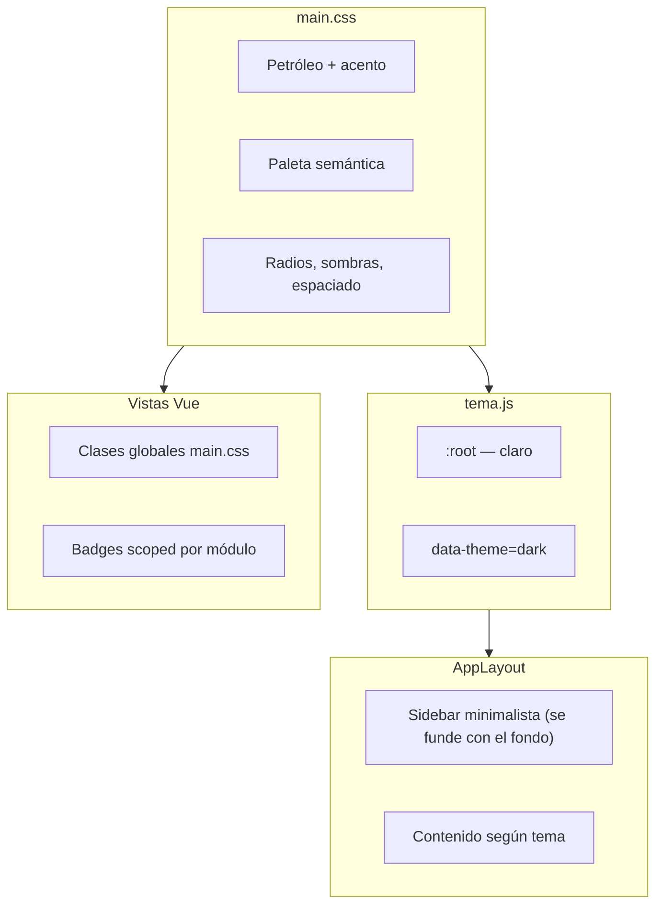

# Guía UX/UI — Materen · Sistema TI

> Documentación visual del panel **Materen — Sistema TI**. Los tokens canónicos
> viven en [`main.css`](../frontend/src/styles/main.css) (`--mat-*` y alias
> `--color-*`); este archivo describe cómo usarlos en las vistas.

**Vigencia**: este documento describe el **estado actual** del design
system — sin historia mezclada. El historial completo de cómo se llegó
hasta acá (cada pasada de trabajo sobre `design.pen`/`main.css`, con
archivos, riesgo y pendientes) vive en `docs/CHANGELOG.md` (versión
condensada al inicio, versión detallada en el apéndice al final) — se
extrajo de este archivo en la reorganización de documentación de
2026-08-29. Deuda de accesibilidad y hallazgos de diseño abiertos/cerrados
con su ID (DS-*, U-*, DP-*, UX*-*) viven en `docs/HISTORIAL-AUDITORIAS.md`,
no acá.

Documentación del sistema visual del panel: colores, tipografías, layout y
convenciones de componentes. Útil para mantener coherencia al añadir pantallas.

## Componentes compartidos (`frontend/src/components/shared/`)

Vistas de listado usan estos wrappers en lugar de copiar el markup del header
o del estado vacío:

| Componente | Uso |
|------------|-----|
| `PageHeader` | Título + icono Tabler + conteo opcional; slots `#acciones`, `#izquierda` (detalle con volver) y `#extra` (franja opcional bajo el header; sin uso actual — Configuración pasó a sidebar propio, ago 2026, ver más abajo) |
| `EmptyState` | Tabla sin filas: icono, título, mensaje y slot para CTA secundario (`.btn`, no primario) |
| `BadgeEstado` | Badge semántico vía `core/badges.js` (`tipo`: `empleado`, `ticket`, `prioridad`, `situacion`, `tipo_cuenta`) |
| `TextoVacio` | Celda vacía con placeholder `—` y clase `.text-muted` automática |
| `Pagination` | Paginación client/server (ya documentada abajo) |
| `PublicBrand` | Cabecera de páginas públicas (empleados sin sesión) |
| `NotificacionesCampana` | Campana de notificaciones (migración 045) en el footer del sidebar/topbar móvil; lista los 4 eventos con estado leído/no-leído, marca lectura por usuario vía `stores/notificaciones.js` |
| `SelectorVista` | Grupo segmentado **solo-ícono** para alternar la vista de un módulo (Tabla/Triage en Tickets — hasta la octava pasada, "Isla" — Tabla/Tarjetas en Empleados y Equipos) |
| `ListaVistas` | Lista de vistas/bandejas mutuamente excluyentes con contador opcional. Prop `variante`: `nav` (columna de riel, default) o `segmento` (grupo segmentado horizontal **con texto**). Ver "Variantes de `ListaVistas`" abajo |

Los mapas de color por dominio siguen en `core/dominio-*.js`; `core/badges.js`
solo despacha hacia ellos.

### Librería visual (`design.pen`)

`design.pen` (raíz del repo, se abre con Pencil) contiene el espejo visual de
este documento: los tokens `--mat-*` como variables con tema claro/oscuro, y
cada componente compartido y primitiva de `main.css` como componente
reutilizable e instanciable (46 componentes). Incluye tres tableros de nivel
raíz:

| Tablero | Contenido |
|---------|-----------|
| `Librería de componentes` | Fichas agrupadas: Tokens, Primitivas, Formularios, Datos y tablas, Contenedores, Superposiciones, Navegación y marca |
| `Empleados — listado` | Pantalla armada con los componentes (sidebar + `PageHeader` + filtros + tabla + paginación) |
| `Empleados — listado (tema oscuro)` | La misma pantalla con `theme: {mode: dark}` para revisar el tema oscuro |

El logotipo se reconstruyó desde `frontend/public/logo_materen_sisti.svg` (mismo
trazado; "sistema ti" en Poppins) y se invierte a blanco en tema oscuro, igual
que el `filter: brightness(0) invert(1)` del CSS. Si cambia un token o un
componente compartido, actualizar también el tablero correspondiente.

**Nomenclatura**: cada uno de los 46 componentes usa el prefijo
`Familia/Componente` (p. ej. `Primitivas/Botón`, `Formularios/Campo de
texto`, `Navegación y marca/Barra lateral`), con las mismas 7 familias que
agrupan las fichas del tablero (`Tokens`, `Primitivas`, `Formularios`,
`Datos y tablas`, `Contenedores`, `Superposiciones`, `Navegación y marca`).
`Ítem de combo`/`Lista de combo` viven en `Superposiciones` (no en
`Formularios`) porque su lista se teletransporta al body igual que un menú o
un modal, no porque el campo de búsqueda que los dispara no sea un
formulario.

## Arquitectura general

El frontend **no usa Tailwind ni librería de componentes**. Todo el diseño vive en:

| Archivo | Rol |
|---------|-----|
| [`frontend/src/styles/main.css`](../frontend/src/styles/main.css) | Design system completo: tokens, layout, botones, tablas, modales, badges, timeline, capacity, confirm-dialog, etc. |
| [`frontend/src/core/tema.js`](../frontend/src/core/tema.js) | Alternancia claro/oscuro (`data-theme` en `<html>`) |
| [`frontend/src/components/shared/AppLayout.vue`](../frontend/src/components/shared/AppLayout.vue) | Shell raíz: drawer/colapso, socket realtime, tema, logout. Compone `AppSearch.vue` (buscador), `AppNav.vue` (navegación) y `AppNotifications.vue` (toasts) — divididos del propio `AppLayout` en 2026-08-12 (era un god-component de 1161 líneas, A-06) |
| [`frontend/index.html`](../frontend/index.html) | Geist + Geist Mono (Google Fonts) + Tabler Icons |

**Patrón de uso:** las vistas Vue aplican clases globales (`.card`, `.btn-primary`, `.filters`…) directamente en el template; usan `<style scoped>` solo para badges/chips de dominio. El shell (`AppLayout` + `AppSearch`/`AppNav`/`AppNotifications`) es la excepción con layout propio. Nota de implementación: `.sidebar--colapsado` vive en `AppLayout` pero varias reglas de `AppSearch`/`AppNav` dependen de esa clase ancestro — `:global()` dentro de `<style scoped>` pierde el selector descendiente al compilar en este proyecto (verificado), así que esas reglas van en un segundo `<style>` sin scope en cada componente hijo.


```mermaid
flowchart TB
  subgraph tokens ["main.css"]
    brand["Petróleo + acento"]
    semantic["Paleta semántica"]
    layout["Radios, sombras, espaciado"]
  end

  subgraph theme ["tema.js"]
    light[":root — claro"]
    dark["data-theme=dark"]
  end

  subgraph shell ["AppLayout"]
    sidebar["Sidebar minimalista (se funde con el fondo)"]
    main["Contenido según tema"]
  end

  subgraph views ["Vistas Vue"]
    globalClasses["Clases globales main.css"]
    scopedBadges["Badges scoped por módulo"]
  end

  tokens --> theme
  theme --> shell
  tokens --> views
```

---

## Identidad de marca

> **Actualizado 2026-08-27 — corrección de una discrepancia documental
> heredada, no solo cambio de paleta**: esta sección decía que producción
> ya estaba en navy/mint (`#00203F`/`#36ECDE`) desde una reconciliación del
> 2026-08-22, contra la paleta teal-green (`#157955`/`#34D399`) de una
> pasada de julio. **Esa reconciliación estaba mal**: verificado al portar
> la dirección azul (G1, 2026-08-27), `main.css` seguía en teal-green real
> — el "navy/mint" nunca existió en el código, solo en el texto de esta
> guía. La cadena real de producción es **teal-green → azul**, directo, sin
> pasar nunca por navy/mint. Queda anotado acá porque es el mismo patrón de
> fondo que ya rompió CI una vez sin que nadie lo notara (Q-01,
> `docs/HISTORIAL-AUDITORIAS.md`) — documentación afirmando un estado que
> el código no tenía.

> **Principio (jul 2026, decisión del JEFE, sigue vigente): la marca no es la
> paleta del sistema.** El logo es identidad; las superficies, bordes y texto
> de la UI son **grises neutros** en ambos temas. La marca se conecta a la
> interfaz únicamente a través del **acento** (botón primario, nav activo,
> focus ring) y del propio logo — el logo en sí (`logo_materen_sisti.svg`,
> `icon_sisti.svg`) es arte vectorial con color fijo dentro del archivo, no
> un token CSS: cambiar la paleta de la UI no le cambia un solo píxel. Si el
> rebranding requiere un logo nuevo en azul, es un entregable de diseño
> aparte, fuera de alcance de la migración de tokens.

### Estado actual en producción (azul — desde 2026-08-27, Fases G0-G5)

| Token | Claro | Oscuro | Rol en Sistema TI |
|-------|-------|--------|-------------------|
| `--mat-color-brand-500` | `#0082FB` | `#0082FB` (invariante) | Foco, focus ring, indicadores no textuales — **nunca texto ni fondo con texto blanco** (3.76:1, bajo AA) |
| `--mat-color-brand-600` | `#0064E0` | `#0064E0` (invariante) | Botón primario, links, nav activo, estados interactivos sólidos |
| `--mat-color-brand-700` | `#0052B8` | `#0052B8` (invariante) | Hover/pressed del acento |
| `--mat-color-accent` | `#0064E0` (=brand-600) | `#0064E0` | Ya no salta de hue entre temas, a diferencia de la paleta anterior |
| `--mat-color-accent-hover` | `#0052B8` (=brand-700) | `#0052B8` | — |
| `--mat-color-accent-alt` / `-soft` | `#0082FB` (=brand-500) | `#0082FB` | Alias de brand-500, no color propio |
| `--mat-color-accent-2` | `#0052B8` (=brand-700) | `#0052B8` | Gradiente de avatar (`AppLayout.vue`, `DashboardView.vue`, `EmpleadoDetalleView.vue`) |
| `--mat-color-accent-subtle` | `#E5F2FF` | `rgba(0,130,251,0.16)` | — |
| `--mat-color-accent-text` | `#0064E0` (=brand-600) | `#3D9CFF` | **Distinto del botón en oscuro** — brand-600 como texto sobre superficie oscura mide 3.06:1, bajo AA |
| `--color-primary` (alias legacy) | = `--mat-color-accent-text` | = `--mat-color-accent-text` | **Ya no es alias directo de `--mat-color-accent`** — sigue al valor de texto (`#3D9CFF` en oscuro), no al del botón |

`success`/`warning`/`danger`/`info` **sin cambios** — la migración de marca nunca tocó los semánticos (confirmado también en `StyleLabView.vue`, ver changelog abajo).

`--mat-color-brand` (`#072E2A`), `--mat-color-brand-elevated` (`#0A2E28`) y
`--mat-color-brand-ink` (`#072E2A` claro / `#34D399` oscuro — sin consumidores
reales hoy, verificado por grep) son el verde petróleo original del logo,
reservados a piezas de marca y **no tocados por G1** (confirmado con
`git show cd21c9a -- frontend/src/styles/main.css`).

### Fondos y texto (ambos temas, actualizado con la migración de marca)

| Token | Claro | Oscuro | Nota |
|-------|-------|--------|------|
| `--mat-color-bg` | `#F1F5F8` | `#0F1720` | — |
| `--mat-color-bg-elevated` | `#FFFFFF` (sin cambio) | `#16202B` (antes `#16181B`) | — |
| `--mat-color-text-primary` | `#1C2B33` | `#EDF2F5` | — |
| `--mat-color-text-secondary` | `#52636D` | `#9FB0BA` | — |
| `--mat-color-text-tertiary` | `#697281` (4.86:1 vs. bg-elevated) | `#818A96` (4.71:1 vs. bg-elevated nuevo) | **El valor de oscuro se recalculó en vivo**: el planeado (`#747C8B`) medía 4.23:1 contra el `bg-elevated` nuevo (más claro que el viejo) y fallaba AA — se ajustó a `#818A96` durante la propia migración (G2), no quedó como se había planeado originalmente. Cierra U-01 (`docs/HISTORIAL-AUDITORIAS.md`) de forma definitiva. |
| `--mat-color-text-disabled` / `-inverse` | sin cambio | sin cambio | No tocados por esta migración |

### Bordes — jerarquía de 3 niveles (ya portada, no "pendiente")

| Nivel | Token | Claro | Oscuro | Uso |
|---|---|---|---|---|
| Sutil | `--mat-color-border` / `-subtle` | `#D9E2E8` | `#1F2A35` | Decorativo — card/tabla/modal, sin umbral WCAG exigible |
| Default | `--mat-color-border-default` | `#7E96A3` (3.10:1) | `#5A6E7E` (3.11:1) | Input, select, textarea, botón secundario en reposo |
| Fuerte | `--mat-color-border-strong` | `#526A7B` (5.67:1) | `#7B93A3` (5.13:1) | Hover de controles, seleccionado no enfocado, toast |

### Sombras y radios (ya portadas)

```css
--radius-lg: 12px;   /* antes 14px */
--radius-xl: 16px;   /* antes 14px — deja de ser idéntico a radius-lg */
--shadow-sm: 0 1px 2px rgba(28,43,51,.06);
--shadow-md: 0 4px 12px rgba(28,43,51,.08);
--shadow-lg: 0 16px 40px rgba(28,43,51,.16);
--shadow-modal: var(--shadow-lg);   /* alias, no valor propio */
```

Política de elevación por componente, ya aplicada:

| Componente | Token | Estado |
|---|---|---|
| `.card`, `.stat-card`, tabla, paneles normales | ninguno | ✅ sin cambio, sigue así |
| `.card--clicable` (nueva variante, solo hover/focus) | `--shadow-sm` + borde `--color-border-default` en hover; `--shadow-sm` + `--mat-ring` + borde acento en focus | ✅ nueva clase creada en G4 |
| Popovers (`MenuAcciones`, `BuscadorCombo`, `AppSearch`, `NotificacionesCampana`, `AppNotifications`) | `--shadow-md` | ✅ bajado de `--shadow-lg` (3 de 5 lo tenían mal, nivel modal) |
| Toast | `--shadow-md` | ✅ antes no tenía ninguna |
| Modal | `--shadow-lg` (=`--shadow-modal`) | ✅ antes no tenía ninguna |

**Nota de la propia migración**: al activar `--shadow-sm` con valor real
(antes era `none`), `.panel-lista` y `.stat-card` del Dashboard quedaron con
sombra no deseada en contenedores estáticos — se corrigieron quitándoles la
regla en el mismo pase (G4), junto con el mismo hallazgo en `.aviso-card`
de `AppNotifications.vue` (bajado de `--shadow-lg` a `--shadow-md`, mismo
patrón que los popovers). Si aparece otra sombra "fantasma" en algún
componente que antes de esta migración tenía `box-shadow: var(--shadow-sm)`
de forma inerte, es la misma causa — revisar contra la lista de "Repaso de
consistencia" más abajo en este documento.

### Anillo de foco

```css
--mat-ring: rgba(0, 130, 251, 0.28);   /* claro */
--mat-ring: rgba(0, 130, 251, 0.35);   /* oscuro */
```

Derivado de brand-500 (indicador no textual, umbral 3:1), no de brand-600.

### Sigue pendiente, sin relación con esta migración

- **Selección múltiple en tablas ITSM (`TK1`/`TK2`)**: sigue bloqueada por la
  tensión sin resolver del principio "sin bordes de costado" (ver
  "Ambigüedad documental encontrada", más abajo en "Un solo acento visible
  por vista") — no depende del color, sigue esperando decisión del JEFE.
- **Propuesta de paleta dot-notation de `design.pen`** (tercera pasada,
  verde/teal, ver changelog "propuesta de rediseño de paleta"): queda
  formalmente **descontinuada** — no se portó nunca a producción y la
  dirección real terminó siendo la azul del Style Lab. El bloque
  correspondiente de este documento queda como archivado, no se borra
  (valor histórico).

---

## Paleta de colores (tokens CSS)

Los valores canónicos viven en `--mat-color-*`; la tabla usa los alias `--color-*`
que apuntan a ellos.

### Fondos y texto — tema claro (`:root`)

Grises neutros, valores reales de `main.css` (ver nota de reconciliación en
"Identidad de marca" — esta tabla listaba antes los valores de la pasada
teal-green, ya reemplazados por navy/mint en el código sin actualizar acá):

| Token | Valor | Uso |
|-------|-------|-----|
| `--mat-color-bg` | `#F4F6F7` | Fondo de página |
| `--mat-color-bg-elevated` | `#FFFFFF` | Tarjetas, header |
| `--mat-color-bg-subtle` | `#E6E9EC` | Filtros, cabeceras de tabla |
| `--mat-color-bg-hover` | `#D9DDE1` | Hover en filas/elementos |
| `--mat-color-text-primary` | `#2F2F2F` | Texto de cuerpo |
| `--mat-color-text-secondary` | `#6B7280` | Subtítulos, labels |
| `--mat-color-text-tertiary` | `#9CA3AF` | Placeholders |
| `--mat-color-border` | `#DADFE3` | Bordes estándar |

En oscuro el lienzo también es gris neutro (`#0F1113` página, `#16181B`
tarjetas, bordes `#282D33`). El acento sube a `#36ECDE` (mint) — ver nota de
"cambio de comportamiento" en Identidad de marca: la dirección aprobada
pendiente de portar deja de saltar de hue entre temas.

**Dirección aprobada, pendiente de portar** — valores **específicos por
tema**, no un único valor compartido (corrección 2026-08-22: una versión
anterior de este párrafo podía leerse como que claro y oscuro comparten
fondo/texto; no es así):

| Token | Claro | Oscuro |
|---|---|---|
| `--mat-color-bg` (app) | `#F1F5F8` | `#0F1720` |
| `--mat-color-bg-elevated` (superficie) | `#FFFFFF` | `#16202B` |
| `--mat-color-text-primary` | `#1C2B33` | `#EDF2F5` |
| `--mat-color-text-secondary` | `#52636D` | `#9FB0BA` |

Valores de oscuro tomados de `.sl-lab.sl-oscuro` en
`frontend/src/modules/styleLab/StyleLabView.vue`. Detalle completo, incluida
la tabla de bordes por tema, en "Identidad de marca".

### Acento / identidad

| Token | Claro | Oscuro |
|-------|-------|--------|
| `--mat-color-accent` | `#00203F` | `#36ECDE` |
| `--mat-color-accent-hover` | `#0B3A61` | `#21C9BC` |
| `--mat-color-accent-subtle` | `#E1FBF8` | `rgba(54,236,222,0.14)` |
| `--mat-color-accent-text` | `#00203F` | `#7DF3E9` |
| `--color-primary` (alias legacy, ~20 consumidores de texto/borde) | `#00203F` | `#36ECDE` |

Títulos (toolbar, modal) y valores de stats usan `--color-text-primary`, igual
que el cuerpo — la jerarquía se logra con tamaño/peso, no con el color de
marca. `--mat-color-brand` queda reservado al área del logo.

**Dirección aprobada, pendiente de portar** (commit `G1` del plan de
migración): `--mat-color-accent` → `#0064E0` en **ambos** temas (no salta a
otro hue en oscuro); `--mat-color-accent-hover` → `#0052B8`;
`--mat-color-accent-subtle` → `#E5F2FF` (claro) / `rgba(0,130,251,0.16)`
(oscuro — tinte de baja opacidad sobre la superficie oscura, no un hex
sólido, tomado de `.sl-lab.sl-oscuro` en `StyleLabView.vue`);
`--mat-color-accent-text` → `#0064E0` (claro) / `#3D9CFF` (oscuro, ver por
qué en "Identidad de marca"); **`--color-primary` deja de ser un alias
directo de `--mat-color-accent` y pasa a apuntar a
`--mat-color-accent-text`** — mismo commit, sin ventana intermedia donde uno
esté migrado y el otro no (hallazgo de la planificación: `--color-primary`
usado como color de *texto* en `.empleado-link:hover`, `BuscadorCombo.vue`,
`ThOrdenable.vue`, `CorreoForm.vue`, `CuentaForm.vue`, `LicenciaForm.vue`,
`EquipoForm.vue`, `EquiposView.vue`, `EmpleadoDetalleView.vue`,
`EntregaView.vue`, `PersonalRegistrosView.vue`, `PreguntaCampo.vue`,
`LoginView.vue`, `CorreosView.vue`, `CuentasPanel.vue` — con el alias viejo,
brand-600 como texto sobre la superficie oscura mide 3.06:1, bajo AA).

### Colores semánticos (convención de dominio)

> **Sin cambios en la migración de paleta azul** (ago 2026): `success`,
> `warning`, `danger`, `info` conservan su semántica y valores propios,
> independientes del acento de marca. Nota aparte, no bloqueante: la fórmula
> HSL de abajo es una descripción de diseño, no necesariamente el valor hex
> exacto que tiene hoy cada token en `main.css` (no verificado en esta
> pasada — quedaría para una auditoría de documentación aparte, sin relación
> con el rebranding).

Cada familia comparte **una sola fórmula** de saturación/luminosidad; solo
cambia el hue (H). Esto garantiza que las 8 familias se lean como *un mismo
sistema* y no como paletas sueltas:

- **Claro**: `bg` → H, S 35-55%, L 90-93% · `text` → H, S 45-60%, L 28-35% · `border` → H, S 30-45%, L 75-80%
- **Oscuro**: `bg` → H, S 25-30%, L 20-22% · `text` → H, S 45-60%, L 75-80% · `border` → H, S 25-30%, L 35-38%

Todas las variantes `-bg`/`-text` (16 pares, 8 familias × 2 temas) están
verificadas ≥5.3:1 de contraste (WCAG AA es 4.5:1; la mayoría cae en rango
AAA). Ver [`scripts/contraste.mjs`](../scripts/contraste.mjs) — correr
`node scripts/contraste.mjs` tras tocar estos tokens.

| Familia | Hue | Significado en el panel |
|---------|-----|--------------------------|
| **danger** (rojo) | 9° | Errores, crítico, equipos perdidos/robados |
| **success** (verde) | 100° | OK, disponible, activo |
| **warning** (ámbar) | 36° | Rotar contraseña, por vencer, suspendido, en reparación |
| **info** (azul) | 205° | Asignado, entregas |
| **purple** (morado) | 265° | Ubicaciones |
| **sky** (celeste) | 190° | Tipos de cuenta |
| **teal** | 170° | Correos, garantías |
| **neutral** (gris) | 100° (S baja) | Baja, inactivo genérico |

Cada familia expone `-bg`, `-text`, `-border`; `warning` y `teal` además
tienen variantes de énfasis (`-text-strong`, `-bg-strong`, `-bg-subtle`)
para casos donde el par base no da suficiente jerarquía visual — estas
variantes también están verificadas en el script.

`--color-danger` y `--color-success` (sin sufijo) son versiones **vivas**
de alta saturación para iconos/botones sólidos — no se usan para texto
sobre su propio `-bg` (para eso están `-text`).

> Corrección de accesibilidad (jul 2026): `--color-neutral-text` pasó de
> `#68716b` (4.2:1 sobre `--color-neutral-bg`, fallaba AA) a `#474d40`
> (~7.2:1, AAA).

### Sidebar (minimalista, sigue el tema)

Definido en `AppLayout.vue`. Regla de diseño (decisión del JEFE):
**el sidebar no debe sentirse como un bloque aparte** —

- Fondo: `var(--color-bg)` — el mismo de la página (gris claro / gris-noche
  oscuro). **Sin borde derecho, sin sombra, sin líneas divisorias** internas
  (logo y footer sin `border-bottom/top`).
- Hover de ítems: fondo muy tenue `var(--color-bg-hover)`, **nunca bordes**.
- Ítem activo: tinte suave `var(--color-accent-subtle)` + texto
  `var(--color-accent-text)`, **sin border-left ni indicadores**.
- Foco de ítems (`:focus-visible`, DS-04 resuelto ago 2026): `outline: 2px
  solid var(--color-accent); outline-offset: -2px` — `outline`, no el anillo
  `box-shadow` que usan botones/inputs, porque el `gap` de 2px entre ítems
  recortaría el `box-shadow`. Mismo criterio en `.th-ordenable-btn`
  (encabezado ordenable de tablas). `.sb-nav-titulo` (título de grupo) ya no
  es focoable desde el rediseño de sidebar (ago 2026, ver más abajo): es un
  `<div>` estático, no un control.
- Búsqueda: input sin borde visible (fondo tenue); al enfocar sube a
  `--color-bg-elevated` con borde suave.
- **Nav agrupada semánticamente**, definida en `AppNav.vue` (`navGrupos`), en
  este orden: "Día a día" (Dashboard, Tickets, Empleados) →
  "Activos y credenciales" (Correos,
  Licencias, Equipos) → "Conocimiento y mejora" (Base de Conocimiento,
  Problemas, Encuestas) → "Administración" (Actividad y Accesos sensibles,
  ambos solo JEFE — **Configuración ya no vive acá**, ver el apéndice de
  `docs/CHANGELOG.md`, "sidebar reagrupado a producción"). Un grupo sin
  ítems visibles para el rol actual (ej.
  "Administración" completo para ASISTENTE, una vez retirada Configuración)
  no se renderiza — un encabezado sin filas debajo se leería como una
  sección rota. Labels de sección en uppercase 11px `--color-text-secondary`;
  la separación entre grupos es solo espaciado (`gap`), **nunca líneas
  divisorias**. Colapsado (rail): los labels se ocultan y queda el
  espaciado.
- **Sin acordeón por grupo** (retirado en el rediseño de sidebar, ago 2026):
  los títulos de grupo son ahora `<div>` estáticos, siempre expandidos —
  ver el apéndice de `docs/CHANGELOG.md`, "acordeón por grupo en el
  sidebar" (octava pasada), para el porqué y el detalle.
- Ancho: `240px` expandido, `64px` colapsado (rail de solo iconos). En móvil
  (off-canvas) sí lleva sombra al abrirse.
- **Colapso (jul 2026)**: toggle en la fila del logo
  (`ti-layout-sidebar-left-collapse/expand`); preferencia persistida en
  `localStorage` clave `sistema-ti-sidebar` (mismo patrón que el tema).
  Colapsado: labels ocultos con `title` como tooltip, búsqueda reducida a un
  botón que expande y enfoca el input, footer apilado con solo avatar +
  iconos. Solo aplica en desktop (>768px); el drawer móvil siempre va
  completo y oculta el toggle. **Default inteligente (ago 2026, ver
  changelog "compactación del sidebar" más abajo)**: sin preferencia
  guardada, arranca colapsado en ventanas `≤1200px` (breakpoint ya usado en
  `main.css`/`DashboardView.vue`) y expandido en monitores más anchos; una
  vez que el usuario toca el toggle, su elección manda sobre el tamaño de
  ventana en cualquier sesión futura.
- **Footer de usuario condensado (ago 2026)**: a 240px de ancho, avatar +
  nombre + 3 botones de ícono (campana, tema, logout) dejaban al nombre
  ~66px de ancho antes de truncarse (ej. "a.gueva…"). Tema y "Cerrar
  sesión" se movieron a un menú `⋮` (reusa `MenuAcciones.vue`, el mismo
  componente de los menús de fila de tabla — sin componente nuevo); la
  campana de notificaciones queda visible fuera del menú por ser
  información urgente/frecuente, no una acción de cuenta. Resultado: el
  nombre gana ~40px (ej. "a.guevaramart…"). **Configuración se suma a ese
  mismo menú (ago 2026, rediseño de sidebar)** como primer ítem, antes de
  tema/logout — no es una sección de uso diario, así que sale de la nav
  principal. `label` del trigger pasa de "Más acciones de la cuenta" a
  "Configuración y cuenta" para reflejarlo.

### Sombras y radios

Estado actual (valores reales de `main.css`):

```
--radius-sm: 6px      --shadow-sm: none
--radius-md: 8px      --shadow-md: none
--radius-lg: 14px     --shadow-lg: none
--radius-xl: 14px     (idéntico a --radius-lg — no diferenciados hoy)
--radius-pill: 999px  (badges, capacity-bar, timeline-dot)
```

Los 3 `--shadow-*` valen literalmente `none` — decisión de producto "sin
sombras en contenedores" (DS v0.3 §3.4). Ningún componente (`.card`,
`.stat-card`, `.modal`, popovers) tiene sombra visible hoy en producción.

**Dirección aprobada, pendiente de portar** (commit `G4` del plan de
migración — token + consumidor en el mismo commit, para no dejar una ventana
donde el valor ya es real pero algún componente sigue mal alineado):

```
--radius-lg: 12px     --shadow-sm: 0 1px 2px rgba(28,43,51,.06)   md
--radius-xl: 16px     --shadow-md: 0 4px 12px rgba(28,43,51,.08)  lg
                      --shadow-lg: 0 16px 40px rgba(28,43,51,.16) --shadow-modal alias de --shadow-lg
```

Elevación por componente (política cerrada, no una sombra genérica "para
separar secciones"):

| Componente | Token | Estado hoy |
|---|---|---|
| `.card`, `.stat-card`, tabla, paneles normales | ninguno — solo borde sutil | ✅ ya así |
| Card clicable, en hover/focus únicamente | `--shadow-sm` | pendiente (no existe hoy la variante "clicable") |
| Dropdown / popover / menú contextual (`BuscadorCombo`, `NotificacionesCampana`, `AppSearch`, `MenuAcciones`) | `--shadow-md` | pendiente — 3 de los 4 hoy apuntan a `--shadow-lg` (el nivel de modal) y 1 no tiene ninguna |
| Toast | `--shadow-md` | pendiente — hoy no tiene ninguna |
| Modal | `--shadow-lg` (= `--shadow-modal`) | pendiente — hoy no tiene ninguna |

Escala en `main.css` (`--radius-*`, `--shadow-*`).

### Escala de z-index

Especificación en `main.css` (`--z-*`).

```
--z-header: 50           site-header sticky de cada vista
--z-header-mobile: 60    topbar-mobile (encima del header normal)
--z-nav: 100             sidebar en modo drawer (≤768px) + su overlay (z-nav - 1)
--z-popover: 300         .sb-resultados (búsqueda global)
--z-modal: 400           .modal-bg
--z-modal-stacked: 410   reservado para un modal sobre otro (sin uso aún)
--z-popover-modal: 420   .combo-lista (BuscadorCombo) — popover teleportado
                         a <body> que nace dentro de un modal y debe superarlo
--z-toast: 500           .toast — siempre visible, incluso sobre un modal
```

Antes de este ajuste, `.modal-bg` estaba en `z-index: 100` y el drawer móvil
en `200` — un modal podía quedar **debajo** del sidebar en móvil. Corregido
al fijar la escala completa en `main.css`.

Un popover que se teletransporta a `<body>` deja de competir dentro del
stacking context de su modal y pasa a competir contra toda la escala: por eso
`.combo-lista` necesita un nivel propio por encima de `--z-modal`. Un popover
que sigue dentro del árbol del modal (posicionado con `absolute`) no participa
de la escala y le basta un `z-index` local.

### Bordes — jerarquía de 3 niveles (dirección aprobada, pendiente de portar)

Hoy `main.css` usa un solo nivel "genérico" (`--color-border`) para
cards, tabla, modal, inputs, selects, textareas y botones por igual. La
dirección aprobada separa 3 niveles, verificados a los umbrales reales de
WCAG 1.4.11 (3:1 para el borde de un componente interactivo; un borde
puramente decorativo, como el de una card, no está sujeto a ese umbral):

| Nivel | Token | Claro | Oscuro | Uso | Contraste vs. superficie |
|---|---|---|---|---|---|
| Sutil | `--color-border` / `--color-border-subtle` | `#D9E2E8` | `#1F2A35` | Separadores, borde de card/tabla/modal — decorativo | no exigible |
| Default | `--color-border-default` (nuevo) | `#7E96A3` | `#5A6E7E` | Input, select, textarea, botón secundario en reposo | 3.10:1 (claro) / 3.11:1 (oscuro) |
| Fuerte | `--color-border-strong` | `#526A7B` | `#7B93A3` | Hover de controles, seleccionado no enfocado, toast | 5.67:1 (claro) / 5.13:1 (oscuro) |

Nota de proceso: el primer valor propuesto para "default" (`#A9BBC6`) medía
1.98:1 — bajo el umbral. Se ajustó manteniendo el matiz. El valor de
"fuerte" también se re-ajustó una vez corregido "default", porque ambos
quedaban casi idénticos entre sí sobre blanco (no hay margen en esta franja
gris-azulada para dos tonos que pasen 3:1 y además se distingan). El foco
**nunca** se resuelve solo con un cambio de borde — siempre borde de acento
+ anillo (`--color-focus`/`--color-focus-ring`), ver más abajo.

### Excepciones hardcodeadas

- Botón WhatsApp: `#25d366` (sin cambios — no forma parte del rebranding, es
  color de marca de un tercero)
- Overlay de modal (`.modal-bg`): `rgba(12,15,17,0.55)`, sin `blur` — mismo
  valor en ambos temas
- Focus ring en inputs/botones (`--mat-ring`): `rgba(0,32,63,0.28)` (claro,
  derivado del navy actual) / `rgba(54,236,222,0.28)` (oscuro, derivado del
  mint actual)

**Dirección aprobada, pendiente de portar** (commit `G3`): el anillo de foco
pasa a `rgba(0,130,251,0.28)` (claro) / `rgba(0,130,251,0.35)` (oscuro) —
derivado de brand-500, no de brand-600, porque un anillo es un indicador no
textual (umbral 3:1) y brand-500 ya cumple ahí sin necesidad del ajuste que
sí hace falta para texto.

---

## Tipografía — Geist (ago 2026)

**Una sola familia** para cuerpo y títulos (decisión del JEFE, cierra la
nota "Axiforma pendiente" que quedaba abierta desde la versión anterior de
esta sección) — reemplaza el par Inter/Sora: Inter se sentía genérico,
Sora se había elegido para acompañar el logotipo viejo (verde), motivo que
dejó de aplicar con el rebranding a azul. La jerarquía entre cuerpo y
títulos la sigue dando el peso (600–700 en títulos) y el tamaño, no una
segunda tipografía — mismo criterio que "ningún dato en negrita en celdas
de tabla" (jerarquía por peso/tamaño/posición, no por ornamento).

| Rol | Fuente | Pesos |
|-----|--------|-------|
| Cuerpo / UI / Encabezados | **Geist** | 400–700 |
| Mono | **Geist Mono** | 400–700 |
| Iconos | **Tabler Icons** | CDN |

`--mat-font-display` es alias de `--mat-font-sans` (mismo valor) — el token
se conserva porque lo consumen varios componentes vía `--font-display`, no
porque siga aportando una tipografía distinta. Mono deja de depender de la
pila del sistema operativo (Cascadia en Windows, SF Mono en Mac — variaba
entre usuarios) y pasa a ser Geist Mono, cargada igual que el resto.

Variables canónicas: `--mat-fs-*` (alias legacy `--fs-*`). El `body` usa
`--mat-fs-md` (14px). Títulos de marca/toolbar/modal usan `--font-display`.

### Escala tipográfica (tokenizada)

Tokens en `main.css` — **usar en pantallas nuevas** en lugar de px sueltos:

| Token | Valor | Uso típico |
|-------|-------|------------|
| `--mat-fs-xs` | 11px | Badges, headers de tabla (uppercase) |
| `--mat-fs-sm` | 12px | Labels secundarios, metadatos |
| `--mat-fs-base` | 13px | Botones, inputs, celdas de tabla, nav |
| `--mat-fs-md` | 14px | `body` base |
| `--mat-fs-lg` | 15px | Títulos de toolbar/sección |
| `--mat-fs-xl` | 17px | Títulos de modal |
| `--mat-fs-2xl` | 20px | Títulos de página/login |
| `--mat-fs-stat` | 26px | Valores en stat cards |

Pesos: **600** botones/nav/labels/badges, **700** solo stats y
marca. Uppercase con letter-spacing `0.04–0.06em`.

### Escala de íconos (tokenizada, 2026-08-28)

Los íconos se dimensionan con `font-size` (son un webfont, Tabler) pero **no
pertenecen a la escala tipográfica**: mezclarlos obliga a elegir entre "el
tamaño de letra correcto" y "el tamaño de ícono correcto" con un solo juego de
nombres. Tienen escala propia, `--mat-icon-*` (alias `--icon-*`).

| Token | Valor | Uso |
|-------|-------|-----|
| `--mat-icon-xs` | 13px | Dentro de un chip o badge, junto a `--fs-sm` |
| `--mat-icon-sm` | 14px | Inline en una línea de texto de UI |
| `--mat-icon-md` | 16px | Default: campo, toast, ítem de menú |
| `--mat-icon-lg` | 18px | Botón de ícono, topbar, acción de fila |
| `--mat-icon-xl` | 20px | Ícono dentro de un contenedor (stat, aviso) |
| `--mat-icon-2xl` | 28px | Ilustrativo en contenedor circular (`.empty-icon`) |
| `--mat-icon-hero` | 40px | Ilustración de página completa (404, vistas públicas) |

**Antes de tokenizar** convivían **11 tamaños crudos** de ícono
(13/14/16/17/18/19/20/22/24/28/40px) repartidos en 20+ archivos, sin ningún
criterio que dijera cuál usar. Junto con el texto eran **131 declaraciones
`font-size` en px sueltos**, incluidos medios píxeles que no existen en
ninguna escala (`10.5`, `11.5`, `12.5`, `13.5px`). Hoy quedan **cero**: todo
apunta a `--fs-*` o `--icon-*`.

`.ti` tiene `line-height: 1` en el webfont, así que el valor de `font-size`
**es** el lado del cuadro del ícono. Por eso el cálculo de target táctil se
hace directo sobre estos números, sin factor de corrección:

```css
@media (pointer: coarse) {          /* WCAG 2.5.5: target >= 44x44 */
  .icon-btn { padding: 13px; }      /* --icon-lg (18) + 13x2 = 44 exactos */
}
```

Ese `padding` era `13.5px` cuando `.icon-btn` medía 17px — el medio píxel
desapareció al tokenizar, no se "ajustó" a mano.

**Dos excepciones declaradas** a las escalas, ambas anotadas en su archivo:
`.ds-swatch span` (9px, micro-etiqueta con el hex dentro del swatch de
`DesignSystemView.vue`) y `.nivel-btn` (24px, glifo de la escala de
satisfacción 1-5 en `EncuestaSatisfaccionForm.vue` — es el contenido del
control, ni texto de UI ni ícono del sistema). Cualquier otro px suelto que
aparezca es deuda, no criterio.

---

## Tema claro / oscuro

[`frontend/src/core/tema.js`](../frontend/src/core/tema.js):

1. `initTema()` se llama **antes** de montar Vue (evita flash)
2. Preferencia guardada en `localStorage` → clave `sistema-ti-tema`
3. Sin preferencia: respeta `prefers-color-scheme` del sistema
4. Oscuro: atributo `data-theme="dark"` en `<html>`

El sidebar usa los tokens del tema, así que **cambia junto con el área
principal** (gris claro / gris-noche oscuro).

---

## Layout y estructura de página

### Grilla de 12 columnas

Las vistas componen sobre `.grid-12` (12 columnas, gap 16px) con clases de
span `.col-2 / .col-3 / .col-4 / .col-6 / .col-8 / .col-12` definidas en
`main.css`. Colapso responsive automático: ≤1200px los spans se ensanchan
(2→4, 3→6, 4→6, 8→12); ≤700px todo apila (col-2 queda en media fila).

Uso en el Dashboard: 6 stat-cards `col-2` (fila completa), pendientes
`col-4` (3 por fila), recientes `col-3` (4 por fila). **Preferir esta grilla
sobre grids ad-hoc por vista.**

### Shell autenticado (unificado jul 2026)

```
┌────────────┬──────────────────────────────┐
│  Sidebar   │  layout-main (scroll)        │
│  240px/64  │  ├ site-header sticky ≥64px  │
│  (tema)    │  └ main.page (full-bleed)    │
└────────────┴──────────────────────────────┘
```

**Todas las vistas de módulo comparten la misma estructura** — la raíz lleva
`.vista-modulo` (llena el alto del `layout-main`), el header muestra el
**título del módulo** (no la marca, que ya vive en el sidebar), y `main.page`
es **full-bleed** (sin padding; decisión del JEFE jul 2026 — el módulo ocupa
todo el ancho y alto). Solo icono + título, **sin descripción** (decisión del
JEFE jul 2026):

```html
<div class="mimodulo-page vista-modulo">
  <header class="site-header">
    <div class="header-inner">
      <div class="header-title">
        <h1>
          <i class="ti ti-users" aria-hidden="true"></i> Empleados
          <span class="badge-count">{{ listaFiltrada.length }}</span>
        </h1>
      </div>
      <div class="header-btns">…acciones (único .btn-primary de la vista)…</div>
    </div>
  </header>
  <main class="page">…</main>
</div>
```

`.brand` (icono + "Sistema TI") quedó **reservado a rutas públicas** (login,
entrega, tickets públicos), donde no hay sidebar que muestre la marca.

### Página tipo listado (empleados, equipos, etc.)

1. Shell de arriba, con las acciones del módulo en `.header-btns` y el
   **contador (`.badge-count`) dentro del `h1`** — la fila `.card-toolbar`
   con título+contador se eliminó de los módulos (jul 2026): era
   redundante con el header. Los paneles de Configuración SÍ conservan su
   `.card-toolbar` porque no tienen header propio (ahí viven su título,
   contador y botón de crear).
2. `main.page` → `.card.card--fill` — el card se estira a todo el
   ancho/alto disponible, **sin borde ni radio** (full-bleed)
3. `.filters` (búsqueda + selects)
4. `.table-wrap` > `table` o `.empty`

### Página multi-card (dashboard, detalle de empleado/ticket)

El contenido no es un solo card: el `main` lleva `page--padded`
(padding `1.5rem`, `1rem` en ≤600px) y adentro van stats/grids/cards con
borde y radio normales. Las vistas de detalle mantienen su header
contextual (botón volver + entidad) sobre la misma base `site-header` +
`header-inner`.

### Página split-view (Tickets, ago 2026)

Cuarto tipo de página, distinto de los tres de arriba: no es un solo `.card`
(listado) ni varios cards apilados en una columna (multi-card) — son **tres
paneles lado a lado**, cada uno con su propio scroll interno. Aplica cuando
una vista necesita navegar entre ítems de una lista y ver el detalle de uno
sin perder el contexto de la lista (a diferencia de un listado normal, donde
seleccionar una fila reemplaza toda la pantalla).

```
┌──────────┬────────────────┬──────────────────────────┐
│  nav     │  lista angosta │  panel de detalle         │
│  ~15%    │  ~25%          │  resto                    │
│  filtros │  tarjetas      │  TicketDetallePanel.vue    │
│  rápidos │  reducidas     │  (o estado vacío)          │
└──────────┴────────────────┴──────────────────────────┘
```

Implementado en `TicketsView.vue` + `TicketDetallePanel.vue` (el panel
comparte lógica de negocio con `TicketDetalleView.vue` vía el composable
`useTicketDetalleLogica.js` — mismo store, mismas acciones; lo único que
cambia es el contenedor). Decisiones que quedan documentadas acá para que no
se reviertan sin contexto:

- **Solo desktop.** En ≤768px (`useEsMovil.js`, mismo corte que
  `.solo-movil`/`.solo-escritorio`) el nav y el panel ni se montan
  (`v-if="!esMovil"`); la fila de la lista vuelve a navegar a la ruta
  `/tickets/:id` de página completa, sin cambios respecto al comportamiento
  de antes del split-view. La ruta de página completa **sigue existiendo**
  en ambos breakpoints — la usan los enlaces externos (Empleados, Dashboard,
  notificaciones) y es la única forma de llegar al detalle en mobile.
- **Fondo "island".** Los tres paneles flotan sobre `--color-bg` (el mismo
  gris-azulado del body, no un valor nuevo) con `gap: 16px` entre ellos, cada
  uno con su propio borde + `--radius-lg` + fondo `--color-bg-elevated`. Es
  lo opuesto al patrón "página tipo listado" (arriba), donde `.card--fill` es
  a propósito full-bleed, sin borde ni radio, pegado a los bordes del área de
  contenido — **cada pantalla usa el patrón que le corresponde según su
  estructura**: una tabla densa de un solo bloque se sirve mejor full-bleed
  (más espacio útil, sin marco que compita con las filas); un layout
  multi-panel necesita separación visual entre paneles para leerse como
  "tres zonas", no como una sola superficie partida — ahí el borde+gap+radio
  de cada isla cumple ese rol. No es una preferencia estética suelta, es la
  misma regla de "separar por bordes, no por sombra" aplicada al nivel de
  panel en vez de al nivel de card individual.
- **Detalle en 2 columnas** (`.tdp-grid`, 300px + resto): izquierda angosta
  con "Datos del ticket" (prioridad/nivel/técnico/tipo, editables inline) e
  "Historial" (timeline de hitos, tope de 280px con scroll propio);
  derecha ancha con "Conversación" — separadas porque tienen ritmos de
  lectura distintos (datos estructurados de un vistazo vs. hilo de mensajes
  que se lee de arriba a abajo) y porque Conversación necesita el espacio
  horizontal que los otros dos no piden.
- **Conversación a todo el alto disponible.** A diferencia del resto de
  secciones (alto natural, `flex-shrink: 0`), la card de Conversación se
  estira al 100% de la fila del grid y scrollea con su propio scroll interno
  (`.tdp-conversacion-scroll`) — el composer de "nuevo comentario" queda fijo
  abajo por flujo normal, no por `position: sticky`. Es la sección que más
  contenido puede acumular (un ticket viejo con muchos comentarios) y la que
  el usuario más necesita ver sin scrollear el panel entero para llegar a
  ella. En ≤1100px (el panel ya angosto, aunque siga siendo "desktop" para
  `useEsMovil`) esto se desactiva y vuelve a alto natural con `.tdp-body`
  scrolleando como una sola unidad — con las 2 columnas apiladas no hay
  "alto sobrante" que repartirle a Conversación.
- **Criterio de CTAs en el header del panel**: orden fijo
  `KB → Problema → acción principal del estado` (Iniciar atención / Marcar
  resuelto / Reabrir), con Rechazar como par de Iniciar atención (van juntos,
  no es "la principal" de "abierto"). La acción principal queda **al final**
  a propósito — es la más importante, pero KB/Problema son toggles/enlaces
  de contexto que tienen sentido revisar primero, antes de decidir la
  transición de estado.
- **Satisfacción no vive en el panel** — se sacó por completo (rompía el
  ritmo visual de las cards, era una fila entera de forma despareja). El
  acceso sigue existiendo desde el header de `TicketsView.vue` ("Satisfacción"
  en el toolbar) y desde la página completa; no se perdió funcionalidad, se
  reubicó.
- **Nav de filtros rápidos** (columna izquierda, ~15%): contenido y modelo
  de interacción cambiaron varias veces desde este párrafo inicial — la
  fuente de verdad vigente es "Bandejas y filtros de Tickets — quinta
  pasada" más abajo, no lo que se describía acá en la primera versión de
  esta sección. Se mantiene el criterio de layout original: mismo `ListaVistas`
  (componente y datos) que la fila horizontal de modo Tabla, mismo par
  tenue/acento (`--color-accent-subtle` + `--color-accent-text`) que el
  ítem activo del sidebar real — un solo lenguaje para "esto está
  seleccionado" en toda la app.

  **Rediseño ago 2026 — dos cambios en este nav:**

  1. **Contadores en las 6 Vistas, no solo en la activa.** Antes
     `conteosVistas` era `computed(() => ({ [vistaActiva]: total }))`: el nav
     solo sabía el total de la vista en la que ya estabas parado, así que no
     podía responder "¿cuántos sin asignar hay?" — que es exactamente para lo
     que existe. Ahora `TicketsView.vue` llama a
     **`insforgeApi.contarTickets()`** (nuevo, `api/domains/tickets.js`) una
     vez por Vista: reusa `queryTickets()` con `soloConteo: true`, que
     selecciona `id` en vez de `SELECT_RESUMEN` y no trae los embeds.
     Los contadores **respetan los filtros secundarios activos** (búsqueda,
     prioridad, sin vincular) a propósito: el número tiene que ser el que se
     va a ver al hacer clic, no un total teórico. Por eso se recalculan con
     esos filtros y **no** con el cambio de Vista — cambiar de Vista no mueve
     ningún contador. Son *best-effort*: si la query falla, `ListaVistas` no
     muestra número y ya; nunca bloquean el listado, y por eso no hay toast.
     En `ListaVistas.vue` la condición es `conteos[v.id] != null`, no un
     truthy check — `0` es un valor válido y tiene que verse ("Sin asignar 0"
     es la mejor noticia del turno, no un dato ausente). El contador va en
     gris terciario en reposo y hereda el acento en el ítem activo: con seis
     números al mismo peso que seis etiquetas, la columna se leería como una
     tabla de dos columnas en vez de como un nav.
  2. **Se retiró el ítem "Vencidos · Próximamente"** (deshabilitado, sin
     query de servidor detrás) junto con su separador y sus clases
     `.tnav-proximamente`/`.tnav-badge-proximamente`. Ocupaba un renglón
     permanente del nav para anunciar algo que no se podía usar. **La función
     sigue pendiente** — necesita un filtro nuevo del lado del servidor; se
     anota acá para que no se pierda el pendiente al sacar el cartel de la
     pantalla de trabajo.

- **Tarjeta de la lista angosta (rediseño ago 2026)**: tres renglones fijos,
  uno por pregunta del triage.

  ```
  quién/cuál →  TCK-0142 · María Quispe        hace 3 h
  qué        →  Impresora del piso 3 no imprime
  cómo va    →  [Abierto]  ● Alta                   (MQ)
  ```

  Antes faltaban **Prioridad** y **Solicitante**: una lista de triage sin
  prioridad no permite triar, y sin solicitante no se reconoce el caso sin
  abrirlo. Entraron en lugar de la píldora de **Tipo**
  (incidente/solicitud), que era la más débil de la tarjeta — dos valores
  fijos, sin color propio y sin peso en el orden de atención. Tipo **no se
  perdió**: sigue visible y editable en el panel de detalle, solo salió de
  la lista. El código nunca se corta; el solicitante cede espacio primero
  (`.tfs-identidad`/`.tfs-solicitante`). Estado sigue como píldora y
  Prioridad usa el mismo `IndicadorPrioridad.vue` que la tabla.
- **Estado vacío del panel**: decía *"Seleccioná un ticket para ver el
  detalle"* — la única cadena de la app que trataba de vos al usuario, contra
  la regla de tono impersonal del proyecto. Ahora nombra la superficie
  ("Detalle del ticket") y da la indicación en infinitivo debajo, mismo
  registro que el resto de los `EmptyState`.

**Selección múltiple con checkboxes**: validada en el Style Lab **contra un
patrón de `<table>`** (ver "Selección múltiple en tablas ITSM" más abajo),
**todavía no portada** a `TicketsView.vue`. Con el split-view ya en
producción, la lista angosta de Tickets ya no es una tabla — es
`<ul class="lista-tarjetas">` (mismo elemento que usan las tarjetas móviles
de todos los módulos). La validación de checkboxes queda pendiente de
revisarse contra este formato de tarjeta antes de portarla; no se resolvió
acá, solo se señala para que quien la porte no asuma que sigue siendo una
fila de `<tr>`/`<td>`.

### Filtros de Tickets: modelo de Vistas (2026-08-27)

`TicketsView.vue` tenía dos superficies de filtro separadas manteniendo el
**mismo estado**: Tabla (dropdown de Estado + chips sueltos "Mis
tickets"/"Sin asignar"/"Sin vincular") e Isla (nav-list de Estado + los
mismos 3 toggles, repetidos). Esa duplicación produjo 2 bugs de
sincronización consecutivos entre ambas superficies (el más reciente:
cambiar de Tabla a Isla con "Sin asignar" activo lo descartaba en
silencio). Reemplazado por un solo modelo, compartido entre Tabla e Isla:

- **`VISTAS_TICKETS`** (definido en `TicketsView.vue`) es la fuente de
  verdad — un array de 6 vistas, cada una un combo **cerrado** de
  estado+asignación elegido de una sola vez, no editable por separado
  (`sin_asignar`, `mis_tickets`, `todos` [vigentes], `en_progreso`,
  `resuelto`, `rechazado`). `'__yo__'` en el campo `asignadoA` de una
  vista se resuelve a `auth.user?.id` recién al aplicarla, nunca se
  hardcodea el id en el array.
- **`vistaActiva`** es un solo ref, con un solo `watch(vistaActiva,
  aplicarVista, { immediate: true })` — reemplaza el watcher de doble
  rama tabla/isla que causaba los bugs de sincronización. Arranca
  **siempre en `'sin_asignar'`, cada sesión, sin `localStorage`** — a
  diferencia de `useVistaModulo` (tema claro/oscuro, colapso del sidebar,
  y el propio selector Tabla/Isla de esta misma vista): "Mis tickets"
  nunca debe recordarse de una sesión a otra, sería fácil perder de vista
  tickets sin asignar de otro turno.
- **`ListaVistas.vue`** (`components/shared/`) es el componente que
  renderiza `VISTAS_TICKETS` — reutilizado tal cual, mismos datos, en la
  fila horizontal de Tabla y en la columna del nav de Isla. No impone
  ningún `display`/`flex-direction` propio: cada consumidor pasa su
  propia clase de layout (`.tickets-vistas-fila` en Tabla,
  `.tickets-nav-vistas` en Isla) — evita apostar a la especificidad CSS
  entre 2 componentes con scope distinto para resolver un conflicto de
  layout. Reusa `.tnav-item`/`.tnav-label`/`.tnav-contador` (movidas acá
  desde el scoped de `TicketsView.vue`, ahora en un `<style>` **sin**
  scope — el botón "Vencidos", que no es una Vista, también las usa fuera
  del componente).
- **Prioridad** dejó de ser un `<select>` de un solo valor: es
  **`ChipsFiltro.vue`** (`components/shared/`), selección **múltiple
  libre** (a diferencia de `ListaVistas`, que es exclusiva) — un ticket
  puede filtrarse por más de una prioridad a la vez. Ninguna marcada al
  entrar = todas. **Dónde vive (actualizado ago 2026)**: en Isla sigue
  visible en el nav; en Tabla pasó **adentro del popover de `MasFiltros`**,
  junto a "Sin vincular" — la barra de filtros de Tabla bajó de tres filas a
  una y Prioridad ya se lee columna por columna en la tabla, así que no
  justifica 40px de alto permanentes. Es el mismo componente con los mismos
  datos en los dos modos, solo cambia el layout. Ojo con el `activo` del
  trigger: en Tabla es `soloSinVincular || prioridadSeleccionada.length > 0`
  (las dos cosas están adentro), en Isla es solo `soloSinVincular`. `filtros.prioridad` pasó de `string` a `array` en
  `stores/tickets.js`/`api/domains/tickets.js` (`.in('prioridad', [...])`
  en vez de `.eq('prioridad', valor)`).
- **"Sin vincular"** dejó de ser un chip/toggle suelto en la fila
  principal: es un filtro **secundario**, dentro de un popover que abre
  **`MasFiltros.vue`** (`components/shared/`) — ícono de filtro que se
  resalta (color acento) cuando hay algo activo adentro. Mismo patrón de
  interacción que `MenuAcciones.vue` (Teleport a `body`, posicionamiento,
  cierre por click afuera/Escape/resize), pero con un slot libre en vez
  de una lista fija de acciones que se auto-cierra al hacer click en
  cualquier ítem — el contenedor queda preparado para sumar más filtros
  secundarios después sin sobre-construir hoy.

Los 3 componentes (`ListaVistas`, `ChipsFiltro`, `MasFiltros`) se
reutilizan **con los mismos datos** en Tabla e Isla — layout distinto
según el contexto (fila vs. columna) es aceptable, pero nunca una segunda
implementación del mismo filtro.

### Página con sidebar propio (Configuración)

`ConfiguracionView.vue` (ago 2026, reemplaza las pestañas horizontales que
vivían en `#extra` del `PageHeader`): debajo del header va un
`.config-layout` (`display:flex`) con dos columnas — `.config-sidebar`
(220px, ítems verticales `.config-sidebar-item`/`--activa`, mismas clases
de color/hover que `.sb-nav-item` de `AppNav.vue` a menor escala, para que
se lea como el mismo sistema) y `.config-content` (`flex:1`) con el
`RouterView` de la sección activa. Cada sección sigue siendo una ruta hija
con su propio `main.page`/`.card--fill`, sin cambios. En ≤768px el sidebar
pasa a fila horizontal con scroll (`overflow-x:auto`), igual que antes
hacían las pestañas — no se convierte en drawer aparte.

Aplica este mismo patrón (sidebar de secciones + `RouterView`) si otra
zona de administración crece a más de ~4-5 sub-secciones; para 2-3 pestañas
sin planes de crecer, las pestañas horizontales en `#extra` siguen siendo
válidas.

### Rutas públicas (login, entrega)

Sin sidebar: card centrada a pantalla completa, reutilizando `.card`, `.brand`, `.form-group`, `.btn-primary`.

### Breakpoints responsive

**Escala única (jul 2026): 1200 / 900 / 768.** Todo corte "móvil" nuevo debe
usar **768px** — es donde el shell cambia a drawer + topbar, y el contenido
debe cambiar con él (antes convivían cortes en 560/600/700 y quedaba una
franja 601-768px con drawer móvil pero contenido de escritorio).

| Ancho | Comportamiento |
|-------|----------------|
| ≤1200px | Grid-12: spans se ensanchan |
| ≤900px | Stats grid a 2 columnas |
| ≤768px | Sidebar off-canvas + topbar móvil 48px; grid-12 apila; formularios 1 columna; padding reducido; header compacto; filtros apilados (buscador a fila completa); toast a lo ancho; tablas de módulos operativos → tarjetas |

Constantes: `--header-h: 64px` (`min-height`, no fijo — un header con
contenido extra en `#extra` puede crecer). `--max-w` se eliminó (estaba
definido pero ningún selector lo usaba; el contenido es de ancho completo).
`.page` ya no tiene padding — el respiro en vistas multi-card lo da
`.page--padded`.

**Utilidades de visibilidad:** `.solo-escritorio` (se oculta en ≤768px) y
`.solo-movil` (solo visible en ≤768px; variante `.solo-movil--flex` cuando el
elemento necesita `display:flex`). Son la base del dual render de tablas.

**Targets táctiles:** `@media (pointer: coarse)` sube el padding de
`.icon-btn` a 13.5px (44px de target exacto, WCAG 2.5.5) sin afectar la
densidad en escritorio. El icono `.ti` mide `font-size` exacto como alto de
contenido (`line-height: 1` en el webfont de Tabler, no el `1.5` heredado
del `body`) — 17px de contenido + 13.5px×2 de padding = 44px. El valor
anterior (10px de padding) daba 37px reales, no los ~40px que decía esta
nota; corregido en el mismo cambio que subió el padding (fix a11y,
2026-08-27).

### Patrón tabla → tarjetas (módulos operativos en móvil)

En ≤768px las tablas se reemplazan por tarjetas apiladas (dual render: el
`<table>` lleva `.solo-escritorio` y a su lado vive una
`<ul class="lista-tarjetas solo-movil">` sobre la **misma lista paginada**;
`<Pagination>` queda fuera de ambos para no ocultarse). **Corrección (ago
2026, repaso de consistencia)**: esta sección decía que solo Empleados y
Equipos tenían este dual render y que Correos/Licencias/Accesos sensibles se
quedaban con la tabla sin tarjetas — no era así al revisar el código: **todos
los módulos de lista con tabla lo tienen** (Empleados, Equipos, Correos,
Licencias, Base de Conocimiento, Problemas, Encuestas —ambas tablas—,
Accesos sensibles). No se verificó Configuración en este repaso, queda
pendiente de confirmar. **Actividad** es la única excepción real, confirmada
a propósito: es un log de auditoría denso de 6 columnas de solo lectura, sin
acciones por fila — forzarlo a tarjetas apiladas sería más difícil de
escanear que la tabla con scroll horizontal (el `.table-wrap` global ya
pinta sombras de scroll en los bordes como indicador, sin JS,
`background-attachment: local`).

**Tickets ya no usa `<table>`** (ago 2026, ver "Página split-view" arriba):
tanto la lista angosta del split-view (desktop) como la vista mobile son
`<ul class="lista-tarjetas">` sobre la misma lista paginada — la diferencia
entre ambas es de **contenido**, no de elemento: la tarjeta de escritorio
muestra menos campos (código+fecha, título, badges+avatar) porque es una
columna angosta al lado del panel de detalle; solicitante/categoría/
prioridad completa quedan solo en el panel al seleccionar. La tarjeta mobile
(`.solo-movil`, sin split-view) sí muestra esos campos porque no hay panel
al lado que los complete.

Anatomía de `.tarjeta-fila` (todas las zonas son opcionales):

```html
<li class="tarjeta-fila tarjeta-fila--clic">      <!-- --clic si navega -->
  <div class="tarjeta-fila__cab">…</div>          <!-- código mono + fecha -->
  <div class="tarjeta-fila__principal">…</div>    <!-- dato principal -->
  <div class="tarjeta-fila__sec">…</div>          <!-- secundarios con "·" -->
  <div class="tarjeta-fila__pie">                 <!-- badges + menú ⋮ -->
    <div class="tarjeta-fila__badges">…</div>
    <MenuAcciones :acciones="accionesDe(fila)" />
  </div>
</li>
```

### MenuAcciones.vue (menú contextual ⋮)

`src/components/shared/MenuAcciones.vue`. Condensa acciones por fila en las
tarjetas móviles (≥3 acciones) o botones de toolbar que no caben en móvil
(ej. el "Más" del header de Tickets). API: prop
`acciones: [{ icono, label, danger?, disabled?, visible?, separador?, onClick }]`;
prop `texto` para trigger tipo `.btn` (toolbar) — sin texto usa `.icon-btn`.
Accesible: `role="menu"`, `aria-haspopup`/`aria-expanded`, flechas ↑↓,
Escape devuelve el foco al trigger; cierra con clic fuera, scroll y resize.
Panel con `Teleport` a body + `--z-popover` (`.card` tiene `overflow:hidden`
y recortaría un popover absoluto). En Equipos la fuente única de las 11
acciones condicionales es `accionesDe(eq)` (EquiposView.vue): cada acción
puede llevar `overflow: true`; la tarjeta móvil siempre cuelga el arreglo
completo del menú ⋮, y el escritorio separa con `accionesInlineDe(eq)`
(las sueltas como icon-btn) y `accionesOverflowDe(eq)` (las que van al
mismo `MenuAcciones` también en escritorio) — no dupliques condiciones
entre ambos. Ver "Umbral de acciones por fila" en "Reglas de tabla" más
abajo para el criterio completo de cuándo aplica este reparto híbrido
(Equipos) frente a consolidar todo en `MenuAcciones` o dejar todo suelto.

### BuscadorCombo.vue (campo de búsqueda con lista de resultados)

`src/components/shared/BuscadorCombo.vue`. Reemplaza al antiguo
`BuscadorEmpleado.vue` y a las variantes ad hoc de combo que había en
Cuentas, Licencias, Equipos y Tickets. API: `v-model` (id seleccionado),
`v-model:busqueda` (texto), `items`, `camposBusqueda`, `etiqueta(item)`,
`limite` (filas visibles, 8 por defecto), `forzarCerrado`. Slots:
`#resultado` (contenido de cada fila), `#icono`, `#vacio`, `#extra` (acciones
al pie, ej. "Registrar como correo nuevo" en LicenciaForm).

**La lista va teleportada a `<body>` con `position: fixed`, no `absolute`.**
Es el punto no obvio del componente: `.modal-body` tiene `overflow-y: auto` y
el modal se ajusta a su contenido, así que una lista `absolute` quedaba
recortada a la altura visible del body — en un modal chico se veían una o dos
filas y había que scrollear el modal a mano para leer los resultados. Las dos
alternativas se descartaron: dejar solo el scroll interno no arregla nada
porque el hueco visible sigue siendo de dos filas, y hacer crecer el modal
según la cantidad de resultados provoca un salto de tamaño en cada tecleo.
Teleportada, la lista se mide contra el viewport y el modal nunca cambia de
tamaño.

Detalles de comportamiento, todos en el componente:

- Se abre hacia abajo y **solo se voltea hacia arriba** si el contenido real
  (`scrollHeight`) no cabe abajo y arriba hay más aire. Se ancla por `top` al
  abrir hacia abajo y por `bottom` al abrir hacia arriba, así el borde pegado
  al campo no se mueve mientras se filtra.
- `max-height` se calcula contra el espacio disponible (techo de 320px, ~8
  filas) — no es un valor fijo. El espacio se mide contra el **visual
  viewport**, no `window.innerHeight`: en móvil el teclado virtual no siempre
  reduce `innerHeight`, y la lista terminaría extendiéndose por debajo del
  teclado — el mismo síntoma de dos filas visibles que el componente evita.
- Reposiciona en `scroll` (en captura, para oír el scroll del modal), `resize`
  y los eventos de `visualViewport`, con throttle por `requestAnimationFrame`;
  los listeners solo existen mientras la lista está abierta. Si el campo sale
  del área visible de su contenedor con scroll, la lista se cierra en vez de
  quedar flotando apuntando a nada.
- Escape se intercepta en `window` en fase de **captura**, no desde el input:
  `Modal.vue` escucha en `document` en captura y detiene ahí la propagación,
  así que un handler en el campo nunca vería el evento y Escape cerraría el
  modal entero en vez de solo la lista. La captura en `window` corre antes que
  la de `document`. Solo intercepta con la lista visible.
- Teclado: ↑↓ recorren (con wrap), Enter elige el ítem marcado — sin ítem
  marcado Enter sigue enviando el formulario —, Escape cierra solo la lista
  sin cerrar el modal, Tab cierra. El mouse y el teclado comparten
  `indiceActivo`, así nunca hay dos filas resaltadas.
- Cuando `limite` recorta resultados, un pie fijo declara cuántos quedaron
  fuera ("N coincidencias más — precise la búsqueda"). Sin eso, 40
  coincidencias se ven igual que 8 y el usuario cree que ya no hay nada por
  afinar.
- Las filas de los slots `#vacio`/`#extra` se compilan con el scope del padre:
  las reglas de fila usan `.combo-lista :deep(...)` para que todas compartan
  el layout. Bajo `.combo-lista` cada regla de fila especial gana por
  especificidad a la regla base, sin `!important`.

---

## Componentes UI reutilizables (clases CSS)

Todo en `main.css` — no hay átomos Vue separados:

**Botones:** `.btn`, `.btn-primary`, `.btn-whatsapp`, `.btn-danger` (+ `.toolbar-actions` para agrupar varios en un toolbar)

**Contenedores:** `.card`, `.card-toolbar`, `.stat-card`, `.password-cell`/`.password-text` (credenciales en `CuentasPanel.vue`)

**Formularios:** `.form-grid`, `.form-group`, `.section-label`. Accesorios de equipo: lista editable (código / descripción / cantidad) en `EquipoForm.vue` (`.acc-lista`, `.acc-fila`); ya no se usan chips.

**Datos:** `.table-wrap`, `table/th/td`, `.user-name`, `.avatar`, `.lista-tarjetas`/`.tarjeta-fila` (render móvil de tablas, ver patrón arriba)

**Estado:** `.status`, `.badge`/`.badge--*` (ver sistema unificado abajo), `.badge-count`

**Interacción:** `.icon-btn`, `.actions`, `.filters`, `.search-wrap`, `MenuAcciones.vue` (menú ⋮, ver arriba), `ListaVistas.vue` (Bandejas de Tickets, selección única exclusiva — con prop `disabled` desde la quinta pasada; ver "Bandejas y filtros de Tickets — quinta pasada"), `.chip-filtro`/`.chips-filtro` (`main.css`, chip removible — usados hoy por la fila de "filtros activos" de Tickets). `ChipsFiltro.vue` y `MasFiltros.vue` (popover de filtros secundarios) se usaron entre la segunda y la cuarta pasada y se retiraron en la quinta — no hay componentes vigentes con esos nombres.

**Overlays:** `.modal-bg`, `.modal`, `.modal-lg`, `.modal-actions`

**Feedback:** `.empty`, `.no-results`, `.toast` (vía `core/toast.js`)

**Detalle:** `.detalle-grid`, `.datos-card`, `.datos-lista`, `.dato` (`EmpleadoDetalleView.vue`)

**Vocabulario de ficha (global desde 2026-08-31):** `.datos-title` (título de
sección dentro de una card), `.tk-seccion` (divisor horizontal entre
sub-bloques de una misma card), `.tk-detalle` (línea de dato secundario),
`.tk-nota` (nota en itálica/terciaria). Las usan las fichas de Ticket, KB,
Problema y Empleado, el modal de Reporte y el reporte de Satisfacción.

> **Cambio importante**: hasta el 2026-08-30 estas 4 clases **no eran
> globales** — cada vista las copiaba en su propio `<style scoped>` (23
> copias), y una vista que las usara sin copiarlas las renderizaba sin
> estilo (le pasaba a `ReporteTicketsModal.vue`). Desde el 2026-08-31 viven
> una sola vez en `main.css` (ARQ-06, ver `docs/HISTORIAL-AUDITORIAS.md`).
> **No volver a copiarlas a una vista nueva**: si hace falta un ajuste,
> declarar en el `<style scoped>` **solo la propiedad que cambia** — así lo
> hacen las dos únicas excepciones, `EmpleadoDetalleView.vue`
> (`margin-bottom: 14px`) y `ReporteSatisfaccionView.vue` (padding propio,
> porque su card no lo trae).

> `.cred-card`, `.tool-tag`/`.tool-input`, `.user-cell`,
> `.detail-header`/`.detail-grid`/`.detail-item` **ya se eliminaron de
> `main.css`** (limpieza del 2026-08-11, ~267 líneas de reglas sin uso) —
> no es que sigan como residuo, ya no existen. `.modal-detail` **sí sigue
> en uso** (`CuentasPanel.vue`, `EquiposView.vue`) y no forma parte de esa
> limpieza.

### Badges — sistema unificado

**Antes**: 5 convenciones distintas para el mismo patrón visual
(`.status`+`.s-*`, `.sit-*`, `.badge-rotar`, `.pill`, `.badge-count`), cada
una con su propio padding/radio/font-size ligeramente distinto. **Ahora**:
una sola base + modificador, definida una vez en `main.css`:

```html
<span class="badge badge--success">Activo</span>
<span class="status badge--warning">Suspendido</span>  <!-- +indicador de punto -->
```

| Modificador | Familia | Uso típico |
|-------------|---------|------------|
| `.badge--success` | verde | Activo, disponible, reutilizable libre |
| `.badge--warning` | ámbar | Suspendido, rotar contraseña, en reparación, entrega abierta |
| `.badge--danger` | rojo | Perdido/robado, sin devolver, acceso denegado (auditoría) |
| `.badge--info` | azul | Asignado, "vio contraseña", rol ASISTENTE (Staff) |
| `.badge--purple` | morado | Ubicaciones, rol JEFE |
| `.badge--sky` | celeste | Tipo de cuenta (compartida/reutilizable en la ficha), Problemas — estado "Acciones" (evita colisión con `SEVERIDADES_PROBLEMA.media`, que ya usa `.badge--teal`; ambos se pintan uno junto al otro en la misma fila/tarjeta de `ProblemasView.vue`/`ProblemaDetalleView.vue`) |
| `.badge--teal` | teal | Problemas — severidad "Media" (`core/dominio-problemas.js`) |
| `.badge--neutral` | gris | Inactivo, de baja |
| `.badge--accent` | identidad | Contadores (`badge-count`), "copió contraseña" |

`.status` es `.badge` + un indicador de punto (`::before`) para estados
"vivos" de una entidad (Activo/Inactivo/Suspendido); se combina con el
modificador de color: `class="status badge--success"`.

**Clases antiguas**: `.s-activo`, `.s-inactivo`, `.s-suspendido`,
`.sit-disponible`, `.sit-asignado`, `.sit-ubicacion`, `.sit-reparacion`,
`.sit-baja`, `.sit-perdido`, `.badge-rotar`, `.pill` **ya se eliminaron de
`main.css`** (limpieza del 2026-08-11) — dejaron de existir como alias, no
solo de usarse. Si algo externo todavía las referencia (no debería quedar
nada en este repo), hay que migrarlo a la clase base + modificador antes de
actualizar.

**Ajustes locales permitidos**: cuando un badge necesita un detalle que no
es color/estructura (ej. `margin-left` para separarlo de texto vecino,
`text-transform: uppercase` para el chip de rol), se agrega como clase
adicional con solo esa propiedad — nunca redeclarando display/padding/
radius/font-size. Ejemplos: `.badge-inline` (cuentas), `.badge-rol`
(staff, solo `text-transform`+`letter-spacing`), `.badge-sin-devolver`
(equipos, solo `margin-left`+`font-weight`).

> Nota de diseño: al consolidar se **quitaron los `border: 1px solid`**
> que tenían `.badge-rotar` y `.badge-sin-devolver` — coherente con el
> principio minimalista (sidebar) de no usar bordes para estados, solo
> fondos tenues.

---

## Componentes de dominio (jul 2026)

Cuatro patrones que no existían como componente reutilizable — vivían como
tabla genérica o texto suelto — ahora están en `main.css`:

### Timeline (historial de asignaciones)

El README llama al historial de asignaciones "el corazón del sistema"; ahora
tiene su propia UI. Reemplaza `.table-wrap` para ese bloque específico:

```html
<div class="timeline">
  <div class="timeline-item">
    <span class="timeline-dot timeline-dot--active"></span>  <!-- fecha_fin NULL -->
    <div class="timeline-content">
      <div class="timeline-title">Juan Pérez <span class="badge badge--success badge-inline">Activa</span></div>
      <div class="timeline-meta">Desde 02/07/2026</div>
    </div>
  </div>
</div>
```

En uso: modal "Historial" de una cuenta (`CuentasPanel.vue`), reemplazando
la antigua `.historial-table`. `timeline-dot--closed` cuando hay `fecha_fin`.

### Barra de capacidad (asientos de licencia)

Reemplaza el texto suelto "2/3": comunica cercanía al tope **antes** de que
el trigger `check_tope_licencia` bloquee la asignación.

```html
<div class="capacity">
  <div class="capacity-bar"><div class="capacity-fill capacity-fill--warning" style="width: 80%"></div></div>
  <span class="capacity-label">4/5 asientos</span>
</div>
```

Umbrales: `--ok` <70% ocupado, `--warning` 70-99%, `--full` =100%. En uso en
`LicenciasView.vue` (tabla y modal "Asignar asiento").

### Columna Situación de Equipos: un solo badge (ago 2026)

Un equipo tiene estado físico (operativo/en_reparación/de_baja/perdido) y
situación derivada (disponible/asignado/en_ubicación) a la vez. Hasta ago
2026 la columna Situación mostraba **ambos** como dos badges (`.badge-group`
+ `.badge-fisico`) cuando el equipo estaba operativo y en uso — se
simplificó a un solo badge con el **estado físico**, porque la situación
derivada ya se lee en las columnas vecinas "Asignado a" (nombre del
empleado) y "Ubicación" (nombre de la ubicación o su `<select>`); mostrarla
también como badge era redundante, no informativo:

```html
<span class="badge badge--success">Operativo</span>
```

`eq.situacion` (disponible/asignado/en_ubicación) no se tocó — sigue
siendo la fuente del filtro "Situación" del toolbar y de las condiciones
`visible`/`enAlmacen()` de `accionesDe()`; el cambio fue solo visual, en
`badgeEstadoFisico(eq)` (`EquiposView.vue`). Columna `.th-situacion` con
`min-width: 120px` (antes 168px, para el badge doble).

### Confirmación destructiva

```html
<div class="modal-bg confirm-dialog--destructive">
  <div class="modal">
    <div class="modal-title">
      <span style="display:flex;align-items:center;gap:10px">
        <span class="modal-icon"><i class="ti ti-user-off"></i></span>
        Dar de baja a Juan Pérez
      </span>
    </div>
    ...
  </div>
</div>
```

Borde superior rojo (`border-top: 3px solid`) + ícono circular de alerta.
**Decisión de producto (jul 2026)**: sin paso extra de fricción — no se pide
escribir el nombre ni marcar un checkbox; el detalle de "qué va a pasar"
vive en el cuerpo del modal (ver `BajaEmpleadoModal.vue`, que ya lo hace
mostrando el resumen de accesos antes de confirmar). No aplica a "revelar
contraseña" (es de lectura, ya auditada en Actividad) ni se implementó aún
para "cerrar asignación reutilizable" (usa `confirm()` nativo del navegador,
que no admite estilos — requeriría un modal propio; pendiente).

### Paginación (`Pagination.vue`)

Todas las tablas cargan la lista completa del store y la filtran en el
cliente (no hay paginación en el backend/InsForge); a partir de jul 2026
esa lista filtrada también se corta en páginas de 20 filas para no
renderizar cientos de `<tr>` de una vez. Componente compartido en
`frontend/src/components/shared/Pagination.vue`:

```html
<script setup>
const TAM_PAGINA = 20;
const paginaActual = ref(1);
watch(listaFiltrada, () => { paginaActual.value = 1; }); // reset al filtrar/buscar
const listaPaginada = computed(() => {
  const inicio = (paginaActual.value - 1) * TAM_PAGINA;
  return listaFiltrada.value.slice(inicio, inicio + TAM_PAGINA);
});
</script>

<tbody>
  <tr v-for="item in listaPaginada" :key="item.id">...</tr>
</tbody>
<!-- fuera de <table>, dentro de .table-wrap -->
<Pagination v-model="paginaActual" :total-items="listaFiltrada.length" :page-size="TAM_PAGINA" />
```

El componente muestra "Mostrando X–Y de Z" y controles anterior/siguiente
(usa `.icon-btn`, ya con estado `:disabled`); no renderiza nada si
`totalItems` es 0, y se auto-ajusta si la página actual queda fuera de
rango al reducirse la lista filtrada. El conteo del badge del toolbar y el
estado vacío siguen usando la lista filtrada completa, nunca la página.

En uso en las 10 vistas con tabla (Tickets, Empleados, Equipos, Licencias,
Plataformas, Empresas, Correos, Actividad, Staff, y los paneles de
Ubicaciones/Tipos de equipo en Configuración). Se descartó a propósito en
`CuentasPanel.vue`: es una lista de cuentas de un solo empleado (unas
pocas filas, sin buscador), no un listado global.

### Rediseño de tabla (ago 2026) — capa global

Rediseño tomando Tickets como modelo y bajando a `main.css` todo lo que no
era específico de ese módulo. **Lo global aplica solo a las ~20 tablas del
sistema, sin tocar ninguna vista**; lo específico de Tickets está más abajo,
en "Tabla de Tickets".

- **Densidad**: `td`/`th` pasan de `12px`/`10px` a **`9px`** de padding
  vertical. Una fila de texto va de ~38px a ~32px — una fila y media más
  visible por pantalla cada ocho. El gutter horizontal (`1.25rem`) **no
  cambia**: es el mismo de `.filters`/`.card-toolbar` y alinea la primera
  columna con el buscador de arriba. Las filas con `.icon-btn` (29px propios)
  siguen mandando su altura, no se aplastan. `ThOrdenable.vue` espeja el
  valor en su `.th-ordenable-btn` — **si se vuelve a tocar el padding de
  `th`, hay que tocarlo ahí también** (el `<th>` va a `padding: 0` y el alto
  lo pone el botón de adentro).
- **`tbody tr:focus-within`**: la fila enfocada por teclado se resalta igual
  que con `:hover`. Antes era la única fila de toda la tabla sin realce.
- **`th.col-elastica`** (`width: 100%`): marca la columna que absorbe el
  ancho sobrante — típicamente la que de verdad se lee (título, nombre,
  asunto). Sin ella el auto-layout reparte el sobrante entre todas y la
  columna importante termina igual de ancha que "Categoría". **Una sola por
  tabla**: con dos, el navegador vuelve a repartir y no se gana nada.
  Opt-in de un atributo por módulo — portada en Tickets y, desde el
  2026-08-29, en las 13 vistas más que replicaron el patrón (ver
  `docs/CHANGELOG.md`).
- **`th.col-num` / `td.col-num`** (`text-align: right`): columnas de
  cantidad/tiempo, para comparar dígito a dígito (la tabla ya trae
  `tabular-nums`). Va en el `<th>` **y** en el `<td>`.
- **`.celda-apilada`** (+ `__meta` y `__principal`): celda de dos líneas —
  identificador/metadato arriba en gris chico, dato principal abajo. Es la
  forma de dar jerarquía **sin negrita**, que es lo que exige la regla de
  tipografía uniforme de más abajo: la jerarquía la da el tamaño, el color y
  la posición, nunca el peso. `__principal` tiene tope de 2 líneas
  (`line-clamp`) para que un título largo no estire la fila sin límite.
- **`.celda-sep`**: el separador "·" entre metadatos de una misma celda.
  Decorativo — siempre con `aria-hidden` en el markup.

### Bandejas y filtros de Tickets — tercera pasada (ago 2026)

Contra un checklist de revisión externa sobre la segunda pasada. Cada punto
se verificó contra el código antes de aplicarlo — el checklist daba por
bug o por faltante varias cosas que ya estaban resueltas, y pedía dos
cambios que **contradicen decisiones de producto ya tomadas** (se listan
más abajo, no se aplicaron).

- **"Sin vincular" pasó de filtro a Bandeja**, última del orden de flujo de
  trabajo (`sin_asignar → mis_tickets → todos → en_progreso → resuelto →
  rechazado → sin_vincular`). Combo: `estado: vigentes, sinVincular: true`
  — mismos vigentes que "Todos", filtrados a los no identificados. Antes
  vivía como checkbox suelto en `MasFiltros`: es el mismo tipo de recorte
  ("qué tickets revisar") que ya resuelven las otras 6, no un filtro libre
  como Prioridad.
- **4 filtros nuevos, todos ejes independientes de la Vista activa**:
  Nivel de atención (chips, `NIVELES_ATENCION`), Tipo (chips,
  `OPCIONES_TIPO`), Categoría (`<select>`, `ticketsApi.listCategoriasTicket()`)
  y Fecha de creación (rango, 2 `<input type="date">`). Viven agrupados con
  título dentro del popover de `MasFiltros` (Prioridad se queda afuera,
  visible como chips en el nav — sus 4 valores entran cómodos en 200px de
  ancho; Nivel/Categoría no, etiquetas más largas). `queryTickets()` y
  `contarTickets()` (`api/domains/tickets.js`) suman `nivelAtencion`/
  `tipo`/`categoriaId`/`fechaDesde`/`fechaHasta` a la firma.
  **Deliberadamente NO hay un filtro de "Estado"** aparte del que ya trae la
  Vista activa — el checklist lo pedía asumiendo que ya existía junto a
  Prioridad y Nivel. Sumarlo reintroduciría la MISMA duplicación de 2
  fuentes de verdad para el mismo dato (Estado) que el modelo de Vistas se
  creó para cerrar en la segunda pasada — un control de Estado libre y las
  6 Vistas (que también fijan Estado) terminarían desincronizándose exactamente
  como el dropdown+chips de antes de agosto.
- **Chips de filtros activos, removibles**, sobre la tabla (Tabla) y sobre
  la lista angosta junto al conteo de resultados (Isla) — un chip por
  VALOR activo (2 prioridades marcadas = 2 chips), cada uno con su propia
  X. Botón "Limpiar filtros" (quita los 6 ejes secundarios de una — Vista y
  búsqueda no se tocan, son ejes aparte) tanto al pie del popover como en la
  fila de chips.
- **Contador de filtros activos** en el badge de `MasFiltros.vue` (prop
  `contador` nueva, número — 0 no muestra nada) — mismo componente en Tabla
  y en el popover mobile.
- **Indicador "sin vincular" en la tarjeta angosta de Isla**: faltaba —
  la tarjeta móvil ya lo mostraba como badge con texto; acá va solo el
  ícono (sin espacio para un badge en ~240px), con `title`/`aria-label`
  como único texto accesible.

#### Persistencia de filtros al navegar al detalle y volver

Bug real, no cosmético: en modo Tabla, abrir un ticket navega a
`/tickets/:id`, que **desmonta `TicketsView.vue` por completo** (rutas
separadas). Vista/Prioridad/Nivel/Tipo/Categoría/Fecha vivían en refs
locales del componente — al volver, se perdían y el nav volvía siempre a
"Sin asignar".

- **`vistaActiva` se movió al store** (`stores/tickets.js`, ya no un
  `ref()` local) — sobrevive al desmontaje porque el store Pinia persiste
  mientras dura la sesión de SPA (se recrea recién en una recarga
  completa). Sigue arrancando en `'sin_asignar'` porque ESE es el default
  de `state()`, aplicado de verdad solo en una sesión nueva — "Mis
  tickets" sigue sin recordarse de una sesión a otra, la regla original no
  cambió, solo se corrigió CUÁNDO se considera "sesión nueva" (una recarga
  de página, no un clic a un ticket y volver).
- **Los 6 filtros secundarios pasaron de `ref()` + `watch()` a
  `computed({ get, set })` atado directo a `store.filtros`** — ya no hay
  refs locales que resetear: el control siempre MUESTRA lo que está
  realmente aplicado, en cualquier montaje.
- **`resetearFiltros()` ya NO se llama en cada montaje.** En su lugar,
  `resetearBusqueda()` (nueva, más angosta: solo `filtros.q`). Motivo para
  no eliminar el reset por completo: el buscador es la ÚNICA pieza que
  sigue siendo un `ref()` local fresco en cada montaje (`useBusqueda.js`);
  sin resetear `filtros.q` a la par, la caja se vería vacía mientras el
  filtro de texto anterior seguiría aplicado en el servidor — el mismo
  mismatch que `resetearFiltros()` ya prevenía acá, y que sigue
  documentado (sin tocar) en `stores/empleados.js` desde que se reportó en
  jul 2026. Los otros 19 módulos con el patrón "resetear filtros en cada
  montaje" **no se tocaron** — es un cambio específico de Tickets, no una
  regla nueva del sistema.

#### No aplicado — contradice una decisión de producto ya tomada

- **"Todos (vigentes)" sin filtro de estado** (el checklist decía "debería
  mostrar el total del sistema, no un subconjunto"): "vigentes" es a
  propósito el mismo recorte que ya comparten `dashboard.js` y el RPC de
  reportes (053) — excluye resuelto/cerrado/rechazado. Repurposearlo para
  mostrar TODO cambiaría su significado en 3 lugares del sistema a la vez,
  no es una corrección de un bug de Tickets.
- **Bandeja "Cerrados" separada de "Resuelto"**: desharía la fusión
  resuelto+cerrado decidida el 2026-08-21 (`ESTADOS_TICKET` en
  `dominio-tickets.js`) — `cerrar_ticket()` (migración 051) encadena ambos
  estados en un solo clic a propósito, nadie ve nunca un ticket parado en
  'resuelto' sin cerrar, y separarlos en el nav reintroduce la pregunta
  "¿en qué se diferencian?" que la fusión vino a cerrar.

#### No aplicado — falta una operación de backend

- **Vincular/desvincular un ticket a un empleado desde el detalle**: no
  existe esa operación hoy. El único "vincular" que hay en el dominio
  Tickets es **ticket↔problema** (`api/domains/problemas.js`,
  `vincularTicket`/`desvincularTicket`/`listTicketsVinculados`,
  consumido por `ProblemaDetalleView.vue`) — un concepto completamente
  distinto de `ticket.vinculado` (si el ticket se identificó automáticamente
  con un empleado por DNI/contacto). Sumar esto exige una RPC nueva
  (asignar `empleado_id` a un ticket que llegó sin vincular), no es un
  cableado de UI sobre algo que ya existe.

#### Verificado, no tocado (ya estaba bien)

Sin cambios en el código, solo constancia de que se revisó: las 3 bandejas
por estado (En progreso/Resuelto/Rechazados) ya mostraban tickets de
**todos** los técnicos, no solo el usuario actual; el resaltado de fila/
tarjeta seleccionada (segunda pasada); `.table-wrap` ya scrollea en
horizontal; Prioridad+Asignado ya estaban en la tarjeta angosta de Isla; el
badge "Sin vincular" ya estaba en el panel de detalle; la conversación ya
diferencia nota interna de visible; las 4 acciones guiadas por estado
(Iniciar atención exige prioridad+nivel+asignado+tipo antes de guardar,
Rechazar y Reabrir piden motivo vía `ConfirmDialog`, Marcar resuelto pide
confirmación, Reabrir ya está gateado a `auth.esJefe` + estado terminal);
el contraste de la fila activa; Nivel ya iba en texto plano, no badge; el
listado ya pagina en servidor (`listTicketsPage`), no carga todo.

#### Pendiente, fuera de esta pasada

Filtro por "Asignado a" (staff): el campo `asignadoA` ya lo escribe la
Vista "Mis tickets" (`__yo__` resuelto a `auth.user.id`) — un filtro libre
sobre el MISMO campo, aplicado independiente de la Vista, necesita decidir
qué gana cuando ambos lo tocan (¿un filtro "Asignado a: Julio" mientras la
Vista activa es "Mis tickets"?) antes de sumarse; no es una extensión
mecánica del patrón de Prioridad. Columna de Acciones por fila, drawer
<1200px, filtros en la URL (compartibles) y contadores de Bandejas en
tiempo real quedan fuera por alcance — cada uno es un pedazo de trabajo
propio, no una corrección puntual.

### Bandejas y filtros de Tickets — cuarta pasada (2026-08-28)

Dos observaciones de flujo de trabajo sobre la tercera pasada, verificadas
contra el código antes de aplicarse.

- **"Mis tickets" dejó de ser una 7ma Vista plana.** En la tercera pasada
  combinaba `estado: vigentes` + `asignadoA: yo` como combo cerrado, así que
  no había forma de ver "mis tickets en progreso" o "mis tickets
  rechazados" sin salir de esa Vista — dos preguntas de triage reales que
  esa Vista no podía responder. Ahora es un **toggle independiente**
  (`store.misTicketsActivo`, checkbox "Mis tickets" en el nav), que se
  combina con cualquiera de las 4 Vistas de estado (`todos`/`en_progreso`/
  `resuelto`/`rechazado` — `VISTAS_CON_MIS_TICKETS` en `TicketsView.vue`):
  con el toggle activo, esa Vista se acota a `asignadoA: auth.user.id`; sin
  él, se ve global (todos los técnicos), exactamente el mismo comportamiento
  de antes. El toggle queda **deshabilitado** en `sin_asignar`/`sin_vincular`
  — "mis tickets sin asignar" no tiene sentido (un ticket sin asignar no es
  de nadie), tampoco "mis tickets sin vincular" (ese filtro no depende del
  técnico). `VISTAS_TICKETS` vuelve a 6 ítems planos (ya no incluye
  `mis_tickets`); `misTicketsActivo` vive en el store junto a `vistaActiva`,
  misma razón (sobrevive a navegar a `/tickets/:id` y volver), mismo
  arranque en `false` cada sesión, sin `localStorage`. Los contadores por
  Vista (`cargarConteos`) ahora recalculan también con `misTicketsActivo`
  como fuente — igual que ya hacían con búsqueda/prioridad/nivel/etc.
- **`MasFiltros.vue` se retiró del sistema** (componente eliminado, ya no
  tiene consumidores) **y sus filtros pasaron a estar siempre visibles.**
  El popover escondía Nivel/Tipo/Categoría/Fecha (y, en mobile, también
  Prioridad) detrás de un ícono — con Tickets señalado como la plantilla de
  diseño para el resto de los módulos, no conviene que el patrón por
  defecto sea "oculto hasta que alguien lo busque". Ahora Prioridad, Nivel
  de atención, Tipo, Categoría y Fecha de creación son un solo bloque
  (`.tk-filtros-secundarios`, con grupos `.tk-filtro-grupo`/
  `.tk-filtro-titulo`) siempre visible: en el nav de escritorio, apilado
  bajo las Bandejas (compartido por Tabla e Isla, igual que antes); en
  mobile, su propia fila bajo la barra de búsqueda. El contador de filtros
  activos y el botón "Limpiar filtros" siguen igual (mismo
  `cantidadFiltrosActivos`, mismos 5 ejes secundarios), solo cambia dónde
  viven — ya no hay un trigger que "abrir". El atajo `f` de
  `useAtajosLista.js` se retiró de Tickets por la misma razón: no hay nada
  que abrir/cerrar (el composable sigue existiendo, genérico, para otro
  módulo que sí use un popover de filtros).

### Bandejas y filtros de Tickets — quinta pasada (2026-08-28)

Corrección sobre la cuarta pasada, tras revisarla en uso real. Dos cambios
de fondo, no de superficie.

- **"Todos" tenía el mismo bug de nombre que "Mis tickets" tenía de
  estructura**: `{ id: 'todos', label: 'Todos (vigentes)', filtro: {
  estado: ESTADO_FILTRO_VIGENTES } }` prometía "todos" y entregaba
  "vigentes" (excluye resuelto/cerrado/rechazado) — detectado en uso, no
  solo un matiz de copy. `ESTADOS_MIS_TICKETS` ahora define `{ id: 'todos',
  estado: '' }`: `queryTickets()` (`api/domains/tickets.js`) ya trataba
  `estado: ''` como "sin cláusula", así que el arreglo fue borrar el mapeo,
  no sumar código nuevo. `ESTADO_FILTRO_VIGENTES` no se eliminó — sigue
  siendo el estado de `sin_asignar`/`sin_vincular` (ahí sí tiene sentido: no
  querés ver, en esas bandejas, un ticket ya resuelto/rechazado que nadie
  tomó).
- **"Mis tickets" pasó de toggle opcional a bandeja-requisito.** La cuarta
  pasada lo dejaba como modificador: los 4 sub-estados
  (`todos`/`en_progreso`/`resuelto`/`rechazado`) eran navegables GLOBAL
  (todos los técnicos) sin necesidad de activarlo, y el toggle solo sumaba
  `asignadoA: yo` encima. En uso, esto no calzaba con el flujo real: si
  "Sin asignar" deshabilita todo lo demás al elegirla, "Mis tickets"
  debía habilitar sus propios sub-filtros al elegirse a ELLA, no ser un
  interruptor aparte flotando sobre bandejas ya usables sin él. Ahora
  `vistaActiva` tiene 3 valores exclusivos (`sin_asignar` | `sin_vincular` |
  `mis_tickets`, `stores/tickets.js`) y los 4 sub-estados (`ListaVistas`
  con `v-model="store.estadoMisTickets"`) se deshabilitan enteros
  (`:disabled="!misTicketsActivo"`, prop nueva en `ListaVistas.vue`) salvo
  que `vistaActiva === 'mis_tickets'` — ya no hay forma de ver "En
  progreso" sin acotar a un técnico, a propósito. **Contrapartida
  aceptada**: se pierde la vista global de un estado por todos los
  técnicos a la vez (ej. "todo lo Resuelto del equipo"); no había ese pedido
  en esta pasada, y si aparece más adelante es una bandeja nueva, no
  reabrir esta decisión.
- **"Sin vincular" se agrupó con "Sin asignar"** en la misma sección del
  nav (`BANDEJAS_TICKETS`, primer `ListaVistas` del bloque) — mismo tipo de
  pregunta ("qué necesita revisión/limpieza"), visualmente separadas de
  "Mis tickets" por un `.tnav-separador`. Siguen siendo excluyentes entre
  sí (mismo `vistaActiva`), la agrupación es solo de layout.
- **Prioridad, Nivel de atención, Tipo y Categoría se eliminaron como
  filtros del listado** (no solo se reubicaron, como en la cuarta pasada):
  cuatro ejes sin demanda real de uso, cada uno permanente en un nav de
  200px. El dato sigue viéndose en la tabla/detalle/tarjetas — se quitó
  únicamente la capacidad de FILTRAR el listado por ellos.
  `queryTickets()`/`contarTickets()` (`api/domains/tickets.js`) ya no
  reciben `prioridad`/`nivelAtencion`/`tipo`/`categoriaId` en la firma;
  `store.filtros` los sacó del state. `ChipsFiltro.vue` quedó sin
  consumidores y se eliminó — sus clases globales (`.chip-filtro`,
  `.chips-filtro`) se trasladaron a `main.css` porque la fila de "chips de
  filtros activos" de `TicketsView.vue` (ahora solo Fecha, removible con X)
  seguía necesitándolas.
- **Fecha de creación, único filtro secundario que queda, se rediseñó**:
  Desde/Hasta pasaron de lado a lado sin etiqueta visible (solo
  `aria-label`, apretados en un ancho pensado para 5 filtros) a apilados
  verticalmente, cada uno con su propia mini-etiqueta (`.tk-filtro-fecha-campo`)
  — un campo por línea se lee mejor en los 200px del nav ahora que es el
  único filtro secundario.

### Bandejas y filtros de Tickets — sexta pasada (2026-08-28)

Hueco detectado tras usar la quinta pasada: con "Mis tickets" como
requisito, dejó de existir CUALQUIER vista sin restricción de técnico —
"¿cómo veo todos los tickets de todos los técnicos?" no tenía respuesta
(`Sin asignar`/`Sin vincular` no sirven para eso, y `Mis tickets` acota
siempre a uno mismo).

- **Nueva bandeja "Equipo", hermana de "Mis tickets"** — mismos 4
  sub-estados (`ESTADOS_SUBFILTRO`: Todos/En progreso/Resuelto/Rechazados),
  misma mecánica de requisito (sub-estados deshabilitados salvo que
  `vistaActiva === 'equipo'` — **superado por la séptima pasada**, que
  reemplazó las dos listas fijas por una sola contextual y eliminó el estado
  deshabilitado; el resto de esta sección sigue vigente), pero con
  `asignadoA: ''` en vez de
  `auth.user.id` — sin acotar a nadie. `vistaActiva` pasa a 4 valores
  exclusivos: `'sin_asignar' | 'sin_vincular' | 'mis_tickets' | 'equipo'`.
- **Cada bandeja tiene su PROPIO campo de sub-estado** en el store
  (`estadoMisTickets` / `estadoEquipo`, `stores/tickets.js`) — no
  comparten uno solo: cambiar de "Mis tickets" a "Equipo" no debe pisar en
  qué sub-estado estabas mirando la otra. Antes de esto se evaluó (y se
  descartó) compartir un único campo con ids con prefijo
  (`mis_todos`/`equipo_todos`) para evitar la colisión de conteos —
  2 campos simples en el store es más legible que ids compuestos.
- **`conteosVistas` gana estructura anidada**: `{ sin_asignar, sin_vincular,
  misTickets: { todos, en_progreso, resuelto, rechazado }, equipo: { ... } }`
  — 2 sub-mapas en vez de uno plano, porque "Mis tickets" y "Equipo"
  comparten los mismos `id` de sub-estado (`todos`, `en_progreso`, ...) y un
  solo objeto plano habría hecho que ambos `ListaVistas` de sub-estados
  leyeran el mismo número. Cada `ListaVistas` recibe su propio sub-mapa
  (`:conteos="conteosVistas?.misTickets"` / `?.equipo`). `cargarConteos()`
  pasa de 6 queries de conteo a 10 (2 bandejas planas + 4 sub-estados × 2
  alcances), todas en paralelo con `Promise.all`.
- **Ícono `ti-users` para "Equipo"** (vs. `ti-user` de "Mis tickets") —
  mismo par visual singular/plural que ya distingue el resto del sistema.
- **Contrapartida de la quinta pasada, ya cerrada**: la nota "se pierde la
  vista global de un estado por todos los técnicos a la vez" en el
  changelog de la quinta pasada quedó resuelta por esta bandeja — no es un
  pendiente abierto.

### Bandejas y filtros de Tickets — séptima pasada (2026-08-28)

Las seis pasadas anteriores fueron sumando ejes al riel de 200px sin volver a
mirarlo entero. El resultado: **12 ítems, de los cuales 8 eran los mismos 4
sub-estados repetidos dos veces** (una copia bajo "Mis tickets", otra bajo
"Equipo") **y 4 estaban permanentemente deshabilitados** — los de la bandeja
que no fuera la activa. Un riel donde un tercio está siempre gris y las
etiquetas se repiten palabra por palabra a 12px de distancia no se escanea:
obliga a desambiguar por posición relativa a un encabezado. Encima, las 2
bandejas más miradas ("Mis tickets", "Equipo") eran justo las únicas 2 **sin
contador**.

- **Sub-estado: una instancia contextual, no una por bandeja.** El riel pasa
  a 4 bandejas al mismo nivel + **una** lista de sub-estados, la de la
  bandeja activa (`subestadoActivo`, un `computed` con get/set que lee y
  escribe el campo que corresponda). En `sin_asignar`/`sin_vincular` no se
  renderiza. **El modelo de datos no cambió**: siguen siendo dos campos
  separados en el store (`estadoMisTickets`/`estadoEquipo`), por la misma
  razón de la sexta pasada — lo que se unificó es el *control*, no el estado.
- **Cero controles deshabilitados en pantalla.** Desaparece el único uso de la
  prop `disabled` de `ListaVistas.vue` en esta vista. Un control que en este
  contexto nunca puede usarse no debería ocupar espacio e invitar al clic.
- **Las 4 bandejas llevan contador** (`conteosBandejas`). Las de trabajo usan
  el conteo de su sub-estado `todos`, que es el total real de la bandeja sin
  recorte de estado (`estado: ''`), no una suma de los otros tres.
- **Nivel de atención pierde su columna** en la tabla (7 → 6) y se suma a la
  línea de metadatos de la celda "Ticket", junto a código y categoría: es la
  misma familia (clasificación, no estado) y el valor es un código de 2
  caracteres que además suele venir vacío — la columna era casi entera "—".
  `.tk-nivel` pasa a `color: inherit` para no leerse como el dato más
  importante de esa línea y para heredar solo el ajuste de contraste de la
  fila activa.
- **Header: de 5 controles a 4.** "Satisfacción" y "Enlace soporte" bajan al
  menú "Más", que ahora existe también en escritorio; "Reporte" se queda como
  botón visible. Eran dos botones de texto de baja frecuencia compitiendo de
  igual a igual con el único `.btn-primary` de la vista.
- **"Exportar" se muda al menú "Más", y eso cierra un hueco real**: vivía en
  `.tickets-filtros`, que solo se renderiza en modo Tabla — **desde Isla no
  había forma de exportar la bandeja**. En el header sirve a las dos vistas.
- **Continuidad de selección entre Tabla e Isla.** `ticketSeleccionado`
  arranca en `store.ultimoAbierto` en vez de `null`. Las dos vistas ya
  marcaban el ticket en curso pero con dos estados distintos: abrir un ticket
  en Tabla y pasar a Isla mostraba el panel vacío aunque el sistema sabía
  cuál era — y `verTicket()` ya escribía `ultimoAbierto` en ambos modos, así
  que el dato estaba ahí sin usarse. Sigue habiendo estado vacío en una
  sesión de SPA nueva, donde `ultimoAbierto` es `null` de verdad.
- **`FiltroFechaCreacion.vue`** — el bloque de Desde/Hasta estaba duplicado
  palabra por palabra (nav de escritorio + barra móvil), salvo los `id`, que
  deben diferir para que cada `<label for>` apunte a su propio input. Sus
  estilos se mudaron **con** el markup, no por prolijidad: el `<style scoped>`
  de un padre alcanza el elemento raíz de un hijo pero no su interior.
- **Estado vacío del panel de Isla** usa `EmptyState` en vez de un ícono +
  2 `<p>` hechos a mano con su propio tamaño de ícono suelto.

### Variantes de `ListaVistas`

| Variante | Layout | Dónde |
|---|---|---|
| `nav` (default) | Columna, label elástico para que los contadores alineen | Riel de bandejas y sub-estados (escritorio) |
| `segmento` | Grupo horizontal contenido, cada botón mide su contenido | Barra de filtros móvil |

La variante `segmento` **copia deliberadamente** el tratamiento de
`SelectorVista.vue` (contenedor `--color-bg-subtle` + borde + radio, activo en
`--color-bg-elevated` + acento + `--shadow-sm`) en vez de inventar un tercer
lenguaje de "seleccionado". En el sistema hay exactamente dos: el fondo de
acento tenue (nav/sidebar, sobre superficie elevada) y este (grupo segmentado,
sobre superficie hundida). El activo no puede usar `accent-subtle` acá porque
el contenedor ya es `bg-subtle` y los dos tonos se pisan.

> **Par de contraste nuevo, verificado**: `SelectorVista` usa el mismo
> contenedor pero sus botones son **solo-ícono** (umbral 3:1, indicador no
> textual); los segmentos de `ListaVistas` llevan **etiqueta**, así que el
> mismo fondo pasa a exigir 4.5:1. Al medirlo apareció un fallo real:
> `.tnav-contador` usa `--color-text-tertiary`, calibrado contra
> `--color-bg-elevated` (4.86:1), y sobre `--color-bg-subtle` cae a **4.33:1**.
> Se sube a `--color-text-secondary` (5.56:1) **solo en esta variante** —
> mismo remedio local que ya usa `.fila-ticket--activa`, sin tocar el token
> global. Los tres pares (`segmentoReposo`, `segmentoContador`,
> `segmentoActivo`) quedaron en `scripts/contraste.mjs`.

Por qué el sub-estado es vertical en el riel y segmento en móvil: el riel mide
200px y "Todos · En progreso · Resuelto · Rechazados" con sus contadores no
entra en una fila de ese ancho. En móvil hay ancho de sobra, y ahí el segmento
**sí** paga: sueltos en la barra, sus 4 ítems se leerían igual que las 4
bandejas de la fila de arriba, que son otro eje.

### Bandejas y filtros de Tickets — octava pasada, "Isla" se renombra a Triage (2026-08-28)

Feedback directo de uso, no un hallazgo de auditoría: alternar entre Tabla y
"Isla" se sentía **mal hecho** — el nav saltaba de riel pegado al borde
(Tabla) a tarjeta con radio (Triage) y toda la pantalla se recomponía en el
cambio, en vez de leerse como dos vistas del mismo sistema. El nombre "Isla"
también quedó en duda: nombraba el LOOK (tarjetas flotando como islas), no la
FUNCIÓN (una consola de triage: lista angosta para escanear + detalle al
lado, sin navegar). Dos cambios, uno de fondo y uno de nombre:

- **El tratamiento de tarjeta flotante pasa a ser el shell base, no una
  particularidad de un modo.** `.tickets-shell` gana `gap: 16px; padding:
  16px;` incondicional (antes solo `.tickets-shell--isla` los tenía); se
  retira la regla que despojaba al nav de Tabla a "riel" (borde solo a la
  derecha, sin radio); el override que le devolvía borde+radio+
  `overflow:hidden` a la tarjeta de contenido pasa de `.tickets-lista
  .card--fill` (solo alcanzaba a Triage) a `.tickets-shell .card--fill`
  (alcanza a las dos). El resultado: nav y contenido son la MISMA tarjeta en
  los dos modos — lo que cambia entre ellos es la densidad interna (la tabla
  sigue tan compacta como siempre), no el marco que la contiene. La sección
  "Shell único de Tickets" de más abajo documentaba el paradigma dividido
  como decisión **a propósito** — quedó superada por esta pasada, no se
  reescribe (valor histórico), se anota ahí mismo.
  > **Bug real atrapado sin poder ver el render** (no había navegador
  > disponible en la sesión que hizo este cambio): el override ampliado
  > (`.tickets-shell .card--fill`) no tenía guarda de mobile, así que en un
  > viewport ≤768px —donde `.tickets-shell` vuelve a `padding: 0`— la
  > tarjeta de Tabla (que SÍ se monta en mobile, a diferencia de Triage)
  > habría quedado con borde+radio+`overflow:hidden` pegada a los 4 bordes
  > de la pantalla, con el radio cortado contra el viewport. Se agregó un
  > reset dentro de `@media (max-width: 768px)`, y tuvo que colocarse
  > DESPUÉS de la regla de escritorio en el archivo: misma especificidad en
  > los dos selectores, y un empate de especificidad lo resuelve el orden de
  > aparición en el código fuente, no si un lado está dentro de `@media`. Se
  > verificó leyendo el CSS ya compilado (`dist/assets/TicketsView-*.css`)
  > para confirmar que la regla de mobile aparece después de la de
  > escritorio en el bundle final, no solo en el `<style>` fuente.
- **Renombre: "Isla" → "Triage".** No es cosmético — el vocabulario del
  propio proyecto ya usaba "triage" orgánicamente en 6+ comentarios y en
  `GUIA-UX-UI.md` para describir exactamente esta interacción (lista angosta
  para escanear y priorizar). "Panel" se descartó a propósito: colisiona con
  el vocabulario YA existente para la columna de detalle
  (`TicketDetallePanel.vue`, "panel de detalle", `.tickets-panel`, 16+
  referencias) — llamar "Panel" al modo entero Y a una de sus tres columnas
  habría sido confuso ("en modo Panel, el panel de detalle muestra...").
  Cambia el valor persistido (`useVistaModulo('tickets', ['tabla',
  'triage'])`, antes `'isla'`), el label del selector, y las clases
  `.tickets-shell--triage` / `.tk-chips-activos--triage` (antes `--isla`).
  Una preferencia guardada en `localStorage` con el valor viejo `'isla'` cae
  sola al default `'tabla'` (`useVistaModulo.js` ya valida contra la lista de
  valores permitidos e ignora lo que no reconoce) — no hace falta migración
  de datos.
- **Compatibilidad con Kanban a futuro (mencionado por el JEFE, no
  implementado en esta pasada)**: el shell quedó pensado para que un tercer
  modo (tablero por estado) entre en el mismo hueco — nav de Bandejas
  siempre en la primera columna, `grid-template-columns` propio por modo, y
  ninguno necesita su propio tratamiento de tarjeta. Cuando se agregue,
  `OPCIONES_VISTA_TICKETS` solo suma una entrada más
  (`{ valor: 'kanban', icono: 'ti-layout-kanban', label: 'Kanban' }`); no
  hay trabajo de shell pendiente para ese día.

### `TicketDetallePanel.vue`: una tarjeta, no una tarjeta llena de tarjetas — novena pasada (2026-08-28)

Feedback directo de uso, en la misma sesión que la octava pasada: "en la vista
Triage, en el detalle de tickets hay una isla y dentro de esa isla hay 5
islas — debe ser una única isla, no debe haber islas dentro de una isla".
Diagnóstico exacto: el panel de detalle (tercera columna del shell en modo
Triage, ya una tarjeta flotante desde la octava pasada) tenía **5 `.card`
propias flotando adentro** — header, banda de solicitante, datos del ticket,
historial y conversación, cada una con su propio fondo blanco + borde + radio
sobre el telón gris (`--color-bg`) del panel. Mismo principio que ya se había
corregido un nivel más arriba (`.tickets-shell`, octava pasada) violado un
nivel más abajo, sin que nadie lo hubiera notado hasta verlo en uso.

- **El panel completo pasa a ser LA tarjeta** — clase `.card` en
  `<aside class="ticket-detalle-panel card">`, en vez de redeclarar
  fondo/borde/radio en la regla scoped: reusa la clase global exactamente
  como cualquier otra card del sistema, no una copia local con los mismos
  valores. `.ticket-detalle-panel` (scoped) queda solo con las propiedades de
  layout que sí son propias (`container-type`, `flex`, `height`).
- **Las 5 secciones dejan de ser `.card`.** Se separan con las herramientas
  MÍNIMAS que `TicketDetalleView.vue` (la página de detalle a pantalla
  completa, con el mismo contenido en 3 cards lado a lado) ya usa para
  separar sub-bloques *dentro* de una card: título en negrita
  (`.datos-title`, sin cambios) + un divisor horizontal, `.tk-seccion`. Esa
  clase ya existía en este archivo desde que se copiaron "las mismas reglas
  que `TicketDetalleView.vue`" pero **nunca había tenido un consumidor
  real acá** — código muerto de una copia parcial. Esta pasada la usa de
  verdad (`.tdp-grid`, `.tdp-historial`) en vez de escribir un divisor nuevo
  para lo mismo que ya resolvía.
- **Header**: de "propia `.card` con `margin`" a franja cosida al borde
  superior con `border-bottom`, mismo lenguaje que `.card-toolbar` (main.css)
  usa en cualquier otro header dentro de una card del sistema.
- **Divisor vertical nuevo**: con Datos+Historial y Conversación dejando de
  ser 2 cards con borde propio lado a lado, el límite entre "la columna
  angosta" y "la ancha" desaparecía del todo — el `gap: 16px` del grid, solo,
  se lee igual que cualquier otro espaciado interno. `.tdp-col-izq` gana un
  `border-right` decorativo (mismo nivel que `.tnav-separador`, sin umbral
  WCAG exigible); se invierte a `border-bottom` en el `@container tdp
  (max-width: 800px)` ya existente, cuando las columnas se apilan.
- **`overflow: hidden` explícito en `.tdp-conversacion`.** Hasta esta pasada
  lo heredaba gratis de `.card` (que ya no lleva); la contención de scroll
  que el propio diseño de la ronda anterior daba por sentada (scroll interno
  en `.tdp-conversacion-scroll`, no en el panel entero) dependía de esa
  propiedad — quedó sin declarar en ningún lado hasta que se hizo explícita
  acá. Es el tipo de dependencia implícita que una revisión visual detecta
  al toque y una lectura de código puede pasar por alto; se encontró
  releyendo con cuidado extra porque no había navegador disponible en la
  sesión que hizo este cambio (ver nota de verificación en la pasada
  anterior).

### Header de Tickets: "Reporte" se consolida en "Más" — décima pasada (2026-08-29)

Feedback directo de uso: "me gustó el menú de Más [...] así debemos incluir
Reporte también, el orden sería Enlace + Reporte + Satisfacción + Exportar
datos". El header pasa de 4 controles a 3: selector de vista, "Más", y el
único `.btn-primary` ("+ Ticket interno").

- **"Reporte" ya no es un botón suelto del header** (lo era desde la séptima
  pasada, considerado de uso más frecuente que Satisfacción/Enlace
  soporte/Exportar). El mismo criterio que bajó a esas tres acciones a "Más"
  aplica también a Reporte: ninguna de las cuatro se usa varias veces por
  turno, a diferencia de crear un ticket — ninguna necesitaba quedar
  compitiendo con el único acento de la vista.
- **Orden fijo dentro de "Más"**: Enlace soporte → Reporte → Satisfacción →
  Exportar datos (antes: Exportar → Reporte solo-móvil → Satisfacción →
  Enlace soporte, sin un criterio de orden explícito). "Exportar" pasa a
  llamarse **"Exportar datos"** en el menú, más descriptivo que el "Exportar"
  a secas que tenía como botón de toolbar.
- **`accionesMas` deja de tener un ítem condicional.** El `visible:
  esMovil.value` de Reporte (que lo ocultaba en escritorio, donde antes
  vivía como botón propio) se retira — las cuatro acciones son idénticas en
  escritorio y móvil, sin excepciones por breakpoint.

### Shell único de Tickets: Bandejas laterales en las dos vistas (ago 2026)

Segunda pasada del rediseño, aplicando una guía externa de diseño. **Tabla e
Isla comparten ahora el mismo esqueleto** (`.tickets-shell`): el nav de
Bandejas es la primera columna en las dos, y lo único que cambia entre modos
es qué ocupa el resto.

```
Tabla   ┌────────┬──────────────────────────────┐
        │ nav    │  toolbar + tabla full-bleed  │   200px 1fr
        └────────┴──────────────────────────────┘
Isla    ┌────────┬──────────────┬───────────────┐
        │ nav    │ lista angosta│  detalle      │   200px minmax(240px,25%) 1fr
        └────────┴──────────────┴───────────────┘
```

Antes el nav existía **solo en Isla** y en Tabla las Vistas eran una fila
horizontal dentro de la barra de filtros: alternar Tabla/Isla movía las
bandejas de arriba a la izquierda. Es el tipo de salto que hace dudar de si
cambió algo más que el layout.

- **Tabla e Isla no comparten paradigma de superficie, y eso sigue siendo a
  propósito**: en Isla los tres paneles flotan sobre `--color-bg` con
  `gap: 16px` y borde+radio cada uno; en Tabla no hay gap ni padding y el nav
  es un **riel** con borde solo a la derecha
  (`.tickets-shell--tabla .tickets-nav`), pegado a una tabla que sigue
  full-bleed. Misma regla de siempre: una tabla densa se sirve mejor sin
  marco que compita con las filas.

  > **Superado por la octava pasada (2026-08-28)**: en uso real, alternar
  > entre los dos paradigmas se sentía como un layout mal hecho, no como dos
  > vistas del mismo sistema — ver "Bandejas y filtros de Tickets — octava
  > pasada" más arriba. Hoy el nav y el contenido usan SIEMPRE el mismo
  > tratamiento de tarjeta flotante en los dos modos; lo que sigue siendo
  > distinto es la densidad interna (la tabla sigue full-bleed *dentro* de su
  > propia tarjeta). Esta sección queda como registro de la decisión
  > original y su razonamiento — no se reescribe.
- **En móvil el nav no se monta** (`v-if="!esMovil"`, sin cambios) y el grid
  colapsa a una columna. Ahí las Vistas vuelven a la barra de filtros como
  fila horizontal, y los filtros secundarios (Prioridad incluida — ver
  "cuarta pasada" más abajo) van en su propia fila visible debajo, mismo
  bloque que en el nav de escritorio.
- **La toolbar de Tabla queda con buscador + Exportar** (Vistas y Prioridad
  ya viven en el riel), y sigue siendo de una sola fila.

### Contención de las tres islas: nada sobresale de su contenedor (ago 2026)

Pasada de cierre sobre el shell de arriba. El esqueleto de 3 columnas estaba
bien planteado pero **no estaba acotado en el eje vertical**, y de ahí salían
cuatro derrames distintos. Regla que fija esta pasada, y que aplica a
cualquier layout multi-panel futuro:

> En un layout multi-panel, **el contenedor manda sobre el contenido**: cada
> panel mide lo que mide el shell y resuelve su propio scroll adentro. Un
> panel que crece con su contenido no es "un panel largo", es un panel roto:
> arrastra a sus vecinos y saca al usuario del layout.

- **`grid-template-rows: minmax(0, 1fr)` en `.tickets-shell`.** Es el fix
  raíz. Sin fila explícita el grid usaba la implícita `auto`, que se
  dimensiona por el hijo más alto: las tres islas se derramaban fuera del
  `padding: 16px` del shell y del viewport, y las esquinas redondeadas de
  abajo no se veían nunca. El efecto colateral menos obvio es que
  **`overflow-y: auto` del nav y de la lista no hacía nada**: sin alto
  acotado no hay nada de qué desbordar, así que el scroll que debía vivir
  dentro de cada isla terminaba siendo el scroll de la página entera.
- **`overflow-x: hidden` en `.tickets-nav`.** Con `overflow-y: auto` el eje X
  computa a `auto` por especificación: cualquier hijo más ancho que los
  200px del riel le colgaba una barra horizontal. En un riel de navegación
  lo que no entra se recorta; nunca se scrollea de costado.
- **`overflow: hidden` en `.tickets-lista .card--fill`.** `main.css` deja
  `.card--fill` en `overflow: auto` — correcto para el modo Tabla, dañino en
  Isla, donde a la card se le devolvieron borde y radio: scrolleaba la card
  entera (el buscador y la fila de chips se iban de vista al bajar por la
  lista, siendo justo el cromo que debe quedar fijo) y el contenido pasaba
  por encima de las esquinas redondeadas. El scroll vuelve a
  `.lista-tarjetas`, que ya lo maneja sola.
- **La tarjeta angosta deja de deformarse.** `.tk-antiguedad` es el ancla
  derecha del renglón de identidad (`flex-shrink: 0` + `nowrap`): quien cede
  ancho es `.tfs-solicitante`, que para eso tiene ellipsis — antes el reparto
  era al revés y "hace 3 h" se partía en dos renglones con nombres largos. Y
  el título se corta en **2 líneas** (`line-clamp`, solo en `.tickets-lista`):
  `.tarjeta-fila__principal` trae `overflow-wrap: anywhere` de `main.css`,
  pensado para la tarjeta móvil que tiene el ancho de la pantalla; en ~280px
  un título largo se desarmaba en 4-5 renglones, cada tarjeta medía distinto
  y la lista dejaba de escanearse en vertical, que es lo único para lo que
  existe una lista de triage. El título completo queda en el atributo `title`
  y en el panel de al lado.

#### El panel de detalle se mide a sí mismo, no a la ventana

`TicketDetallePanel.vue` parte su interior en 2 columnas
(`.tdp-grid`: `300px 1fr`) y las apila cuando no entran. Ese colapso estaba
atado a `@media (max-width: 1100px)` — un umbral de **viewport**, escrito
cuando el panel se usaba standalone y ocupaba la página entera.

Montado como tercera isla el supuesto se cae: el panel es la columna `1fr` de
`200px + minmax(240px,25%) + 1fr`, así que en una pantalla de 1440px mide
**~650px**. El media query no dispara nunca, y el split se queda con 300px
fijos + ~334px para Conversación — la columna que más ancho necesita.

Ahora es un **container query**: `.ticket-detalle-panel` declara
`container-type: inline-size` / `container-name: tdp`, y el colapso es
`@container tdp (max-width: 800px)`. El umbral de 800px es el piso real del
split (300 de la columna izquierda + 16 de gap + ~420 mínimos para el hilo de
mensajes con avatar y composer + 40 de padding lateral de `.tdp-body`), no un
número redondo.

`container-type: inline-size` es seguro acá y conviene saber por qué antes de
copiar el patrón: contiene **solo el eje inline**, así que el `height: 100%`
del panel sigue funcionando, y aunque convierte al panel en bloque contenedor
de descendientes posicionados, en este subárbol no hay ninguno — los cuatro
diálogos del archivo salen por `<Teleport to="body">` de `Modal.vue`. Si
mañana un componente del panel usara `position: fixed` sin teleport, quedaría
anclado al panel y no a la ventana.

### Selección visible de fila y tarjeta (ago 2026)

`.fila-ticket--activa` (tabla) y `.tarjeta-fila--activa` (lista angosta de
Isla). En Isla marca el ticket abierto en el panel; en Tabla marca el último
ticket abierto desde el listado — `ultimoAbierto` vive en `stores/tickets.js`
y no en la vista porque navegar a `/tickets/:id` desmonta `TicketsView.vue`,
y un ref local se perdería justo cuando hace falta, que es al volver.

- **Solo fondo tenue (`--color-accent-subtle`), sin indicador lateral.** La
  dirección validada en el Style Lab suma un inset de 2px en el borde
  izquierdo, pero esta misma guía dejó esa parte **pendiente de confirmación
  del JEFE** (choca con el principio "sin bordes de acento en los costados",
  ver la nota en "Selección múltiple en tablas ITSM"). El fondo solo ya
  cumple "la selección es visible" y es lo que pide el principio vigente:
  hover/activo sin bordes, solo fondos muy tenues. **No se resolvió esa
  tensión acá**, se evitó.
- **Trampa de contraste, medida**: sobre `--color-accent-subtle`,
  `--color-text-tertiary` cae a **4.27:1 en claro y 3.87:1 en oscuro** — por
  debajo del 4.5:1 de texto normal. La fila activa sube esos tonos un escalón
  a `--color-text-secondary` (5.49:1 / 6.05:1), con `:not(.prio--urgente)`
  para no pisar el rojo de prioridad urgente (6.17:1, no necesita ayuda).
  Verificado permanentemente en `scripts/contraste.mjs` (`filaActivaTexto`).
  **Cualquier otra superficie de acento con texto gris encima tiene la misma
  trampa** — medir antes, no asumir que el token terciario sirve en todos
  lados.

### Atajos de teclado en listados (`useAtajosLista.js`, ago 2026)

`/` enfoca el buscador y, opcionalmente, `f` abre/cierra un popover de
filtros — si el módulo consumidor tiene uno. Escrito como composable, no
dentro de `TicketsView.vue`: cualquier módulo con buscador (y, si le hace
falta, un popover) lo suma con una línea. Tickets ya **no** pasa `onFiltros`
(cuarta pasada, ver más arriba): sus filtros secundarios son siempre
visibles desde que se retiró `MasFiltros.vue`, no hay nada que abrir/cerrar.

- **No se dispara mientras se escribe**: ignora `input`/`textarea`/`select` y
  `contenteditable`, y no intercepta nada con Ctrl/Cmd/Alt (Ctrl+F sigue
  siendo la búsqueda del navegador).
- **`Escape` no está acá a propósito**: cada popover/modal (`MenuAcciones.vue`,
  `Modal.vue`) ya lo maneja por su cuenta; un handler global compitiendo
  cerraría de más.
- La pista visual es un `<kbd class="search-atajo">` dentro del buscador, que
  se oculta con `:focus-within` para no competir con lo que se escribe.

### Tabla de Tickets (ago 2026) — el módulo modelo

Lo que sí es específico de `TicketsView.vue`. **De 8 columnas a 6, y de hasta
3 píldoras de color por fila a 1.**

| Antes (8 col.) | Ahora (7 col.) |
|---|---|
| Código · Fecha · Solicitante · Título · Categoría · Estado · Prioridad · Asignado a | Prioridad · **Ticket** · Solicitante · Estado · Nivel · Asignado a · Edad |

- **Nivel de atención (N1/N2/N3)** entró en la segunda pasada, pedido por la
  guía externa. No era solo UI: `nivel_atencion` viajaba únicamente en
  `getTicket()`, así que la columna habría salido vacía — hubo que sumarlo a
  `SELECT_RESUMEN` y a `mapTicketResumen()`. Va en **texto plano**, no como
  `badge badge-info` como pedía la guía: una píldora azul por fila
  reintroduce exactamente el ruido de color que este rediseño quitó, y Nivel
  es un dato de clasificación, no un estado. También se sumó al CSV
  (`core/exportar-tickets.js`) — **cambia la forma del archivo**: una hoja de
  cálculo que apunte a posiciones fijas se corre una columna.

- **Saturación de color, el problema de fondo**: cada fila podía llevar
  píldora de Estado + píldora de Prioridad + píldora de Categoría (+ "Sin
  vincular"), por 20 filas. Eso contradice de frente dos principios del
  sistema ("minimalista: no sobresaturar la vista" y "un solo acento visible
  por vista"). Ahora **Estado es la única píldora de color de la fila**.
- **Prioridad → `IndicadorPrioridad.vue`** (`components/shared/`), punto +
  texto en vez de badge, y se muda a la **primera** columna: es el primer
  criterio de triage y así se escanea en vertical. Reparto de color
  deliberado: `baja`/`media` **no llevan color** (punto gris + texto
  terciario) porque son el caso mayoritario y no piden atención; solo `alta`
  y `urgente` se pintan, con los **mismos** colores que ya tenía la píldora
  (`purple`/`danger`, ver `PRIORIDADES_TICKET`) — el vocabulario de color del
  dominio no cambió, cambió el envase. El punto es `::before` decorativo: el
  texto siempre está al lado, el color nunca es el único portador del
  significado (WCAG 1.4.1). Par nuevo verificado en `scripts/contraste.mjs`
  (`prioridadUrgente`): `danger-text` sobre `bg-elevated` es un par que antes
  no existía — hasta acá ese token solo se usaba dentro de `danger-bg`.
- **Código + Categoría + Título colapsan en una celda "Ticket"**
  (`.celda-apilada`, la columna `col-elastica`): código y categoría arriba en
  gris chico, título abajo. Categoría deja de ser `.badge--neutral` y pasa a
  texto gris — es metadato, no estado.
- **Fecha + Antigüedad colapsan en "Edad"**, de dos líneas a una: la relativa
  se ve, la fecha/hora exacta va al `title`. Ahorra media fila de alto en
  **todas** las filas por un dato que casi nunca se lee al minuto exacto. El
  resalte de `.tk-antiguedad--alerta` (ver `ticketEnvejecido()`) sobrevive: es
  el único color que la fila agrega fuera de Estado y de prioridad alta.
- **Sin avatar en la columna "Asignado a"**, a propósito: `.avatar.sm` mide
  32px y llevaría la fila de ~32px a ~50px, anulando la densidad nueva — y
  suma un círculo de acento por fila, justo el ruido que este rediseño quita.
  El avatar se queda en la tarjeta angosta de Isla, que no tiene ancho para
  el nombre completo.
- **Ordenar por `titulo` se retiró** junto con la columna: ordenar una cola de
  tickets por título alfabético no responde ninguna pregunta operativa. Las
  otras cuatro claves (`prioridad`, `codigo`, `estado`, `created_at`) siguen;
  `ORDEN_COLUMNAS` en `api/domains/tickets.js` no se tocó.
- **Barra de filtros de una sola fila**: antes eran tres apiladas (`.filters`
  con el buscador, `ListaVistas` suelta sobre el card, `ChipsFiltro` de
  Prioridad) — unos 150px de cromo antes de la primera fila. Ahora las
  Bandejas y el único filtro secundario que queda (Fecha de creación —
  Prioridad/Nivel/Tipo/Categoría se eliminaron del listado en la quinta
  pasada) viven en el nav lateral, siempre visibles, y la toolbar de Tabla
  queda solo con buscador + Exportar. En Isla es el mismo nav compartido —
  mismo componente y mismos datos, distinto layout según el
  contexto, que es lo que esta guía ya permitía.
- **La tarjeta móvil sigue el mismo criterio** (Estado píldora, Prioridad
  punto, Categoría texto): no hay dos vocabularios visuales según el ancho de
  pantalla.

### Reglas de tabla (jul 2026, tras auditoría de accesibilidad)

- **Semántica**: todo `<th>` lleva `scope="col"`; toda `<table>` lleva
  `aria-label` descriptivo; la columna de acciones nunca queda con un `<th>`
  vacío. **Texto visible (ago 2026, repaso de consistencia)**: el header de
  esa columna es `<th scope="col">Acciones</th>`, con el texto a la vista —
  reemplaza al `<span class="sr-only">Acciones</span>` que tenían Empleados,
  Equipos, Correos, Licencias, Encuestas (ambas tablas) y Accesos sensibles
  antes de esa ronda. Se prefiere visible porque el resto de headers de la
  fila ya muestran su texto — un solo header oculto entre columnas con texto
  rompía la lectura visual de la fila de encabezados, no aportaba nada a
  cambio (el `sr-only` no es necesario para el lector de pantalla: cada botón
  de la celda ya lleva su propio `aria-label`).
- **Botones de icono**: siempre `title` **y** `aria-label` con el mismo
  texto (o `:aria-label` con la misma expresión si el title es dinámico).
  Aplica también a links solo-icono (URL externa, foto).
- **Filas clicables**: el click en la fila es un atajo de mouse; siempre
  debe existir un elemento enfocable dentro de la fila que haga lo mismo
  (botón "Ver ficha" en Empleados; el código como `RouterLink` en Tickets).
- **Thead sticky**: dentro de `.card--fill` la tabla scrollea internamente
  (`.table-wrap` con `overflow-y: auto`) y el `thead` queda fijo
  (`position: sticky; top: 0`). Por eso `table` usa
  `border-collapse: separate` — con `collapse`, los bordes del header se
  quedan atrás al scrollear. Resultado: header de módulo, toolbar y
  filtros siempre visibles; solo las filas se desplazan.
- **Valores vacíos** ("—", "Sin usuarios"): preferir `<TextoVacio :valor="campo" />`
  o `.text-muted` (color `--color-text-tertiary`). Si la celda a veces tiene
  valor, condicional: `:class="{ 'text-muted': !campo }"`.
- **Números**: `table` define `font-variant-numeric: tabular-nums` — DNI,
  fechas y conteos alinean dígito a dígito sin nada extra por vista.
- **Tipografía uniforme (decisión JEFE jul 2026)**: ningún dato de tabla
  va en negrita; todas las celdas comparten peso (400), tamaño (13px) y
  color (`--color-text-primary`). `.user-name` es peso 400. Lo único que
  puede variar es la **familia** (mono para identificadores: códigos,
  series, correos). La jerarquía la dan los badges y el layout, no la
  tipografía. Excepciones: badges/chips (son estado, no dato) y los
  vacíos "—" en `.text-muted`.
- **Color de los íconos de acción (ago 2026)**: `.icon-btn` es siempre gris
  neutro (`--color-text-secondary`, se oscurece en hover); nunca colores
  por tipo de acción (no "azul = editar", "verde = descargar"). El único
  color permitido es el modificador `.danger`, reservado para acciones
  destructivas, y solo se activa en hover/focus — en reposo se ve igual
  que cualquier otra acción.
- **Umbral de acciones por fila (ago 2026, criterio completo tras el repaso
  módulo por módulo)**: tres tratamientos posibles según cuántas acciones
  tiene la fila en escritorio y si hay una razón documentada para separarlas.
  Nunca un componente nuevo — siempre `MenuAcciones.vue`, el mismo que ya
  arma la tarjeta móvil.

  1. **3 o más acciones, sin justificación documentada → consolidar TODAS en
     `MenuAcciones`**, también en escritorio (no solo mobile). Es el caso más
     común: Empleados (4 → 1 menú), Licencias (4 → 1 menú), Encuestas (3 → 1
     menú, en las dos tablas del módulo — plantillas y rondas). La función
     que arma el array de acciones (`accionesDe(fila)` o equivalente) se
     define **una sola vez** y se reusa igual en la celda de escritorio y en
     la tarjeta móvil — nunca duplicar la lista de acciones entre ambas.
  2. **2 acciones o menos → dejarlas sueltas** como `.icon-btn` en
     escritorio, aunque la tarjeta móvil sí las cuelgue de un
     `MenuAcciones` propio (mobile consolida más agresivo que desktop,
     porque el espacio horizontal de una tarjeta angosta es más escaso que
     el de una fila de tabla). Casos: Correos y Accesos sensibles, ambos con
     Editar + Eliminar sueltos — 2 acciones no justifican el clic extra de
     abrir un menú, y "Eliminar" ya está protegido por su propio
     `ConfirmDialog`, no depende de estar "escondido" en un menú para ser
     seguro.
  3. **3 o más acciones, CON justificación documentada en el código → el
     reparto híbrido queda como está**, no se fuerza a ninguno de los dos
     casos de arriba. Único caso real: `EquiposView.vue`, hasta 6 íconos
     posibles según el estado del equipo — la acción principal (la
     transición de estado más relevante) + "Editar" quedan sueltas como
     `.icon-btn`; el resto (consultas como "Hoja de vida", acciones poco
     frecuentes o destructivas) va al menú ⋮. Ver `accionesInlineDe`/
     `accionesOverflowDe` en `EquiposView.vue` para el patrón de referencia.
     La diferencia con el caso 1 no es solo el número de acciones — es que
     acá hay una razón escrita en el código (evitar hasta 6 íconos sin
     etiqueta en una sola fila) que ya fue evaluada y aceptada; sin ese
     comentario, tratarlo como caso 1.

  No hay un umbral automático que decida solo entre 1 y 3 — si una fila con
  3+ acciones ya tiene un comentario explicando por qué siguen sueltas,
  respetarlo (caso 3); si no lo tiene, consolidar (caso 1).
- **Edición inline en vez de ícono + modal**: cuando una acción de fila solo
  cambia **un campo**, de bajo riesgo y reversible (ej. la ubicación de un
  equipo), se edita directamente en la celda — un `<select>`/control suelto
  que guarda al `@change`, sin modal ni confirmación (mismo patrón que
  `.rol-select` en `StaffView.vue` o la columna Ubicación en
  `EquiposView.vue`). Los modales quedan para flujos con más de un campo o
  que sí requieren confirmación (ej. "Registrar devolución").
- **Filtro de estado con default no-vacío (ago 2026)**: si una entidad tiene
  un estado "vigente" claro (Activo) frente a estados históricos/terminales
  (Inactivo, Suspendido, De baja...), la vista arranca filtrada al estado
  vigente en vez de "Todos" — mostrarlos todos mezclados por defecto obliga
  a leer un badge fila por fila para distinguirlos. El selector de estado
  sigue visible y sigue ofreciendo "Todos los estados"; un link con `?estado=X`
  entrante (ej. los KPI del Dashboard) sigue ganando sobre el default. Ver
  `EmpleadosView.vue`/`stores/empleados.js` (`resetearFiltros()`, default
  `estado: 'Activo'`) como referencia. `EquiposView.vue` (Situación) y
  `StaffView.vue` (sin filtro de estado) todavía no siguen este criterio —
  aplicarlo ahí si se reporta la misma confusión.

### Selección múltiple en tablas ITSM (dirección aprobada, pendiente de portar)

Validado en el Style Lab para el patrón de tabla de Tickets — **todavía no
portado a `TicketsView.vue`** (bloqueado a propósito, ver más abajo).

- Checkbox por fila + "seleccionar todos" en el header, con estado
  `indeterminate` real (propiedad DOM, no simulado) cuando hay selección
  parcial.
- Fila marcada: fondo `--color-accent-subtle` + indicador izquierdo *inset*
  de **2px** en `--color-accent` (`box-shadow: inset 2px 0 0
  var(--color-accent)` en la primera celda — no un `border-left`, que
  empujaría el contenido; no un borde alrededor de las 4 celdas).
- Barra de acciones masivas (aparece solo con ≥1 fila marcada): superficie
  neutra (`--color-bg-subtle`, la misma del header de tabla) — **nunca**
  azul de marca de fondo. Acción destructiva del lote en `.btn-danger`, el
  resto en `.btn` secundario.
- Azul de marca reservado a: link del título, ícono de orden activo,
  checkbox marcado, indicador de fila, foco — nunca estructura ni
  decoración repetida por fila.

> **Nota de conflicto con el principio existente "sin bordes de acento en
> los costados"** (ver "Principios de diseño" al final de este documento):
> el indicador de 2px de arriba **es** un borde de costado, aunque
> capado a 2px según la regla vigente hoy en el proyecto (ver
> `docs/HISTORIAL-AUDITORIAS.md`, `.accion-item--vencida` en
> `ProblemaDetalleView.vue`, ya es una excepción de este tipo en
> producción). Este documento no resuelve la tensión entre "nunca un borde
> de costado" (texto original del principio) y "borde de costado permitido
> hasta 2px" (práctica real ya vigente) — queda señalado para que el JEFE lo
> confirme antes de portar esta tabla, no decidido unilateralmente acá.

**Checkbox/selección múltiple bloqueado a propósito** hasta resolver, sin
relación con CSS: operaciones reales en lote (¿existen RPCs de
asignar/cambiar prioridad/cerrar en lote, o habría que llamar la operación
individual N veces?), permisos (un usuario puede no tener permiso sobre
todos los tickets seleccionados), auditoría (¿registro por ticket o por
lote?), confirmación de la acción destructiva en lote, y manejo de fallos
parciales (¿qué pasa si la operación tiene éxito en 8 de 10 tickets?).

### Errores de formulario/acción (`.form-error`)

Antes duplicado idéntico en 10 módulos; ahora global. Distinto del toast:
**persiste** hasta que el usuario actúa, para mensajes que hay que leer
completos — típicamente rechazos de trigger de BD (tope de asientos, doble
titular activo, equipo no operativo). En uso en los modales "Asignar" de
Licencias y Equipos, además de los formularios de creación/edición.

```html
<p v-if="error" class="form-error" role="alert">{{ error }}</p>
```

`.form-grid .form-error` obtiene automáticamente `grid-column: 1 / -1`.

## Repaso de consistencia — módulo por módulo (ago 2026)

Recorrida completa del sidebar aplicando los criterios de esta guía (umbral
de acciones, header de columna Acciones, patrón de layout) módulo por
módulo, en un worktree aislado. Queda el registro de qué se tocó y qué se
revisó y se dejó igual **a propósito** — para que una revisión futura no
vuelva a auditar estos módulos desde cero pensando que quedaron sin mirar.

**Tocados:**

| Módulo | Cambio |
|---|---|
| Empleados | 4 `.icon-btn` sueltos → `MenuAcciones` en escritorio (caso 1 del umbral) |
| Equipos | Header "Acciones" de `sr-only` a texto visible (el híbrido de acciones se dejó igual — caso 3, ya documentado en el código) |
| Correos | Header "Acciones" visible (las 2 acciones sueltas se dejaron igual — caso 2) |
| Licencias | 4 sueltas → `MenuAcciones` (caso 1) + header visible |
| Problemas | 2 `aria-label` faltantes en `ProblemaDetalleView.vue` (no tenía columna Acciones que tocar) |
| Encuestas | 3 sueltas → `MenuAcciones` en **ambas** tablas del módulo (plantillas y rondas), caso 1, + 2 headers visibles. Primer módulo donde ni mobile usaba `MenuAcciones` antes de esta ronda |
| Accesos sensibles | Header "Acciones" visible (2 sueltas se dejaron igual — caso 2) |

**Revisados, sin cambios (a propósito, no salteados):**

| Módulo | Por qué no se tocó |
|---|---|
| Base de Conocimiento | Sin columna Acciones en la lista — toda la gestión vive en el detalle como botones `.btn` con label, ya consistente |
| Actividad | Log de auditoría de solo lectura, sin acciones por fila — confirmado explícitamente que la ausencia de tarjetas móviles es intencional (ver "Patrón tabla → tarjetas") |
| Dashboard | Ya alineado — sin header sr-only, sin iconos sueltos que consolidar, sin colores fuera de los tokens existentes. Único hallazgo: `box-shadow: var(--shadow-sm)` en `.stat-card`/`.panel-lista`, inerte porque `--shadow-sm` está en `none` a nivel token (ver "Sombras y radios") — no exclusivo del Dashboard, aparece en 7 archivos más del sistema; limpieza pendiente de alcance mayor, no parte de este repaso |

## Animaciones y micro-interacciones

- Transiciones hover: **0.12–0.2s** en botones, tarjetas, bordes
- Stat cards: `translateY(-1px)` + sombra al hover
- Modales: `fadeIn` 0.2s + `slideUp` 0.25s
- Sidebar móvil: slide con `transform` 0.25s

---

## Cómo modificar la identidad visual

1. **Cambiar marca:** editar `--mat-color-accent*` en `:root` y `[data-theme="dark"]` en [`main.css`](../frontend/src/styles/main.css)
2. **Cambiar tipografía:** actualizar `--mat-font-*` y el `<link>` en [`index.html`](../frontend/index.html)
3. **Nuevo componente visual:** preferir añadir clase global en `main.css` antes que estilos inline o duplicados por vista
4. **Nuevo estado/badge de dominio:** clase scoped en la vista usando `var(--color-*-bg)` y `var(--color-*-text)` existentes

---

## Resumen

Panel con **CSS custom estilo shadcn** (sin Tailwind ni librería), tokens
**neutros grises + acento de marca** (`#0064E0`/`#0082FB` azul, en producción
desde el 2026-08-27 — ver "Identidad de marca"), **Geist** (una sola familia
para cuerpo y títulos, ver "Tipografía") con escalas
tokenizadas de texto (`--fs-*`) y de íconos (`--icon-*`), iconos **Tabler**,
separación por **bordes** con sombra discreta solo en card
clicable/dropdown/modal (ver "Sombras y radios"), y clases globales en
`main.css`.

> **Corregido 2026-08-28**: este párrafo decía que producción estaba en
> navy/mint (`#00203F`/`#36ECDE`) con el azul "pendiente de portar", y que no
> había sombras en ningún contenedor. Las dos cosas eran falsas desde las
> fases G1–G4 del 2026-08-27 — la sección "Identidad de marca" ya lo
> documentaba bien y este resumen se quedó atrás. Es el mismo patrón de
> documentación afirmando un estado que el código no tiene que ya está
> anotado como Q-01 en `docs/HISTORIAL-AUDITORIAS.md`. **Sigue pendiente** el
> mismo problema en "Bordes — jerarquía de 3 niveles (dirección aprobada,
> pendiente de portar)" y en "Excepciones hardcodeadas" (anillo de foco
> descrito como derivado del navy): son secciones duplicadas de otras que sí
> están al día, y borrarlas o fusionarlas es decisión del JEFE, no de un
> barrido de tokens.

### Principios de diseño (definidos por el JEFE)

- **Minimalista**: no sobresaturar la vista ni agobiar con información.
- Estados hover/activo **sin bordes** — solo fondos muy tenues.
- Preferir fusión de superficies sobre paneles/bloques delimitados.
- **Sin bordes de acento en los costados de un componente**: para marcar
  severidad/estado en una fila o tarjeta, usar **color de ícono + badge**,
  nunca un borde lateral (izquierdo/derecho) de color. Es el mismo principio
  que ya rige hover/activo ("sin bordes, solo fondos tenues") aplicado
  también a indicadores de severidad — ningún otro componente del sistema
  usa un borde de costado, así que introducir uno rompe la consistencia
  aunque el color sea correcto. Ver `.feed-item` (Dashboard): la severidad
  se lee por el color del ícono y el texto del badge, sin borde. Los bordes
  que sí existen (contenedores `.card`/`.stat-card`, `1px solid
  --color-border`) delimitan la superficie completa, no un costado; no
  confundir ese patrón con un acento de estado.

  > **Ambigüedad documental encontrada (2026-08-22), sin resolver acá**:
  > este principio, tal como está escrito, ya no describe la práctica real.
  > `.accion-item--vencida` (`ProblemaDetalleView.vue`) usa un borde de
  > costado de 2px como acento de severidad, aceptado como excepción (ver
  > `docs/HISTORIAL-AUDITORIAS.md`, hallazgo UX4-04) — la regla operativa
  > que se viene citando en la práctica es "ningún borde/acento estructural
  > supera 2px", no un veto total a bordes de costado. La dirección de
  > tablas ITSM aprobada (fila seleccionada con indicador izquierdo *inset*
  > de 2px, card de alerta con `border-left`) sigue ese tope de 2px, no el
  > veto total. **No reescribí este principio para que diga otra cosa** —
  > señalo la contradicción entre el texto y la práctica para que el JEFE
  > confirme cuál de las dos es la regla vigente antes de portar la tabla
  > de Tickets (commit `TK1`/`TK2` del plan de migración).
- **Un solo acento visible por vista** — el botón `.btn-primary`
  del header/toolbar de cada módulo (ej. "Nueva licencia") es el acento fijo
  de esa vista. **Corrección (jul 2026)**: en 7 vistas (Empleados, Correos,
  Empresas, Plataformas, Licencias, Equipos, Cuentas) el estado vacío
  mostraba un **segundo** `.btn-primary` idéntico ("Agregar X") al mismo
  tiempo que el del header — dos acentos simultáneos para la misma acción.
  Se demotó el CTA del estado vacío a `.btn` (secundario); el header sigue
  siendo el único lugar con el acento primario para "crear".
  **Excepción declarada**: el botón "Guardar"/"Confirmar" dentro de un
  modal SÍ puede ser `.btn-primary` aunque el header de la página detrás
  también lo sea — el modal es la superficie de foco activa, el fondo queda
  inerte tras el backdrop. No se considera doble acento.
