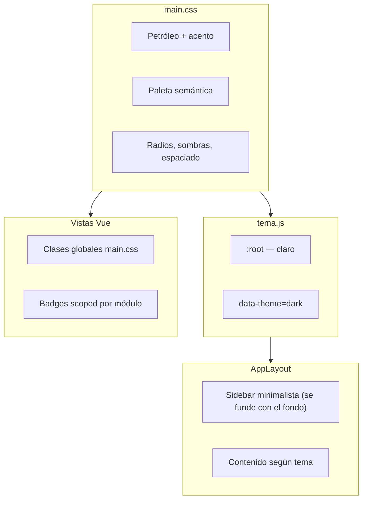

# Guía UX/UI — Materen · Sistema TI

> Documentación visual del panel **Materen — Sistema TI**. Los tokens viven en
> [`main.css`](../frontend/src/styles/main.css) — **un nombre por concepto**,
> sin capa de alias: `--color-*`, `--fs-*`, `--icon-*`, `--space-*`,
> `--radius-*`, `--shadow-*`, `--z-*`. Este archivo describe cómo usarlos en
> las vistas.

**Vigencia**: este documento describe el **estado actual** del design
system — sin historia mezclada. El historial completo de cómo se llegó
hasta acá (cada pasada de trabajo sobre `design.pen`/`main.css`, con
archivos, riesgo y pendientes) vive en `docs/CHANGELOG.md` (versión
condensada al inicio, versión detallada en el apéndice al final) — se
extrajo de este archivo en la reorganización de documentación de
2026-08-29. Deuda de accesibilidad y hallazgos de diseño abiertos/cerrados
con su ID (DS-*, U-*, DP-*, UX*-*) viven en `docs/HISTORIAL-AUDITORIAS.md`,
no acá.

Documentación del sistema visual del panel: colores, tipografías, layout y
convenciones de componentes. Útil para mantener coherencia al añadir pantallas.

## Componentes compartidos (`frontend/src/components/shared/`)

Vistas de listado usan estos wrappers en lugar de copiar el markup del header
o del estado vacío:

| Componente | Uso |
|------------|-----|
| `PageHeader` | Título + icono Tabler + conteo opcional; slots `#acciones`, `#izquierda` (detalle con volver) y `#extra` (franja opcional bajo el header; sin uso actual — Configuración pasó a sidebar propio, ago 2026, ver más abajo) |
| `EmptyState` | Tabla sin filas: icono, título, mensaje y slot para CTA secundario (`.btn`, no primario) |
| `BadgeEstado` | Badge semántico vía `core/badges.js` (`tipo`: `empleado`, `ticket`, `prioridad`, `situacion`, `tipo_cuenta`) |
| `TextoVacio` | Celda vacía con placeholder `—` y clase `.text-muted` automática |
| `Pagination` | Paginación client/server (ya documentada abajo) |
| `PublicBrand` | Cabecera de páginas públicas (empleados sin sesión) |
| `NotificacionesCampana` | Campana de notificaciones (migración 045) en las **acciones globales del header** del shell (hasta el 2026-09-02 vivía en el pie del sidebar); lista los 4 eventos con estado leído/no-leído, marca lectura por usuario vía `stores/notificaciones.js` |
| `SelectorVista` | Grupo segmentado **solo-ícono** para alternar la vista de un módulo (Tabla/Triage en Tickets — hasta ago 2026 se llamaba "Isla"; ver el changelog pasada, "Isla" — Tabla/Tarjetas en Empleados y Equipos) |
| `ListaVistas` | Lista de vistas/bandejas mutuamente excluyentes con contador opcional. Prop `variante`: `nav` (columna de riel, default) o `segmento` (grupo segmentado horizontal **con texto**). Ver "Variantes de `ListaVistas`" abajo |

Los mapas de color por dominio siguen en `core/dominio-*.js`; `core/badges.js`
solo despacha hacia ellos.

## Primitivas de Carbon (`frontend/src/components/carbon/`)

Componentes que implementan un patrón del design system, no un caso de
dominio. Se separan de `shared/` porque el criterio para tocarlos es
distinto: `shared/` resuelve "este producto necesita esto", `carbon/`
resuelve "Carbon define esto así".

| Componente | Qué hace | Qué reemplaza |
|---|---|---|
| `CarbonButton` | 5 variantes × 3 tamaños (32/40/48). Etiqueta a la izquierda, **ícono a la derecha** | `.btn` y sus 4 variantes, que tenían un solo alto (36px, que no es un paso de Carbon) y ningún orden entre sí |
| `CarbonCampo` | Campo **outlined** — borde perimetral de 1px + radio + sombra sutil, foco en halo. `tipo` cubre texto, select y textarea; trae **error por campo** con `aria-describedby`. Reenvía atributos nativos al control real y expone `focus()` — ver "Migración de formularios a `CarbonCampo`" más abajo | `.form-group`, ya adoptado en 30 archivos de `modules/`. Lo que queda en `.form-group` es deliberado, no deuda: envuelve un `BuscadorCombo` (`AsignarLicenciaModal`, `LicenciasView`), un checklist/checkbox-group o radio-group, o una fila densa sin label visible (barras de filtro, grillas de `ImportarEquiposView`); las únicas excepciones sin criterio de densidad son las vitrinas `DesignSystemView`/`StyleLabView`. `.form-error` sigue para el error de la operación completa, que es otra cosa |
| `CarbonNotification` | Aviso `inline` (en el flujo, no se va) y `toast` (flota y se va). `role="alert"` solo para error | Las **tres** formas que convivían: `.toast` (abajo-derecha), `.aviso-card` (arriba-derecha) y `.form-error` como único aviso inline |
| `CarbonContentSwitcher` | Grupo segmentado. El seleccionado es un **relleno de gris invertido**, no un tinte de acento | `.selector-vista__btn--activo` y `.tnav-item--activo`, dos de los tres lenguajes de "seleccionado" |
| `CarbonTabs` | Pestañas con línea inferior de 2px. Con `to` renderiza **enlaces** (ctrl+clic, copiar, lector de pantalla); sin `to`, botones con contrato `tablist` | `.config-sidebar-item--activa`, el tercer lenguaje — que además usa `<button>` para navegar entre URLs |
| `CarbonPagination` | Agrega **filas por página** y **salto directo de página**. Superconjunto de props del anterior. Las opciones del selector se pasan desde `constants/paginacion.js` (`TAMANOS_PAGINA` = 10/15/20/50/100, con `TAM_PAGINA_DEFECTO` = 20 **incluido** en la lista), y **volver a la página 1 al cambiar el tamaño es del padre**, no del componente | `Pagination.vue`, que con 40 páginas obliga a 36 clics para llegar a la 37 |
| `CarbonTag` | Tag rectangular con las 9 variantes semánticas del sistema. Props: `variante` (acepta tanto `success` como `badge--success`, o sea lo que devuelve `badgeInfo(...).clase`), `codigo` (IBM Plex Mono + tabular-nums, para códigos/DNI/seriales) y `punto` (indicador sólido en el color `support-*` de Carbon) | Migrado el 2026-09-03 (ver "Migración de badges/tags"): 13 archivos de `modules/` usan `BadgeEstado` (`grep -rl "BadgeEstado" modules`) y el resto de los tags semánticos escriben `CarbonTag` directo. `.badge`/`.badge--X` (main.css) sigue existiendo solo como vitrina histórica en `DesignSystemView`/`StyleLabView`; en el resto del sistema lo que queda con nombre `.badge-*` (`.badge-count`, `.badge-inline`, `.badge-sin-devolver`) es una clase de layout, no de color — decora el tag, no lo reemplaza |
| `CarbonDataTable` | Tabla de alta densidad declarativa: columnas definidas una vez, y de ahí salen el `colspan` del estado vacío, el skeleton, qué columna ordena, cuál alinea a la derecha y cuál absorbe el ancho — **y la tarjeta móvil**. Props: `columnas`, `filas`, `densidad` (`sm` 32px / `md` 40px, **default** / `lg` 48px), `cargando`, `ordenPor`/`ordenDir`, `claseFila`, `filaAtributos` (atributos ARIA por fila, ej. `aria-current`, para lo que `claseFila` no cubre), `etiqueta`, `conTarjetas`. Slots `#celda-<clave>` (sirven a las **dos** representaciones), `#encabezado-<clave>` (encabezado propio en una columna no ordenable, ej. checkbox "seleccionar todos") y `#vacio` | Los 35 `<table>` a mano de 22 vistas **y las 609 líneas de tarjeta móvil duplicada** — migradas en la Fase C de la convergencia a Carbon (piloto `EmpresasView` el 2026-09-03, resto en la revisión "Filas con foco" el mismo día). Cada columna declara `movil` (`cab`/`principal`/`sec`/`pie`/`false`) para decir dónde cae en la tarjeta; sin declararlo, cae en `sec`. Quedan **fuera a propósito**: `DesignSystemView`/`StyleLabView` (vitrinas de diseño, muestran el `<table>` viejo como ejemplo histórico) y 3 de las 7 tablas de `ReporteTicketsModal` (matrices fijas de 2 columnas — Categoría/Prioridad/Tipo — que no ganan nada con la migración, ver el comentario en ese archivo) |
| `CarbonPasswordReveal` | Revelado de una credencial cifrada: pide a la edge function `credenciales`, la auditoría queda en `accesos_log` con su motivo, **cuenta regresiva visible de 8 segundos** y ocultado automático. Props: `revelar` (`async (motivo) => string`), `bloqueado`, `motivoBloqueo`, `etiqueta`, `segundos` | El patrón `•••••••• [ojo] [copiar]` copiado en cuatro sitios (`CuentasPanel` en tabla y tarjeta, `CorreosView`, `LicenciasView`, `AccesosSensiblesView`), cada uno con su propio `passwordVisibles` — y **ninguno de los cuatro ocultaba la credencial solo** |

Tres decisiones de estos componentes que conviene no revertir sin leer el
motivo:

- **`CarbonTag` habla de ROLES, no de colores.** `variante` recibe
  `success`/`danger`/`sky`, no `green`/`red`/`cyan`. Todo el dominio ya habla
  ese idioma (`core/badges.js` y los `core/dominio-*.js` son la fuente de
  verdad de qué significa cada color); con una API de colores, cada sitio
  tendría que traducir y dos tags del mismo significado podrían terminar de
  colores distintos según quién tradujo.
- **`CarbonPasswordReveal` recibe una FUNCIÓN, no un `tipo`.** Hay tres
  acciones distintas en la edge function (`revelar`,
  `revelarClaveLicencia`, `revelarAccesoSensible`), cada una con su clave de
  cifrado y su control de acceso — la de accesos sensibles usa
  `CRED_KEY_SENSIBLE` y permiso por fila. Con un prop `tipo`, el componente
  tendría que conocer los tres dominios y crecer con el cuarto.
- **Copiar pide su PROPIO revelado con motivo `'copiar'`**, no reusa el valor
  ya visible. Cuesta una llamada más y es el punto de todo el módulo: la
  auditoría tiene que poder distinguir quién solo miró una credencial de
  quién se la llevó al portapapeles.

**Pendiente declarado de la biblioteca**: el *footer de modal al ras* (los
botones a ancho completo, sin gap, que es como los dispone Carbon) **no se
aplicó**. Hacerlo con los botones actuales dejaría un footer de Carbon con
`.btn` de 36px estirados adentro — medio migrado, que se ve peor que sin
migrar. Va junto con el cambio a `CarbonButton` en cada modal.

Todos, más el filtrado de permisos de `AppNav`, están verificados en
[`frontend/tests/componentes/carbon.render.test.js`](../frontend/tests/componentes/carbon.render.test.js)
(62 casos).

### Librería visual (`design.pen`)

`design.pen` (raíz del repo, se abre con Pencil) contiene el espejo visual de
este documento: los tokens `--*` como variables con tema claro/oscuro, y
cada componente compartido y primitiva de `main.css` como componente
reutilizable e instanciable (46 componentes). Incluye tres tableros de nivel
raíz:

| Tablero | Contenido |
|---------|-----------|
| `Librería de componentes` | Fichas agrupadas: Tokens, Primitivas, Formularios, Datos y tablas, Contenedores, Superposiciones, Navegación y marca |
| `Empleados — listado` | Pantalla armada con los componentes (sidebar + `PageHeader` + filtros + tabla + paginación) |
| `Empleados — listado (tema oscuro)` | La misma pantalla con `theme: {mode: dark}` para revisar el tema oscuro |

El logotipo se reconstruyó desde `frontend/public/logo_materen_sisti.svg` (mismo
trazado; "sistema ti" en Poppins) y se invierte a blanco en tema oscuro, igual
que el `filter: brightness(0) invert(1)` del CSS. Si cambia un token o un
componente compartido, actualizar también el tablero correspondiente.

**Nomenclatura**: cada uno de los 46 componentes usa el prefijo
`Familia/Componente` (p. ej. `Primitivas/Botón`, `Formularios/Campo de
texto`, `Navegación y marca/Barra lateral`), con las mismas 7 familias que
agrupan las fichas del tablero (`Tokens`, `Primitivas`, `Formularios`,
`Datos y tablas`, `Contenedores`, `Superposiciones`, `Navegación y marca`).
`Ítem de combo`/`Lista de combo` viven en `Superposiciones` (no en
`Formularios`) porque su lista se teletransporta al body igual que un menú o
un modal, no porque el campo de búsqueda que los dispara no sea un
formulario.

## Arquitectura general

El frontend **no usa Tailwind ni librería de componentes**. Todo el diseño vive en:

| Archivo | Rol |
|---------|-----|
| [`frontend/src/styles/carbon-theme.css`](../frontend/src/styles/carbon-theme.css) | **Capa vendor**: los valores de IBM Carbon v11 (`--cds-*`) — escalas de color, type set, geometría, métricas del shell. Ni un selector |
| [`frontend/src/styles/main.css`](../frontend/src/styles/main.css) | **Capa de roles**: qué significa cada cosa en Sistema TI, mapeado sobre `--cds-*`. Además del layout, botones, tablas, modales, badges, timeline, capacity, confirm-dialog, etc. |
| [`frontend/src/components/carbon/`](../frontend/src/components/carbon/) | Primitivas de Carbon: `CarbonTag`, `CarbonDataTable`, `CarbonPasswordReveal` (ver "Primitivas de Carbon") |
| [`frontend/src/core/tema.js`](../frontend/src/core/tema.js) | Alternancia claro/oscuro (`data-theme` en `<html>`). Gobierna el **workspace**, no el shell |
| [`frontend/src/components/shared/AppLayout.vue`](../frontend/src/components/shared/AppLayout.vue) | Shell raíz (UI Shell de Carbon): header de 48px, SideNav, socket realtime, tema, logout. Compone `AppSearch.vue` (búsqueda del header), `AppNav.vue` (SideNav), `NotificacionesCampana.vue` (campana del header) y `AppNotifications.vue` (toasts) — divididos del propio `AppLayout` en 2026-08-12 (era un god-component de 1161 líneas, A-06) |
| [`frontend/index.html`](../frontend/index.html) | IBM Plex Sans + IBM Plex Mono (Google Fonts) + Tabler Icons |

**Patrón de uso:** las vistas Vue aplican clases globales (`.card`, `.btn-primary`, `.filters`…) directamente en el template; usan `<style scoped>` solo para badges/chips de dominio. El shell (`AppLayout` + `AppSearch`/`AppNav`/`AppNotifications`) es la excepción con layout propio. Nota de implementación: `.sidebar--colapsado` vive en `AppLayout` pero varias reglas de `AppSearch`/`AppNav` dependen de esa clase ancestro — `:global()` dentro de `<style scoped>` pierde el selector descendiente al compilar en este proyecto (verificado), así que esas reglas van en un segundo `<style>` sin scope en cada componente hijo.


```mermaid
flowchart TB
  subgraph tokens ["main.css"]
    brand["Petróleo + acento"]
    semantic["Paleta semántica"]
    layout["Radios, sombras, espaciado"]
  end

  subgraph theme ["tema.js"]
    light[":root — claro"]
    dark["data-theme=dark"]
  end

  subgraph shell ["AppLayout"]
    sidebar["Sidebar minimalista (se funde con el fondo)"]
    main["Contenido según tema"]
  end

  subgraph views ["Vistas Vue"]
    globalClasses["Clases globales main.css"]
    scopedBadges["Badges scoped por módulo"]
  end

  tokens --> theme
  theme --> shell
  tokens --> views
```

---

## IBM Carbon v11 como estándar de UI/UX

> **Vigente desde el 2026-09-02.** El estándar oficial de UI/UX de Materen ·
> Sistema TI es el **IBM Carbon Design System, versión 11**. Toda pantalla,
> componente, token y decisión visual nueva se resuelve contra la
> especificación de Carbon; lo que Carbon no cubre se resuelve por analogía
> con lo que sí cubre, y queda documentado acá con su motivo.

### Por qué Carbon, y por qué ahora

El sistema nació como un panel de credenciales, creció a ITSM (tickets,
problemas, base de conocimiento, encuestas) y la dirección de producto es
que siga creciendo hacia un ERP (ver `docs/PANORAMA-SISTEMA.md` §6,
"alcance de crecimiento"). Ese destino es el argumento: hasta acá el
sistema visual era propio —una estética tipo shadcn, con un acento
muestreado del logo, radios de 6-16px, sombras de elevación y una escala
tipográfica de 8 pasos— y funcionaba, pero cada pantalla nueva volvía a
plantear las mismas preguntas (qué radio, cuánta sombra, qué paso de
tamaño) y la respuesta salía del criterio de quien la escribía.

Carbon es el design system de IBM para **software empresarial denso**, que
es exactamente lo que este producto es: tablas largas, formularios,
auditoría, permisos por rol. Trae decidido lo que acá se decidía caso por
caso, y trae además tres cosas que un sistema propio no puede darse solo:

1. **Pares de color verificados de origen.** Los `tag-*` de Carbon vienen
   con su contraste medido. El sistema anterior tenía pares que pasaban AA
   por márgenes de 4.6-5.3:1, algunos ajustados a mano durante la propia
   migración porque el planeado fallaba; los de Carbon caen en 5.8-7.8:1.
2. **Una respuesta a "cuánta jerarquía".** Carbon trae un shell, una escala
   tipográfica y bordes con umbral de contraste ya decididos, para no volver
   a discutir esas preguntas en cada pantalla nueva. (La geometría y la
   elevación puntuales sí se revisaron después, el 2026-09-03 — ver
   "Geometría y elevación" más abajo — pero el resto de la respuesta de
   Carbon a "cuánta jerarquía" se mantiene.)
3. **Un shell.** El header de 48px + SideNav de 256px no es una propuesta:
   es una especificación con medidas, estados y comportamiento responsive.

### Qué se adopta y qué no

**Se adopta la ESPECIFICACIÓN, no el paquete.** No se instala
`@carbon/styles` ni `@carbon/web-components`, y la razón es concreta:
Carbon publica sus tokens como Sass, este frontend no usa Sass ni librería
de componentes (ver "Arquitectura general"), y `@carbon/web-components`
reimplementaría en Web Components lo que ya existe en Vue. Traerlo
significaría un preprocesador y ~200 kB de CSS del que se usaría el 10%.
Los valores están transcritos en
[`frontend/src/styles/carbon-theme.css`](../frontend/src/styles/carbon-theme.css)
y re-verificados en CI por `scripts/contraste.mjs`.

Tres desviaciones deliberadas del spec, con su motivo:

| Desviación | Carbon dice | Acá | Por qué |
|---|---|---|---|
| Radio del Tag | 12px (píldora) | `--radius-sm` (4px) | Un tag en píldora entre botones/inputs de 6-8px se lee inconsistente. Hasta el 2026-09-02 la desviación era binaria (0 vs. redondeado); desde la revisión "Modern Clean Enterprise" del 2026-09-03 es de escala (4px vs. 12px) — ver "Geometría y elevación". |
| Barra del ítem de nav activo | 3px | 2px | Regla de la casa anterior a este rediseño: ningún borde de componente supera 2px. A esta escala la diferencia no se lee. Es el único número donde el spec y la casa discrepan. |
| Íconos | `@carbon/icons` | Tabler (`ti ti-*`) | ~230 usos en 85 vistas, cada uno con un mapeo de nombre distinto y ninguno verificable salvo mirando la pantalla. Es una migración propia, no un efecto colateral de esta. Tabler comparte grilla de 16px y peso de trazo, así que a estos tamaños conviven sin que se note el origen distinto. |

Y un valor del spec del pedido que **no** era de Carbon: se pidió Yellow 30
como `#8a6d3b`/`#fcf8e3`. Esos dos son los del `.alert-warning` de
Bootstrap 3; Carbon v11 Yellow 30 es `#f1c21b`. Se usa el de Carbon.

### Las dos capas de tokens

| Archivo | Capa | Qué dice |
|---|---|---|
| [`styles/carbon-theme.css`](../frontend/src/styles/carbon-theme.css) | **vendor** (`--cds-*`) | Qué hex es Blue 60. Escalas de color, type set, geometría, métricas del shell. Ni un selector. |
| [`styles/main.css`](../frontend/src/styles/main.css) | **roles** (`--color-*`, `--fs-*`, `--radius-*`…) | Qué significa cada cosa en Sistema TI. Ni un hex en su bloque de tokens. |

La frontera, en una línea: **cambiar de opinión sobre qué color es un
peligro se hace en `main.css`; una versión nueva de la paleta de Carbon se
hace en `carbon-theme.css`.**

**Regla de consumo**: ningún componente ni vista lee `--cds-*`. Solo
`main.css` los lee, para definir los roles. Un `<style>` de componente usa
el rol (`--color-danger-text`), nunca el valor de la escala — igual que en
Carbon, donde el código usa `$layer-01` y no `$gray-10`. La **única
excepción declarada** son los tokens `--cds-shell-*`, que consumen
`AppLayout.vue`, `AppNav.vue`, `AppSearch.vue` y
`NotificacionesCampana.vue`: el shell de Carbon es oscuro en los cuatro
temas, así que no puede expresarse con roles que cambian con el tema.

Esto **no** es la capa de alias que se borró el 2026-09-01. Aquella eran
dos nombres de ROL para el mismo rol — el mismo nombre con y sin un prefijo
de espacio de nombres (el `--mat-` que se retiró), los dos diciendo "el
acento" —, 190 tokens para 104 conceptos.
Esta es un rol apuntando a un VALOR de escala: `--color-accent` puede
dejar de ser Blue 60 sin que Blue 60 deje de ser `#0f62fe`.
`scripts/tokens-vs-guia.mjs` distingue los dos casos — exime la
indirección hacia `--cds-*` y sigue fallando ante dos nombres de rol para
el mismo rol.

<!-- tokens-retirados:inicio — scripts/tokens-vs-guia.mjs ignora esta
     región: nombra tokens que YA NO EXISTEN a propósito, para dejar
     registro de qué se retiró y por qué. No agregar acá tokens vivos. -->

### Tokens retirados el 2026-09-02

**Escala de marca → acento.** `--color-brand-500` (`#0082FB`),
`--color-brand-600` (`#0064E0`) y `--color-brand-700` (`#0052B8`) eran el
acento derivado del logo. Se retiran: con Carbon el acento es Blue 60, un
valor del design system, no de la identidad. Eso desacopla dos cosas que
nunca debieron ir juntas — que el logo cambie de azul no debería mover el
color de los botones. `--color-brand` (`#0082FB`, el azul del logotipo) **se
conserva**, reservado a piezas de marca, sin consumidores reales (el logo es
un SVG estático, no lee esta variable).

También se retiran `--color-accent-alt`, `--color-accent-subtle-bg` y
`--color-accent-subtle-text`: eran alias internos del acento sin ningún
consumidor propio, ya anotados como deuda declarada.

**Escala tipográfica.** `--fs-xs` (11px), `--fs-sm` (12px), `--fs-base`
(13px), `--fs-md` (14px), `--fs-lg` (15px), `--fs-xl` (17px), `--fs-2xl`
(20px) y `--fs-stat` (26px) → los 5 pasos del type set productivo. Ver
"Tipografía".

**Escala de íconos.** `--icon-xs` (13px), `--icon-md` (16px), `--icon-lg`
(18px), `--icon-xl` (20px), `--icon-2xl` (28px) y `--icon-hero` (40px) → los
3 pasos de Carbon con consumidor. Ver "Escala de íconos".

**Radios.** `--radius-sm` (6px), `--radius-md` (8px), `--radius-lg` (12px),
`--radius-xl` (16px) y `--radius-pill` (999px) → `--radius-base`, que vale
`0`. Carbon no tiene escala de radios: tiene la decisión de no tener
esquinas.

**Sombras.** `--shadow-sm`, `--shadow-md`, `--shadow-lg` y su alias
`--shadow-modal` → `--shadow-overlay`, una sola. Tres de los cuatro pasos se
aplicaban a superficies que ahora son planas.

> **Nota del 2026-09-03 — no confundir con un revert idéntico.** La
> revisión "Modern Clean Enterprise" (ver "Geometría y elevación" más
> abajo) reintrodujo una escala de radios (`--radius-sm/md/lg/xl/pill`) y de
> sombras (`--shadow-sm/md/lg/overlay`) con nombres iguales a los de acá,
> pero **no** son los mismos valores: los radios retirados el 2026-09-02
> eran 6/8/12/16px, los reintroducidos son 4/6/8/12px. Esta región documenta
> lo que pasó el 2026-09-02 y sigue siendo históricamente correcta tal cual
> está escrita arriba; los tokens vivos hoy están documentados en
> "Geometría y elevación".

**Z-index.** `--z-header-mobile` (60) → `--z-shell-header` (110). La topbar
móvil que lo consumía la reemplazó el header del shell, que existe en todos
los anchos, no solo en móvil, y necesita quedar por encima del SideNav.

<!-- tokens-retirados:fin -->

---

## Paleta de colores (tokens CSS)

Tema **Gray 10** en claro y **Gray 100** en oscuro: el par que Carbon
documenta como *high contrast pairing*. En Gray 10 el workspace es gris
(`#f4f4f4`) y las tarjetas/tablas son blancas —al revés que el tema White— y
es el que Carbon recomienda para paneles con mucha tabla, porque la fila
blanca se despega del lienzo sin necesitar sombra.

### Superficies y texto

| Token | Rol de Carbon | Claro | Oscuro |
|---|---|---|---|
| `--color-bg` | background | `#f4f4f4` (Gray 10) | `#161616` (Gray 100) |
| `--color-bg-elevated` | layer-01 | `#ffffff` | `#262626` (Gray 90) |
| `--color-bg-subtle` | field-01 / layer-02 | `#f4f4f4` | `#393939` (Gray 80) |
| `--color-bg-accent` | layer-accent-01 | `#e0e0e0` (Gray 20) | `#393939` |
| `--color-bg-hover` | layer-hover-01 | `#e8e8e8` | `#333333` |
| `--color-text-primary` | text-primary | `#161616` | `#f4f4f4` |
| `--color-text-secondary` | text-secondary | `#525252` (Gray 70) | `#c6c6c6` (Gray 30) |
| `--color-text-tertiary` | text-helper | `#6f6f6f` (5.02:1) | `#a8a8a8` (6.36:1) |
| `--color-text-disabled` | text-disabled | `#c6c6c6` | `#6f6f6f` |
| `--color-text-on-color` | text-on-color | `#ffffff` | `#ffffff` (invariante) |
| `--color-text-inverse` | text-inverse | `#ffffff` | `#161616` |
| `--color-overlay` | overlay | `rgba(22,22,22,.5)` | igual (invariante) |

> **`--color-text-on-color` vs `--color-text-inverse`: dos roles, no
> sinónimos.** Carbon los separa (`$text-on-color` / `$text-inverse`) y este
> sistema los tenía confundidos en uno hasta el 2026-09-02.
>
> - **on-color** — texto sobre un **relleno de color sólido**: botón primario,
>   botón destructivo, contador sobre el acento. Esos fondos son
>   **invariantes** entre temas (Blue 60 es Blue 60 en los cuatro), así que su
>   texto también: **blanco, siempre**.
> - **inverse** — texto sobre una superficie de **gris invertido**: el segmento
>   seleccionado de un ContentSwitcher, un tooltip. Ese fondo sí se invierte
>   con el tema, y el texto lo acompaña.
>
> Confundirlos era un bug vivo: el botón primario usaba `inverse` sobre Blue
> 60, así que **en tema oscuro renderizaba #161616 sobre azul — 3.41:1, por
> debajo de AA**. Igual el contador del SideNav y el de la campana.
> `scripts/contraste.mjs` no lo veía porque esos pares vivían en la tabla del
> tema claro afirmando el blanco que se *asumía*; ahora tienen tabla propia
> (`TEXTO SOBRE RELLENO SÓLIDO`), que es la corrección estructural: dice que
> el par no depende del tema. Ver Ciclo 19 (CB-10) en
> `HISTORIAL-AUDITORIAS.md`.

`--color-bg-accent` es nuevo del rediseño. Hasta el 2026-09-02 era el fondo
del encabezado de tabla (`th`); la revisión "Filas con foco" del 2026-09-03
se lo retiró (ver "Revisión Filas con foco (tablas)" más abajo) y hoy vive
en `CarbonButton` (estado disabled), `AppSearch` y `NotificacionesCampana` —
un gris que pesa un escalón más que un campo, para superficies que rotulan
o están inactivas, no para contener datos.

En oscuro `--color-text-tertiary` es Gray 40 y no Gray 50: sobre layer-01 los
dos pasan (6.36:1 vs 4.56:1), pero el texto terciario también cae sobre
`--color-bg-subtle` (Gray 80) y ahí Gray 50 baja a 3.48:1.

### Bordes — tres niveles de jerarquía

El borde es un recurso central de jerarquía junto a la capa de gris y, desde
la revisión "Modern Clean Enterprise" del 2026-09-03 (ver "Geometría y
elevación" más abajo), la micro-sombra. De ahí que haya tres niveles y no
uno:

| Nivel | Token | Claro | Oscuro | Uso |
|---|---|---|---|---|
| Sutil | `--color-border-subtle` (y su alias `--color-border`) | `#e0e0e0` | `#393939` | Separador y borde de contenedor. Decorativo: WCAG 1.4.11 no le exige umbral (no identifica el componente por sí solo). |
| Default | `--color-border-default` | `#8d8d8d` (3.32:1) | `#8d8d8d` (4.56:1) | Borde de CONTROL en reposo (input, select, textarea, botón secundario). Sí debe distinguirse del fondo por sí solo → 3:1. |
| Fuerte | `--color-border-strong` | `#6f6f6f` (5.02:1) | `#a8a8a8` (6.36:1) | Hover de control, seleccionado sin foco, toast. |

Los `-subtle` **no** están en `scripts/contraste.mjs` y es deliberado: son
decorativos, y exigirles 3:1 los volvería líneas duras que compiten con el
contenido.

### Acento e interactivo — Blue 60

| Token | Claro | Oscuro | Rol |
|---|---|---|---|
| `--color-accent` | `#0f62fe` | igual (invariante) | `interactive` de Carbon: botón primario, borde activo, foco |
| `--color-accent-hover` | `#0353e9` | igual | Token de interacción propio de Carbon, no un paso de la escala |
| `--color-accent-soft` | `#4589ff` (Blue 50) | igual | Ícono decorativo. **No portador de texto** |
| `--color-accent-subtle` | `#d0e2ff` (Blue 20) | `#002d9c` (Blue 80) | `highlight`: fila/ítem seleccionado |
| `--color-accent-text` | `#0043ce` (Blue 70) | `#78a9ff` (Blue 40) | Enlace, texto de acento |
| `--color-primary` | = `--color-accent-text` | ídem | Alias semántico |

`accent`, `accent-hover` y `accent-soft` **no se redefinen en oscuro**: el
botón primario de Carbon es Blue 60 en los cuatro temas. Solo se redefine lo
que depende del fondo.

Blue 60 como texto sobre blanco da 5.00:1 —pasa AA— pero el rol de
texto/enlace es Blue 70 (7.79:1), y este sistema lo respeta. Por eso
`--color-primary` sigue siendo alias de `accent-text` y no de `accent`: el
token de texto tiene que seguir al valor que SÍ cambia por tema.

#### Botones: la jerarquía de Carbon necesita un gris

| Token | Claro | Oscuro | Rol |
|---|---|---|---|
| `--color-btn-secondary` | `--color-bg-elevated` (blanco) | `#6f6f6f` (Gray 60) | Superficie del botón **secundario** |
| `--color-btn-secondary-hover` | `--color-bg-subtle` | `#606060` | Su hover |

Carbon v11 estricto define el secundario como un **gris sólido**
(`#393939`/`#6f6f6f`), sin contorno. La revisión "Modern Clean Enterprise"
del 2026-09-03 lo cambió en tema claro a superficie limpia + borde sutil
(`--color-border-default`), porque el bloque gris sólido pesaba más que el
primario en vez de leerse como la alternativa — ver "Geometría y elevación"
más abajo para el porqué completo. El tema oscuro conserva el relleno gris
(Gray 60/50 se explica en el token, "el gris del botón secundario tiene que
despegarse del fondo, no fundirse"). El secundario sigue distinguido del
tertiary (azul con borde): la jerarquía completa es **primary** (azul
sólido) > **secondary** (superficie + borde) > **tertiary** (azul con
borde) > **ghost** (solo texto) > **danger** (rojo sólido). Los pares de
texto siguen en `contraste.mjs`, tabla `TEXTO SOBRE RELLENO SÓLIDO`.

#### Gris invertido

| Token | Claro | Oscuro | Rol |
|---|---|---|---|
| `--color-bg-inverse` | `#161616` | `#f4f4f4` | Superficie que da vuelta el tema |
| `--color-text-inverse` | `#ffffff` | `#161616` | Su texto |

Van juntos y son el par de `--color-bg-inverse`. Lo usa el segmento
seleccionado del ContentSwitcher, y le corresponderá al tooltip cuando
exista. **No confundir con `--color-bg-accent`** (Gray 20), que es un
escalón más de la MISMA dirección; este invierte. Ni con
`--color-text-on-color`, que es blanco siempre — ver la nota de arriba.

### Foco

```css
--ring: var(--cds-blue-60);   /* claro: #0f62fe */
--ring: var(--cds-white);     /* oscuro: #ffffff */
```

Carbon dibuja el foco como una **línea sólida de 2px**, no como un halo
difuso. El sistema anterior usaba `box-shadow: 0 0 0 3px rgba(0,130,251,.28)`
— un anillo semitransparente de 3px, que es el idioma de shadcn/Tailwind. El
mecanismo (box-shadow) no cambió, para no reordenar las reglas que combinan
foco con `outline: none`; lo que cambió es que el valor es **opaco** y el
grosor **2px**.

En oscuro el foco es **blanco**, no el azul: Blue 60 sobre layer-01 da 2.0:1
y no se ve; el blanco da 15.1:1. Es la misma decisión que el tema oscuro ya
toma para el texto de enlace, aplicada al indicador no textual. En el shell
(`--cds-shell-focus`) es blanco en los dos temas, por el mismo motivo.

`--ring-danger` (Red 60) y `--ring-whatsapp` acompañan a su variante de botón.

### Colores semánticos

Los pares `-bg`/`-text` son los **`tag-*` de Carbon v11**: paso 20 de fondo
y 70 de texto en claro, 70/20 en oscuro. Vienen verificados de origen
(5.8-5.9:1 los siete) y `scripts/contraste.mjs` los re-verifica en CI.

| Familia | Tag de Carbon | Significado en el panel |
|---|---|---|
| **success** | green | Operativo, resuelto, activo, disponible |
| **warning** | (yellow, ver abajo) | Requiere rotación, por vencer, suspendido, en reparación |
| **danger** | red | P1, sin devolver, vencido, perdido/robado |
| **info** | blue | Abierto, asignado, entregas |
| **neutral** | gray | Sin estado, cerrado, baja, inactivo genérico |
| **purple** | purple | Prioridad alta, ubicaciones |
| **sky** | cyan | Tipos de cuenta |
| **teal** | teal | Prioridad media, correos, garantías |

`purple`, `sky` y `teal` no comparten hue con `success`/`warning`/`danger`/
`info` a propósito: es lo que evita que "Media" se lea como "resuelto" o
"Alta" como "abierto" cuando caen en la misma fila.

**Advertencia = Yellow, y es el único par armado acá.** Carbon no publica un
`tag-yellow`, así que el par de texto se armó con Yellow 10 (`#fcf4d6`) +
Yellow 70 (`#684e00`), 7.11:1. Es el único de los ocho que no viene
verificado de origen, y por eso el que más importa vigilar.
`--color-warning` es Yellow 30 (`#f1c21b`), el `support-warning` de Carbon:
mismo valor en los dos temas, y **no sirve como portador de texto en ninguno**
— es el color del punto/ícono, no del texto.

Los tokens **sin sufijo** (`--color-success`, `--color-warning`,
`--color-danger`) son el color sólido del `support-*` de Carbon: punto de
estado, ícono, borde izquierdo de aviso. No llevan texto encima.
`--color-danger-hover` y `--color-danger-solid` son invariantes entre temas
(el rojo del botón destructivo no se aclara en oscuro).

`warning` y `teal` además tienen variantes de énfasis
(`--color-warning-text-strong`, `-bg-strong`, `--color-teal-bg-subtle`) para
casos donde el par base no da suficiente jerarquía.

#### Inventario por familia

Cada familia expone el mismo juego de tokens, y el valor de los tres sale del
mismo paso de Carbon. Está listado entero a propósito: es lo que
`scripts/tokens-vs-guia.mjs` compara contra `main.css` en cada corrida de CI,
así que un token que exista y no esté acá sale en su lista de deriva.

| Familia | `-bg` | `-text` | `-border` | Sólido (`support-*`) |
|---|---|---|---|---|
| success | `--color-success-bg` | `--color-success-text` | `--color-success-border` | `--color-success` |
| warning | `--color-warning-bg` | `--color-warning-text` | `--color-warning-border` | `--color-warning` |
| danger | `--color-danger-bg` | `--color-danger-text` | `--color-danger-border` | `--color-danger` |
| info | `--color-info-bg` | `--color-info-text` | `--color-info-border` | — |
| neutral | `--color-neutral-bg` | `--color-neutral-text` | `--color-neutral-border` | — |
| purple | `--color-purple-bg` | `--color-purple-text` | `--color-purple-border` | — |
| sky | `--color-sky-bg` | `--color-sky-text` | `--color-sky-border` | — |
| teal | `--color-teal-bg` | `--color-teal-text` | `--color-teal-border` | — |

Énfasis de `warning` (`--color-warning-bg-strong`,
`--color-warning-text-strong`) y de `teal` (`--color-teal-bg-subtle`): un
escalón más de contraste para cuando el par base no da jerarquía suficiente.

Los `-border` de `info`, `neutral`, `purple`, `sky` y `teal`, y el
`--color-teal-bg-subtle`, siguen **sin consumidor** (DP-05): la familia usa
`-bg`/`-text` y nunca el borde. Están declarados como deuda en
`scripts/tokens-vs-guia.mjs`, no borrados — retirarlos es una decisión de
producto, porque cierra la puerta a la variante con borde.

#### Tonos de avatar — decorativos, no semánticos

5 pares `--color-avatar-<tono>-bg`/`-text` (azul, slate, teal, violeta,
arena) que **identifican a una persona, no comunican un estado**.

| Regla | Por qué |
|---|---|
| Usan los pasos **10/70** de Carbon (claro) y **80/30** (oscuro) | Un escalón por fuera de los pares 20/70 de los tags semánticos: así un avatar violeta no se confunde con un tag de prioridad Alta aunque compartan hue |
| Ninguno reutiliza `success`/`warning`/`danger`/`info` | Un avatar teñido de "danger" leería como una alerta sobre esa persona |
| El tono lo elige `tonoAvatar(nombre)` (`core/avatar.js`), nunca la vista | Determinístico: la misma persona cae en el mismo tono en toda la app |
| Sin nombre → `.avatar--neutro` (`--color-bg-subtle`/`--color-text-secondary`) | No hay un sexto hex: "no sabemos quién es" reusa el gris que el sistema ya tiene para eso |

| Tono | Familia de Carbon | Tokens |
|---|---|---|
| azul | Blue | `--color-avatar-azul-bg` / `--color-avatar-azul-text` |
| slate | Cool Gray | `--color-avatar-slate-bg` / `--color-avatar-slate-text` |
| teal | Teal | `--color-avatar-teal-bg` / `--color-avatar-teal-text` |
| violeta | Purple | `--color-avatar-violeta-bg` / `--color-avatar-violeta-text` |
| arena | Orange | `--color-avatar-arena-bg` / `--color-avatar-arena-text` |

Cada nombre sigue siendo honesto respecto de la familia que lo viste. Contraste verificado en
`scripts/contraste.mjs` (`avatar*`): **7.02-7.22:1 en claro, 6.64-6.89:1 en
oscuro** — más parejo que los 5 tonos anteriores, que iban de 5.2 a 7.3.

El fondo del círculo mide ~1.1:1 contra la superficie de la fila y el avatar
**no lleva borde**: es deliberado, el círculo es decorativo y el nombre de la
persona está siempre al lado o en el `title`.

### Marcas externas (fuera de Carbon)

- `--color-brand` (`#0082FB`): el azul del logotipo de Materen. Identidad,
  no color de sistema. Sin consumidores (el logo es un SVG estático).
- `--color-whatsapp`, `--color-whatsapp-hover` y `--color-whatsapp-text`:
  verde de marca de un tercero. Lo
  consume solo `.btn-whatsapp`, cuyo sentido es "este botón abre WhatsApp" —
  teñirlo de Green 60 lo volvería un botón de éxito genérico. El texto es un
  verde oscuro propio (`#072E2A`) porque sobre `#25d366` el blanco da 2.4:1;
  este par da 7.39:1.

---

## Geometría y elevación

> **Revisado el 2026-09-03.** Esta sección describía el Carbon v11 estricto
> adoptado el 2026-09-02: radio 0 sin excepciones y elevación 100% plana. Un
> día después se revisó — ver "Revisión Modern Clean Enterprise
> (2026-09-03)" más abajo para el motivo. Lo que sigue es el estado actual.

### Escala de radios

```css
--radius-sm:   4px;      /* tags, badges, chips pequeños */
--radius-md:   6px;      /* botones, inputs, selects — es --radius-base */
--radius-lg:   8px;      /* tarjetas, contenedores, tablas */
--radius-xl:   12px;     /* modales, popovers flotantes */
--radius-pill: 9999px;   /* cápsulas y avatares */
--radius-base: var(--radius-md);   /* radio por defecto, 6px */
```

| Token | Valor | Uso |
|---|---|---|
| `--radius-sm` | 4px | `CarbonTag`, badges, chips pequeños |
| `--radius-md` (= `--radius-base`) | 6px | Botones (`CarbonButton`), campos (`CarbonCampo`), selects, menús/popovers de bajo perfil (`MenuAcciones`, `BuscadorCombo`) |
| `--radius-lg` | 8px | `.card`, `.stat-card`, tablas |
| `--radius-xl` | 12px | `.modal`, popovers grandes |
| `--radius-pill` | 9999px | Avatares, cápsulas |

El único radio fuera de esta escala es el `50%` de los círculos puros
(avatar de iniciales, punto de no-leído, radio button): no es un paso de
escala, es geometría — un círculo con otro radio deja de ser un círculo — y
el guardrail de literales lo excluye de su check.

### Escala de sombras

```css
--shadow-sm:      0 1px 2px 0 rgba(0, 0, 0, 0.05);
--shadow-md:      0 4px 6px -1px rgba(0, 0, 0, 0.07), 0 2px 4px -2px rgba(0, 0, 0, 0.04);
--shadow-lg:      0 10px 15px -3px rgba(0, 0, 0, 0.08), 0 4px 6px -4px rgba(0, 0, 0, 0.04);
--shadow-overlay: var(--shadow-lg);
```

| Token | Uso |
|---|---|
| `--shadow-sm` | `.card`, `.stat-card`, campos (`CarbonCampo`), botones en reposo |
| `--shadow-md` | Botón primario en hover, tarjeta en hover |
| `--shadow-lg` | Base de `--shadow-overlay` |
| `--shadow-overlay` | `.modal`, menú (`MenuAcciones`), popover (`BuscadorCombo`), panel de búsqueda, panel de la campana, toast — todo lo que **flota de verdad**, lo que se teletransporta a `<body>` y necesita despegarse del contenido |
| Panel deslizante del SideNav en móvil | sombra direccional propia (única excepción declarada en `literales-vs-tokens.mjs`) |

`--scroll-shadow` no es elevación: es el degradado que avisa "esta tabla
sigue a la derecha" en `.table-wrap`.

### Revisión Modern Clean Enterprise (2026-09-03)

**Qué cambió.** Un día después de adoptar Carbon v11 estricto se revisó
**solo** la geometría y la elevación: radio 0 en todo, campo *filled*
(fondo gris + línea inferior) y botón secundario en bloque gris sólido se
leían como industrial-brutalista para una V2 del producto — más cerca de un
formulario de trámite que del software empresarial denso y moderno que
Carbon habilita (Linear, GitHub y Supabase resuelven la misma densidad sin
esa dureza). Se reintrodujo:

- La escala de radios de arriba (`--radius-sm/md/lg/xl/pill`).
- La escala de sombras de arriba (`--shadow-sm/md/lg/overlay`), micro-sombras
  sutiles en vez de superficies 100% planas.
- El campo **outlined** (borde perimetral + radio + sombra sutil + halo de
  foco) en vez de *filled* — ver `CarbonCampo.vue`.
- El botón **secondary** con superficie clara + borde sutil en vez de
  bloque gris sólido — ver "Botones: la jerarquía de Carbon necesita un
  gris" más arriba.

**Qué NO cambió.** La paleta de color de Carbon, el type set IBM Plex Sans
+ Mono, el shell de 48px/256px, el contraste WCAG re-verificado por
`scripts/contraste.mjs`, y la arquitectura de dos capas de tokens
(`carbon-theme.css` vendor → `main.css` roles). Tampoco cambió la regla de
"ningún borde de componente supera 2px" ni la migración de íconos a Tabler.

Los valores de radio/sombra no son un regreso literal al sistema anterior
al Carbon (retirado el 2026-09-02, ver "Tokens retirados" arriba): esa
escala tenía otros pasos (6/8/12/16px). La de acá es una calibración nueva
(4/6/8/12px), pensada para convivir con la paleta y el type set de Carbon,
no una reversión.

---

## Anatomía del shell

Definido en [`AppLayout.vue`](../frontend/src/components/shared/AppLayout.vue)
+ [`AppNav.vue`](../frontend/src/components/shared/AppNav.vue). Es el UI Shell
de Carbon v11, con sus tres regiones:

| Región | Medida | Color | Contenido |
|---|---|---|---|
| **Header** | 48px de alto | Gray 100 `#161616` | Botón de menú · HeaderName (marca) · acciones globales: búsqueda, campana, tema, usuario |
| **SideNav** | 256px / 48px en riel | Gray 90 `#262626` | Solo navegación de módulo |
| **Workspace** | resto | Gray 10 `#f4f4f4` | La vista del módulo |

Dentro del workspace, cada vista trae además su propio header de **página**
(`.site-header`: el `h1` del módulo y sus acciones), de alto `--header-h`
(64px = spacing-10 de Carbon). **No confundirlo con el header del shell**: son
dos barras distintas, una encima de la otra, y el `--header-h` no es el
`--cds-shell-header-h`. El de página es `position: sticky` dentro del
contenedor de scroll del workspace, así que se pega justo debajo del otro.

**El shell es oscuro en los dos temas.** No es "el header del tema oscuro":
en Carbon el shell es Gray 100/90 siempre, y el tema claro/oscuro solo
gobierna el workspace. De ahí los tokens `--cds-shell-*`.

### Los tres cambios de fondo respecto del shell anterior

No son estéticos, así que quedan escritos:

1. **Aparece un header en desktop.** Antes solo existía en móvil. Todo lo
   que no es navegación de módulo salió del sidebar y subió: búsqueda
   global, campana e identidad del usuario. El SideNav queda **solo** para
   navegar — una responsabilidad por región, que es lo que Carbon espera.
   El pie del sidebar apilaba avatar + nombre + rol + 3 botones de ícono en
   240px y el nombre truncaba (por eso tema y logout se habían condensado
   en un menú `⋮`); ese apretujamiento ya no existe.
2. **Hay separación real entre navegación y contenido.** Antes el sidebar
   usaba `--color-bg` —el mismo fondo del contenido— y se apoyaba en un
   borde de 1px. Ahora la distinción es la capa de gris, que es como Carbon
   resuelve jerarquía sin sombras.
3. **Configuración vuelve a tener ítem de nav propio.** Lo había perdido en
   ago 2026 cuando se movió al menú `⋮`, con el argumento de que no es de
   uso diario y no gasta una fila. Ahora que la navegación no comparte
   espacio con búsqueda, campana ni usuario, ese argumento no aplica. Sigue
   además en el menú de usuario, para quien ya aprendió ese camino.

### Flex, no `position: fixed`

La implementación de Carbon fija header y SideNav y compensa el contenido con
`margin-left`/`padding-top`. Acá el shell es un flex de dos filas y el
resultado visual es el mismo, con una ventaja concreta: el contenido es su
**propio contenedor de scroll**, así que el `position: sticky; top: 0` del
`.site-header` de cada vista se pega justo debajo del header del shell sin
necesitar saber que el shell mide 48px. Con `fixed` había que escribir
`top: 48px` en una regla global aparte — que es exactamente lo que hacía el
bloque `<style>` sin scoped al final del `AppLayout.vue` anterior.

### Header — acciones globales

Cada acción es un cuadrado de **48×48**, sin radio ni borde. El hover es una
capa de gris (`--cds-shell-hover`, `#353535`), **nunca un tinte de acento**:
en Carbon el color de acento está reservado a una acción primaria o a un
estado seleccionado, y una acción de header no es ninguna de las dos.

El **HeaderName** es prefijo + nombre (`Materen` · **Sistema TI**, de
`core/marca.js`). La jerarquía es de peso, no de color: los dos textos son
`--cds-shell-text` y lo que distingue el producto del prefijo es el 600.
Teñir "Materen" de gris secundario lo dejaría legible pero convertiría la
marca en metadato. En móvil el prefijo se esconde: a 360px compite con las
cuatro acciones y el producto es el dato que importa.

La **búsqueda global** es un HeaderSearch: colapsada es un botón de lupa
como cualquier otra acción; expandida es un campo que crece a la izquierda,
sobre Gray 80, con una X para cerrar. No hay estado intermedio — en un
header de 48px un campo permanente se come el nombre del producto en cuanto
la ventana se angosta. El atajo `Ctrl`/`Cmd`+`K` la expande y enfoca.

La **campana** muestra el conteo de no-leídas en Blue 60 sólido con texto
blanco (5.00:1) y abre su panel hacia abajo, alineado al borde derecho. El
conteo es reactivo por definición: sale de `store.noLeidas`, un getter sobre
la lista que alimentan las dos suscripciones realtime de
`AppNotifications.vue` (`notificaciones:nuevas` broadcast +
`notificaciones:usuario:<id>` personal, migración 048).

**El conteo no es rojo, y es una regla**: en este sistema Red 60 significa
P1 o falta de devolución. Una notificación sin leer no es ninguna de las dos.
Un color, un significado.

### SideNav — ítems y estados

| Estado | Fondo | Texto |
|---|---|---|
| Reposo | — | `--cds-shell-text-secondary` (Gray 30) |
| Hover | `--cds-shell-hover` (`#353535`) | `--cds-shell-text` (Gray 10) |
| Activo | `--cds-shell-selected` (Gray 80) | `--cds-shell-text`, peso 600, + barra de acento de 2px a la izquierda |
| Foco | — | `outline: 2px solid` blanco, `outline-offset: -2px` |

El texto del ítem activo **no se tiñe de azul**: sobre Gray 80 el Blue 60 da
2.4:1. La jerarquía la dan la capa, el peso y la barra.

- **32px de alto mínimo** y **16px de gutter**: las dos medidas del
  SideNavLink de Carbon. Con 12 ítems y cuatro rótulos, el nav completo entra
  sin scroll en una pantalla de 768px de alto.
- **Rótulos de grupo** estáticos (no interactivos, sin cursor ni foco), 12px
  en mayúsculas con 0.32px de tracking — el del paso `label-01`, no un ajuste
  a ojo: a 12px en mayúsculas el texto se cierra sin él. Color
  `--cds-shell-text-muted` (Gray 40, 6.36:1). La separación entre grupos es
  espaciado, **nunca líneas divisorias**.
- **Nav agrupada por intención de uso** (Plan Maestro v2, 2026-09-04; antes
  agrupaba por dominio de datos) en este orden: Dashboard suelto, sin rótulo
  de grupo (pantalla de entrada) → "Mesa de Ayuda" (Tickets, Base de
  Conocimiento, Problemas, Encuestas) → "Gestión de Personal" (Empleados) →
  "Inventario Global" (Correos, Licencias, Equipos) → "Administración"
  (Actividad y Accesos sensibles, **solo JEFE** por `meta.roles`;
  Configuración, para cualquier staff). El reagrupamiento es solo de
  presentación: `item.modulo` sigue apuntando al mismo id de
  `MODULOS_CONFIGURABLES` de siempre, así que el guard de ruta y el permiso
  por módulo no cambiaron.
- Un grupo **sin ítems visibles no se renderiza** — un encabezado sin filas
  debajo se leería como una sección rota.
- **Sin acordeón por grupo** (retirado ago 2026): con ~12 ítems el plegado
  agregaba más reglas de comportamiento que valor.
- **Áreas**: nivel por encima de los grupos, preparado para una segunda área
  fuera de TI (`docs/PANORAMA-SISTEMA.md` §6). Con una sola área el
  encabezado no se renderiza y el nav se ve idéntico.

### Riel (48px) y panel deslizante (móvil)

- **Riel** (solo desktop): el ítem pasa a ser un cuadrado de 48px con el
  ícono centrado — mismo lado que el header, así la columna de íconos queda
  alineada con el botón de menú. Los labels se ocultan (quedan como `title`),
  los rótulos de grupo también, y el badge de conteo pasa a punto sobre el
  ícono. Al pie aparece un botón de expandir: es la única salida del riel sin
  subir al header, para quien no reconoce un ícono.
- **Preferencia persistida** en `localStorage`, clave `sistema-ti-sidebar`
  (el nombre **no cambió** a propósito: quien tenía el sidebar colapsado
  antes del rediseño abre con el riel puesto en vez de perder su elección).
  Sin preferencia guardada, arranca en riel por debajo de **1056px** — el
  breakpoint `lg` de la grilla de Carbon y el punto donde su propio shell
  empieza a esconder el SideNav. Una vez que el usuario toca el toggle, su
  elección manda sobre el tamaño de ventana.
- **Móvil (≤768px)**: el nav pasa a panel deslizante sobre el contenido, con
  velo detrás. Sale de **debajo** del header, así que el header sigue
  accesible con el panel abierto — incluido el botón que lo cierra.

El botón de menú del header hace dos cosas según el ancho, y es la misma
cosa desde el punto de vista del usuario ("mostrame/escondeme la
navegación"): en móvil abre el panel, en desktop alterna el riel.

### Permisos → ítems visibles

El nav **nunca es la barrera**: es el reflejo de ella. Las barreras reales
son el guard de [`router/guards.js`](../frontend/src/router/guards.js)
(`meta.roles` y `meta.modulo`) y RLS en la base.

| Rol | Ve |
|---|---|
| **JEFE** | Dashboard + los 8 módulos configurables + Actividad + Accesos sensibles + Configuración |
| **ASISTENTE** | Dashboard + los módulos habilitados en `staff_modulos_permisos` (migración 056) + Configuración |

Dos precisiones que importan porque hacerlas mal rompe permisos, no estética:

- **Configuración SÍ se le muestra al ASISTENTE.** De sus 7 pestañas, 6
  (Empresas, Áreas/Obras, Plataformas, Tipos de equipo, Ubicaciones,
  Categorías de ticket) están abiertas a cualquier staff activo; la única
  restringida es Staff, que declara su propio `meta: { roles: ['jefe'] }` y
  redirige a Empresas (`config.routes.js`). Esconder la entrada entera le
  quitaría 6 secciones que sí puede usar.
- **`empleados` se filtra como cualquier otro módulo.** Está habilitado por
  defecto para todo staff nuevo (la migración 056 siembra los 8), así que en
  la práctica está abierto — pero mostrarlo *incondicionalmente* sería
  pasarle por encima a `staff_modulos_permisos`: el ítem aparecería para un
  ASISTENTE al que el JEFE le desmarcó el módulo, y cada clic rebotaría al
  dashboard con un aviso y escribiría una fila de acceso denegado en
  `accesos_log`.

Verificado en `tests/componentes/carbon.render.test.js` (bloque
`AppNav.vue — permisos a ítems visibles`) y, contra el backend real, en
`tests/integration/autorizacion-roles.smoke.test.js`.

### Escala de z-index

Especificación en `main.css` (`--z-*`).

```
--z-header: 50           site-header sticky de cada vista
--z-nav: 100             SideNav como panel deslizante (≤768px) + su velo (z-nav - 1)
--z-shell-header: 110    header del shell — por ENCIMA del nav: la sombra del
                         panel deslizante proyecta en todas las direcciones,
                         incluida hacia arriba
--z-popover: 300         panel de búsqueda global, panel de la campana
--z-modal: 400           .modal-bg
--z-modal-stacked: 410   reservado para un modal sobre otro (sin uso aún)
--z-popover-modal: 420   .combo-lista (BuscadorCombo) — popover teleportado
                         a <body> que nace dentro de un modal y debe superarlo
--z-toast: 500           .toast — siempre visible, incluso sobre un modal
```

Un popover que se teletransporta a `<body>` deja de competir dentro del
stacking context de su modal y pasa a competir contra toda la escala: por eso
`.combo-lista` necesita un nivel propio por encima de `--z-modal`. Un popover
que sigue dentro del árbol del modal (posicionado con `absolute`) no participa
de la escala y le basta un `z-index` local.

---

## Tipografía — IBM Plex (Carbon v11)

**IBM Plex Sans** para todo el texto e **IBM Plex Mono** para códigos,
cargadas en [`index.html`](../frontend/index.html) desde Google Fonts.
Reemplazan a Geist/Geist Mono (ago 2026). Plex no es un gusto: es la
tipografía de Carbon, y sus métricas son las que el type set asume.

### Escala tipográfica — el type set productivo

Carbon publica dos juegos: **productive** (UI densa de software de gestión)
y **expressive** (marketing). Manda el productivo, que es exactamente lo que
este panel es.

| Token | Paso de Carbon | Tamaño / interlineado | Uso |
|---|---|---|---|
| `--fs-label-01` | label-01 | 12px / 16px, tracking 0.32px | Label, helper text, badge, encabezado de tabla, rótulo de grupo |
| `--fs-body-01` | body-compact-01 | 14px / 18px, tracking 0.16px | **Default del cuerpo**, celda de tabla, ítem de nav |
| `--fs-heading-02` | heading-02 | 16px / 22px | Título de sección |
| `--fs-heading-03` | heading-03 | 20px / 28px | `h1` de módulo |
| `--fs-heading-05` | heading-05 | 32px / 40px | Cifra de KPI |

**Por qué la escala se comprimió de 8 pasos a 5.** Los tamaños discretos del
juego productivo en rango de UI son 12 · 14 · 16 · 20 · 32. El sistema
anterior tenía 11/12/13/14/15/17/20/26 — ocho pasos donde Carbon tiene cinco.
Mantener los ocho habría dejado **tres pares de tokens con el mismo valor**,
o sea tres veces el problema que se cerró el 2026-09-01. Se comprimió, y los
nombres pasaron a ser los de Carbon para que el paso y su rol sean la misma
cosa:

```
--fs-xs   (11px) ┐
--fs-sm   (12px) ┴→ --fs-label-01     12px
--fs-base (13px) ┐
--fs-md   (14px) ┴→ --fs-body-01      14px
--fs-lg   (15px) ┐
--fs-xl   (17px) ┴→ --fs-heading-02   16px
--fs-2xl  (20px) ─→ --fs-heading-03   20px
--fs-stat (26px) ─→ --fs-heading-05   32px
```

Los interlineados y el letter-spacing de cada paso viven en la capa vendor
(`--cds-*-lh` / `--cds-*-ls`) y se consumen desde las reglas de `main.css`.
No se tokenizan como rol propio: no hay ninguna decisión de producto que
tomar sobre ellos, son parte indivisible del paso tipográfico.

La jerarquía entre cuerpo y títulos la da el **peso** (600 en títulos y
labels) y el tamaño, no una segunda familia — mismo criterio que "ningún dato
en negrita en celdas de tabla".

`--font-sans` es IBM Plex Sans y lo consume `body`; `--font-display` es un
**alias de `--font-sans`**, no una segunda tipografía — se conserva porque lo
consumen media docena de componentes de título y renombrarlos no aportaría
nada, pero ya no trae una familia distinta (desde que el sistema pasó a una
sola familia, ago 2026).

`--font-mono` (IBM Plex Mono) es para lo que se transcribe carácter por
carácter: código de ticket, DNI, usuario de cuenta, serial, credencial
revelada. Con `font-variant-numeric: tabular-nums`, la diferencia entre
`l`/`1`/`I` y `O`/`0` en una proporcional es exactamente el error que se paga
después.

### Escala de íconos

Los íconos son un sistema aparte (webfont Tabler, `.ti`), **no** texto: se
dimensionan con `font-size` pero no pertenecen a la escala tipográfica. `.ti`
trae `line-height: 1`, así que el valor de `font-size` **es** el lado del
cuadro del ícono.

| Token | Tamaño | Uso |
|---|---|---|
| `--icon-sm` | 16px | Default: campo, toast, ítem de menú, celda |
| `--icon-md` | 20px | Botón de ícono, shell, acción de fila, `.icon-box` |
| `--icon-lg` | 32px | Ilustrativo: empty-state, 404, vistas públicas |

Carbon publica cuatro tamaños (16 · 20 · 24 · 32); el anterior tenía siete
(13/14/16/18/20/28/40), así que la escala se comprimió igual que la
tipográfica:

```
--icon-xs/-sm/-md (13/14/16) → --icon-sm   16px
--icon-lg/-xl     (18/20)    → --icon-md   20px
--icon-2xl/-hero  (28/40)    → --icon-lg   32px
```

El cuarto tamaño de Carbon (24px) **no se declara**: es el que Carbon usa
para un ícono prominente dentro de un contenedor grande, y acá el contenedor
más grande es `.icon-box` (32px), donde el que corresponde es 20px. Un token
sin consumidor en una escala que se acaba de escribir no es deuda declarada,
es peso muerto.

### Espaciado

La escala `--space-1..12` (2·4·6·8·10·12·16·20·24·32·40·48) **no se re-basó**
a la de Carbon (2·4·8·12·16·24·32·40·48·64·80·96), y la razón es concreta:
nueve de los doce pasos ya coinciden, pero mapear los doce nombres a la
escala de Carbon desplazaría cada paso un lugar (`--space-10` pasaría de 32px
a 64px) y estos tokens **no se consumen solo como separación**: `.avatar.sm`
usa `var(--space-10)` como *ancho*. Re-basar no habría movido márgenes,
habría duplicado el tamaño de los avatares.

Pasos y su valor: `--space-1` 2px, `--space-2` 4px, `--space-3` 6px,
`--space-4` 8px, `--space-5` 10px, `--space-6` 12px, `--space-7` 16px,
`--space-8` 20px, `--space-9` 24px, `--space-10` 32px, `--space-11` 40px,
`--space-12` 48px. Invariantes entre temas.

Los tres pasos fuera de la grilla de 8 de Carbon —`--space-3` (6px),
`--space-5` (10px), `--space-8` (20px)— quedan como **deuda declarada**: el
código nuevo usa solo los pasos que sí están en la grilla. El trinquete de
`scripts/literales-vs-tokens.mjs` gobierna la adopción de la escala en sí
(hay ~457 literales de espaciado y el check falla solo si el número sube).

### Excepción tipográfica declarada

`.nivel-btn` (24px, glifo de la escala de satisfacción 1-5 en
`EncuestaSatisfaccionForm.vue`) dimensiona un **objetivo táctil**, no texto:
la escala `--fs-*` gobierna texto, y atar el tamaño de un control a la
escala tipográfica ataría dos cosas que cambian por motivos distintos. Está
declarada en `scripts/literales-vs-tokens.mjs`. Cualquier otro px suelto que
aparezca es deuda, no criterio.

---

## Tema claro / oscuro

[`frontend/src/core/tema.js`](../frontend/src/core/tema.js):

1. `initTema()` se llama **antes** de montar Vue (evita flash)
2. Preferencia guardada en `localStorage` → clave `sistema-ti-tema`
3. Sin preferencia: respeta `prefers-color-scheme` del sistema
4. Oscuro: atributo `data-theme="dark"` en `<html>`

El sidebar usa los tokens del tema, así que **cambia junto con el área
principal** (gris claro / gris-noche oscuro).

---

## Layout y estructura de página

### Grilla de 12 columnas

Las vistas componen sobre `.grid-12` (12 columnas, gap 16px) con clases de
span `.col-2 / .col-3 / .col-4 / .col-6 / .col-8 / .col-12` definidas en
`main.css`. Colapso responsive automático: ≤1200px los spans se ensanchan
(2→4, 3→6, 4→6, 8→12); ≤700px todo apila (col-2 queda en media fila).

Uso en el Dashboard: 6 stat-cards `col-2` (fila completa), pendientes
`col-4` (3 por fila), recientes `col-3` (4 por fila). **Preferir esta grilla
sobre grids ad-hoc por vista.**

### Shell autenticado (unificado jul 2026)

```
┌────────────┬──────────────────────────────┐
│  Sidebar   │  layout-main (scroll)        │
│  240px/64  │  ├ site-header sticky ≥64px  │
│  (tema)    │  └ main.page (full-bleed)    │
└────────────┴──────────────────────────────┘
```

**Todas las vistas de módulo comparten la misma estructura** — la raíz lleva
`.vista-modulo` (llena el alto del `layout-main`), el header muestra el
**título del módulo** (no la marca, que ya vive en el sidebar), y `main.page`
es **full-bleed** (sin padding; decisión del JEFE jul 2026 — el módulo ocupa
todo el ancho y alto). Solo icono + título, **sin descripción** (decisión del
JEFE jul 2026):

```html
<div class="mimodulo-page vista-modulo">
  <header class="site-header">
    <div class="header-inner">
      <div class="header-title">
        <h1>
          <i class="ti ti-users" aria-hidden="true"></i> Empleados
          <span class="badge-count">{{ listaFiltrada.length }}</span>
        </h1>
      </div>
      <div class="header-btns">…acciones (único .btn-primary de la vista)…</div>
    </div>
  </header>
  <main class="page">…</main>
</div>
```

`.brand` (icono + "Sistema TI") quedó **reservado a rutas públicas** (login,
entrega, tickets públicos), donde no hay sidebar que muestre la marca.

### Página tipo listado (empleados, equipos, etc.)

1. Shell de arriba, con las acciones del módulo en `.header-btns` y el
   **contador (`.badge-count`) dentro del `h1`** — la fila `.card-toolbar`
   con título+contador se eliminó de los módulos (jul 2026): era
   redundante con el header. Los paneles de Configuración SÍ conservan su
   `.card-toolbar` porque no tienen header propio (ahí viven su título,
   contador y botón de crear).
2. `main.page` → `.card.card--fill` — el card se estira a todo el
   ancho/alto disponible, **sin borde ni radio** (full-bleed)
3. `.filters` (búsqueda + selects)
4. `.table-wrap` > `table` o `.empty`

### Dashboard: lo mío al lado de lo de todos (2026-09-02)

Dos columnas en la misma fila, y la división entre ellas es **de quién es el
trabajo**, no de qué tipo es:

| Columna | Qué contiene | Por qué ahí |
|---|---|---|
| **Mi trabajo** (angosta, `col-2`) | Mis tickets vigentes asignados, por urgencia, tope 5 + "ver mis N" | Es lo que un técnico abre la app para ver. El feed de al lado **no** lo cubre: solo tiene lo que nadie tomó (sin asignar, sin vincular) o lo que se pasa de tiempo (+3 días) — un ticket asignado a mí, en curso y de ayer no estaba en pantalla |
| **Pendientes** (ancha) | El feed único del equipo, ordenado por urgencia real | Sin cambios: fusiona todas las categorías en una sola cola en vez de cajas de igual peso |

Reglas que fija esta pasada:

- **Una cifra que no habilita una decisión no va en el Dashboard.** Se
  retiraron "Contraseñas por rotar" y "Licencias por vencer" del Resumen:
  duplicaban filas del feed de arriba con menos información — el feed dice
  cuáles, desde cuándo y lleva a cada una; la tarjeta decía un número. La de
  rotación era el caso extremo: su única acción era hacer scroll hacia el feed
  que tenía justo encima.
- **El Resumen que queda es inventario, no pendientes**: responde "cuánto
  hay" y sirve de entrada al módulo. Si una cifra pide acción, su lugar es el
  feed.
- **Un enlace "ver todos" dice el total real**, no el de los mostrados.
- **Vacío no es alarma**: "Sin tickets asignados" usa el tratamiento discreto
  de `.todo-ok`, no un `EmptyState` con ilustración — no hay nada que ir a
  crear.

### Página multi-card (dashboard, detalle de empleado/ticket)

El contenido no es un solo card: el `main` lleva `page--padded`
(padding `1.5rem`, `1rem` en ≤600px) y adentro van stats/grids/cards con
borde y radio normales. Las vistas de detalle mantienen su header
contextual (botón volver + entidad) sobre la misma base `site-header` +
`header-inner`.

### Página split-view (Tickets, ago 2026)

Cuarto tipo de página, distinto de los tres de arriba: no es un solo `.card`
(listado) ni varios cards apilados en una columna (multi-card) — son **tres
paneles lado a lado**, cada uno con su propio scroll interno. Aplica cuando
una vista necesita navegar entre ítems de una lista y ver el detalle de uno
sin perder el contexto de la lista (a diferencia de un listado normal, donde
seleccionar una fila reemplaza toda la pantalla).

```
┌──────────┬────────────────┬──────────────────────────┐
│  nav     │  lista angosta │  panel de detalle         │
│  ~15%    │  ~25%          │  resto                    │
│  filtros │  tarjetas      │  TicketDetallePanel.vue    │
│  rápidos │  reducidas     │  (o estado vacío)          │
└──────────┴────────────────┴──────────────────────────┘
```

Implementado en `TicketsView.vue` + `TicketDetallePanel.vue` (el panel
comparte lógica de negocio con `TicketDetalleView.vue` vía el composable
`useTicketDetalleLogica.js` — mismo store, mismas acciones; lo único que
cambia es el contenedor). Decisiones que quedan documentadas acá para que no
se reviertan sin contexto:

- **Solo desktop.** En ≤768px (`useEsMovil.js`, mismo corte que
  `.solo-movil`/`.solo-escritorio`) el nav y el panel ni se montan
  (`v-if="!esMovil"`); la fila de la lista vuelve a navegar a la ruta
  `/tickets/:id` de página completa, sin cambios respecto al comportamiento
  de antes del split-view. La ruta de página completa **sigue existiendo**
  en ambos breakpoints — la usan los enlaces externos (Empleados, Dashboard,
  notificaciones) y es la única forma de llegar al detalle en mobile.
- **Fondo "island".** Los tres paneles flotan sobre `--color-bg` (el
  workspace en Gray 10, no un valor nuevo) con `gap: 16px` entre ellos, cada
  uno con su propio borde + fondo `--color-bg-elevated`. **Sin radio desde
  el rediseño a Carbon** (2026-09-02): lo que separa un panel del lienzo es
  su borde y su capa de gris, no su esquina. Es
  lo opuesto al patrón "página tipo listado" (arriba), donde `.card--fill` es
  a propósito full-bleed, sin borde ni radio, pegado a los bordes del área de
  contenido — **cada pantalla usa el patrón que le corresponde según su
  estructura**: una tabla densa de un solo bloque se sirve mejor full-bleed
  (más espacio útil, sin marco que compita con las filas); un layout
  multi-panel necesita separación visual entre paneles para leerse como
  "tres zonas", no como una sola superficie partida — ahí el borde+gap+radio
  de cada isla cumple ese rol. No es una preferencia estética suelta, es la
  misma regla de "separar por bordes, no por sombra" aplicada al nivel de
  panel en vez de al nivel de card individual.
- **Detalle en 2 columnas** (`.tdp-grid`, 300px + resto): izquierda angosta
  con "Datos del ticket" (prioridad/nivel/técnico/tipo, editables inline) e
  "Historial" (timeline de hitos, tope de 280px con scroll propio);
  derecha ancha con "Conversación" — separadas porque tienen ritmos de
  lectura distintos (datos estructurados de un vistazo vs. hilo de mensajes
  que se lee de arriba a abajo) y porque Conversación necesita el espacio
  horizontal que los otros dos no piden.
- **Conversación a todo el alto disponible.** A diferencia del resto de
  secciones (alto natural, `flex-shrink: 0`), la card de Conversación se
  estira al 100% de la fila del grid y scrollea con su propio scroll interno
  (`.tdp-conversacion-scroll`) — el composer de "nuevo comentario" queda fijo
  abajo por flujo normal, no por `position: sticky`. Es la sección que más
  contenido puede acumular (un ticket viejo con muchos comentarios) y la que
  el usuario más necesita ver sin scrollear el panel entero para llegar a
  ella. En ≤1100px (el panel ya angosto, aunque siga siendo "desktop" para
  `useEsMovil`) esto se desactiva y vuelve a alto natural con `.tdp-body`
  scrolleando como una sola unidad — con las 2 columnas apiladas no hay
  "alto sobrante" que repartirle a Conversación.
- **Criterio de CTAs en el header del panel**: orden fijo
  `KB → Problema → acción principal del estado` (Iniciar atención / Marcar
  resuelto / Reabrir), con Rechazar como par de Iniciar atención (van juntos,
  no es "la principal" de "abierto"). La acción principal queda **al final**
  a propósito — es la más importante, pero KB/Problema son toggles/enlaces
  de contexto que tienen sentido revisar primero, antes de decidir la
  transición de estado.
- **Satisfacción no vive en el panel** — se sacó por completo (rompía el
  ritmo visual de las cards, era una fila entera de forma despareja). El
  acceso sigue existiendo desde el header de `TicketsView.vue` ("Satisfacción"
  en el toolbar) y desde la página completa; no se perdió funcionalidad, se
  reubicó.
- **Nav de filtros rápidos** (columna izquierda, ~15%): contenido y modelo
  de interacción cambiaron varias veces desde este párrafo inicial — la
  fuente de verdad vigente es "Bandejas y filtros de Tickets — quinta
  pasada" más abajo, no lo que se describía acá en la primera versión de
  esta sección. Se mantiene el criterio de layout original: mismo `ListaVistas`
  (componente y datos) que la fila horizontal de modo Tabla, mismo par
  tenue/acento (`--color-accent-subtle` + `--color-accent-text`) que el
  ítem activo del sidebar real — un solo lenguaje para "esto está
  seleccionado" en toda la app.

  **Rediseño ago 2026 — dos cambios en este nav:**

  1. **Contadores en las 6 Vistas, no solo en la activa.** Antes
     `conteosVistas` era `computed(() => ({ [vistaActiva]: total }))`: el nav
     solo sabía el total de la vista en la que ya estabas parado, así que no
     podía responder "¿cuántos sin asignar hay?" — que es exactamente para lo
     que existe. Ahora `TicketsView.vue` llama a
     **`insforgeApi.contarTickets()`** (nuevo, `api/domains/tickets.js`) una
     vez por Vista: reusa `queryTickets()` con `soloConteo: true`, que
     selecciona `id` en vez de `SELECT_RESUMEN` y no trae los embeds.
     Los contadores **respetan los filtros secundarios activos** (búsqueda,
     prioridad, sin vincular) a propósito: el número tiene que ser el que se
     va a ver al hacer clic, no un total teórico. Por eso se recalculan con
     esos filtros y **no** con el cambio de Vista — cambiar de Vista no mueve
     ningún contador. Son *best-effort*: si la query falla, `ListaVistas` no
     muestra número y ya; nunca bloquean el listado, y por eso no hay toast.
     En `ListaVistas.vue` la condición es `conteos[v.id] != null`, no un
     truthy check — `0` es un valor válido y tiene que verse ("Sin asignar 0"
     es la mejor noticia del turno, no un dato ausente). El contador va en
     gris terciario en reposo y hereda el acento en el ítem activo: con seis
     números al mismo peso que seis etiquetas, la columna se leería como una
     tabla de dos columnas en vez de como un nav.
  2. **Se retiró el ítem "Vencidos · Próximamente"** (deshabilitado, sin
     query de servidor detrás) junto con su separador y sus clases
     `.tnav-proximamente`/`.tnav-badge-proximamente`. Ocupaba un renglón
     permanente del nav para anunciar algo que no se podía usar. **La función
     sigue pendiente** — necesita un filtro nuevo del lado del servidor; se
     anota acá para que no se pierda el pendiente al sacar el cartel de la
     pantalla de trabajo.

- **Tarjeta de la lista angosta (rediseño ago 2026)**: tres renglones fijos,
  uno por pregunta del triage.

  ```
  quién/cuál →  TCK-0142 · María Quispe        hace 3 h
  qué        →  Impresora del piso 3 no imprime
  cómo va    →  [Abierto]  ● Alta                   (MQ)
  ```

  Antes faltaban **Prioridad** y **Solicitante**: una lista de triage sin
  prioridad no permite triar, y sin solicitante no se reconoce el caso sin
  abrirlo. Entraron en lugar de la píldora de **Tipo**
  (incidente/solicitud), que era la más débil de la tarjeta — dos valores
  fijos, sin color propio y sin peso en el orden de atención. Tipo **no se
  perdió**: sigue visible y editable en el panel de detalle, solo salió de
  la lista. El código nunca se corta; el solicitante cede espacio primero
  (`.tfs-identidad`/`.tfs-solicitante`). Estado sigue como píldora y
  Prioridad usa el mismo `IndicadorPrioridad.vue` que la tabla.
- **Estado vacío del panel**: decía *"Seleccioná un ticket para ver el
  detalle"* — la única cadena de la app que trataba de vos al usuario, contra
  la regla de tono impersonal del proyecto. Ahora nombra la superficie
  ("Detalle del ticket") y da la indicación en infinitivo debajo, mismo
  registro que el resto de los `EmptyState`.

**Selección múltiple con checkboxes**: validada en el Style Lab **contra un
patrón de `<table>`** (ver "Selección múltiple en tablas ITSM" más abajo),
**todavía no portada** a `TicketsView.vue`. Con el split-view ya en
producción, la lista angosta de Tickets ya no es una tabla — es
`<ul class="lista-tarjetas">` (mismo elemento que usan las tarjetas móviles
de todos los módulos). La validación de checkboxes queda pendiente de
revisarse contra este formato de tarjeta antes de portarla; no se resolvió
acá, solo se señala para que quien la porte no asuma que sigue siendo una
fila de `<tr>`/`<td>`.

### Filtros de Tickets: modelo de Vistas (2026-08-27)

`TicketsView.vue` tenía dos superficies de filtro separadas manteniendo el
**mismo estado**: Tabla (dropdown de Estado + chips sueltos "Mis
tickets"/"Sin asignar"/"Sin vincular") y Triage (nav-list de Estado + los
mismos 3 toggles, repetidos). Esa duplicación produjo 2 bugs de
sincronización consecutivos entre ambas superficies (el más reciente:
cambiar de Tabla a Triage con "Sin asignar" activo lo descartaba en
silencio). Reemplazado por un solo modelo, compartido entre Tabla y Triage:

- **`VISTAS_TICKETS`** (definido en `TicketsView.vue`) es la fuente de
  verdad — un array de 6 vistas, cada una un combo **cerrado** de
  estado+asignación elegido de una sola vez, no editable por separado
  (`sin_asignar`, `mis_tickets`, `todos` [vigentes], `en_progreso`,
  `resuelto`, `rechazado`). `'__yo__'` en el campo `asignadoA` de una
  vista se resuelve a `auth.user?.id` recién al aplicarla, nunca se
  hardcodea el id en el array.
- **`vistaActiva`** es un solo ref, con un solo `watch(vistaActiva,
  aplicarVista, { immediate: true })` — reemplaza el watcher de doble
  rama tabla/triage que causaba los bugs de sincronización. Arranca
  **siempre en `'sin_asignar'`, cada sesión, sin `localStorage`** — a
  diferencia de `useVistaModulo` (tema claro/oscuro, colapso del sidebar,
  y el propio selector Tabla/Triage de esta misma vista): "Mis tickets"
  nunca debe recordarse de una sesión a otra, sería fácil perder de vista
  tickets sin asignar de otro turno.
- **`ListaVistas.vue`** (`components/shared/`) es el componente que
  renderiza `VISTAS_TICKETS` — reutilizado tal cual, mismos datos, en la
  fila horizontal de Tabla y en la columna del nav de Triage. No impone
  ningún `display`/`flex-direction` propio: cada consumidor pasa su
  propia clase de layout (`.tickets-vistas-fila` en Tabla,
  `.tickets-nav-vistas` en Triage) — evita apostar a la especificidad CSS
  entre 2 componentes con scope distinto para resolver un conflicto de
  layout. Reusa `.tnav-item`/`.tnav-label`/`.tnav-contador` (movidas acá
  desde el scoped de `TicketsView.vue`, ahora en un `<style>` **sin**
  scope — el botón "Vencidos", que no es una Vista, también las usa fuera
  del componente).
- **Prioridad** dejó de ser un `<select>` de un solo valor: es
  **`ChipsFiltro.vue`** (`components/shared/`), selección **múltiple
  libre** (a diferencia de `ListaVistas`, que es exclusiva) — un ticket
  puede filtrarse por más de una prioridad a la vez. Ninguna marcada al
  entrar = todas. **Dónde vive (actualizado ago 2026)**: en Triage sigue
  visible en el nav; en Tabla pasó **adentro del popover de `MasFiltros`**,
  junto a "Sin vincular" — la barra de filtros de Tabla bajó de tres filas a
  una y Prioridad ya se lee columna por columna en la tabla, así que no
  justifica 40px de alto permanentes. Es el mismo componente con los mismos
  datos en los dos modos, solo cambia el layout. Ojo con el `activo` del
  trigger: en Tabla es `soloSinVincular || prioridadSeleccionada.length > 0`
  (las dos cosas están adentro), en Triage es solo `soloSinVincular`. `filtros.prioridad` pasó de `string` a `array` en
  `stores/tickets.js`/`api/domains/tickets.js` (`.in('prioridad', [...])`
  en vez de `.eq('prioridad', valor)`).
- **"Sin vincular"** dejó de ser un chip/toggle suelto en la fila
  principal: es un filtro **secundario**, dentro de un popover que abre
  **`MasFiltros.vue`** (`components/shared/`) — ícono de filtro que se
  resalta (color acento) cuando hay algo activo adentro. Mismo patrón de
  interacción que `MenuAcciones.vue` (Teleport a `body`, posicionamiento,
  cierre por click afuera/Escape/resize), pero con un slot libre en vez
  de una lista fija de acciones que se auto-cierra al hacer click en
  cualquier ítem — el contenedor queda preparado para sumar más filtros
  secundarios después sin sobre-construir hoy.

Los 3 componentes (`ListaVistas`, `ChipsFiltro`, `MasFiltros`) se
reutilizan **con los mismos datos** en Tabla y Triage — layout distinto
según el contexto (fila vs. columna) es aceptable, pero nunca una segunda
implementación del mismo filtro.

### Página con sidebar propio (Configuración)

`ConfiguracionView.vue` (ago 2026, reemplaza las pestañas horizontales que
vivían en `#extra` del `PageHeader`): debajo del header va un
`.config-layout` (`display:flex`) con dos columnas — `.config-sidebar`
(220px, ítems verticales `.config-sidebar-item`/`--activa`, mismas clases
de color/hover que `.sb-nav-item` de `AppNav.vue` a menor escala, para que
se lea como el mismo sistema) y `.config-content` (`flex:1`) con el
`RouterView` de la sección activa. Cada sección sigue siendo una ruta hija
con su propio `main.page`/`.card--fill`, sin cambios. En ≤768px el sidebar
pasa a fila horizontal con scroll (`overflow-x:auto`), igual que antes
hacían las pestañas — no se convierte en drawer aparte.

Aplica este mismo patrón (sidebar de secciones + `RouterView`) si otra
zona de administración crece a más de ~4-5 sub-secciones; para 2-3 pestañas
sin planes de crecer, las pestañas horizontales en `#extra` siguen siendo
válidas.

### Rutas públicas (login, entrega)

Sin sidebar: card centrada a pantalla completa, reutilizando `.card`, `.brand`, `.form-group`, `.btn-primary`.

### Breakpoints responsive

**Escala única (jul 2026): 1200 / 900 / 768.** Todo corte "móvil" nuevo debe
usar **768px** — es donde el shell cambia a drawer + topbar, y el contenido
debe cambiar con él (antes convivían cortes en 560/600/700 y quedaba una
franja 601-768px con drawer móvil pero contenido de escritorio).

| Ancho | Comportamiento |
|-------|----------------|
| ≤1200px | Grid-12: spans se ensanchan |
| ≤900px | Stats grid a 2 columnas |
| ≤768px | Sidebar off-canvas + topbar móvil 48px; grid-12 apila; formularios 1 columna; padding reducido; header compacto; filtros apilados (buscador a fila completa); toast a lo ancho; tablas de módulos operativos → tarjetas |

Constantes: `--header-h: 64px` (`min-height`, no fijo — un header con
contenido extra en `#extra` puede crecer). `--max-w` se eliminó (estaba
definido pero ningún selector lo usaba; el contenido es de ancho completo).
`.page` ya no tiene padding — el respiro en vistas multi-card lo da
`.page--padded`.

**Utilidades de visibilidad:** `.solo-escritorio` (se oculta en ≤768px) y
`.solo-movil` (solo visible en ≤768px; variante `.solo-movil--flex` cuando el
elemento necesita `display:flex`). Son la base del dual render de tablas.

**Targets táctiles:** `@media (pointer: coarse)` sube el padding de
`.icon-btn` a 13.5px (44px de target exacto, WCAG 2.5.5) sin afectar la
densidad en escritorio. El icono `.ti` mide `font-size` exacto como alto de
contenido (`line-height: 1` en el webfont de Tabler, no el `1.5` heredado
del `body`) — 17px de contenido + 13.5px×2 de padding = 44px. El valor
anterior (10px de padding) daba 37px reales, no los ~40px que decía esta
nota; corregido en el mismo cambio que subió el padding (fix a11y,
2026-08-27).

### Patrón tabla → tarjetas (módulos operativos en móvil)

En ≤768px las tablas se reemplazan por tarjetas apiladas (dual render: el
`<table>` lleva `.solo-escritorio` y a su lado vive una
`<ul class="lista-tarjetas solo-movil">` sobre la **misma lista paginada**;
`<Pagination>` queda fuera de ambos para no ocultarse). **Corrección (ago
2026, repaso de consistencia)**: esta sección decía que solo Empleados y
Equipos tenían este dual render y que Correos/Licencias/Accesos sensibles se
quedaban con la tabla sin tarjetas — no era así al revisar el código: **todos
los módulos de lista con tabla lo tienen** (Empleados, Equipos, Correos,
Licencias, Base de Conocimiento, Problemas, Encuestas —ambas tablas—,
Accesos sensibles). No se verificó Configuración en este repaso, queda
pendiente de confirmar. **Actividad** es la única excepción real, confirmada
a propósito: es un log de auditoría denso de 6 columnas de solo lectura, sin
acciones por fila — forzarlo a tarjetas apiladas sería más difícil de
escanear que la tabla con scroll horizontal (el `.table-wrap` global ya
pinta sombras de scroll en los bordes como indicador, sin JS,
`background-attachment: local`).

**Tickets ya no usa `<table>`** (ago 2026, ver "Página split-view" arriba):
tanto la lista angosta del split-view (desktop) como la vista mobile son
`<ul class="lista-tarjetas">` sobre la misma lista paginada — la diferencia
entre ambas es de **contenido**, no de elemento: la tarjeta de escritorio
muestra menos campos (código+fecha, título, badges+avatar) porque es una
columna angosta al lado del panel de detalle; solicitante/categoría/
prioridad completa quedan solo en el panel al seleccionar. La tarjeta mobile
(`.solo-movil`, sin split-view) sí muestra esos campos porque no hay panel
al lado que los complete.

Anatomía de `.tarjeta-fila` (todas las zonas son opcionales):

```html
<li class="tarjeta-fila tarjeta-fila--clic">      <!-- --clic si navega -->
  <div class="tarjeta-fila__cab">…</div>          <!-- código mono + fecha -->
  <div class="tarjeta-fila__principal">…</div>    <!-- dato principal -->
  <div class="tarjeta-fila__sec">…</div>          <!-- secundarios con "·" -->
  <div class="tarjeta-fila__pie">                 <!-- badges + menú ⋮ -->
    <div class="tarjeta-fila__badges">…</div>
    <MenuAcciones :acciones="accionesDe(fila)" />
  </div>
</li>
```

### MenuAcciones.vue (menú contextual ⋮)

`src/components/shared/MenuAcciones.vue`. Condensa acciones por fila en las
tarjetas móviles (≥3 acciones) o botones de toolbar que no caben en móvil
(ej. el "Más" del header de Tickets). API: prop
`acciones: [{ icono, label, danger?, disabled?, visible?, separador?, onClick }]`;
prop `texto` para trigger tipo `.btn` (toolbar) — sin texto usa `.icon-btn`.
Accesible: `role="menu"`, `aria-haspopup`/`aria-expanded`, flechas ↑↓,
Escape devuelve el foco al trigger; cierra con clic fuera, scroll y resize.
Panel con `Teleport` a body + `--z-popover` (`.card` tiene `overflow:hidden`
y recortaría un popover absoluto). En Equipos la fuente única de las 11
acciones condicionales es `accionesDe(eq)` (EquiposView.vue): cada acción
puede llevar `overflow: true`; la tarjeta móvil siempre cuelga el arreglo
completo del menú ⋮, y el escritorio separa con `accionesInlineDe(eq)`
(las sueltas como icon-btn) y `accionesOverflowDe(eq)` (las que van al
mismo `MenuAcciones` también en escritorio) — no dupliques condiciones
entre ambos. Ver "Umbral de acciones por fila" en "Reglas de tabla" más
abajo para el criterio completo de cuándo aplica este reparto híbrido
(Equipos) frente a consolidar todo en `MenuAcciones` o dejar todo suelto.

### BuscadorCombo.vue (campo de búsqueda con lista de resultados)

`src/components/shared/BuscadorCombo.vue`. Reemplaza al antiguo
`BuscadorEmpleado.vue` y a las variantes ad hoc de combo que había en
Cuentas, Licencias, Equipos y Tickets. API: `v-model` (id seleccionado),
`v-model:busqueda` (texto), `items`, `camposBusqueda`, `etiqueta(item)`,
`limite` (filas visibles, 8 por defecto), `forzarCerrado`. Slots:
`#resultado` (contenido de cada fila), `#icono`, `#vacio`, `#extra` (acciones
al pie, ej. "Registrar como correo nuevo" en LicenciaForm).

**La lista va teleportada a `<body>` con `position: fixed`, no `absolute`.**
Es el punto no obvio del componente: `.modal-body` tiene `overflow-y: auto` y
el modal se ajusta a su contenido, así que una lista `absolute` quedaba
recortada a la altura visible del body — en un modal chico se veían una o dos
filas y había que scrollear el modal a mano para leer los resultados. Las dos
alternativas se descartaron: dejar solo el scroll interno no arregla nada
porque el hueco visible sigue siendo de dos filas, y hacer crecer el modal
según la cantidad de resultados provoca un salto de tamaño en cada tecleo.
Teleportada, la lista se mide contra el viewport y el modal nunca cambia de
tamaño.

Detalles de comportamiento, todos en el componente:

- Se abre hacia abajo y **solo se voltea hacia arriba** si el contenido real
  (`scrollHeight`) no cabe abajo y arriba hay más aire. Se ancla por `top` al
  abrir hacia abajo y por `bottom` al abrir hacia arriba, así el borde pegado
  al campo no se mueve mientras se filtra.
- `max-height` se calcula contra el espacio disponible (techo de 320px, ~8
  filas) — no es un valor fijo. El espacio se mide contra el **visual
  viewport**, no `window.innerHeight`: en móvil el teclado virtual no siempre
  reduce `innerHeight`, y la lista terminaría extendiéndose por debajo del
  teclado — el mismo síntoma de dos filas visibles que el componente evita.
- Reposiciona en `scroll` (en captura, para oír el scroll del modal), `resize`
  y los eventos de `visualViewport`, con throttle por `requestAnimationFrame`;
  los listeners solo existen mientras la lista está abierta. Si el campo sale
  del área visible de su contenedor con scroll, la lista se cierra en vez de
  quedar flotando apuntando a nada.
- Escape se intercepta en `window` en fase de **captura**, no desde el input:
  `Modal.vue` escucha en `document` en captura y detiene ahí la propagación,
  así que un handler en el campo nunca vería el evento y Escape cerraría el
  modal entero en vez de solo la lista. La captura en `window` corre antes que
  la de `document`. Solo intercepta con la lista visible.
- Teclado: ↑↓ recorren (con wrap), Enter elige el ítem marcado — sin ítem
  marcado Enter sigue enviando el formulario —, Escape cierra solo la lista
  sin cerrar el modal, Tab cierra. El mouse y el teclado comparten
  `indiceActivo`, así nunca hay dos filas resaltadas.
- Cuando `limite` recorta resultados, un pie fijo declara cuántos quedaron
  fuera ("N coincidencias más — precise la búsqueda"). Sin eso, 40
  coincidencias se ven igual que 8 y el usuario cree que ya no hay nada por
  afinar.
- Las filas de los slots `#vacio`/`#extra` se compilan con el scope del padre:
  las reglas de fila usan `.combo-lista :deep(...)` para que todas compartan
  el layout. Bajo `.combo-lista` cada regla de fila especial gana por
  especificidad a la regla base, sin `!important`.

---

## Componentes UI reutilizables (clases CSS)

Todo en `main.css` — no hay átomos Vue separados:

**Botones:** `.btn`, `.btn-primary`, `.btn-whatsapp`, `.btn-danger`, `.btn-danger-solid`, `.btn-ghost` (+ `.toolbar-actions` para agrupar varios en un toolbar). `.btn-ghost` (rediseño Materen, Fase 1) es la cuarta variante de jerarquía: sin fondo ni borde, para acciones reales pero de baja jerarquía ("Limpiar selección", "Filtros") que no deben competir con la secundaria. Comparte `.btn`, así que hereda el anillo de foco sin regla propia.

**Contenedores:** `.card`, `.card-toolbar`, `.stat-card`, `.icon-box`/`.icon-box--*`. (`.password-cell`/`.password-text` se retiraron el 2026-09-02: el revelado de credenciales es ahora `components/carbon/CarbonPasswordReveal.vue`, con su propio marcado — ver "Primitivas de Carbon".) `.icon-box` (rediseño Materen, Fase 1) es el ícono en caja de color de cabecera de card: 32px (`--space-10`), `--icon-md`, con seis modificadores (`.icon-box--brand`, `.icon-box--success`, `.icon-box--warning`, `.icon-box--danger`, `.icon-box--info`, `.icon-box--neutral`). Reemplazó a `.feed-icon` (Dashboard, 30px) y `.soporte-accion-icono` (Soporte, 38px), dos implementaciones divergentes del mismo patrón — **las dos ya migradas, no quedan copias locales**. Al agregar un ícono en caja a una vista nueva, usar esta clase; no redeclarar una propia. **La card que contiene un `.icon-box` no cambia su propio borde ni fondo por eso**: el color vive solo en el ícono, no hay `.card--alerta` con borde de color (evaluada y descartada en el Style Lab).

**Formularios:** `.form-grid`, `.form-group`, `.section-label`. El campo en sí es hoy `CarbonCampo` (ver "Primitivas de Carbon" arriba) — `.form-group` sigue viva como envoltorio para lo que no es un campo de texto/select/textarea (un `BuscadorCombo`, un checklist, un radio-group) y `.form-grid`/`.section-label` siguen ordenando el layout alrededor. Accesorios de equipo: lista editable (código / descripción / cantidad) en `EquipoForm.vue` (`.acc-lista`, `.acc-fila`); ya no se usan chips.

**Datos:** `.table-wrap`, `table/th/td`, `.user-name`, `.avatar`/`.avatar.sm`/`.avatar.lg` + `.avatar--*`, `.lista-tarjetas`/`.tarjeta-fila` (render móvil de tablas, ver patrón arriba)

**Avatar de iniciales** (rediseño Materen, Fase 1) — **una** familia visual
para cualquier persona del sistema: el usuario del sidebar, el empleado de su
ficha, el solicitante de un ticket y el técnico asignado se ven igual. Tres
tamaños (`sm` 32px · base 36px · `lg` 44px) y seis tonos; **el tamaño es el
único eje que elige la vista, el tono nunca**:

```vue
import { tonoAvatar, inicialesDe } from '@/core/avatar.js';

<span class="avatar sm" :class="tonoAvatar(nombre)">{{ inicialesDe(nombre) }}</span>
```

Reglas: sin borde, sin gradiente, sin color elegido a mano. Se descartó
distinguir "responsable" de "cualquiera" por color (evaluado en el Style Lab):
trataba el color como si comunicara peso de acción, cuando acá es identidad.
Hasta esta fase convivían tres implementaciones — `.avatar` (azul de acento +
borde), `.sb-user-avatar` y `.emp-avatar` (las dos con gradiente de marca, que
le daban al usuario propio y a la ficha un tratamiento "más importante" que al
resto) — y cuatro funciones de iniciales, dos idénticas carácter por carácter.
Todas retiradas.

**Estado:** `.status`, `.badge`/`.badge--*` (ver sistema unificado abajo), `.badge-count`

**Interacción:** `.icon-btn`, `.actions`, `.filters`, `.search-wrap`, `MenuAcciones.vue` (menú ⋮, ver arriba), `ListaVistas.vue` (Bandejas de Tickets, selección única exclusiva — con prop `disabled` desde la quinta pasada; ver "Bandejas y filtros de Tickets — quinta pasada"), `.chip-filtro`/`.chips-filtro` (`main.css`, chip removible — usados hoy por la fila de "filtros activos" de Tickets). `ChipsFiltro.vue` y `MasFiltros.vue` (popover de filtros secundarios) se usaron entre la segunda y la cuarta pasada y se retiraron en la quinta — no hay componentes vigentes con esos nombres.

**Overlays:** `.modal-bg`, `.modal`, `.modal-lg`, `.modal-actions`

**Feedback:** `.empty`, `.no-results`, `.toast` (vía `core/toast.js`)

**Detalle:** `.detalle-grid`, `.datos-card`, `.datos-lista`, `.dato` (`EmpleadoDetalleView.vue`)

**Vocabulario de ficha (global desde 2026-08-31):** `.datos-title` (título de
sección dentro de una card), `.tk-seccion` (divisor horizontal entre
sub-bloques de una misma card), `.tk-detalle` (línea de dato secundario),
`.tk-nota` (nota en itálica/terciaria). Las usan las fichas de Ticket, KB,
Problema y Empleado, el modal de Reporte y el reporte de Satisfacción.

> **Cambio importante**: hasta el 2026-08-30 estas 4 clases **no eran
> globales** — cada vista las copiaba en su propio `<style scoped>` (23
> copias), y una vista que las usara sin copiarlas las renderizaba sin
> estilo (le pasaba a `ReporteTicketsModal.vue`). Desde el 2026-08-31 viven
> una sola vez en `main.css` (ARQ-06, ver `docs/HISTORIAL-AUDITORIAS.md`).
> **No volver a copiarlas a una vista nueva**: si hace falta un ajuste,
> declarar en el `<style scoped>` **solo la propiedad que cambia** — así lo
> hacen las dos únicas excepciones, `EmpleadoDetalleView.vue`
> (`margin-bottom: 14px`) y `ReporteSatisfaccionView.vue` (padding propio,
> porque su card no lo trae).

> `.cred-card`, `.tool-tag`/`.tool-input`, `.user-cell`,
> `.detail-header`/`.detail-grid`/`.detail-item` **ya se eliminaron de
> `main.css`** (limpieza del 2026-08-11, ~267 líneas de reglas sin uso) —
> no es que sigan como residuo, ya no existen. `.modal-detail` **sí sigue
> en uso** (`CuentasPanel.vue`, `EquiposView.vue`) y no forma parte de esa
> limpieza.

### Badges — sistema unificado

**Antes**: 5 convenciones distintas para el mismo patrón visual
(`.status`+`.s-*`, `.sit-*`, `.badge-rotar`, `.pill`, `.badge-count`), cada
una con su propio padding/radio/font-size ligeramente distinto. **Ahora**:
una sola base + modificador, definida una vez en `main.css`:

```html
<span class="badge badge--success">Activo</span>
<span class="status badge--warning">Suspendido</span>  <!-- +indicador de punto -->
```

| Modificador | Familia | Uso típico |
|-------------|---------|------------|
| `.badge--success` | verde | Activo, disponible, reutilizable libre |
| `.badge--warning` | ámbar | Suspendido, rotar contraseña, en reparación, entrega abierta |
| `.badge--danger` | rojo | Perdido/robado, sin devolver, acceso denegado (auditoría) |
| `.badge--info` | azul | Asignado, "vio contraseña", rol ASISTENTE (Staff) |
| `.badge--purple` | morado | Ubicaciones, rol JEFE |
| `.badge--sky` | celeste | Tipo de cuenta (compartida/reutilizable en la ficha), Problemas — estado "Acciones" (evita colisión con `SEVERIDADES_PROBLEMA.media`, que ya usa `.badge--teal`; ambos se pintan uno junto al otro en la misma fila/tarjeta de `ProblemasView.vue`/`ProblemaDetalleView.vue`) |
| `.badge--teal` | teal | Problemas — severidad "Media" (`core/dominio-problemas.js`) |
| `.badge--neutral` | gris | Inactivo, de baja |
| `.badge--accent` | identidad | Contadores (`badge-count`), "copió contraseña" |

`.status` es `.badge` + un indicador de punto (`::before`) para estados
"vivos" de una entidad (Activo/Inactivo/Suspendido); se combina con el
modificador de color: `class="status badge--success"`.

**Clases antiguas**: `.s-activo`, `.s-inactivo`, `.s-suspendido`,
`.sit-disponible`, `.sit-asignado`, `.sit-ubicacion`, `.sit-reparacion`,
`.sit-baja`, `.sit-perdido`, `.badge-rotar`, `.pill` **ya se eliminaron de
`main.css`** (limpieza del 2026-08-11) — dejaron de existir como alias, no
solo de usarse. Si algo externo todavía las referencia (no debería quedar
nada en este repo), hay que migrarlo a la clase base + modificador antes de
actualizar.

**Ajustes locales permitidos**: cuando un badge necesita un detalle que no
es color/estructura (ej. `margin-left` para separarlo de texto vecino,
`text-transform: uppercase` para el chip de rol), se agrega como clase
adicional con solo esa propiedad — nunca redeclarando display/padding/
radius/font-size. Ejemplos: `.badge-inline` (cuentas), `.badge-rol`
(staff, solo `text-transform`+`letter-spacing`), `.badge-sin-devolver`
(equipos, solo `margin-left`+`font-weight`).

> Nota de diseño: al consolidar se **quitaron los `border: 1px solid`**
> que tenían `.badge-rotar` y `.badge-sin-devolver` — coherente con el
> principio minimalista (sidebar) de no usar bordes para estados, solo
> fondos tenues.

---

### Guía de alta de empleado (`EmpleadoDetalleView.vue`, 2026-09-01)

Patrón a reusar si aparece otro proceso de varios pasos: **un paso pendiente
es su propia acción**, no un texto que describe lo que falta.

- Los pasos y su estado los decide el dominio (`pasosAlta()` en
  `core/dominio-empleados.js`); la vista solo engancha qué abre cada botón.
- Un paso hecho muestra su check y **no** ofrece acción. Un paso pendiente
  trae un `.btn` secundario — nunca `.btn-primary`: el acento primario de la
  vista ya lo tiene el header (regla "un solo acento visible por vista").
- Lo opcional se marca como tal y **no bloquea** dar el proceso por terminado.
- La guía **deriva del estado real**, no de un query param. Ocultarla silencia
  el caso "recién creado" pero no un pendiente de verdad: ningún pendiente del
  sistema se marca como visto con un clic.
- En una pantalla angosta los pasos bajan de a uno en vez de comprimirse — un
  paso que no se lee entero no invita a completarlo.

## Componentes de dominio (jul 2026)

Cuatro patrones que no existían como componente reutilizable — vivían como
tabla genérica o texto suelto — ahora están en `main.css`:

### Timeline (historial de asignaciones)

El README llama al historial de asignaciones "el corazón del sistema"; ahora
tiene su propia UI. Reemplaza `.table-wrap` para ese bloque específico:

```html
<div class="timeline">
  <div class="timeline-item">
    <span class="timeline-dot timeline-dot--active"></span>  <!-- fecha_fin NULL -->
    <div class="timeline-content">
      <div class="timeline-title">Juan Pérez <span class="badge badge--success badge-inline">Activa</span></div>
      <div class="timeline-meta">Desde 02/07/2026</div>
    </div>
  </div>
</div>
```

En uso: modal "Historial" de una cuenta (`CuentasPanel.vue`), reemplazando
la antigua `.historial-table`. `timeline-dot--closed` cuando hay `fecha_fin`.

### Barra de capacidad (asientos de licencia)

Reemplaza el texto suelto "2/3": comunica cercanía al tope **antes** de que
el trigger `check_tope_licencia` bloquee la asignación.

```html
<div class="capacity">
  <div class="capacity-bar"><div class="capacity-fill capacity-fill--warning" style="width: 80%"></div></div>
  <span class="capacity-label">4/5 asientos</span>
</div>
```

Umbrales: `--ok` <70% ocupado, `--warning` 70-99%, `--full` =100%. En uso en
`LicenciasView.vue` (tabla y modal "Asignar asiento").

### Columna Situación de Equipos: un solo badge (ago 2026)

Un equipo tiene estado físico (operativo/en_reparación/de_baja/perdido) y
situación derivada (disponible/asignado/en_ubicación) a la vez. Hasta ago
2026 la columna Situación mostraba **ambos** como dos badges (`.badge-group`
+ `.badge-fisico`) cuando el equipo estaba operativo y en uso — se
simplificó a un solo badge con el **estado físico**, porque la situación
derivada ya se lee en las columnas vecinas "Asignado a" (nombre del
empleado) y "Ubicación" (nombre de la ubicación o su `<select>`); mostrarla
también como badge era redundante, no informativo:

```html
<span class="badge badge--success">Operativo</span>
```

`eq.situacion` (disponible/asignado/en_ubicación) no se tocó — sigue
siendo la fuente del filtro "Situación" del toolbar y de las condiciones
`visible`/`enAlmacen()` de `accionesDe()`; el cambio fue solo visual, en
`badgeEstadoFisico(eq)` (`EquiposView.vue`). Columna `.th-situacion` con
`min-width: 120px` (antes 168px, para el badge doble).

### Confirmación destructiva

**El contenedor NO se tiñe.** Un modal destructivo usa el mismo shell neutro
que cualquier otro: mismo borde, misma sombra, mismo overlay, mismo ancho.
Toda la señal de "esto es peligroso" vive en dos componentes internos —el
ícono y el botón de la acción— y en ningún otro lado:

```html
<div class="modal-bg">
  <div class="modal modal-sm">
    <div class="modal-title">
      <span class="confirm-titulo">
        <span class="icon-box icon-box--danger"><i class="ti ti-user-off"></i></span>
        Dar de baja a Juan Pérez
      </span>
      <button class="icon-btn" aria-label="Cerrar"><i class="ti ti-x"></i></button>
    </div>
    ...
    <div class="modal-actions">
      <button class="btn">Cancelar</button>
      <button class="btn btn-danger">Confirmar baja</button>
    </div>
  </div>
</div>
```

> **Por qué no hay borde de color, para no reabrirlo sin contexto**
> (rediseño Materen, Fase 1, sep 2026). Hasta acá
> `.confirm-dialog--destructive` pintaba un `border-top: 2px` rojo sobre
> `.modal`. Se evaluó subirlo a borde completo y se descartó: un borde de
> color rodeando el modal entero se lee como **"esto se rompió"** —el mismo
> lenguaje visual que un campo de formulario en error— y no como "prestá
> atención a esta decisión". Además contradecía la regla que esta guía ya
> tenía escrita para las cards: el contenedor nunca se tiñe por estado, el
> color vive en un componente interno. Se probó como excepción, se vio
> forzado, y se revirtió el borde entero, no solo la excepción. Así lo
> resuelven también Material Design, Apple HIG y GitHub: ninguno tiñe el
> contenedor. La clase `.confirm-dialog--destructive` ya no existe, y con
> ella se retiró el prop `overlayClass` de `Modal.vue` — era el gancho para
> teñir el contenedor y no le quedaba otro consumidor.
>
> El `.modal-icon` propio (círculo de 40px) se retiró en la misma pasada:
> el ícono reusa `.icon-box` + `.icon-box--danger` (32px, esquinas
> redondeadas), un componente de ícono menos que mantener.

**La X arriba y "Cancelar" abajo conviven a propósito** — no es redundancia.
La X es el escape por hábito; "Cancelar" le da a la opción *no hacerlo* el
mismo peso visual que a la opción destructiva, en el punto exacto de la
decisión. Revisado y confirmado tal cual en la Fase 1: no tocar sin releer
esto.

**Decisión de producto (jul 2026), sigue vigente**: sin paso extra de
fricción — no se pide escribir el nombre ni marcar un checkbox; el detalle de
"qué va a pasar" vive en el cuerpo del modal (ver `BajaEmpleadoModal.vue`,
que muestra el resumen de accesos antes de confirmar). No aplica a "revelar
contraseña": es de lectura y ya queda auditada en Actividad. "Cerrar
asignación reutilizable" **sí** está implementado desde entonces
(`CuentasPanel.vue`, `ConfirmDialog` con `destructivo`); ya no queda ningún
`confirm()` nativo en el código.

### Paginación (`Pagination.vue`)

Todas las tablas cargan la lista completa del store y la filtran en el
cliente (no hay paginación en el backend/InsForge); a partir de jul 2026
esa lista filtrada también se corta en páginas de 20 filas para no
renderizar cientos de `<tr>` de una vez. Componente compartido en
`frontend/src/components/shared/Pagination.vue`:

```html
<script setup>
const TAM_PAGINA = 20;
const paginaActual = ref(1);
watch(listaFiltrada, () => { paginaActual.value = 1; }); // reset al filtrar/buscar
const listaPaginada = computed(() => {
  const inicio = (paginaActual.value - 1) * TAM_PAGINA;
  return listaFiltrada.value.slice(inicio, inicio + TAM_PAGINA);
});
</script>

<tbody>
  <tr v-for="item in listaPaginada" :key="item.id">...</tr>
</tbody>
</table>
</div> <!-- cierra .table-wrap -->
<!-- Pagination va FUERA de .table-wrap (que tiene overflow-y:auto) y como
     hermana del fallback de tarjetas móvil si la vista tiene uno — así
     queda fija y siempre visible, en vez de scrollear con las filas. -->
<Pagination v-model="paginaActual" :total-items="listaFiltrada.length" :page-size="TAM_PAGINA" />
```

El componente muestra "Mostrando X–Y de Z" y controles anterior/siguiente
(usa `.icon-btn`, ya con estado `:disabled`); no renderiza nada si
`totalItems` es 0, y se auto-ajusta si la página actual queda fuera de
rango al reducirse la lista filtrada. El conteo del badge del toolbar y el
estado vacío siguen usando la lista filtrada completa, nunca la página.

En uso en las 17 vistas con tabla: Tickets, Reporte de satisfacción,
Empleados, Equipos (+ Importar equipos), Licencias, Plataformas, Empresas,
Correos, Actividad, KB, Encuestas, Problemas, Staff, y los paneles de
Ubicaciones/Tipos de equipo/Áreas y obras en Configuración. Se descartó a
propósito en `CuentasPanel.vue`: es una lista de cuentas de un solo
empleado (unas pocas filas, sin buscador), no un listado global.

Auditoría de ago 2026: 7 de estas 17 vistas tenían `<Pagination>` DENTRO de
`.table-wrap`, scrolleando con las filas en vez de quedar fija — quedó así
porque el patrón correcto (afuera, como hermana) nació cuando cada vista
sumó su fallback de tarjetas móvil y nunca se retrofiteó a las que no
pasaron por ese cambio. Las 17 ya siguen el patrón de arriba.

### Rediseño de tabla (ago 2026) — capa global

> **Densidad y encabezado revisados el 2026-09-03** — ver "Revisión Filas
> con foco (tablas)" más abajo. Esta sección describe el estado de ago 2026
> (una sola densidad fija de ~32px, encabezado con fondo de
> `--color-bg-accent`); lo que sigue vigente son `th.col-elastica`,
> `th.col-num`/`td.col-num`, `.celda-apilada` y `.celda-sep`, que no
> cambiaron.

Rediseño tomando Tickets como modelo y bajando a `main.css` todo lo que no
era específico de ese módulo. **Lo global aplica solo a las ~20 tablas del
sistema, sin tocar ninguna vista**; lo específico de Tickets está más abajo,
en "Tabla de Tickets".

- **Densidad** (superada, ver nota arriba): `td`/`th` pasaron de `12px`/`10px`
  a **`9px`** de padding vertical. Una fila de texto iba de ~38px a ~32px —
  una fila y media más visible por pantalla cada ocho. El gutter horizontal
  (`1.25rem`) **no cambia**: es el mismo de `.filters`/`.card-toolbar` y
  alinea la primera columna con el buscador de arriba. Las filas con
  `.icon-btn` (29px propios) siguen mandando su altura, no se aplastan.
  `ThOrdenable.vue` espeja el valor en su `.th-ordenable-btn` — **si se
  vuelve a tocar el padding de `th`, hay que tocarlo ahí también** (el `<th>`
  va a `padding: 0` y el alto lo pone el botón de adentro).
- **`tbody tr:focus-within`**: la fila enfocada por teclado se resalta igual
  que con `:hover`. Antes era la única fila de toda la tabla sin realce.
- **`th.col-elastica`** (`width: 100%`): marca la columna que absorbe el
  ancho sobrante — típicamente la que de verdad se lee (título, nombre,
  asunto). Sin ella el auto-layout reparte el sobrante entre todas y la
  columna importante termina igual de ancha que "Categoría". **Una sola por
  tabla**: con dos, el navegador vuelve a repartir y no se gana nada.
  Opt-in de un atributo por módulo — portada en Tickets y, desde el
  2026-08-29, en las 13 vistas más que replicaron el patrón (ver
  `docs/CHANGELOG.md`).
- **`th.col-num` / `td.col-num`** (`text-align: right`): columnas de
  cantidad/tiempo, para comparar dígito a dígito (la tabla ya trae
  `tabular-nums`). Va en el `<th>` **y** en el `<td>`.
- **`.celda-apilada`** (+ `__meta` y `__principal`): celda de dos líneas —
  identificador/metadato arriba en gris chico, dato principal abajo. Es la
  forma de dar jerarquía **sin negrita**, que es lo que exige la regla de
  tipografía uniforme de más abajo: la jerarquía la da el tamaño, el color y
  la posición, nunca el peso. `__principal` tiene tope de 2 líneas
  (`line-clamp`) para que un título largo no estire la fila sin límite.
- **`.celda-sep`**: el separador "·" entre metadatos de una misma celda.
  Decorativo — siempre con `aria-hidden` en el markup.

### Revisión "Filas con foco" (tablas, 2026-09-03)

**Qué cambió.** Con las 22 vistas restantes migradas a `CarbonDataTable` en
la misma pasada (más el piloto `EmpresasView` del día anterior, ya no queda
ningún `<table>` a mano operativo), se revisó la tabla igual que "Modern
Clean Enterprise" había revisado botones y campos un día antes: llevarla del
Carbon estricto hacia el mismo lenguaje de lista denso de Linear/GitHub.

- **Encabezado sin relleno**: el `th` deja el fondo de `--color-bg-accent`
  (la cabecera-bandeja de Carbon estricto) y pasa a transparente, apoyado
  solo en una línea inferior más fuerte que la de las filas
  (`--color-border-strong`). La lectura de la tabla la sigue sosteniendo el
  separador horizontal; ya no hace falta además una capa de gris para marcar
  "esto rotula". `--color-bg-accent` no queda huérfano: sigue en
  `CarbonButton` (disabled), `AppSearch` y `NotificacionesCampana`.
- **Tres densidades, no una fija**: `CarbonDataTable` reemplaza el padding
  único de `9px` (ago 2026) por un prop `densidad` de tres pasos —
  `sm` (32px, consulta densa: Actividad, los reportes de Satisfacción y de
  `ReporteTicketsModal`), `md` (40px, **default**, el punto de partida
  general) y `lg` (48px, vistas insignia con más controles por fila:
  Empleados, Tickets, Equipos, Staff). Es un prop del componente, no una
  clase de `main.css` — cada vista declara la suya, no hay que tocar CSS
  global para cambiarla.
- **`filaAtributos`**: prop nueva de `CarbonDataTable`, complementa a
  `claseFila`. Devuelve atributos ARIA por fila (`(fila) => ({
  'aria-current': 'true' })`) para lo que una clase no cubre — un estado que
  un lector de pantalla tiene que anunciar, no solo ver (ej. "este es el
  ticket abierto actualmente" en `TicketsView`, que antes tenía ese
  `aria-current` a mano en su `<tr>` y no había forma de preservarlo solo
  con `claseFila`).
- **`.fila-accion`** (`main.css`): botón de icono de fila visible solo en
  hover o foco de teclado — patrón nuevo para acciones que no necesitan estar
  siempre a la vista en una fila ya espaciosa. Reglas de accesibilidad, las
  tres obligatorias:
  - **foco de teclado** (`tbody tr:focus-within .fila-accion`): quien tabula
    hasta el botón tiene que verlo aparecer, no solo poder activarlo a
    ciegas.
  - **`@media (hover: none)`**: siempre visible en dispositivos táctiles —
    sin esto el botón no aparece nunca en una tablet o un celular, que no
    tiene hover.
  - **`prefers-reduced-motion`**: sin transición de opacidad, aparece de
    golpe en vez de con un fundido.

  Quien declara una columna de acciones le agrega la clase al botón, no a la
  celda.

**Por qué.** La base ya la puso "Modern Clean Enterprise" (radios, sombras,
campo outlined, botón secundario con borde): esto extiende el mismo criterio
a la pieza que faltaba, la tabla, que hasta acá conservaba la cabecera-bandeja
de Carbon estricto.

**Qué NO cambió.** La arquitectura de columnas declarativas de
`CarbonDataTable` (una columna, un lugar; de ahí salen `colspan`, skeleton,
orden y tarjeta móvil) y el criterio "sin zebra, sin bordes verticales": el
hover de fila en `layer-hover-01` y el separador horizontal de 1px siguen
siendo lo que sostiene la lectura, igual que antes de esta revisión.

### Migración de formularios a `CarbonCampo` (2026-09-03)

**Qué cambió.** Los formularios del sistema terminaron de migrar de
`.form-group` a `CarbonCampo` en cuatro tandas — 30 archivos de `modules/`
usan hoy el componente (contado con `grep -rl "CarbonCampo" modules`). Lo
que quedó en `.form-group` no es deuda pendiente sino la decisión correcta
de no forzar el patrón "etiqueta arriba + caja outlined" donde rompe un
layout compacto: envoltorio de un `BuscadorCombo` (`AsignarLicenciaModal`,
`LicenciasView`, y varios más que combinan ambos), un checklist o
radio-group (`StaffModulosForm`), o una fila densa sin label visible
(barras de filtro, la grilla de edición de `ImportarEquiposView`, altas
rápidas inline). Las únicas dos excepciones sin un criterio de densidad
detrás son `DesignSystemView` y `StyleLabView`, y es intencional: son
vitrinas que muestran el `.form-group` viejo como referencia histórica, no
pantallas de trabajo.

La migración de los 30 archivos, sin embargo, expuso dos huecos reales en
`CarbonCampo` que no existían cuando se documentó el componente
originalmente:

- **Atributos nativos perdidos.** `CarbonCampo` no declaraba `autocomplete`,
  `pattern`, `inputmode`, `min`/`max`/`step` ni `maxlength` como props, y sin
  `inheritAttrs: false` Vue los aplicaba al `<div>` raíz del componente en
  vez de al control real — un atributo que "no hacía nada" y no avisaba por
  qué. Se encontró primero en `LoginView`, que perdía
  `autocomplete="current-password"` (rompe el ofrecimiento de credenciales
  guardadas del gestor de contraseñas del navegador), y en `PlataformasView`,
  que perdía el `pattern` de validación del slug. La solución es
  `defineOptions({ inheritAttrs: false })` en el componente más
  `v-bind="$attrs"` en el `<input>`/`<select>`/`<textarea>` interno: ahora
  cualquier atributo nativo que el que llama declare llega al control real.
- **Foco tras error, inalcanzable.** Un template ref sobre `<CarbonCampo
  ref="x">` entregaba la instancia del componente, no el control DOM —
  `x.focus()` no existía. `LicenciaForm` necesitaba llevar el foco al primer
  campo que falló la última validación (y luego `EquipoForm` y
  `EmpleadoForm` adoptaron el mismo patrón), algo que con `.form-group` a
  mano era un `document.getElementById(...).focus()` directo. Se resolvió
  con `useTemplateRef('control')` sobre el control interno y
  `defineExpose({ focus: () => control.value?.focus() })`: quien tiene la
  ref del componente puede llamar `.focus()` y el foco llega adonde
  corresponde.

**Qué NO cambió.** La arquitectura del componente en sí — un solo archivo
con prop `tipo` en vez de tres componentes separados, el campo outlined de
"Modern Clean Enterprise", el error por campo con `aria-describedby` — sigue
siendo la que describe la fila de `CarbonCampo` en "Primitivas de Carbon" y
su propio comentario de cabecera. Esto fue extender el componente para que
cubriera casos que ya usaba (atributos nativos, foco programático), no
rediseñarlo.

### Migración de badges/tags a `BadgeEstado`/`CarbonTag` (2026-09-03)

**Qué cambió.** Última pieza del rediseño del día: las vistas que todavía
escribían `<span class="badge badge--X">` a mano migraron a `BadgeEstado` (si
el valor es un tipo de dominio ya resuelto en `core/badges.js`) o a
`CarbonTag` directo (si es decorativo o local a una vista). Hoy 13 archivos
de `modules/` usan `BadgeEstado` (`grep -rl "BadgeEstado" modules`) y el
resto de los tags semánticos —contadores, marcas de "duplicado", "vencida",
"sin devolver", el filtro de comentarios internos— usan `CarbonTag`
directo con una `variante` fija en el propio archivo. `.badge`/`.badge--X`
de `main.css` no se retiró: sigue existiendo, pero como vitrina histórica
en `DesignSystemView` y `StyleLabView`, las dos pantallas que a propósito
muestran el sistema de clases viejo como referencia (mismo criterio que ya
aplicaba a `.form-group` en la migración de formularios y al `<table>` a
mano en la de tablas). Lo que queda con nombre `.badge-*` en el resto del
código (`.badge-count`, `.badge-inline`, `.badge-sin-devolver`) no es deuda
pendiente: son utilidades de layout — separación, tamaño de contador,
márgenes contra el texto vecino — que se aplican junto a un `CarbonTag` o
`BadgeEstado`, no una clase de color alternativa a ellos.

**El criterio de decisión** es el mismo que ya separaba dominio de
presentación en el resto de la capa de diseño:

- **`BadgeEstado`** cuando el valor es un tipo de dominio que
  `core/badges.js` ya resuelve o al que vale la pena darle nombre ahí
  (`empleado`, `ticket`, `prioridad`, `situacion`, `tipo_cuenta`, etc.) —
  el color sale de una función de dominio, no de una `variante` escrita a
  mano en la vista.
- **`CarbonTag` directo** para lo decorativo o local a una sola vista —
  un contador, "Código duplicado" en `ImportarEquiposView`, "Vencida" en
  `ProblemaDetalleView`, "Sin devolver" en `EquiposView`, el interno/externo
  de `TicketComentarios`. Ninguno de estos es un estado que otra pantalla
  necesite reconocer con el mismo color, así que no se le inventó un `tipo`
  nuevo en `core/badges.js` solo para poder pasar por `BadgeEstado` — hacerlo
  hubiera inflado el mapa de dominio con entradas de un solo uso.

**Qué NO cambió.** La arquitectura dominio/presentación que ya describían
`BadgeEstado.vue` y `CarbonTag.vue` desde el 2026-09-02 (`BadgeEstado`
resuelve QUÉ color le toca a un valor vía `core/badges.js`, `CarbonTag`
resuelve CÓMO se ve ese color): esto fue terminar de adoptar esa
arquitectura en las vistas que todavía no la usaban, no rediseñarla.

### Rediseño Modern Clean Enterprise — cierre (2026-09-03)

Con esta migración de badges/tags, el rediseño completo del sistema
("Modern Clean Enterprise" + componentización) queda cerrado. Fue un solo
esfuerzo coordinado en seis piezas, todas fechadas el mismo día y en este
orden:

1. **Botones** (`CarbonButton`) — ver "Revisión Modern Clean Enterprise".
2. **Avisos/toasts** (`CarbonNotification`) — ver "Revisión Modern Clean
   Enterprise".
3. **Paginación** (`CarbonPagination`) — fila de `CarbonPagination` en
   "Primitivas de Carbon".
4. **Tablas** (`CarbonDataTable`) — ver "Revisión 'Filas con foco'".
5. **Formularios** (`CarbonCampo`) — ver "Migración de formularios a
   `CarbonCampo`".
6. **Badges/tags** (`BadgeEstado`/`CarbonTag`) — esta sección.

Quien lea esta guía más adelante y encuentre las seis secciones fechadas
2026-09-03: no son seis cambios sueltos que coincidieron en la fecha, son
las seis piezas de un mismo plan de convergencia a componentes de Carbon,
ejecutadas en orden dentro del mismo día.

### Tickets — bandejas, filtros y shell (estado vigente)

> **De dónde sale esta sección.** Hasta el 2026-09-01 este mismo contenido
> ocupaba ~535 líneas repartidas en ocho apartados consecutivos ("tercera
> pasada", "cuarta pasada"… hasta "Shell único"), cada uno narrando **cómo se
> llegó** al estado siguiente. Para responder "¿cómo funcionan hoy los filtros
> de Tickets?" había que leer los ocho y deducir el resultado, y varios se
> contradecían entre sí porque el posterior superaba al anterior sin decirlo.
> La narración completa de las diez pasadas ya vivía —y sigue viviendo— en
> `docs/CHANGELOG.md`, que es su lugar. Acá queda solo el estado actual,
> verificado contra `TicketsView.vue`, no contra los relatos.

**Dos modos de vista**, mismo esqueleto (`.tickets-shell`):

| Modo | Cuándo | Qué ocupa el shell |
|---|---|---|
| `tabla` | Default; **único** modo en móvil (`vistaEfectiva` lo fuerza) | Nav de bandejas + tabla |
| `triage` | Escritorio, elección del usuario | Nav de bandejas + lista angosta + panel de detalle |

El modo se persiste con `useVistaModulo('tickets', ['tabla', 'triage'])`. Un
valor desconocido en `localStorage` cae solo al default: el composable valida
contra la lista y descarta lo que no reconoce, así que un renombre de modo no
necesita migración de datos.

**Nav y contenido son la MISMA tarjeta en los dos modos.** Lo que cambia entre
ellos es la densidad interna, nunca el marco. `.tickets-shell` lleva
`gap`/`padding` incondicionales, y el override de borde+radio alcanza a las dos
vistas (`.tickets-shell .card--fill`). Cualquier override así **necesita su
reset dentro de `@media (max-width: 768px)` y colocado DESPUÉS** de la regla de
escritorio en el archivo: con la misma especificidad, el empate lo resuelve el
orden de aparición, no el estar dentro de una media query.

**Cuatro bandejas, en dos grupos:**

| Grupo | Bandeja | Alcance |
|---|---|---|
| Revisión | `sin_asignar`, `sin_vincular` | Trabajo que nadie tomó todavía |
| Trabajo | `mis_tickets`, `equipo` | Trabajo en curso, por responsable |

- Cada bandeja lleva contador (`conteosBandejas`).
- **Solo las dos de trabajo tienen sub-estado** (`Todos` / `En progreso` /
  `Resuelto` / `Rechazados`). En las de revisión el control **no se
  renderiza** — antes se mostraba deshabilitado, que es peor: ocupa el mismo
  espacio, invita al clic y no responde.
- `Todos` no lleva ninguna restricción de estado. Es literal: cualquier estado,
  sin recorte. La versión anterior lo llamaba "Todos (vigentes)" y excluía los
  terminales — prometía todo y entregaba un subconjunto.
- El **control** de sub-estado es uno solo y contextual, pero el **estado** vive
  separado por bandeja (`estadoMisTickets` / `estadoEquipo`): pasar de "Mis
  tickets" a "Equipo" no pisa en qué sub-estado estabas mirando la otra.

**Un solo filtro secundario: fecha de creación.** Prioridad, nivel de atención,
tipo y categoría se retiraron como filtros —la información sigue en la tabla,
pero filtrar por ella no tenía uso real— y `MasFiltros.vue` se eliminó del
sistema con ellos. El filtro que queda vive siempre visible
(`FiltroFechaCreacion.vue`, reusado en el nav de escritorio y en la barra
móvil), nunca detrás de un desplegable.

**Chips de filtros activos**, removibles, sobre el contenido en los dos modos.
Es la única señal de "hay un recorte aplicado" ahora que no existe un badge de
contador escondido.

**Cero controles deshabilitados en pantalla.** Regla del sistema, no solo de
este módulo: un control que en su contexto nunca puede usarse no debería ocupar
espacio ni invitar al clic. Se oculta.

**El estado de vista y filtros vive en el store** (`stores/tickets.js`), no en
refs locales del componente: al volver de un detalle, el nav no se reinicia.
`resetearFiltros()` no se llama en cada montaje.

**Continuidad de selección entre modos**: `ticketSeleccionado` arranca en
`store.ultimoAbierto`, así que alternar Tabla ↔ Triage conserva en cuál se
estaba trabajando.

**Un tercer modo (Kanban) entra sin trabajo de shell**: el nav de bandejas
ocupa siempre la primera columna y cada modo aporta su propio
`grid-template-columns`. Sumar una entrada a `OPCIONES_VISTA_TICKETS` alcanza.

### Contención de las tres islas: nada sobresale de su contenedor (ago 2026)

Pasada de cierre sobre el shell de arriba. El esqueleto de 3 columnas estaba
bien planteado pero **no estaba acotado en el eje vertical**, y de ahí salían
cuatro derrames distintos. Regla que fija esta pasada, y que aplica a
cualquier layout multi-panel futuro:

> En un layout multi-panel, **el contenedor manda sobre el contenido**: cada
> panel mide lo que mide el shell y resuelve su propio scroll adentro. Un
> panel que crece con su contenido no es "un panel largo", es un panel roto:
> arrastra a sus vecinos y saca al usuario del layout.

- **`grid-template-rows: minmax(0, 1fr)` en `.tickets-shell`.** Es el fix
  raíz. Sin fila explícita el grid usaba la implícita `auto`, que se
  dimensiona por el hijo más alto: las tres islas se derramaban fuera del
  `padding: 16px` del shell y del viewport, y las esquinas redondeadas de
  abajo no se veían nunca. El efecto colateral menos obvio es que
  **`overflow-y: auto` del nav y de la lista no hacía nada**: sin alto
  acotado no hay nada de qué desbordar, así que el scroll que debía vivir
  dentro de cada isla terminaba siendo el scroll de la página entera.
- **`overflow-x: hidden` en `.tickets-nav`.** Con `overflow-y: auto` el eje X
  computa a `auto` por especificación: cualquier hijo más ancho que los
  200px del riel le colgaba una barra horizontal. En un riel de navegación
  lo que no entra se recorta; nunca se scrollea de costado.
- **`overflow: hidden` en `.tickets-lista .card--fill`.** `main.css` deja
  `.card--fill` en `overflow: auto` — correcto para el modo Tabla, dañino en
  Triage, donde a la card se le devolvieron borde y radio: scrolleaba la card
  entera (el buscador y la fila de chips se iban de vista al bajar por la
  lista, siendo justo el cromo que debe quedar fijo) y el contenido pasaba
  por encima de las esquinas redondeadas. El scroll vuelve a
  `.lista-tarjetas`, que ya lo maneja sola.
- **La tarjeta angosta deja de deformarse.** `.tk-antiguedad` es el ancla
  derecha del renglón de identidad (`flex-shrink: 0` + `nowrap`): quien cede
  ancho es `.tfs-solicitante`, que para eso tiene ellipsis — antes el reparto
  era al revés y "hace 3 h" se partía en dos renglones con nombres largos. Y
  el título se corta en **2 líneas** (`line-clamp`, solo en `.tickets-lista`):
  `.tarjeta-fila__principal` trae `overflow-wrap: anywhere` de `main.css`,
  pensado para la tarjeta móvil que tiene el ancho de la pantalla; en ~280px
  un título largo se desarmaba en 4-5 renglones, cada tarjeta medía distinto
  y la lista dejaba de escanearse en vertical, que es lo único para lo que
  existe una lista de triage. El título completo queda en el atributo `title`
  y en el panel de al lado.

#### El panel de detalle se mide a sí mismo, no a la ventana

`TicketDetallePanel.vue` parte su interior en 2 columnas
(`.tdp-grid`: `300px 1fr`) y las apila cuando no entran. Ese colapso estaba
atado a `@media (max-width: 1100px)` — un umbral de **viewport**, escrito
cuando el panel se usaba standalone y ocupaba la página entera.

Montado como tercera isla el supuesto se cae: el panel es la columna `1fr` de
`200px + minmax(240px,25%) + 1fr`, así que en una pantalla de 1440px mide
**~650px**. El media query no dispara nunca, y el split se queda con 300px
fijos + ~334px para Conversación — la columna que más ancho necesita.

Ahora es un **container query**: `.ticket-detalle-panel` declara
`container-type: inline-size` / `container-name: tdp`, y el colapso es
`@container tdp (max-width: 800px)`. El umbral de 800px es el piso real del
split (300 de la columna izquierda + 16 de gap + ~420 mínimos para el hilo de
mensajes con avatar y composer + 40 de padding lateral de `.tdp-body`), no un
número redondo.

`container-type: inline-size` es seguro acá y conviene saber por qué antes de
copiar el patrón: contiene **solo el eje inline**, así que el `height: 100%`
del panel sigue funcionando, y aunque convierte al panel en bloque contenedor
de descendientes posicionados, en este subárbol no hay ninguno — los cuatro
diálogos del archivo salen por `<Teleport to="body">` de `Modal.vue`. Si
mañana un componente del panel usara `position: fixed` sin teleport, quedaría
anclado al panel y no a la ventana.

### Selección visible de fila y tarjeta (ago 2026)

`.fila-ticket--activa` (tabla) y `.tarjeta-fila--activa` (lista angosta de
Triage). En Triage marca el ticket abierto en el panel; en Tabla marca el último
ticket abierto desde el listado — `ultimoAbierto` vive en `stores/tickets.js`
y no en la vista porque navegar a `/tickets/:id` desmonta `TicketsView.vue`,
y un ref local se perdería justo cuando hace falta, que es al volver.

- **Solo fondo tenue (`--color-accent-subtle`), sin indicador lateral.** La
  dirección validada en el Style Lab suma un inset de 2px en el borde
  izquierdo. **Esa tensión está resuelta desde el 2026-09-01** (decisión de
  producto, `PANORAMA` §6): el borde izquierdo de acento de hasta 2px es
  válido tanto para severidad como para selección, y el principio "sin
  bordes de acento en los costados" se reescribió en consecuencia — ver
  "Principios de diseño", más abajo, que ya lo dice así.

  > Esta viñeta decía "pendiente de confirmación del JEFE" y "no se
  > resolvió esa tensión acá" hasta el 2026-09-02, contradiciendo a la
  > sección de principios del mismo documento. Es el mismo modo de fallo que
  > la nota del "Resumen": se actualiza la sección canonica y la copia
  > queda. Corregido, no borrado, para que quede el rastro.
- **Trampa de contraste, medida**: sobre `--color-accent-subtle`,
  `--color-text-tertiary` cae a **4.27:1 en claro y 3.87:1 en oscuro** — por
  debajo del 4.5:1 de texto normal. La fila activa sube esos tonos un escalón
  a `--color-text-secondary` (5.49:1 / 6.05:1). Verificado permanentemente en
  `scripts/contraste.mjs` (`filaActivaTexto`). **`.prio` ya no entra en esa
  regla** (rediseño Materen, Fase 1): los 4 niveles tienen color propio y
  ninguno depende del gris terciario — `baja`/`media` pasan solos sobre el
  fondo de acento (5.34:1 y 6.26:1 en claro, ver `prioridadBajaFilaActiva`/
  `prioridadMediaFilaActiva`) y `alta`/`urgente` son badges con fondo propio
  que tapa esa superficie. El `:not(.prio--urgente)` que la regla llevaba
  antes se retiró: hoy tendría que excluir los cuatro, o sea todo.
  **Cualquier otra superficie de acento con texto gris encima tiene la misma
  trampa** — medir antes, no asumir que el token terciario sirve en todos
  lados.

### Atajos de teclado en listados (`useAtajosLista.js`, ago 2026)

`/` enfoca el buscador y, opcionalmente, `f` abre/cierra un popover de
filtros — si el módulo consumidor tiene uno. Escrito como composable, no
dentro de `TicketsView.vue`: cualquier módulo con buscador (y, si le hace
falta, un popover) lo suma con una línea. Tickets ya **no** pasa `onFiltros`
(ver "Tickets — bandejas, filtros y shell"): sus filtros secundarios son siempre
visibles desde que se retiró `MasFiltros.vue`, no hay nada que abrir/cerrar.

- **No se dispara mientras se escribe**: ignora `input`/`textarea`/`select` y
  `contenteditable`, y no intercepta nada con Ctrl/Cmd/Alt (Ctrl+F sigue
  siendo la búsqueda del navegador).
- **`Escape` no está acá a propósito**: cada popover/modal (`MenuAcciones.vue`,
  `Modal.vue`) ya lo maneja por su cuenta; un handler global compitiendo
  cerraría de más.
- La pista visual es un `<kbd class="search-atajo">` dentro del buscador, que
  se oculta con `:focus-within` para no competir con lo que se escribe.

### Tabla de Tickets (ago 2026) — el módulo modelo

Lo que sí es específico de `TicketsView.vue`. **De 8 columnas a 6, y de hasta
3 píldoras de color por fila a 1.**

| Antes (8 col.) | Ahora (7 col.) |
|---|---|
| Código · Fecha · Solicitante · Título · Categoría · Estado · Prioridad · Asignado a | Prioridad · **Ticket** · Solicitante · Estado · Nivel · Asignado a · Edad |

- **Nivel de atención (N1/N2/N3)** entró en la segunda pasada, pedido por la
  guía externa. No era solo UI: `nivel_atencion` viajaba únicamente en
  `getTicket()`, así que la columna habría salido vacía — hubo que sumarlo a
  `SELECT_RESUMEN` y a `mapTicketResumen()`. Va en **texto plano**, no como
  `badge badge-info` como pedía la guía: una píldora azul por fila
  reintroduce exactamente el ruido de color que este rediseño quitó, y Nivel
  es un dato de clasificación, no un estado. También se sumó al CSV
  (`core/exportar-tickets.js`) — **cambia la forma del archivo**: una hoja de
  cálculo que apunte a posiciones fijas se corre una columna.

- **Saturación de color, el problema de fondo**: cada fila podía llevar
  píldora de Estado + píldora de Prioridad + píldora de Categoría (+ "Sin
  vincular"), por 20 filas. Eso contradice de frente dos principios del
  sistema ("minimalista: no sobresaturar la vista" y "un solo acento visible
  por vista"). Ahora Estado es la píldora **de estado** de la fila y Categoría
  bajó a texto. **Matiz vigente desde sep 2026** (rediseño Materen, Fase 1):
  Prioridad `alta` y `urgente` vuelven a tener forma de píldora, así que una
  fila urgente lleva dos. Es deliberado y acotado: solo los 2 niveles de
  arriba de 4, nunca junto a un tercer badge (Categoría sigue siendo texto), y
  `baja`/`media` —el caso mayoritario— siguen siendo punto + texto. El
  principio que aplica no es "una sola píldora" sino "peso visual proporcional
  al significado": un ticket urgente **sí** merece dos señales.
- **Prioridad → `IndicadorPrioridad.vue`** (`components/shared/`), y se muda
  a la **primera** columna: es el primer criterio de triage y así se escanea
  en vertical. **Escala de 4 niveles con color propio cada uno** (rediseño
  Materen, Fase 1, sep 2026):

  | Nivel | Tratamiento | Tokens |
  |---|---|---|
  | `baja` | punto + texto | `--color-sky-text` |
  | `media` | punto + texto | `--color-teal-text` |
  | `alta` | badge (fondo tenue + texto, sin punto) | `--color-purple-bg`/`-text` |
  | `urgente` | badge (fondo tenue + texto, sin punto) | `--color-danger-bg`/`-text` |

  El teal de `media` es el mismo que usa "Media" en la severidad de
  Problemas: refuerza una asociación que el sistema ya tenía. `alta` y
  `urgente` suben a badge completo para que el salto de "informativo" a
  "accionable" se lea de un vistazo, con el mismo `padding`/`border-radius`
  que `.badge`; ya **no llevan punto** — el fondo tenue es la señal y un punto
  encima sería redundante. El punto de `baja`/`media` es `::before`
  decorativo: el texto siempre está al lado, el color nunca es el único
  portador del significado (WCAG 1.4.1). El vocabulario de color del dominio
  sigue siendo el de `PRIORIDADES_TICKET` (`sky`/`teal`/`purple`/`danger`),
  que además sigue sirviendo la vía de `<Badge>` (`core/badges.js`) sin
  cambios.

  > **Por qué se corrigió**: en la pasada de ago 2026 `baja` y `media` se
  > dejaron sin color (punto gris + texto terciario), con el argumento de que
  > "el caso mayoritario no pide atención". El efecto real fue que quedaron
  > **indistinguibles entre sí**: dos de los cuatro niveles de la escala no se
  > leían. El argumento sigue valiendo para no volver a pintar Categoría; no
  > vale para colapsar dos niveles de una escala en el mismo gris.

  Pares nuevos verificados en `scripts/contraste.mjs`
  (`prioridadBaja`/`prioridadMedia` y sus variantes `...FilaActiva`):
  `sky-text`/`teal-text` como texto suelto sobre `bg-elevated` y sobre
  `accent-subtle` son pares que antes no existían — hasta acá esos tokens
  solo se usaban dentro de su propio `-bg`. Reemplazan al par
  `prioridadUrgente`, que dejó de existir cuando "Urgente" volvió a tener
  fondo propio.
- **Código + Categoría + Título colapsan en una celda "Ticket"**
  (`.celda-apilada`, la columna `col-elastica`): código y categoría arriba en
  gris chico, título abajo. Categoría deja de ser `.badge--neutral` y pasa a
  texto gris — es metadato, no estado.
- **Fecha + Antigüedad colapsan en "Edad"**, de dos líneas a una: la relativa
  se ve, la fecha/hora exacta va al `title`. Ahorra media fila de alto en
  **todas** las filas por un dato que casi nunca se lee al minuto exacto. El
  resalte de `.tk-antiguedad--alerta` (ver `ticketEnvejecido()`) sobrevive: es
  el único color que la fila agrega fuera de Estado y de prioridad alta.
- **Sin avatar en la columna "Asignado a"**, a propósito: `.avatar.sm` mide
  32px y llevaría la fila de ~32px a ~50px, anulando la densidad nueva — y
  suma un círculo de acento por fila, justo el ruido que este rediseño quita.
  El avatar se queda en la tarjeta angosta de Triage, que no tiene ancho para
  el nombre completo.
- **Ordenar por `titulo` se retiró** junto con la columna: ordenar una cola de
  tickets por título alfabético no responde ninguna pregunta operativa. Las
  otras cuatro claves (`prioridad`, `codigo`, `estado`, `created_at`) siguen;
  `ORDEN_COLUMNAS` en `api/domains/tickets.js` no se tocó.
- **Barra de filtros de una sola fila**: antes eran tres apiladas (`.filters`
  con el buscador, `ListaVistas` suelta sobre el card, `ChipsFiltro` de
  Prioridad) — unos 150px de cromo antes de la primera fila. Ahora las
  Bandejas y el único filtro secundario que queda (Fecha de creación —
  Prioridad/Nivel/Tipo/Categoría se eliminaron del listado en la quinta
  pasada) viven en el nav lateral, siempre visibles, y la toolbar de Tabla
  queda solo con buscador + Exportar. En Triage es el mismo nav compartido —
  mismo componente y mismos datos, distinto layout según el
  contexto, que es lo que esta guía ya permitía.
- **La tarjeta móvil sigue el mismo criterio** (Estado píldora, Prioridad
  punto en `baja`/`media` y badge en `alta`/`urgente`, Categoría texto): no
  hay dos vocabularios visuales según el ancho de pantalla. `.prio` es global
  a propósito (sin `scoped`) justamente por eso — la usan la tabla, la tarjeta
  angosta de Triage y la tarjeta móvil.

### Reglas de tabla (jul 2026, tras auditoría de accesibilidad)

- **Semántica**: todo `<th>` lleva `scope="col"`; toda `<table>` lleva
  `aria-label` descriptivo; la columna de acciones nunca queda con un `<th>`
  vacío. **Texto visible (ago 2026, repaso de consistencia)**: el header de
  esa columna es `<th scope="col">Acciones</th>`, con el texto a la vista.
  **Aplicado de verdad el 2026-09-01**: la ronda de ago 2026 dejó esta regla
  escrita y solo llegó a Empleados — al medirlo había **7 tablas con el header
  oculto y 7 con él visible**, la misma columna escrita de dos formas según el
  módulo. Se corrigieron las 7 (Equipos, Correos, Licencias, Encuestas ×2,
  Accesos sensibles, Staff) más una que ningún repaso había mirado
  (`ImportarEquiposView`, columna "Migrar"). Lo vigila `patrones-ui.mjs`. Se prefiere visible porque el resto de headers de la
  fila ya muestran su texto — un solo header oculto entre columnas con texto
  rompía la lectura visual de la fila de encabezados, no aportaba nada a
  cambio (el `sr-only` no es necesario para el lector de pantalla: cada botón
  de la celda ya lleva su propio `aria-label`).
- **Botones de icono**: siempre `title` **y** `aria-label` con el mismo
  texto (o `:aria-label` con la misma expresión si el title es dinámico).
  Aplica también a links solo-icono (URL externa, foto).
- **Filas clicables**: el click en la fila es un atajo de mouse; siempre
  debe existir un elemento enfocable dentro de la fila que haga lo mismo
  (botón "Ver ficha" en Empleados; el código como `RouterLink` en Tickets).
- **Thead sticky**: dentro de `.card--fill` la tabla scrollea internamente
  (`.table-wrap` con `overflow-y: auto`) y el `thead` queda fijo
  (`position: sticky; top: 0`). Por eso `table` usa
  `border-collapse: separate` — con `collapse`, los bordes del header se
  quedan atrás al scrollear. Resultado: header de módulo, toolbar y
  filtros siempre visibles; solo las filas se desplazan.
- **Valores vacíos** ("—", "Sin usuarios"): preferir `<TextoVacio :valor="campo" />`
  o `.text-muted` (color `--color-text-tertiary`). Si la celda a veces tiene
  valor, condicional: `:class="{ 'text-muted': !campo }"`.
- **Números**: `table` define `font-variant-numeric: tabular-nums` — DNI,
  fechas y conteos alinean dígito a dígito sin nada extra por vista.
- **Tipografía uniforme (decisión JEFE jul 2026)**: ningún dato de tabla
  va en negrita; todas las celdas comparten peso (400), tamaño (13px) y
  color (`--color-text-primary`). `.user-name` es peso 400. Lo único que
  puede variar es la **familia** (mono para identificadores: códigos,
  series, correos). La jerarquía la dan los badges y el layout, no la
  tipografía. Excepciones: badges/chips (son estado, no dato) y los
  vacíos "—" en `.text-muted`.
- **Color de los íconos de acción (ago 2026)**: `.icon-btn` es siempre gris
  neutro (`--color-text-secondary`, se oscurece en hover); nunca colores
  por tipo de acción (no "azul = editar", "verde = descargar"). El único
  color permitido es el modificador `.danger`, reservado para acciones
  destructivas, y solo se activa en hover/focus — en reposo se ve igual
  que cualquier otra acción.
- **Umbral de acciones por fila (ago 2026, criterio completo tras el repaso
  módulo por módulo)**: tres tratamientos posibles según cuántas acciones
  tiene la fila en escritorio y si hay una razón documentada para separarlas.
  Nunca un componente nuevo — siempre `MenuAcciones.vue`, el mismo que ya
  arma la tarjeta móvil.

  1. **3 o más acciones, sin justificación documentada → consolidar TODAS en
     `MenuAcciones`**, también en escritorio (no solo mobile). Es el caso más
     común: Empleados (4 → 1 menú), Licencias (4 → 1 menú), Encuestas (3 → 1
     menú, en las dos tablas del módulo — plantillas y rondas). La función
     que arma el array de acciones (`accionesDe(fila)` o equivalente) se
     define **una sola vez** y se reusa igual en la celda de escritorio y en
     la tarjeta móvil — nunca duplicar la lista de acciones entre ambas.
  2. **2 acciones o menos → dejarlas sueltas** como `.icon-btn` en
     escritorio, aunque la tarjeta móvil sí las cuelgue de un
     `MenuAcciones` propio (mobile consolida más agresivo que desktop,
     porque el espacio horizontal de una tarjeta angosta es más escaso que
     el de una fila de tabla). Casos: Correos y Accesos sensibles, ambos con
     Editar + Eliminar sueltos — 2 acciones no justifican el clic extra de
     abrir un menú, y "Eliminar" ya está protegido por su propio
     `ConfirmDialog`, no depende de estar "escondido" en un menú para ser
     seguro.
  3. **3 o más acciones, CON justificación documentada en el código → el
     reparto híbrido queda como está**, no se fuerza a ninguno de los dos
     casos de arriba. Único caso real: `EquiposView.vue`, hasta 6 íconos
     posibles según el estado del equipo — la acción principal (la
     transición de estado más relevante) + "Editar" quedan sueltas como
     `.icon-btn`; el resto (consultas como "Hoja de vida", acciones poco
     frecuentes o destructivas) va al menú ⋮. Ver `accionesInlineDe`/
     `accionesOverflowDe` en `EquiposView.vue` para el patrón de referencia.
     La diferencia con el caso 1 no es solo el número de acciones — es que
     acá hay una razón escrita en el código (evitar hasta 6 íconos sin
     etiqueta en una sola fila) que ya fue evaluada y aceptada; sin ese
     comentario, tratarlo como caso 1.

  No hay un umbral automático que decida solo entre 1 y 3 — si una fila con
  3+ acciones ya tiene un comentario explicando por qué siguen sueltas,
  respetarlo (caso 3); si no lo tiene, consolidar (caso 1).
- **Edición inline en vez de ícono + modal**: cuando una acción de fila solo
  cambia **un campo**, de bajo riesgo y reversible (ej. la ubicación de un
  equipo), se edita directamente en la celda — un `<select>`/control suelto
  que guarda al `@change`, sin modal ni confirmación (mismo patrón que
  `.rol-select` en `StaffView.vue` o la columna Ubicación en
  `EquiposView.vue`). Los modales quedan para flujos con más de un campo o
  que sí requieren confirmación (ej. "Registrar devolución").
- **Filtro de estado con default no-vacío (ago 2026)**: si una entidad tiene
  un estado "vigente" claro (Activo) frente a estados históricos/terminales
  (Inactivo, Suspendido, De baja...), la vista arranca filtrada al estado
  vigente en vez de "Todos" — mostrarlos todos mezclados por defecto obliga
  a leer un badge fila por fila para distinguirlos. El selector de estado
  sigue visible y sigue ofreciendo "Todos los estados"; un link con `?estado=X`
  entrante (ej. los KPI del Dashboard) sigue ganando sobre el default. Ver
  `EmpleadosView.vue`/`stores/empleados.js` (`resetearFiltros()`, default
  `estado: 'Activo'`) como referencia. `EquiposView.vue` (Situación) y
  `StaffView.vue` (sin filtro de estado) todavía no siguen este criterio —
  aplicarlo ahí si se reporta la misma confusión.

### Selección múltiple en tablas ITSM (portada a `TicketsView.vue`, 2026-09-01)

Validada primero en el Style Lab y **ya en producción** en `TicketsView.vue`.

- Checkbox por fila + "seleccionar todos" en el header, con estado
  `indeterminate` real (propiedad DOM, no simulado) cuando hay selección
  parcial.
- Fila marcada: fondo `--color-accent-subtle` + indicador izquierdo *inset*
  de **2px** en `--color-accent` (`box-shadow: inset 2px 0 0
  var(--color-accent)` en la primera celda — no un `border-left`, que
  empujaría el contenido; no un borde alrededor de las 4 celdas).
- Barra de acciones masivas (aparece solo con ≥1 fila marcada): superficie
  neutra (`--color-bg-subtle`, la misma del header de tabla) — **nunca**
  azul de marca de fondo. Acción destructiva del lote en `.btn-danger`, el
  resto en `.btn` secundario.
- Azul de marca reservado a: link del título, ícono de orden activo,
  checkbox marcado, indicador de fila, foco — nunca estructura ni
  decoración repetida por fila.

> **Tensión resuelta (2026-09-01)**: el indicador de 2px de arriba es un borde
> de costado, y este documento lo señalaba como un conflicto con el principio
> "sin bordes de acento en los costados", pendiente de que el JEFE lo
> confirmara antes de portar la tabla. La decisión de producto de esa fecha lo
> confirmó: la regla vigente es **"ningún acento estructural supera 2px"**, no
> un veto a los bordes de costado. El principio quedó reescrito en ese sentido
> (ver "Principios de diseño" al final) y el patrón, portado.

### Errores de formulario/acción (`.form-error`)

Antes duplicado idéntico en 10 módulos; ahora global. Distinto del toast:
**persiste** hasta que el usuario actúa, para mensajes que hay que leer
completos — típicamente rechazos de trigger de BD (tope de asientos, doble
titular activo, equipo no operativo). En uso en los modales "Asignar" de
Licencias y Equipos, además de los formularios de creación/edición.

```html
<p v-if="error" class="form-error" role="alert">{{ error }}</p>
```

`.form-grid .form-error` obtiene automáticamente `grid-column: 1 / -1`.

### Label vs. placeholder (ago 2026)

Todo campo de formulario lleva `<label for>` visible; el `placeholder` es
solo un ejemplo de formato dentro del campo (ej. "ej: TCK-0001"), nunca un
sustituto del label — desaparece al escribir y no tiene equivalente para
lectores de pantalla. Es el estándar en 95%+ del código ya sin excepciones
reales entre los ~27 formularios del sistema.

**Excepción**: un widget de alta rápida embebido inline en una fila de
tabla o de detalle (un `<input>` + botón de acción adyacente, sin
`form-group` propio) no necesita label visible — ahí alcanza un
`aria-label` explícito en el input, nunca placeholder solo. Ejemplos ya
resueltos con este criterio: el alta rápida de subcategoría en
`CategoriasTicketPanel.vue`, el campo "Nueva acción correctiva" y "Código
de ticket a vincular" en `ProblemaDetalleView.vue`, el campo de texto de
pregunta en `EncuestaForm.vue`, y "Nombre de la ubicación nueva" en
`EquiposView.vue`.

## Repaso de consistencia — módulo por módulo (ago 2026)

Recorrida completa del sidebar aplicando los criterios de esta guía (umbral
de acciones, header de columna Acciones, patrón de layout) módulo por
módulo, en un worktree aislado. Queda el registro de qué se tocó y qué se
revisó y se dejó igual **a propósito** — para que una revisión futura no
vuelva a auditar estos módulos desde cero pensando que quedaron sin mirar.

**Tocados:**

| Módulo | Cambio |
|---|---|
| Empleados | 4 `.icon-btn` sueltos → `MenuAcciones` en escritorio (caso 1 del umbral) |
| Equipos | Header "Acciones" de `sr-only` a texto visible (el híbrido de acciones se dejó igual — caso 3, ya documentado en el código) |
| Correos | Header "Acciones" visible (las 2 acciones sueltas se dejaron igual — caso 2) |
| Licencias | 4 sueltas → `MenuAcciones` (caso 1) + header visible |
| Problemas | 2 `aria-label` faltantes en `ProblemaDetalleView.vue` (no tenía columna Acciones que tocar) |
| Encuestas | 3 sueltas → `MenuAcciones` en **ambas** tablas del módulo (plantillas y rondas), caso 1, + 2 headers visibles. Primer módulo donde ni mobile usaba `MenuAcciones` antes de esta ronda |
| Accesos sensibles | Header "Acciones" visible (2 sueltas se dejaron igual — caso 2) |

**Revisados, sin cambios (a propósito, no salteados):**

| Módulo | Por qué no se tocó |
|---|---|
| Base de Conocimiento | Sin columna Acciones en la lista — toda la gestión vive en el detalle como botones `.btn` con label, ya consistente |
| Actividad | Log de auditoría de solo lectura, sin acciones por fila — confirmado explícitamente que la ausencia de tarjetas móviles es intencional (ver "Patrón tabla → tarjetas") |
| Dashboard | Ya alineado — sin header sr-only, sin iconos sueltos que consolidar, sin colores fuera de los tokens existentes. **Actualizado 2026-09-02**: la discusión que ocupaba esta celda (una sombra "inerte" en `.stat-card`/`.panel-lista` y una supuesta limpieza pendiente en 7 archivos) quedó sin objeto con Carbon: la escala de elevación de tres pasos se retiró y las tarjetas son planas, así que no hay sombra en reposo que discutir. Queda una sola sombra en el sistema (`--shadow-overlay`) y solo la llevan las capas teletransportadas |

## Animaciones y micro-interacciones

- Transiciones hover: **0.12–0.2s** en botones, tarjetas, bordes
- Stat cards: `translateY(-1px)` + sombra al hover
- Modales: `fadeIn` 0.2s + `slideUp` 0.25s
- Sidebar móvil: slide con `transform` 0.25s

---

## Cómo se verifica esta guía

**Cuatro** scripts en CI (`.github/workflows/ci.yml`, job `build-y-tests`)
impiden que este documento y el código se separen sin que nadie lo note. El
mapa completo de qué manda, dónde se implementa y qué lo verifica está en
**`docs/GOBERNANZA-DISENO.md`**.

- `node scripts/contraste.mjs` — los pares bg/text cumplen WCAG.
- `node scripts/tokens-vs-guia.mjs` — los tokens que `main.css` define, los
  que el código consume y los que esta guía documenta son el mismo conjunto.
  Falla si esta guía nombra un token inexistente (**FANTASMA**), si `main.css`
  define uno sin consumidor (**MUERTO**), o si un `var()` sin fallback apunta a
  un token que no existe (**REFERENCIA ROTA**); avisa, sin fallar, de los
  tokens vivos que esta guía todavía no menciona (**NO DOCUMENTADO**).
- `node scripts/literales-vs-tokens.mjs` — valores escritos a mano en los
  `<style>` de los componentes que deberían ser token. Color, radio, sombra y
  tipografía se exigen en **0**; el espaciado va por **trinquete** (falla solo
  si sube respecto de `scripts/literales-base.json`).
- `node scripts/patrones-ui.mjs` — invariantes de marcado: modal hecho a mano
  en vez del `<Modal>` compartido, `` sin `alt`, cabecera de columna sin
  texto visible, botón solo-ícono sin nombre accesible.

**Al escribir estilos nuevos**: nada de color, radio, sombra ni tamaño de
fuente en literal — el check los rechaza. El espaciado usa
`var(--space-N)`; escribirlo en px no rompe el build hoy, pero sube el
trinquete si se agrega uno nuevo.

Por qué existe el segundo: hasta el 2026-09-01 esta guía llegó a tener dos
secciones con el mismo título afirmando lo contrario entre sí, a describir el
anillo de foco con un valor que el código no tenía desde hacía semanas, y a
nombrar tres tokens borrados ese mismo día. Ver `docs/PLAN-MAESTRO-MATEREN.md`
§1 y §6.1.

**Al retirar un token**, moverlo a la región `<!-- tokens-retirados -->` de
"Identidad de marca": el verificador la ignora a propósito, para que dejar
registro de un retiro no cuente como deriva.

---

## Cómo modificar la identidad visual

1. **Cambiar marca:** editar `--color-accent*` en `:root` y `[data-theme="dark"]` en [`main.css`](../frontend/src/styles/main.css)
2. **Cambiar tipografía:** actualizar `--font-*` y el `<link>` en [`index.html`](../frontend/index.html)
3. **Nuevo componente visual:** preferir añadir clase global en `main.css` antes que estilos inline o duplicados por vista
4. **Nuevo estado/badge de dominio:** clase scoped en la vista usando `var(--color-*-bg)` y `var(--color-*-text)` existentes

---

## Resumen

Panel de software empresarial denso sobre **IBM Carbon Design System v11**
(estándar oficial desde el 2026-09-02, ver la sección de arriba). Sin
Tailwind, sin librería de componentes y sin `@carbon/styles`: se adopta la
especificación, no el paquete.

| Pieza | Estado |
|---|---|
| **Tokens** | Dos capas: valores de Carbon (`--cds-*`, `carbon-theme.css`) y roles del producto (`--color-*`, `--fs-*`…, `main.css`). Ningún componente lee `--cds-*` salvo los cuatro del shell |
| **Temas** | Gray 10 (claro) y Gray 100 (oscuro), el par de alto contraste que Carbon documenta. El **shell es oscuro en los dos** |
| **Color** | Los `tag-*` de Carbon para lo semántico (5.8-5.9:1 de origen), Blue 60 para lo interactivo. Un color, un significado |
| **Tipografía** | IBM Plex Sans + Mono; los 5 pasos del type set productivo (12/14/16/20/32), con su interlineado y tracking |
| **Geometría** | Escala de radios `--radius-sm/md/lg/xl/pill` (4/6/8/12px + píldora), `--radius-base` = `--radius-md`. Revisada el 2026-09-03, "Modern Clean Enterprise" |
| **Elevación** | Micro-sombras `--shadow-sm/md/lg` en tarjetas y campos; `--shadow-overlay` para lo que se teletransporta al body (modal, menú, popover, toast). Revisada el 2026-09-03 |
| **Jerarquía** | La dan los **bordes** (3 niveles), las **capas de gris** y, desde el 2026-09-03, la **micro-sombra** — no un radio uniforme ni una elevación 100% plana |
| **Íconos** | Tabler (`ti ti-*`), 3 pasos (16/20/32). Desviación declarada: Carbon tiene su propia librería, migrarla es un trabajo aparte |
| **Shell** | Header 48px Gray 100 + SideNav 256/48px Gray 90 + workspace Gray 10 |
| **Primitivas** | `components/carbon/` (`CarbonTag`, `CarbonDataTable`, `CarbonPasswordReveal`) + las clases globales de `main.css`, que se retiran a medida que los módulos adoptan las primeras |

> **Por qué esta sección lleva una advertencia.** Es la tercera vez que este
> resumen se queda atrás del sistema que describe: decía navy/mint cuando
> producción ya estaba en teal-green (corregido 2026-08-28), y describía el
> sistema shadcn/Geist/con-sombras un día después de que el rediseño a Carbon
> lo retirara (corregido 2026-09-02). El patrón es siempre el mismo: se
> reescriben las secciones de detalle y el resumen no, porque no lo nombra
> ningún guardrail — `tokens-vs-guia.mjs` compara NOMBRES de token, y este
> resumen habla en prosa. **Al tocar cualquier decisión de sistema, esta
> tabla se actualiza en el mismo cambio.**

### Principios de diseño (definidos por el JEFE)

- **Minimalista**: no sobresaturar la vista ni agobiar con información.
- Estados hover/activo **sin bordes** — solo fondos muy tenues.
- Preferir fusión de superficies sobre paneles/bloques delimitados.
- **Ningún acento estructural supera 2px** (regla vigente desde el
  2026-09-01). Para marcar severidad o selección en una fila o tarjeta se
  puede usar un borde **izquierdo** de acento de hasta 2px, además del color
  de ícono + badge. Más de 2px, o un borde de acento en cualquier otro
  costado (derecho, superior, inferior), no. Los bordes que delimitan una
  superficie completa (`.card`/`.stat-card`, `1px solid --color-border`) son
  otra cosa y no cuentan acá — no confundir un contenedor con un acento de
  estado.

  Consumidores reales de la excepción: `.accion-item--vencida`
  (`ProblemaDetalleView.vue`, severidad) y la fila/tarjeta seleccionada de
  `TicketsView.vue` (selección múltiple). Cuando el acento **no** es
  estructural sino informativo, sigue prefiriéndose ícono + badge sin borde
  — ver `.feed-item` (Dashboard), que lee su severidad solo por color de
  ícono y texto.

  > **Historia de esta regla, para no reabrirla**: hasta el 2026-09-01 este
  > principio estaba escrito como un veto total ("sin bordes de acento en los
  > costados"), y una nota dentro de él admitía que el veto ya no describía la
  > práctica — `.accion-item--vencida` usaba 2px como excepción aceptada
  > (hallazgo UX4-04) y la dirección aprobada de tablas ITSM también. La nota
  > pedía que el JEFE confirmara cuál de las dos era la regla vigente, y ese
  > pedido bloqueó la selección múltiple de Tickets durante toda la migración
  > `TK1`/`TK2`. La decisión de producto del 2026-09-01 confirmó el tope de
  > 2px; el texto de arriba es esa decisión, ya no una tensión abierta.

- **Un solo acento visible por vista** — el botón `.btn-primary`
  del header/toolbar de cada módulo (ej. "Nueva licencia") es el acento fijo
  de esa vista. **Corrección (jul 2026)**: en 7 vistas (Empleados, Correos,
  Empresas, Plataformas, Licencias, Equipos, Cuentas) el estado vacío
  mostraba un **segundo** `.btn-primary` idéntico ("Agregar X") al mismo
  tiempo que el del header — dos acentos simultáneos para la misma acción.
  Se demotó el CTA del estado vacío a `.btn` (secundario); el header sigue
  siendo el único lugar con el acento primario para "crear".
  **Excepción declarada**: el botón "Guardar"/"Confirmar" dentro de un
  modal SÍ puede ser `.btn-primary` aunque el header de la página detrás
  también lo sea — el modal es la superficie de foco activa, el fondo queda
  inerte tras el backdrop. No se considera doble acento.

- **Peso visual proporcional al significado** (rediseño Materen, Fase 1,
  sep 2026). Toda superficie se ubica en uno de 5 escalones, de más discreta a
  más protagonista:

  | # | Escalón | Para qué | Ejemplos vigentes |
  |---|---|---|---|
  | 1 | Sin fondo ni borde | Acción de baja jerarquía | `.btn-ghost` |
  | 2 | Solo borde | Contenedor o control. **Nunca lleva color de estado.** | `.card`, `.btn` secundario, input en reposo |
  | 3 | Fondo tenue, sin borde | Estado o categoría pasiva, no clickeable | `.badge--*`, ítem activo del sidebar, `.icon-box`, `.prio--alta`, `.prio--urgente` |
  | 4 | Fondo tenue + borde | La combinación más fuerte después del sólido. **Reservada, no un default.** | Fila seleccionada; alerta que necesita más presencia que un badge pero no puede competir con un botón |
  | 5 | Fondo sólido | **Una sola por vista**: la acción principal | `.btn-primary` |

  El escalón 5 es el mismo criterio que "un solo acento visible por vista",
  aplicado a superficies en general y no solo a botones. El escalón 4 solo se
  justifica en dos casos: distinguir un elemento entre varios similares, o una
  alerta intermedia — si no es ninguno de los dos, el elemento pertenece al 3.

  **Ante la duda entre dos escalones, ir siempre por el más bajo**: subir de
  peso después es más fácil que bajarlo una vez que el ojo se acostumbró.
